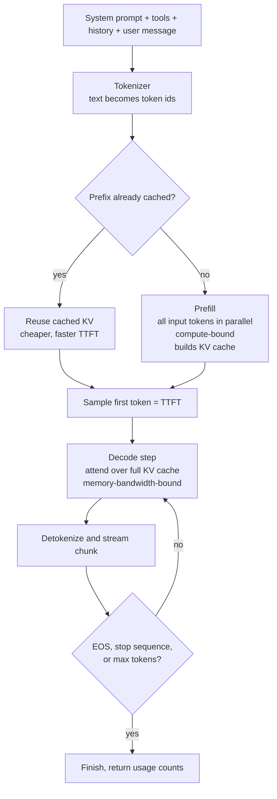

# How LLMs actually work (the part you have to explain out loud)

Every heading is a question an interviewer asks. Each answer: the one-sentence
lead, the reasoning that earns it, the trap.

---

## What is a token, and why is token count not word count?

**One sentence:** A token is a sub-word chunk from a fixed vocabulary learned
before training — the model never sees characters or words, only token ids.
Frequent sequences get their own token, rare ones get split. English prose runs
roughly 3–4 characters per token, but the ratio moves a lot: code (indentation,
`snake_case` splits), JSON (every quote and comma is billable), non-Latin
scripts, and UUIDs/hashes/base64 at near worst case. Tokens are the billing
unit, the context-window unit and the latency unit at once, so estimating in
words is wrong in the expensive direction for exactly the payloads that matter.

**The trap:** counting client-side with a rule of thumb, then enforcing a hard
limit. Use the provider's tokenizer for the model you are calling; tokenizers
differ between families. And the same characters tokenize differently depending
on what precedes them — `" hello"` and `"hello"` are usually different tokens,
which is why stop sequences and prefilled turns behave oddly at the join.

## Walk me through what happens between my prompt and the first token

**One sentence:** Your text is tokenized, all input tokens are processed in one
parallel pass called prefill which builds the KV cache, then the model decodes
one token at a time, each step reading that cache.

1. **Assemble.** System prompt, tool definitions, history, retrieved context and
   your message concatenated into one flat sequence. No structured memory.
2. **Tokenize.** Chat roles are special tokens or a template — the model sees a
   formatted transcript, not an object.
3. **Prefill.** All input tokens through the network in parallel, storing
   per-layer key and value vectors: the KV cache. Compute-bound.
4. **First token.** A distribution for the last position; sampling picks one.
   Time to here is TTFT.
5. **Decode.** Each new token attends over the whole cache and produces the next
   distribution. Strictly sequential, memory-bandwidth-bound.
6. **Stream and stop.** On EOS, a stop sequence, or the max token cap.



**The insight to land:** prefill and decode are two different machines.

| | Prefill | Decode |
|---|---|---|
| Work shape | All input tokens at once | One token at a time |
| Bottleneck | Compute (FLOPs) | Memory bandwidth |
| Scales with | Prompt length | Output length |
| Metric | TTFT | Inter-token latency / tokens per second |
| Cheapest lever | Shorter prompt, prompt caching | Shorter output, streaming, smaller model |
| Batching | Modest gain | Large — many sequences share one weight read |

That is why output tokens cost more than input, why batching helps throughput
but not single-request latency, and why asking for less output beats almost any
prompt-trimming exercise. **The trap:** reporting one "latency" number instead
of TTFT and tokens-per-second separately, at a percentile.

## What is attention, in one minute, and why is it O(n²)?

**One sentence:** For each token, attention decides which other tokens in the
context are relevant right now and builds that token's representation as a
weighted blend of them. Every token emits a **query** ("what am I looking
for?"), a **key** ("what am I about?") and a **value** ("what I contribute if
chosen"); each query is compared against every key, high match means high
weight, and the new representation is the weighted mix of the matching values.
Repeat across many heads and many layers, so later layers attend over
already-contextualised representations. That is the whole mechanism:
**content-based lookup over the context, learned, repeated, differentiable** —
which is why in-context learning works. Nothing was retrained when you put three
examples in the prompt; attention just found them. **The clarification that
reads as senior:** attention has no notion of position by itself, so position
encoding is a separate design decision, and long-context behaviour depends on
how a model extrapolates position beyond training.

Because every token compares against every other, cost grows with the square of
sequence length. **It bites in prefill** — TTFT grows faster than linearly with
prompt size. **It is milder in decode**, where each new token attends over the
existing n, so per-token cost grows linearly as context accumulates. **Memory is
the harder constraint:** the KV cache grows linearly with context and usually
runs out first. Fused kernels, paged caches and sliding windows engineer around
the naive quadratic, but they optimise constants and memory traffic — **the
dependency of every token on every other does not go away.** Say it is mostly an
engineering problem now; do not say it has been removed. **The trap:** assuming
a bigger context window is free because the provider offers it.

## What is the KV cache and why does it dominate my GPU memory?

**One sentence:** The KV cache stores the key and value vectors for every token
already processed so each new token can attend over the past without recomputing
it — and because it is stored per token, per layer, per head, it grows linearly
with context and quickly exceeds the model weights.

Without it, generating token 1,000 means re-running the entire prefix. The
shape: **linear in context length**, **linear in concurrency** (every request
holds its own, so the cache caps how many users one GPU serves), and **fixed
weights, variable cache** — weights are a constant, the cache is the part that
moves, and at long context and high concurrency it dominates.

### The formula, built up factor by factor

```
kv_bytes = 2 × n_layers × n_kv_heads × head_dim × bytes_per_element
             × context_length × batch_size
```

| Factor | Where it comes from |
|---|---|
| **2** | One K vector and one V vector per token, per layer. Nothing else is cached. |
| **n_layers** | Every layer has its own K and V projections. Nothing is shared between layers. |
| **n_kv_heads** | The number of *distinct* key/value heads. Under GQA or MQA, smaller than the query-head count. |
| **head_dim** | The width of one head's vector. Usually `d_model / n_heads`. |
| **bytes_per_element** | 2 for BF16, 1 for FP8 or INT8, 0.5 for INT4. |
| **context_length** | Every token so far, prompt plus generated. Grows every decode step. |
| **batch_size** | Each concurrent sequence carries its own cache. |

**There is no Q term** — the query is used at the step that produced it and
thrown away; only keys and values are needed by future tokens, so writing a 3
instead of a 2 says you have not thought about what the cache is for. And
**`batch_size` is linear only across *independent* sequences**: if requests share
a prefix and the server does prefix sharing, that prefix's KV is stored once —
the same machinery as prompt caching, seen from the memory side.

### Why `n_kv_heads` is not `n_heads` — this is the follow-up

In classic multi-head attention every query head has its own key and value
heads, so `n_kv_heads == n_heads` and the cache is enormous. **Grouped-query
attention (GQA)** keeps all query heads and lets groups of them share one KV
head; **MQA** is the limit case, one KV head per layer. Queries stay expressive;
the stored thing shrinks. The saving is exactly `n_heads / n_kv_heads` — with 64
query heads and 8 KV heads, 8× smaller. **Say this out loud:** *GQA exists
because the KV cache, not the weights, limits how much context and how many
concurrent users fit on a GPU.* It costs some attention capacity; do not quote a
number, call it a quality-for-memory trade the field judged worth making.

## Work out the KV cache for a 70B model at long context

**One sentence:** For a 70B-class GQA configuration at BF16 the cache is about
320 KB per token — 10 GB for a single 32k sequence and 320 GB at batch 32 — so
the cache, not the weights, is what you run out of.

**The config I am assuming.** State this before computing. A *representative*
70B-class open-weight configuration, not any specific product's spec:
`n_layers` 80, `n_heads` (query) 64, `n_kv_heads` 8, `head_dim` 128, BF16.

```
per layer, per token :  2 × 8 × 128 × 2 bytes  =  4,096 B  =  4 KB
all 80 layers        :  4 KB × 80              =  320 KB per token
one sequence at 8k   :  320 KB × 8,192         =  2.5 GB
one sequence at 32k  :  320 KB × 32,768        =  10 GB
batch 32 at 32k      :  10 GB × 32             =  320 GB
batch 32 at 8k       :  2.5 GB × 32            =  80 GB
```

320 KB per token is the number to commit to memory; everything else is
multiplication. **The punchline:** a batch of 32 short-ish conversations fills an
entire 80GB accelerator with cache alone, before a single weight is loaded. At
32k the same batch needs four such accelerators just for cache.

**Now show what GQA bought you** — recompute with `n_kv_heads = n_heads = 64`:

```
2 × 64 × 128 × 2 bytes =  32 KB per layer per token
32 KB × 80 layers      =  2.5 MB per token
2.5 MB × 32,768        =  80 GB for ONE 32k sequence
```

One user, 32k of context, and the whole GPU is gone. Same shape, same precision,
GQA off — eight times the memory, because 64/8 = 8. Produce that contrast on a
whiteboard and you have answered the GQA follow-up before it was asked. Note
once that these are 1024-based figures spoken as "GB" while marketing numbers
are decimal; naming it is what separates an estimate from a guess.

## Will a 70B model fit on one 80GB GPU?

**One sentence:** Not at BF16 — the weights alone are about 140 GB — and even
quantised, whether it fits is a subtraction where the KV cache is the term that
moves.

```
  accelerator memory
− model weights          (parameters × bytes per parameter, fixed)
− framework overhead     (CUDA context, kernels, allocator — low single-digit GB)
− activations + workspace(moves with batch size and kernel choice)
= whatever is left for the KV cache
```

Weights first, since that term is fixed. 70 billion parameters: **BF16** ~140 GB
(does not fit at all), **FP8/INT8** ~70 GB, **INT4** ~35 GB.

```
Walkthrough A — INT8 weights        Walkthrough B — INT4 weights
  80 GB accelerator                   80 GB
− 70   weights @ 1 B/param          − 35   weights @ 0.5 B/param
−  2   framework and CUDA           −  5   overhead, activations, workspace
−  3   activations and workspace    = 40 GB for the KV cache
=  5 GB for the KV cache
```

Five gigabytes is **two** concurrent 8k sequences and **zero** 32k sequences:
the model loads and the deployment is useless, the most common surprise for
people who size on weights alone. Forty gigabytes is **16** sequences at 8k or
**4** at 32k — a real configuration, bought with a quality risk you must measure.

**Fragmentation is the term people leave out.** A naive allocator reserves the
full `max_seq_len` per request on arrival, so if your cap is 32k and the average
conversation is 2k, most of the cache is reservations never filled. Paged
allocation — fixed-size blocks mapped per sequence, the PagedAttention idea —
cuts that to near-zero.

### What you do when it does not fit, in pull order

| Lever | What it buys | What it costs |
|---|---|---|
| **Paged KV allocation** | Removes reservation waste; often the largest single win | Nothing in quality. Needs a serving stack that supports it. |
| **Prefix / prompt caching** | Shared prefixes stored once across requests | Nothing in quality. Needs an exact shared prefix — design for it. |
| **Cap max context** | Caps worst-case per-request cache directly | Long conversations truncated or summarised. You choose what to forget. |
| **Smaller batch** | Linear reduction, immediately | Throughput and cost per token get worse; per-user latency does not improve. |
| **Quantise weights** | Frees a large fixed block (70 → 35 GB) | Quality risk and a re-evaluation you must run. Not a config flag. |
| **Quantise the KV cache** | Halves or quarters the term that grows | Quality risk that *accumulates along the sequence*. |
| **GQA / MQA** | The biggest structural saving, often 8× | Not a deployment lever — baked in at training. You choose it by choosing a model. |
| **Tensor parallelism** | More aggregate memory and bandwidth | An all-reduce per layer, fast interconnect, GPUs paid for whether busy or not. |
| **Offload cache to CPU/NVMe** | Effectively unbounded capacity | PCIe becomes the bottleneck and decode is already bandwidth-bound. Batch only. |

**The ordering is the answer.** Free levers first, then throughput, then quality,
then money. Anyone opening with "quantise to INT4" has skipped three cheaper
fixes and introduced an evaluation burden.

## What do BF16, FP8, INT8 and INT4 actually cost you?

**One sentence:** Each step down halves the bytes per element and therefore that
term of the memory budget, and what degrades is not uniform — it concentrates in
outlier values, long generations and precision-critical outputs.

| Format | Bytes | Size | What it is | What tends to degrade |
|---|---|---|---|---|
| **BF16** | 2 | 1× | The serving default. Wide exponent, low mantissa. | The quality reference point. |
| **FP8** | 1 | 0.5× | Floating point, so it tolerates outliers better than an integer grid. Needs recent accelerators. | Activation outliers; depends which tensors you cast and on calibration. |
| **INT8** | 1 | 0.5× | Uniform integer grid with scale factors. Mature tooling. | Outliers. Per-channel or per-group scales matter more than bit width. |
| **INT4** | 0.5 | 0.25× | Largest saving. Needs group-wise scales to work at all. | Real, task-dependent loss. Worst on long generations, multi-step reasoning, rare-token recall. |

The memory saving is exact and predictable; the quality cost is not. Perplexity
moves less than task-level failures do, so flat perplexity is weak evidence that
a quantised deployment is safe — every step down needs its own evaluation on
*your* traffic.

**The distinction that reads as senior: weight quantisation and KV-cache
quantisation do not degrade the same way.** Weight error is fixed — the same
approximation every token. KV-cache error is *positional and compounding*: an
imprecise key stored at token 50 is attended to by every one of the next ten
thousand tokens, so a quantised cache looks clean on short prompts and drifts on
long ones. **Validate KV-cache quantisation at your longest real context.**

## Say the whole thing out loud in two minutes

**The formula (20s).** "Per token, per layer, you store one key vector and one
value vector. So the cache is two, times layers, times KV heads, times head
dimension, times bytes per element — then times context length and batch size.
No query term; queries are used once and discarded. And it's KV heads, not query
heads, which matters the moment the model uses grouped-query attention."

**The one number (40s).** "Take a representative 70B config — 80 layers, 8 KV
heads, head dimension 128, BF16. Per layer per token that's 2 × 8 × 128 × 2,
which is 4 KB. Times 80 layers is 320 KB per token. So a 32k conversation is
about 10 GB of cache for one user. At batch 32 that's 320 GB — four 80GB cards
for cache alone. And with full multi-head attention instead of GQA it'd be eight
times that: a single 32k sequence would fill an entire 80GB GPU by itself."

**The budget (30s).** "So 'will it fit' is a subtraction. Eighty gigabytes,
minus weights, minus a couple of gigabytes of framework overhead, minus
activations — whatever's left is your cache, and that's what sets concurrency.
At INT4 weights that's about 40 GB of cache, so roughly 16 users at 8k or 4 at
32k."

**The lever (30s).** "First I'd pull the free stuff: paged KV allocation so
we're not reserving max context per request, prefix caching on the system prompt
and tool definitions, and a hard cap on context. Those cost nothing in quality.
Then batch size, which costs throughput. Quantisation last — and if I quantise
the cache rather than the weights, I'd evaluate it at our longest real context,
because cache error compounds along the sequence in a way weight error doesn't."

**If you remember one thing:** *320 KB per token, and the cache runs out first.*
That is also why throughput collapses as conversations get long, why providers
cap concurrency rather than tokens per minute, and why prompt caching is
dramatically cheaper — it reuses an already-built KV prefix and skips prefill.
So put the stable part of the prompt **first**; a cache keyed on an exact prefix
is destroyed by a timestamp at the top. **The trap:** the KV cache is not a
semantic cache. It matches a token prefix, not a meaning.

## Why does the model get worse with long context even when it fits?

**One sentence:** Fitting in the window is a capacity guarantee, not an
attention guarantee — attention mass is finite and spread across more
candidates, so the signal you care about gets diluted. Four mechanisms:
**dilution** (adding irrelevant context actively lowers the weight on relevant
context); **position effects** (beginning and end handled better than the
middle — "lost in the middle", varies by model, do not quote a number);
**training-distribution mismatch** (the advertised window exceeds the lengths
seen most in training, so the top of it is extrapolation); and **conflicting
evidence** (the model does not adjudicate, it blends or picks the most recent
and fluent version). What you do: retrieve less and better, put decisive
material near the end, deduplicate, summarise or evict old turns. **Relevance
density beats volume.** You cannot see this in unit tests — it shows up as drift
once real conversations outgrow your fixtures, so put long, noisy contexts in
the eval set.

## Temperature, top-k, top-p — and what temperature 0 does not guarantee

**One sentence:** Temperature rescales the output scores before they become
probabilities; top-k and top-p truncate the tail before sampling. Low
temperature is near-greedy — consistent, repetitive, prone to loops. High
temperature flattens the distribution and past a point goes incoherent, because
one odd token becomes context the rest of the output must be consistent with.

**Temperature 0 guarantees** the sampler picks the argmax at each step. That is
all — it is a *sampling* setting. It does **not** guarantee the same output
across runs, or across providers and model versions, or truth (greedy returns
the most likely continuation, which can be confidently wrong), or better quality
(greedy is duller and can be worse at multi-step reasoning).

| | Top-k | Top-p (nucleus) |
|---|---|---|
| Rule | Keep the k highest-probability tokens | Keep the smallest set summing to p |
| Candidate count | Fixed | Adapts to the model's confidence |
| Model confident | Still admits k−1 also-rans | Collapses to one or two tokens |
| Model unsure | Cuts off a genuinely flat distribution | Widens to admit the real spread |
| Typical use | Hard cap on weirdness | The general-purpose default |

Top-p is the better default because **the right number of candidates depends on
the position**: after `the capital of France is` the distribution is a spike;
mid-sentence in open prose it is broad. Tighten both when output must be
parseable — JSON, a schema, an enum. Loosen p for ideation. **The trap:**
stacking temperature, top-p, top-k and a repetition penalty at once, then trying
to reason about the result. Change one at a time and pin all of them in evals.

## Why is the model non-deterministic even at temperature 0?

Greedy decoding removes randomness from *sampling*, not from the computation
that produced the scores. Floating-point addition is not associative and GPU
kernels reduce in whatever order the parallel schedule produced; your request is
batched with others, so batch composition changes shapes, kernel selection and
reduction order; hardware pools and silent serving changes vary underneath you.
When two tokens score near-identically a last-bit difference flips the argmax,
and one flipped token changes the context for everything after it. So pin model
version, sampling params and template; **test behaviour, not bytes** — schema
validity, required facts, a label, never string equality; run evals n times and
report a distribution; and log the exact request and response, because you
cannot reproduce a bad output from the prompt alone.

## Why can the model not count letters or do arithmetic reliably?

**One sentence:** It cannot see letters — its input unit is the token, so
character-level questions ask it to report information the tokenizer destroyed —
and arithmetic fails because it pattern-matches digit sequences rather than
executing an algorithm. A word may be a single opaque token, so asking how many
of a letter it contains is like counting the strokes in a logo you have only
seen whole; models often get it right anyway from memorised spelling, which is
worse than failing outright because the failures are unpredictable. For
arithmetic there is no register, no carry, no loop — just a fixed number of
forward passes. Small common operations are memorised; larger ones degrade
plausibly, right magnitude and wrong middle digits. Chain-of-thought helps
because intermediate steps land in the context where later steps can attend to
them — external scratch space substituting for internal state. It lowers the
error rate; it does not make the operation exact.

**The senior answer is architectural:** do not prompt around a capability gap,
route around it. **Let the model decide what to compute and let a deterministic
tool compute it** — calculator, code interpreter, SQL engine, real regex. Same
for dates, unit conversions and sorting. **The trap in eval terms:** these
failures are silent. No exception, no confidence drop. If numbers matter, assert
on them.

## What actually changes between pretraining, SFT and RLHF/DPO?

| Stage | Data | What it adds | What it cannot add |
|---|---|---|---|
| **Pretraining** | Huge unlabelled corpora; predict the next token | Language, facts, reasoning patterns, code — essentially all raw capability | Any sense of being asked something |
| **Instruction tuning (SFT)** | Curated prompt → good-response pairs | Follows instructions, respects format, adopts the assistant role and chat template | Judgement between two plausible answers |
| **Preference optimisation (RLHF, DPO)** | Human or model comparisons of two responses | Tone, helpfulness, refusal behaviour, hedging, formatting habits | New knowledge |

**The line that gets you credit:** *capability comes from pretraining; alignment
and behaviour come from the later stages.* RLHF and DPO differ in mechanics — a
separate reward model versus direct optimisation on preference pairs — but both
consume *comparisons*, not gold answers. Preference training has costs: it is a
plausible contributor to over-hedging, excessive caveats and sycophancy, because
raters reward agreeable, complete-looking answers.

## Base model versus instruct model

A base model only continues text; an instruct model is post-trained to treat the
input as a request. Want the base one for pure completion, style imitation or
your own post-training — but it has no chat template, no tuned stop behaviour
and no refusal layer, so product work wants instruct.

## What is a context window made of, and how do the parts compete?

**One sentence:** It is one flat token budget shared by everything you send and
everything the model generates — no reserved lanes, so every component takes
room from the others: the system prompt (fixed, put it first so prefix caching
works), tool definitions (fixed, routinely underestimated — full JSON schemas on
every call), conversation history (grows without limit unless managed),
retrieved context (bursty, the main quality-vs-cost dial), the user message, and
the generated output, which shares the same budget.

The competition is the interesting part. Thirty tool definitions can consume the
room you wanted for documents, so filter the tool list per request. Unbounded
history is the default failure, and each fix loses something — a sliding window
forgets, rolling summarisation distorts, retrieval over history misses when the
query does not lexically match. More chunks is not more accuracy past a point,
because of dilution. And if input plus expected output exceeds the window,
truncation mid-JSON surfaces as a parse failure three layers downstream.

**Volunteer the observability point:** log token counts per component, not just
a total. `prompt_tokens` tells you the bill went up; the breakdown tells you
which part grew, and it is nearly always history or retrieval.

## Why does the model confidently make things up? The mechanism, not the morality.

**One sentence:** The model emits the most plausible next token, and
plausibility is a property of *form*, not of truth — so a fluent fabrication and
a fluent fact are both good outputs by the only objective it ever had.

1. **The objective is next-token likelihood.** There is never a term for "is this
   true". Truth correlates with likelihood; it is not the target.
2. **There is no lookup step.** Facts are distributed across weights. There is no
   record to be absent, so no absence to detect — a rare fact and a fabricated
   one come out of the same machinery.
3. **Nothing represents "I don't know" natively.** Uncertainty is a flatter
   distribution, but a flat distribution still yields a token, and that token
   starts a sentence that must be completed.
4. **Commitment compounds.** Once a fabricated citation is in the context, every
   later token conditions on it, and the model generates supporting detail
   because that is what a consistent document looks like.
5. **Post-training rewards confident, complete answers**, so the calibrated hedge
   is trained against at the margin.
6. **Format cues amplify it.** Ask for a citation, version number or file path
   and you have specified a *shape*. Shape-filling produces a well-formed
   reference to a paper that does not exist.

It is worst for identifiers, API signatures, dates, statistics and citations —
high-entropy, low-redundancy, exactly where next-token statistics are weakest
and where being wrong costs most. **As a systems answer:** ground it (retrieval,
answer only from context, an explicit "say you don't know"); **verify, don't
trust** — check quoted spans occur in the source, resolve URLs, compile the
code, run the query; constrain the surface with enums and schemas; prefer
abstention where cost is asymmetric; and measure it, because hallucination rate
is not observable from logs by default. **Close on:** "The model has no
mechanism to know it does not know, so the knowing has to live in my system, not
in the model."

---

## Traps that cost people the round

- Saying the model "looks things up" or "searches its training data".
- Claiming temperature 0 is deterministic, full stop.
- Calling attention "O(n²) so long context is impossible" — the constants were
  engineered around; the dependency and the memory growth remain.
- Confusing the KV cache with a semantic response cache.
- Writing `n_heads` where the formula needs `n_kv_heads`, putting a Q term in it,
  or dropping the ×2 for K and V. The interviewer is asking precisely to find out.
- Sizing a deployment on weights and forgetting the cache. Weights do not move;
  the cache decides concurrency.
- Treating tensor parallelism as free memory, or assuming weight and KV-cache
  quantisation degrade the same way.
- Saying RLHF makes the model smarter. Capability comes from pretraining.
- Quoting a benchmark number or degradation percentage from memory. Say the shape
  of the effect and that the magnitude is model-dependent.
