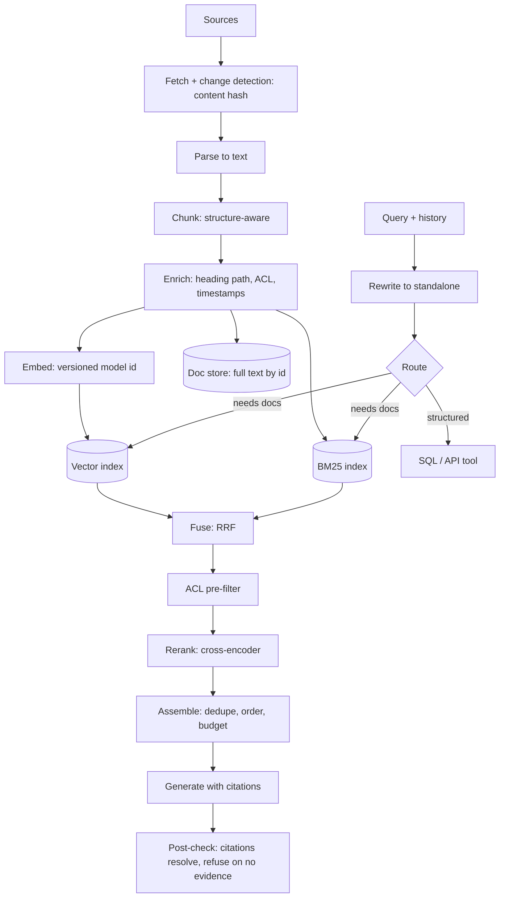

# RAG

The interviewer knows what RAG is. They are testing whether you have *operated*
one: where it goes wrong, how you found out, what it cost. Every heading is a
question you will be asked out loud.

---

## Explain RAG to a sceptical staff engineer in two minutes

**One sentence:** RAG is search plus a summariser — retrieve the passages most
likely to contain the answer, paste them into the prompt, ask the model to answer
using only those passages.

Then the reasoning, in order. The weights are a frozen snapshot: no private data,
no citations. Context is the only writable memory a model has, so every fact must
arrive as tokens. Context is finite and attention over a long one is uneven, so
you need a selection step — and **that step is information retrieval**. RAG is IR
with a model on the end.

The framing that lands: *RAG moves your hardest problem from "make the model
smarter" to "make your search better", and search has metrics, logs, an
inspectable index and a golden set you can regression-test.* **The caveat to
volunteer:** RAG does not make a model truthful, it makes the right evidence
available. A bad retrieval gives a confident wrong answer with a citation
attached — worse than no answer, because it looks trustworthy.

## When is RAG the wrong answer?

**One sentence:** RAG is wrong when the bottleneck is not "the model lacks facts".

| Situation | Why RAG fails | Instead |
|---|---|---|
| Corpus fits in context | Infrastructure that replaces a `cat` | Whole corpus in prompt + prompt caching |
| Aggregation — "how many tickets last quarter" | Top-k returns 10 of 4,000 rows; the model counts 10 | Text-to-SQL against the real store |
| Answer needs the whole document | Chunking destroys exactly what you need | Summarise in-pipeline, or send it whole |
| Style or format, not facts | Retrieval cannot teach voice | Fine-tuning, or few-shot |
| Reasoning over a fixed small ruleset | Rules are stable; retrieval adds latency and a failure mode | Rules in the system prompt |
| Data is per-request and structured | A snapshot is stale by construction | Tool call at request time |

**"First I ask whether this is retrieval or query"** — "which customers churned in
March" is not a retrieval problem. **"RAG and long context are a cost curve, not
rivals"** — bigger windows move the break-even, they do not remove it. **The
trap:** saying "RAG reduces hallucination" — it removes the kind caused by missing
knowledge and adds another, grounded-sounding answers on the wrong passage.

## Walk me through the pipeline

**Change detection is the whole ingestion cost story** — hash the content, skip
everything downstream when unchanged. **Parsing is where quality dies:** a PDF
table flattened into a line of numbers is unrecoverable later, and it is the most
common root cause of "RAG doesn't work here", because nobody looks. **ACLs attach
at ingestion**, and the chunk text is kept for citation and re-embedding. **Write
behind a version pointer**; the failure to name unprompted is partial ingestion.

## How do you chunk, and why is fixed-size the weakest choice?

**One sentence:** fixed-size splits on a character count — a property of the file,
not of the meaning — so it cuts sentences, tables and arguments at random. A chunk
is the unit of retrieval *and* of evidence, so an arbitrary boundary lets
you retrieve a chunk with the question's keywords but not the answer. And
embeddings of mixed-topic chunks are averages: a chunk spanning two sections
embeds near neither, retrieved for the wrong queries and missed for the right ones.

**Instead:** split on the document's own structure — headings, code blocks, table
rows — falling back to a size limit only *within* an oversized section; **overlap
modestly**, which rescues straddling answers and creates near-duplicate hits, so
dedupe at assembly; **prefix each chunk with its heading path**, since "It must be
set to 30 seconds" is useless where "Billing API > Timeouts > It must be set to 30
seconds" is retrievable and citable; and **decouple the retrieval unit from the
generation unit** — embed a sentence, return the parent section.

The trade-off: small chunks give precision, because the vector is about one thing,
and risk truncating the answer; large chunks are complete but embed as an average,
diluting retrieval and wasting context tokens.

**The trap:** one global chunk size — it is per-content-type. **The thing nobody
mentions:** store the chunker version with the chunk, because changing the
splitter changes chunk ids, so feedback, evals and caches keyed on them break
silently.

## How do you pick an embedding model?

**One sentence:** pick on your own data with your own queries, then on cost,
dimensions, and the cost of ever changing it again. Build a 50–200 query golden
set first and measure **recall@k on it**; public
leaderboards are directional, gamed, and ignorant of your jargon. Then the
constraints that decide it: max input length (does it silently truncate your
chunks?), dimensionality, which drives index memory linearly, domain match,
residency, and whether the model is **asymmetric** — separate query and doc
encoders with required prefixes, and using one without its prefixes quietly
degrades everything. Price comes last; embedding is small next to generation.

**The trap:** query and document vectors must come from the same model *and
version*. Cosine between two embedding spaces is meaningless and does not error —
it just ranks nonsense.

## You want to change the embedding model later. What happens?

This separates people who have run a RAG system from people who have built one.
**One sentence:** changing the embedding model invalidates every vector, so it is
a full re-embedding migration done without downtime or a quality cliff. Old and
new vectors are **not comparable** and cannot share an index, re-embedding
competes with live traffic for the same quota, and quality **will change in both
directions** on queries you never looked at.

**Version from day one** — every vector carries `embedding_model_id` and
`embedding_version`, every index has a version, queries go through an alias.
**Build the new index alongside the old**, backfilling from the doc store, which
is why you kept the chunk text. **Evaluate offline on the golden set**, looking at
the queries that *regressed*, not the average. **Shadow it:** both retrievers
live, serve from old, log both. **Roll out behind a flag by percentage**, then
**flip the alias and keep the old index**, so rollback is a pointer change.

**The detail that impresses:** re-embed incrementally — a cursor-based backfill,
rate-limited so it does not starve live ingestion, resumable, safe to run twice.
**The second-order trap:** change the chunker too and you cannot attribute a
regression to either migration.

## Why is pure vector search often worse than hybrid with BM25?

**One sentence:** embeddings capture meaning and lose the exact string, and a
large fraction of real queries are about an exact string. Dense-only fails on **identifiers** — `ERR_2041` and `ERR_2042` embed to nearly
the same point, while BM25 correctly treats them as different tokens; on **rare
terms**, where BM25's IDF gives your unseen product name *more* weight; on
**negation**, since "not supported on Safari" sits near "supported on Safari";
and on verbatim quotes. Lexical-only fails on paraphrase. **They fail on different
queries** — that is the entire argument for hybrid, and the sentence to say.

**How to combine.** **Reciprocal rank fusion** combines by rank, not score:
`score(d) = Σ 1 / (k + rank_i(d))` — no normalisation, no per-corpus tuning, the
sane default. Weighted fusion has more headroom but fragile normalisation: score
distributions differ per query and corpus. **The trap:** saying "hybrid" and not
being able to say how the two lists are merged.

## What is reranking, and where does it go?

**One sentence:** a second, slower, more accurate model that re-scores a small
candidate set, sitting between retrieval and generation. The reason it works is
architectural. **Retrieval is a bi-encoder:** query and
document are embedded *separately* and compared with a dot product — precomputable
and fast, but the document was embedded without ever seeing the query. **A
reranker is a cross-encoder:** they go through the model *together*, so every query
token attends to every document token — far more accurate, impossible to
precompute, one model call per candidate. So the shape is fixed by cost:
**retrieve broadly and cheaply, rerank narrowly and expensively** — 50–100 in,
5–10 out.

It buys precision at the head of the list, which is what the model reads, and **a
usable confidence signal** — a top reranked score below threshold means no good
evidence, your cue to refuse rather than generate, and most people never use it.
But **reranking improves precision, not recall**: if recall@100 is bad, fix
retrieval.

## How do you stop a user retrieving a document they are not allowed to see?

Asked constantly, and where most candidates lose the interview. **One sentence:**
authorisation is a *pre-filter* on the retrieval query, derived from the caller's
identity at request time — never a post-processing step, and never something you
ask the model to respect.

| Wrong approach | Why it fails |
|---|---|
| Retrieve top-k, then drop what the user cannot see | You leak through the gaps: k shrinks to 2, quality collapses, and timing or citation counts still reveal the documents exist |
| "Only use documents the user is allowed to see" in the prompt | The model is not an access-control system. It cannot verify, and injection in a retrieved document can override it |
| One index per user | Does not scale, duplicates every shared document |

**The shape that is right:**

1. **Attach permissions at ingestion.** Every chunk carries its source document's
   ACL — group ids, role, tenant, sensitivity label — in the index payload.
2. **Resolve the caller's grants at query time** from your real authorisation
   system, not a cached claim in a possibly-stale token.
3. **Pass those grants as a filter into the search itself**, so the ANN traversal
   only ever visits permitted vectors. Filtered ANN search is a feature to check
   for in a store — filtering *inside* the index is a different thing.
4. **Isolate tenants hard.** Tenant id is a partition or a namespace, not a filter
   you might forget. A filter bug is a cross-customer leak.
5. **Re-check at render time.** Before showing a citation, verify the user can
   still read the source. Permissions change between ingestion and query.
6. **Log the authorisation decision** with the trace. "Could user X have seen
   document Y" needs an answer with evidence.

**The hard parts to raise yourself — this is what gets you the nod:**

- **Permission changes are a re-indexing event.** Someone leaves a group; access
  must revoke immediately, but the index holds a copy of the old ACL. Either store
  a group reference and resolve membership live, or propagate permission changes
  on a much tighter SLA than content.
- **Deletion must propagate.** A document deleted at source must leave the index,
  or the model answers from a document that no longer exists.
- **Inference leaks.** Even with perfect filtering, aggregates over permitted
  documents can reveal restricted facts. Worth naming in a regulated domain.
- **Prompt injection is an access-control problem too.** A document a user *can*
  read may carry instructions telling the model to exfiltrate context or call a
  tool. Treat retrieved text as untrusted, keep it delimited from instructions,
  and never let retrieved content authorise an action.

**Close on:** "Retrieval is a query against data the user may not own, so it
inherits every authorisation requirement the underlying store has. I enforce it in
the query, not in the prompt."

## What are the failure modes, how do you detect them, what do you do?

| Failure | Detect | Fix |
|---|---|---|
| **Nothing relevant retrieved.** Confident off-topic answers, or a refusal on a question the corpus covers | Top reranked score below threshold — the cheapest live signal; recall@k on the golden set over time | Check the doc is in the index at all — half of these are ingestion bugs; add BM25, it was probably an identifier; rewrite and expand the query; raise k and rerank; then chunking, then the embedding model. If there is genuinely no evidence, **refuse** |
| **Right chunk, answer cut in half.** Answers that start correctly and stop, or drop the condition on a rule ("set the timeout to 30s" without "for enterprise plans") | Nearly invisible to retrieval metrics — retrieval looks *correct*. Faithfulness passes, completeness against reference answers fails. Read traces at chunk boundaries | Overlap; small-to-big; sentence-window, sending the neighbours of any hit; structure-aware splitting |
| **Right chunk, buried mid-context.** The evidence is demonstrably in the prompt and unused; quality gets *worse* as k rises | Ablation: move the known-good chunk to position 1 and see if the answer becomes correct. Plot quality against k and look for the turn | Send **fewer** chunks — the instinct to raise k is usually wrong; rerank and order deliberately, strongest first; number chunks and require citation by number; dedupe before assembly |
| **Model ignores context, answers from weights.** Fluent, plausible, generic — often the pre-training answer where your corpus says something company-specific | Citation checking: verify the cited chunk supports the claim. Counterfactual probe: rerun with context removed — if the answer barely changes it was never grounded | Instruct to answer only from context; make context structurally distinct from instructions; require citations and reject uncited claims; give a legitimate "not in the documents" escape hatch — a model with no permitted refusal invents something |
| **Follow-up query makes no sense alone.** "What about on Windows?" retrieves Windows docs and misses the subject; multi-turn much worse than single-turn | Compare retrieval quality on turn 1 vs later turns. Log the rewritten query next to the raw one — without both you cannot see this at all | Rewrite to a standalone question with a small fast model and embed that. Retrieve on raw *and* rewritten and fuse, since rewriting loses information. The same step gives you routing free |
| **Conflicting sources.** Old policy and its replacement disagree; the model picks whichever came first in the prompt | Hard automatically — user reports, and auditing chunks with near-identical embeddings and different content | Carry timestamps and version status in the payload, prefer current documents in ranking, instruct the model to surface the conflict. Better: archive superseded docs — most "RAG quality problems" are content problems |

Row two is the failure mode that hides from your retrieval metrics, which is why
you measure answer completeness separately. On row four: domain facts must come
from context, general knowledge may come from weights.

## How do you evaluate a RAG system?

**One sentence:** evaluate retrieval and generation *separately*, because an
end-to-end score tells you the answer was bad without telling you which half to
fix. A single end-to-end 0.6 fits two different systems: retrieval is excellent
and the model ignores context → fix the prompt; or retrieval is broken and the
model faithfully summarises the wrong documents → fix chunking. The prompt work
you would do in the second case is wasted weeks.

| Retrieval metric | Question it answers | Use when |
|---|---|---|
| **Recall@k** | Is the right chunk anywhere in the top k? | **The primary metric and the ceiling — generation cannot recover what retrieval missed** |
| Precision@k | How much of what we sent is relevant? | Context budget, lost-in-the-middle |
| nDCG@k | Is the ranking good, with graded relevance? | Several partially-relevant docs |

Precision problems a reranker can fix; recall problems are terminal for that query.
Labels come from hand-labelling a few hundred real queries, plus synthetic ones
from chunks to broaden coverage — never as the only set.

**Generation metrics** are judged *given* the retrieved context, which is what
makes them diagnostic: faithfulness, answer relevance, completeness against a
reference, **citation accuracy** — does the cited chunk actually support the claim,
cheap and high signal — and refusal correctness. **Do not skip the unanswerable
set:** a system that never refuses scores well on everything but the thing that
matters.

Retrieval eval is cheap and deterministic, so run it on every commit; judged
generation eval runs nightly with a pinned judge version, since changing the judge
changes your history. **Compare against ablations** — no-retrieval, no-rerank,
fixed-size-chunk — or you cannot tell whether the complexity earns its place.

## Short answers to the rest

**ANN, in three lines.** It drops the guarantee of the true nearest neighbours to
search a fraction of the index, trading recall, memory and update behaviour — the
last bites hardest, as churn rots quality weeks later. **HNSW:** graph, knob
`ef_search`, strong recall, high memory, deletes leave tombstones needing rebuilds.
**IVF:** clustered, knob `nprobe`, cheaper memory, geometric failure — a query near
a cluster boundary has true neighbours in a cluster you did not probe.

**Do you need a vector database?** It gives you an ANN index, metadata filtering
done *with* the search, CRUD, persistence and replication. At tens of thousands of
vectors, no — brute-force cosine over a matrix is milliseconds and exact, and
saying so is a strong signal. The vector extension on the database you already run
goes further than people assume and keeps ACL data in one place. **The trap:** it
is a derived index, not the source of truth.

**Freshness.** An SLA per source plus change detection rather than re-ingesting
everything: webhooks over polling, detect by content hash not `updated_at`, handle
deletes explicitly — pull pipelines miss them, because an absent record looks like
nothing happened — and upsert by a stable chunk id of document id, position and
chunker version. Repeated ingestion otherwise duplicates chunks: no error, just
the same passage filling the top-k.

**Cost, latency, alerting.** Input tokens dominate, so context length is the lever:
route, cache (prompt caching only helps if the stable prefix comes *first*, an
argument for putting chunks after the instructions), then send fewer chunks, which
cuts cost *and* usually improves quality. Run the two retrievers in parallel and
measure p95. The alert that matters is **the share of queries with no confident
retrieval**: it moves before users complain and catches a broken ingestion job, a
permission change or a model swap.

**How would you start tomorrow?** Collect 50 real user questions before writing
code. Build the dumbest pipeline that works — one splitter, one embedding model,
brute-force search, no reranker. Measure recall@k, read the twenty worst failures
by hand, and fix what they say is broken, usually parsing or chunking. Only then
add hybrid, then a reranker, then anything clever.
