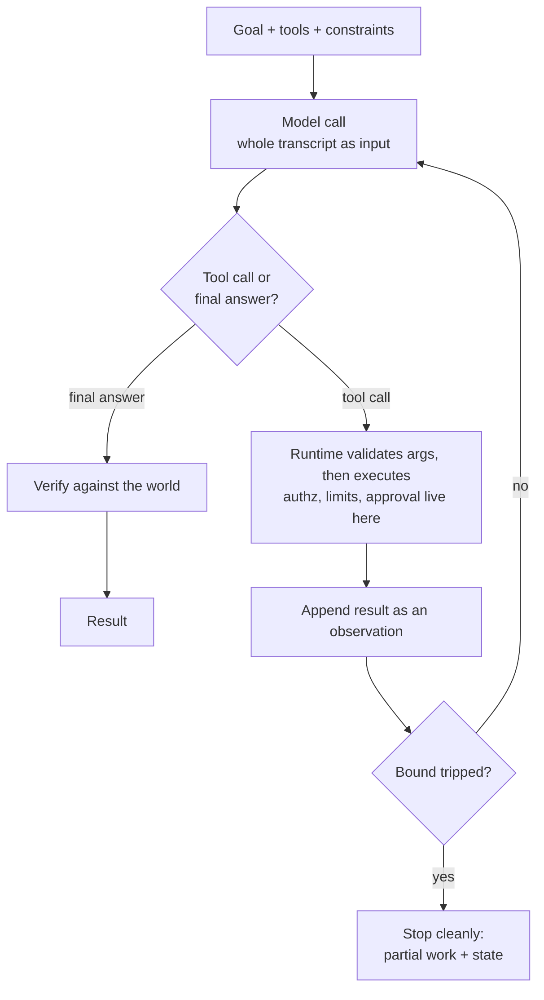

# Agents

An agent is a loop: the model decides what to do next, your code does it, the
result goes back into the prompt, repeat. Everything hard follows from two facts
— the model picks the control flow, and every step's output is the next input.

## 1. Agent or workflow — and how do you choose?

**In a workflow a human wrote the control flow. In an agent the model decides it
at runtime.** It matters because **you can only test what you can enumerate**:
a workflow's cost, latency and blast radius are properties of the code, an
agent's are runtime properties you must bound.

| | Workflow | Agent |
|---|---|---|
| Paths | Finite, enumerable | Unbounded |
| Cost / latency | Known before you ship | Known only after the run |
| Typical failure | Wrong branch | Wandering, looping, fabricated success |

The rule, in order: steps writable now → **workflow**. Finite branches → a
**router**, where the model classifies and your code executes; most "agents" are
this. Open-ended, discovery is the point, wrong steps cheap → **agent**. Any
irreversible step → router with a human gate. The agent is the most expensive and
least testable option; it buys flexibility across inputs you could not
anticipate. **Trap:** treating agentic as binary — most good systems are a
workflow with one or two agentic steps, and if you end up bounding every step you
wanted a workflow.

## 2. Explain the ReAct loop.

**Reason, act, observe, repeat: the model emits a thought and a tool call, the
runtime executes it and appends the result, the model is called again on the
longer transcript.**

**There is no state inside the model** — each iteration is a fresh pass over the
whole transcript, so "the agent remembers" means the text is still in the prompt,
and the message list is both program counter and heap. **The reasoning text is
not a commitment** — it can be a rationalisation emitted alongside the call, so
log it to debug, never as evidence of intent.

## 3. What is tool calling actually doing under the hood?

**The model does not call anything. It emits structured text saying "I would like
this function with these arguments"; your runtime parses it and makes the call.**
Definitions are serialised into the prompt as ordinary context — name,
description, JSON Schema — paid for on every request. The API layer parses the
emitted tokens into a name, arguments and a call id; **your code decides whether
to run it**, then appends the result under that id.

**The model has no permissions. Your executor does** — authorisation, rate
limits, approval and sandboxing live there, and the model cannot bypass them
because it never had the ability to act. **Valid JSON is not a valid argument**:
constrained decoding guarantees the shape parses, not that `cus_9f2` is a real
customer, so validate against the world. A tool the model can see may be used:
visibility is permission to attempt. **Trap:** saying "the model calls the API" —
the tokens-then-your-executor version is the fastest signal you have built one
rather than read about one.

## 4. How do you design a tool interface a model can use?

**Design for a competent new hire who can only read the docstring and can never
ask a follow-up — so few, wide, well-named tools beat many narrow ones, one per
user-level intent rather than one per endpoint.**

1. **Name it after what the caller wants**, and say when to use it *and when not
   to*, naming the alternative. Two descriptions that do not distinguish
   themselves get picked by coin flip, differently on the retry. Keep the set
   small: every definition sits in every request of every turn, so sixty tools is
   a fixed tax plus measurably worse selection.
2. **Constrain the arguments in the schema** — enums, required fields, units,
   formats, timezone. Every illegal value is a failure class deleted by code
   rather than by persuasion.
3. **Return what the model needs to pick the next step, not the raw payload** —
   thirty-seven useless fields are paid for on every remaining turn.
4. **Make errors instructive and failure semantics explicit.** "No customer
   `cus_9f2`; use search_customers with an email" turns a dead end into a
   recovery, while a tool that cannot distinguish "no results" from "broken"
   causes loops. Never pass a raw stack trace or a 200KB page into context, and
   give dangerous actions their own tool and gate, never a flag.

**The test to say out loud:** hand the tool list and the task to an engineer with
no access to your codebase; if they cannot pick the right tool, neither will the
model. **Most of an agent's reliability lives in this layer**, and unlike a
prompt you can unit-test it.

## 5. What is MCP and what problem does it solve?

**An open protocol for how a host app discovers and calls tools, so an
integration is written once per system instead of once per system per agent** —
N agents × M systems becomes N + M. A client in the host talks to a server
wrapping a system, exposing tools, resources and prompts over stdio or HTTP,
discovered at runtime. What it does not solve is the follow-up: **not tool
quality**, since a bad description is just as bad over a standard protocol; **not
context cost**, since five servers can dump hundreds of definitions into every
request; **not authorisation**, since the server's credentials are your blast
radius; and **a third-party server's tool descriptions are untrusted text in
your prompt** — a prompt-injection surface, decided at install time, by you. Say:
*"MCP is USB-C for tools. It standardises the connector, not the quality of what
you plug in."*

## 6. If each step is 95% reliable, what is a 20-step task worth?

**About 36%, because reliability multiplies.** `0.95^20 = 0.358` — two runs in
three fail.

| Per-step | 5 steps | 10 steps | 20 steps | 50 steps |
|---|---|---|---|---|
| 99% | 95% | 90% | 82% | 61% |
| 95% | 77% | 60% | **36%** | 8% |
| 90% | 59% | 35% | 12% | 0.5% |

Turn it round, because this is the version that lands: **90% end-to-end over 20
steps needs 99.5% per step** (`0.9^(1/20) ≈ 0.995`). That is not prompt tuning.
Levers in order: **fewer steps**, which changes the exponent; **recovery, not
just correctness**, since what counts is "succeeds *or* the agent notices and
fixes it"; **checkpoints at stage boundaries**; **deterministic code for
deterministic steps**. **Trap:** the multiplication assumes independence, and
real failures correlate — one bad early observation poisons everything after it,
so runs cluster into clean successes plus a tail that died at step three.

## 7. The four failure modes of a running agent

| Failure | Why | Detect | Control |
|---|---|---|---|
| **Context growth** | Every observation is appended and the whole transcript resent, so run cost is quadratic in steps | Cost and latency rise within a run; cache-hit rate | Trim at source; external artefacts + handles; compact on a threshold; append-only prefix |
| **Looping** | Nothing penalises repetition — the same state plus one failure still makes the same action most plausible | Repeated hash of (tool, normalised args) | Detect in code; escalate: inject an observation → remove the tool → fail; distinguishable errors; step budget |
| **Fabricated success** | "I have completed the task" is always a plausible continuation and nothing checks it against the world | A verifier disagrees with the final message | Grade the artefact, not the narration; deterministic acceptance checks; a verifier that never sees the transcript; `finish(summary, evidence)`; make failure a first-class outcome |
| **Silent cost blow-up** | Cost ≈ steps × prompt size × price, and the agent picks its own step count | p95 cost per run, never the mean | Meter per *completed task*; hard token budget in the loop; stable prefix; route by difficulty |

The arithmetic to recite: at 2,000 tokens per step, step *k* sends 2,000·*k*, so
20 steps cost 2,000 × (20·21/2) = **420,000 input tokens** for a final transcript
weighing 40,000. **Input dominates**, so optimise **bytes × turns**; the silent
killers are a timestamp near the top of the prompt (every request a cache miss,
nothing breaks, the bill doubles) and a tool that starts returning ten times more
data. **Trap:** compaction that summarises away what mattered — the goal, the
constraints and the side effects already performed are carried verbatim, or an
agent that forgets it sent the email sends it again. Fabricated success is the
most dangerous of the four because it is the only silent one.

## 8. How do you bound an agent, and what happens when a bound trips?

| Bound | Catches | Shape |
|---|---|---|
| **Step limit** | Loops, wandering | Hard max, plus a soft warning injected at ~70% |
| **Token / cost budget** | Context blow-up, expensive tools | Per run, checked before each model call |
| **Wall clock** | Hung tools, slow upstreams | A deadline per run *and* a timeout per tool call — one hung call makes a bounded run unbounded |
| **Action budget** | Runaway side effects | Count writes separately — 100 reads is fine, 100 writes is an incident |
| **Scope** | Damage | What the credentials can reach. The only bound that limits harm rather than cost |

All live in the runtime. What you do on a trip is the half people forget: **stop
cleanly** with a distinct terminal state, not a plausible answer assembled from
half the work; **return partial work plus state** — done, remaining, next step —
which makes the run resumable; **surface the bound in telemetry**, since "hit
step limit" is a different alert from "tool failed"; and **escalate on
reversibility**, sending a half-applied run to a human with what was applied.

## 9. What is agent memory, and what are the real options?

**Memory is not a model feature. It is whatever you choose to put back into the
prompt, so every option is a retrieval decision and a budget decision.**

| Option | Breaks when |
|---|---|
| **Full transcript** | Quadratic cost; degrades; hits the window |
| **Windowed history** — last N turns | The thing you needed was in turn 3 |
| **Summarisation** on a threshold | Lossy invisibly; summary errors compound |
| **Structured state** — goal, decisions, entities, side effects, open questions | Only holds fields you designed |
| **Retrieval over past runs** | Replays past mistakes with authority |

The structured state object is the most underrated: a small JSON document
maintained by *tools* rather than the model's prose — diffable, assertable in
tests, and it survives compaction because you carry it verbatim. **Working
memory** is what this run needs in the prompt; **long-term memory** persists
across runs, and conflating them is how projects sprawl. An external store plus
retrieval buys unbounded capacity and a retrieval-quality problem.

**Trap:** memory you cannot forget is a liability — stale facts are retrieved
forever and look like current ones, so every item needs a timestamp, a source and
an expiry, and for past runs store the **outcome** or you industrialise failure.

## 10. When is multi-agent genuinely better than one agent with more tools?

**When subtasks are genuinely independent and the win is parallelism or context
isolation — not when you want "specialists", which is usually prompt sections
with extra network hops.** The honest answer is "less often than people think":
every boundary is a lossy natural-language interface; reliability multiplies
across agents too, so three 90% agents in series is 73%; cost multiplies with
each sub-agent's own context; and most specialist gains come from focused
instructions and a smaller tool set, which one agent gets per phase.

It wins for **parallel independent work**; **context isolation**, a sub-agent as
a firewall around a subtask that generates large intermediate junk and returns
only the answer — the strongest argument here; and **different trust domains**,
where whatever reads untrusted input must not hold the credentials that act.
**The rule: add an agent when you need a separate context window or a separate
permission boundary. Add a tool otherwise.**

| Topology | Watch out for |
|---|---|
| **Supervisor / worker** | Its context grows with every summary; it must *accept*, not relay, or it inherits every fabricated success below it |
| **Pipeline** — fixed hand-offs | Nothing; the most testable option, so prefer it when stages are known |

## 11. Where does the human approval gate go?

**At the irreversible step — not at the start, and not at the end.** Gate every
step and people click through without reading, which is worse than no gate. **Do
it on reversibility × blast radius, not on model confidence:** confidence is not
calibrated, reversibility is a property you can look up.

| Action | Gate |
|---|---|
| Read-only | None |
| Reversible write, narrow scope | Log it, make undo easy, no gate |
| Irreversible or wide — send, pay, delete, deploy, message a customer | Explicit approval showing the exact action |
| Outside agreed scope | Hard refusal in code, not an approval prompt |

The most useful pattern is a **dry run / diff** applied on confirm, then **plan
approval** with a bounded run. The human must see the action and its arguments —
"I'll update the customer record" is not reviewable, the diff is. Measure it:
approvals granted 100% of the time mean the gate is decoration, frequent
rejections mean the agent is not ready for that scope.

## 12. How do you make an agent run resumable and idempotent?

**Treat the run as a durable state machine: persist transcript and state after
every step, derive an idempotency key for every side-effecting call, and record
the intent before you act and the outcome after.** A crash between "the tool
succeeded" and "the result was appended" leaves the world changed while the
transcript has no idea.

Per step: write the **intent** (run id, step, tool, args, key), execute under
that key, write the **outcome**, append the observation, checkpoint. A crash
anywhere except between intent and outcome is unambiguous, and an intent with no
outcome is the one case to reconcile on restart — hence intent first.
Derive keys from content — `hash(run_id + step + tool + canonical_args)` — so
replaying an intent is a no-op at the provider, and make tools idempotent
(upsert, not insert). Reconcile on resume rather than assume: reading is cheap,
double-sending is not. Replay is not re-execution, and the side-effect list goes
in the prompt or the model redoes it.

**Trap:** resuming by re-running with the same seed. Sampling and tool results
vary, so resumability comes from persisted state, never reproducibility, and
at-least-once is the realistic guarantee.

## 13. How do you trace and debug an agent run?

**Log the run as a tree of spans where every model call and tool call is
reconstructable — if you cannot rebuild the exact prompt that produced a bad
step, you cannot debug it.** The unit is the **run**, whose id is on every log
line, model call, tool call and side effect.

**Per model call:** step index and parent span, the exact messages (or a hash
plus a blob pointer), model id and sampling params, input/output/cached-input
tokens, latency, stop reason, raw output, cost. **Per tool call:** name,
arguments as sent, whether validation passed, latency, outcome and error class,
what you truncated, whether it was a side effect and its key. **Per run:** goal,
terminal state (succeeded, failed, bound hit, escalated, human-rejected), steps,
cost, wall clock, and a **verified outcome from the world**, not the claim.

What makes it debuggable: **replayability**, because prompts change under you — a
template edit, a changed document, a tool whose output shape moved;
**diffability**, because "why did this work yesterday" is answered by diffing two
traces; and **a stable failure taxonomy** (wrong tool, bad arguments, tool error,
loop, budget exhausted, fabricated success, wrong answer, injection), because
counting by class tells you what to fix. Alert on steps and cost per run at p95,
loop trips, bound-hit rate and fabricated-success rate. **The single most
valuable artefact is the stored prompt: almost everything else can be
reconstructed from it, and without it nothing can.**

## 14. How do you evaluate an agent?

Full treatment in `05-evaluation.md`. Three levels: **outcome**, a deterministic
assertion on the end state, best when available; **trajectory** — right tool
called, forbidden ones avoided, in budget, no loop — checkable in code from the
trace, and what distinguishes agent eval from output scoring; **response
quality**, a rubric plus a judge, when no end state is checkable. Run each case n
times for a pass rate, and put cost and steps next to accuracy.

## 15. Latency and injection

**Latency** per turn is prefill + generation + tool time, and turns are strictly
sequential, so the only large levers are fewer turns, smaller prompts and
overlapping work; tool time is usually the biggest component. See
`07-cost-and-performance.md`.

**Injection:** tool output is untrusted input, and an agent that can both read
untrusted content and act is a confused deputy. The controls — least privilege on
the executor, splitting reading from acting, approval on irreversible actions,
allow-listed egress — are none of them prompt-based. **You cannot prompt your way
out of injection; you design the blast radius.** See `08-safety-and-guardrails.md`.
