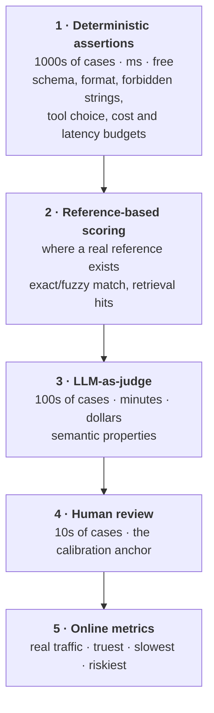

# Evaluation

Every heading is a question an interviewer asks: one-sentence answer, the reasoning that earns it,
then the trap. Evaluation is not testing bolted on at the end — it is the only instrument you have.

---

## How do you know your LLM feature got better?

**You define "better" as a measurable property before changing anything, fix a set of inputs, and
compare old and new on that set — with cost and latency in the same table as quality.** Name the
failure precisely (not "it hallucinates" but "it answers from the wrong document when the question
mentions two products"), build a fixed set containing it, run the baseline, change one thing, then
diff at case level and read what got worse.

**The trap:** "I looked at a few outputs and they seemed better" — you looked at the cases you
remembered, which are the ones you already fixed. **The second trap:** a single aggregate. A
4-point gain drawn entirely from easy cases while the hard slice fell 10 is a regression.

## Why is this genuinely harder than testing normal software?

**Three reasons, and they compound.** There is **no single correct output** — hundreds of good
summaries exist and `assertEquals` has nothing to compare against. **The output space is open**: a
parser has a finite grammar of failures, a generator fails in ways nobody imagined, so coverage in
the normal sense does not exist. And **the property is semantic** — "faithful", "helpful", "would
this embarrass us" are not computable by string comparison. Two more for depth: it is
non-deterministic, so the suite has a flake rate by construction, and a hosted model can shift under
a pinned name, so your core dependency changes without a changelog.

**The line that lands:** "Normal tests check that a function returns the value it must return. LLM
evals check that a distribution of outputs has a property. That is a statistics problem dressed as
a testing problem, and treating it as a testing problem is how you get a green suite and an angry
user."

## Why do exact match, BLEU and ROUGE fail for open-ended generation?

**They measure lexical overlap with one reference, and overlap is neither necessary nor sufficient
for correctness.** A perfect paraphrase sharing few words is punished; an answer echoing the
reference's phrasing while stating the opposite fact scores well. n-grams carry no negation,
attribution or numbers.

Where they still work — say this, it shows you are not being dogmatic:

| Method | Still fine for |
|---|---|
| Exact match, normalised match, schema checks | Closed output spaces: class label, extracted field, tool name, enum, a number after normalisation; valid JSON with required keys and types |
| ROUGE / BLEU | Summarisation and translation as a *relative* signal on frozen references, watching for large regressions. Never an absolute quality number |
| Embedding similarity | Survives paraphrase, but measures topical similarity, not correctness — a confidently wrong answer on the right topic scores well |

**The trap:** a team adopts an overlap metric because it produces a graph, then optimises it.
Outputs start copying the reference instead of answering the user.

## What are the levels of evaluation, and when do you use each?

**Five. Cost per case rises as you go up, and so does fidelity to "did the user get value". Push
every check as far down as it will go.**



Cadence: 1 and 2 on every commit, 3 on every prompt PR, 4 per release, 5 continuously. **Level 1 is
underused** — most real incidents are structural: malformed JSON, missing citation, unwanted
refusal, leaked system prompt, 6x over budget. **Level 3 reduces Level 4's load**, not replaces it:
the judge triages, the human reads the flagged cases plus a random sample it passed. **Level 4
keeps Level 3 honest**, because human labels are the only ground truth and therefore the judge's
calibration set. **Level 5 is the only one that pays the bills**, and arrives too late and too noisy
to steer development.

**The trap:** building the judge first, then paying a model to tell you your JSON is broken.

## You have nothing. How do you build the first eval suite?

**By hand, today, with twenty cases — and by writing pass criteria instead of expected outputs.**

1. **Write 20 inputs from what you think the feature is for**, before the implementation. It is a
   spec. Then **add the failures you already know** — the demo that broke, the one complaint.
2. **Cover the distribution:** short and long, the intents that matter, an ambiguous request, an
   adversarial one, and the one people forget — **out-of-scope requests where the correct behaviour
   is to refuse**.
3. **Write assertions, not a gold answer:** "cites a source", "no price", "under 150 words", "valid
   JSON with keys x, y". Properties of a correct answer are what you actually know.
4. **Run the current system and label it yourself** for the baseline; make it one command checked in
   next to the prompt, printing a per-case diff.
5. **Grow it only from real failures** — every production bug becomes a case in the same PR as the
   fix. That is how the suite becomes the system's memory.

```yaml
id: refund-window-multi-product
input: "Bought the Pro plan and a seat add-on last week, can I get money back on both?"
context_must_retrieve: [doc-refunds-v3]
assert: [json_valid, {cites_at_least: 1}, {contains_any: ["14 days"]}, {max_tokens: 300}]
judge: [faithfulness, answers_both_products]
```

**The trap:** waiting for "enough data" — twenty cases you wrote and understand beat two thousand you
scraped and never read. **The second trap:** writing the expected output as prose and diffing it;
that suite breaks on every rewording and within a month it is deleted.

## How do you mine a golden set out of production traffic?

**Sample deliberately and stratified, so the set matches the distribution rather than whoever
complained loudest — and mine implicit negatives rather than waiting for thumbs-down.**

| Source | Why it is good | Caveat |
|---|---|---|
| Rephrased or retried immediately | Strongest implicit failure signal | Also fires when they changed their mind |
| Escalated to a human | Unambiguous product failure | Low volume, biased to the severe |
| Draft heavily edited before sending | Edit distance is a gradient, not a binary | Needs the product to expose it |
| Explicit thumbs-down | Direct | Sparse; angry users rate far more often |
| Tail clusters by embedding | Finds traffic you never designed for | Needs clustering work |

**Cluster a month of traffic by embedding** and read the cluster sizes — that is how you find 12% of
"document Q&A" traffic is people writing emails. **Sample per cluster**, including small ones, since
uniform sampling gives you 90% easy majority case. **Oversample known-bad signals** as a separate
slice so you report "hard" and "representative" apart. **Strip PII at mining time**, or you cannot
check the set in. **Freeze it with a version number**: a score is only comparable to another on the
same set version. **The trap:** the set becomes a museum of your worst incidents, and 100% hard cases
says nothing about whether the everyday experience got worse.

## How do you keep the golden set fresh without overfitting to it?

**Run two sets — a frozen regression set so scores stay comparable, and a rolling set resampled
monthly so it still represents today's traffic — then hold out a third you refuse to debug against.**

Staleness has two causes. **The traffic moved** (new feature, segment, season): fix with the rolling
slice. **You saturated it**, because you spent three months fixing exactly these cases: retire solved
cases to an archive that still runs but reports separately, and add harder ones from current
failures. Symptoms are a pass rate pinned near 100%, production incidents with no case, and the
offline score and the online metric no longer moving together. Overfitting is the same disease from
the other side: iterating against a set is training on it by hand, and the symptom is a score
climbing while production does not improve.

- **Hold out a set you look at rarely**, at release only. The gap between working and held-out set
  is your overfitting gauge; a widening gap is the alarm.
- **Never put an eval case or near-duplicate into the prompt as a few-shot example** — check by
  embedding similarity. This leak happens when examples and cases came from the same mining run.
- **Distinguish a rule from a patch.** "If they ask about refunds in French, mention the 14-day
  window" names an eval case and will not generalise; "always cite the source for any numeric claim"
  is behaviour.
- **Never delete a case that once caught a real bug**, and **version set, rubric, judge model and
  prompt**, or the score is not a measurement.

## How big does an eval set need to be before a difference means anything?

Uncertainty on a pass rate scales as one over the square root of the case count, so at 100 cases near
80% anything under roughly 8 points is noise. The lever is **pairing**: run both variants on the same
inputs and look only where they differ, removing case-difficulty variance. "Of 120 cases they were
identical on 84; of the 36 that differed, the new prompt won 28 and lost 8" is stronger than two pass
rates and needs a fraction of the data. Report counts, and state what the set can resolve: "this set
sees a cliff, not a two-point move." Never compare across runs with a different judge, rubric, set
version or temperature — that comparison is void, not caveated.

---

# LLM-as-judge

The naive answer is "I ask GPT to score it out of 10". The senior answer treats the judge as another
model in the system: it has a spec, biases and a failure rate, and it is evaluated before it is
trusted.

## How do you write a judge rubric?

**A rubric is a spec, and the test of a good one is that two careful humans reading it reach the same
verdict. If they would not, neither will the judge.**

1. **One dimension per call** — faithfulness, relevance, tone, safety separately. A single "quality
   1–10" collapses dimensions that move in opposite directions.
2. **Define levels by an observable condition.** "Contains a claim not supported by the context" is
   checkable; "inaccurate" is a mood.
3. **Give it only the inputs it needs.** Do not say which variant is new, and do not show a reference
   unless authoritative — it punishes valid answers that differ.
4. **Evidence before verdict**, which stops the justification being post-hoc; **few labels**, because
   judges cluster at 7–8 on a 1–10 scale; and **two or three worked examples**, at least one
   borderline, since borderline examples do more work than clear ones.
5. **Force a machine-parseable final field** and fail loudly if it does not parse. A silently
   unparsed verdict defaulting to "pass" is how a suite goes green while the product burns.
6. **Version the rubric like code.** A rubric change invalidates prior scores.

```
Grade whether the ANSWER is supported by the CONTEXT.
CONTEXT: {{context}}   QUESTION: {{question}}   ANSWER: {{answer}}

1. List each factual claim in the ANSWER.
2. For each, quote the CONTEXT span supporting it, or write UNSUPPORTED.
3. Ignore style, length and formatting. They are graded elsewhere.

VERDICT: SUPPORTED | PARTIALLY_SUPPORTED | UNSUPPORTED
UNSUPPORTED_CLAIMS: <count>
```

That prompt names what to ignore, forces claim decomposition before judgement, and derives the
verdict from an enumerable intermediate a human can check. **The trap:** rubrics that smuggle in your
preferences — "prefer thorough answers" produces a judge that rewards length, and now you cannot tell
whether the new prompt is better or wordier.

## Why is pairwise comparison more reliable than absolute scoring?

**Relative judgement needs no calibrated internal scale; absolute scoring assumes one exists.** Ask
"which is better" and the judge is stable; ask "score 1–10" and the same output gets 7 today and 8
tomorrow. Nothing anchors an absolute scale — it drifts across runs, rubric edits, model versions and
the surrounding cases in the batch, whereas in a comparison both outputs move together under drift
so the *direction* survives. It also matches the decision you are making, and its output is
actionable: wins, losses, ties, and the list of losses to read, which is the real product of an eval
run. On cost, compare the candidate against current production output on the same inputs — n
comparisons, not n².

**Where pairwise is not enough — say this unprompted:** it gives direction, not level, so both
outputs can be terrible and you walk downhill in comfortable little wins; keep an absolute floor of
assertions, a safety slice and periodic human review. It is not comparable across time unless you
keep a frozen anchor, since "B beat A" then "C beat B" does not prove C beats A. And count ties:
forcing a winner manufactures signal, and a high tie rate means your change did nothing.

## What biases does an LLM judge have, and what do you do about each?

**Four you must name — position, verbosity, self-preference, formatting — plus some that bite in
practice. The mitigation is what separates the answer from a list you read somewhere.**

| Bias | What it looks like | Mitigation |
|---|---|---|
| **Position** | Prefers the first (or last) option regardless of content | Randomise order. Better: **run both orders, keep only consistent verdicts**, count flips as ties. The flip rate measures judge reliability directly |
| **Verbosity** | Longer, hedged answers win | Log output length with every verdict and check whether wins correlate with length. If they do, you are measuring verbosity. Compare at similar length; grade concision separately |
| **Self-preference** | A model scores its own family higher | Judge with a different family. Against a competitor's model either family is compromised — use a third, or a panel, and report the spread |
| **Formatting** | Bullets and bold read as quality | Strip or normalise markdown before judging; grade format with a deterministic check |
| **Sycophancy** | Assertive wrong beats hedged right | Rubric makes unsupported confidence a failure and requires evidence quoting. Never label variants "current" and "new" — the judge favours what it infers you want |
| **Reference anchoring** | Valid answers differing from a shown reference marked down | Only show a reference when genuinely authoritative |
| **Leniency drift** | Passes nearly everything | Salt the set with deliberately broken outputs and check they fail. A judge that never fails anything manufactures confidence |

Two structural mitigations cover several at once: **both-orders consistency** (run every pairwise
twice with options swapped, keep only agreeing verdicts) and **a panel from different families** with
disagreement routed to a human, for release gates. **The trap most teams hit:** they randomise for
position bias, feel safe, and never check length correlation — and verbosity bias quietly steers the
product towards long waffling answers users hate, because every change that adds hedging wins.

## How do you evaluate the judge itself?

**Against human labels on a held-out set — and you measure human-human agreement first, because that
is your ceiling.**

1. **Sample 100–200 outputs** across the full quality range, not just ambiguous ones, and have **two
   humans label them independently**, blind, before anyone looks at the judge.
2. **Measure human-human agreement.** People skip this and it is the most informative step: if two
   engineers agree 70% of the time the rubric is ambiguous and no judge will beat 70%. Fix the
   rubric, not the judge.
3. **Measure judge-human agreement** against consensus, with the base rate. If 90% of outputs are
   good, a judge that always says "good" scores 90% and is worthless — report **false-pass and
   false-fail separately**.
4. **Read every disagreement** and **weight errors by cost**. Most disagreements are rubric
   ambiguity, some judge failures, a few the humans being wrong. On a safety rubric a false pass is
   an incident and a false fail an annoyance; tune towards the cheap error.
5. **Recalibrate on any change to rubric, judge model, prompt or temperature** — each produces a
   different judge. Keep a trap set of known-good and known-bad outputs that runs on every change.

**Say this and it lands:** "The judge is not ground truth. It is a cheap approximation of a human
label with a known error rate, and if I cannot quote that error rate I should not quote the scores
it produces."

---

# Component evaluation versus end to end

## RAG: how do you separate retrieval quality from generation quality?

An end-to-end score tells you something broke and never where — the same 6-point drop can come from
chunking, embeddings, reranking, the prompt or the model. **Evaluate each stage against the input it
was actually given**: a generator that answered wrongly from a context that never contained the
answer did nothing wrong. Components attribute, end-to-end decides, so keep both. Score retrieval on
whether the supporting evidence was in the context you passed and generation on whether the answer is
supported by it, then read the four cells.

| Retrieval | Generation | What you see | Fix lives in |
|---|---|---|---|
| Missed the doc | — | Wrong or hallucinated answer | Chunking, embeddings, hybrid search, query rewriting, larger k |
| Retrieved but buried | Ignored it | Wrong answer despite correct evidence present | Reranking, context ordering, fewer chunks, prompt |
| Retrieved and used | Still wrong | Genuine generation failure | Prompt, model, output constraints |
| Retrieved the wrong doc | Right answer anyway | **Looks like a pass** | Nothing — and that is the problem. It answered from parametric memory and will be confidently wrong the moment the question is specific to your data |

Volunteer that last row: a RAG system scoring well end to end while retrieval is broken has not been
tested on anything your corpus uniquely knows.

## Which retrieval metrics actually matter?

**Recall@k, then the rest. Recall@k is the ceiling on the whole system: if the supporting chunk is
not in the k you pass, no prompt change recovers the answer.** Precision@k drives cost and quality,
because irrelevant context distracts the model. MRR and nDCG matter once you have a reranker, since
models attend unevenly across long contexts. And chunk-level recall catches the case where
document-level recall looks fine but the answer spans a boundary.

**Report recall at the k you actually use** — recall@100 of 95% is irrelevant if you pass 5 chunks —
and **plot recall against k**: if recall@20 beats recall@5 badly, a reranker is the cheap win.
**Labelling is cheaper than it sounds:** mark which chunk ids contain the answer, bootstrapping by
having a model write a question answerable only from a chunk. **Caveat:** synthetic questions are
lexically similar to their source chunk, so they overstate recall.

## What do you check on the generation side?

- **Faithfulness.** Every claim supported by the context. Decompose into atomic claims and check each
  — that is what makes the judge reliable and auditable.
- **Answer relevance.** Grounded *and* addressing what was asked. A faithful answer to a different
  question is a common invisible failure.
- **Abstention.** Keep a slice of questions the corpus cannot answer and assert the system says so.
  A system that never abstains will hallucinate in production.
- **Citation correctness.** The cited chunk actually contains the claim. Near-deterministic to check,
  high value, frequently broken.

**The trap worth naming:** faithfulness is not truth — it measures agreement with the retrieved
context. If the context is out of date, a perfectly faithful answer is wrong and your metric is
green. Corpus correctness is a separate problem.

## How do you evaluate an agent, rather than a single output?

**You grade the trajectory, not just the last frame. The final answer says whether it arrived; the
trajectory says how expensive, how safe and how repeatable the arrival was.**

1. **Task success against the world, not the agent's summary.** Assert on end state: the row exists,
   the file was written, the ticket moved. An agent reporting success is not evidence — the most
   common way agent evals lie.
2. **Tool choice** as constraints, not an exact script: "must call `search` before `answer`", "never
   call `delete_*`", "no repeated identical call".
3. **Recovery.** Inject failures deliberately — a 500, an empty result set, malformed data, a
   timeout. Did it retry, change approach, ask, or plough on and fabricate? Fabricating on tool
   failure is the most dangerous agent behaviour and a happy-path suite never sees it.
4. **Efficiency**, and **termination** in both directions. Steps, tool calls, tokens, wall clock,
   dollars per task — two agents both pass and one costs eight times more. Did it loop, or stop
   early and declare victory?
5. **Safety along the path.** An irreversible or out-of-scope action mid-run is a failure even when
   the final state is correct. Final-answer scoring passes it.

**Why final-answer-only scoring hides the expensive path:** cost, latency, flakiness and dangerous
actions all live in the middle, and an agent that stumbled onto the right answer by a lucky path has
no reason to repeat it — your pass was noise. Making it practical: **log the run as structured events** (step index, tool, arguments, result,
tokens, duration) so the eval reads events rather than scraping logs; **assert on trajectory
properties, never exact equality**, since many paths are valid; **record and replay tool outputs** so
the only remaining variance is the model, the single biggest practical unlock; and report per run
pass rate, p95 steps, $/task, recovery-slice pass rate, and safety violations, which must be zero.

## Why do task-specific evals beat public benchmarks?

Your users write badly, in your domain, against your corpus, and you ship a system, not a model —
retrieval, prompts, tools and fallbacks contribute more variance than model choice. Contamination is
unfalsifiable, so public scores are weak evidence by construction. **One sentence:** "Leaderboards
decide what I *try*; my own eval set decides what I *ship*."

---

# Evals as an engineering discipline

## A prompt is a deployed artefact. What does that mean in practice?

**A prompt change is a deploy: reviewed, versioned, tested against a fixed set, rollable back as a
unit.** Prompts have no type checker and no linter that understands meaning — a one-word edit changes
behaviour across every request and nothing tells you.

1. **Prompts live in version control**, next to the eval set covering them. If they live in a config
   service so non-engineers can edit them, the change still goes through review and the version is
   logged on every request, so any behaviour change is attributable.
2. **Every prompt PR carries its eval diff** — aggregate plus the per-case list of what changed,
   sorted by how much worse it got.
3. **The deployable unit is the whole configuration:** model id, sampling params, prompt version,
   tool schemas, retrieval index version, chunking config. Change one and the previous evaluation no
   longer applies. Pin and log all of them, and make rollback a tested config change.

## What does the CI gate actually look like?

**Three tiers by cost — free structural checks on every commit; the frozen regression set, safety
slice and pairwise judge on every prompt PR; the full set nightly plus a live-traffic canary with
auto-rollback after merge. The gating rules matter more than the tiers.**

| Check | Gate |
|---|---|
| Structural assertions, schema, forbidden content | **Hard fail.** No override without a second reviewer |
| Safety / refusal / policy slice | **Hard fail on any regression.** Frozen, never "improved" to make a PR pass |
| Cost and latency budgets | **Hard fail on breach** — these regress silently and never get fixed later |
| Judge quality scores | **Report; do not auto-block on small moves.** Block on a cliff, else a human reads the losses. Auto-blocking on a 2-point move teaches people to re-run until green |
| Flake rate | Report, and fail if it jumps |

**What makes this work socially** is the readable diff: old output next to new, per case, sorted by
regression size. A CI job that prints only a score gets rubber-stamped within two weeks.

## How do you handle non-determinism in the test suite?

You cannot remove it, so you bound it. Assert on properties instead of strings, and record and replay
everything that is not the model so one source of variance is left instead of four. For cases that
matter, sample n times and assert on the rate: **all-of-n for things that must always hold** (safety,
schema, no leaked system prompt), **k-of-n for quality** (8 of 10). Track flake rate as a first-class
metric and never re-run until green silently. **And say this:** temperature 0 is not determinism —
batching, floating-point non-associativity on GPUs, MoE routing and serving changes all move the
output.

## Offline and online disagree. Which do you trust?

**Online decides what to ship. Offline explains why. On disagreement the default assumption is that
your eval set is wrong, not that the users are.** Usual causes: the set is not the traffic
distribution; you optimised the wrong property (users wanted shorter, the judge rewarded thorough);
the affected slice is 2% of traffic, so an offline +8 is an online flat line and both readings are
correct. **Every online regression becomes an offline case** — that loop is what makes the offline suite
predictive — and **track the offline-to-online correlation as a property of the suite**: if the last
five offline wins did nothing online, fix the suite before running another experiment. On the A/B
itself, randomise by user or session rather than request, and do not rely on thumbs-up/down, which is
sparse and skewed to anger. Use task completion, retry rate, escalation, and best of all **edit
distance between the generated draft and what the user sent**.

## How would you detect the provider silently changing the model underneath you?

**Run a frozen canary set on a schedule and watch its output distribution, not just its scores — and
log every scrap of provider metadata so you can correlate a shift with a version change.**

The cheap tells need no judge and catch most of it: **output length distribution** per prompt, which
moves on almost every silent change; **refusal rate** on a fixed set; **format-compliance rate**, how
often a structured-output prompt parses first time; the **latency and token-throughput profile**; and
the **byte-identical rate at temperature 0** on a fixed prompt run repeatedly — when that rate changes
shape, something moved in the serving stack. Judge scores on the canary are the slower, more
expensive confirmation.

Around that: **log the model id and any version or fingerprint field on every request** and alert on
any value you have not seen before. **Pin explicit dated model ids; never point production at a
"latest" alias**, and keep the previous pinned id in config so rollback is a flag flip. Segment
production metrics by model version so a shift shows up as an attributable step change. **Be honest
about the limits, because a good interviewer will push:** a pinned version can still be
served by different hardware or a different serving stack, so "we pinned it" is no guarantee of
stable behaviour. And the canary shifts for your own reasons too — an index rebuild, a prompt edit, a
library upgrade — so it must be frozen in every respect except the model.

---

# Cost and performance are eval axes

## How do you evaluate cost and latency alongside quality?

**Put quality, dollars per successful task and p95 latency in one table, gate on all three, and pick
on the frontier rather than on the quality column.** Quality you cannot afford, or that arrives after
the user has left, is a failed eval. Record per case: input tokens split cached vs uncached (the
split is the lever), output tokens, tool and retrieval calls, retries and fallbacks, time to first
token, total wall clock.

**The comparison unit is cost per *successful* task, not cost per call.** A cheaper model that fails
20% more often — triggering a retry, a fallback to the expensive model, or a human handoff — is more
expensive. That is what makes routing concrete: small model for the easy 90%, expensive for the hard
10%, at which point "how good is the router and what does a misroute cost" needs its own eval slice.
**TTFT and total latency are different products:** for streaming chat TTFT dominates perceived speed,
for a background agent only total time and cost matter.

**Gates worth having:** token budget per request, p95 latency, dollars per thousand requests — a
prompt change adding 300 tokens to every call is a permanent tax nobody removes. **Three traps:**
measuring cost on the eval set, which is shorter and cleaner than production; ignoring prompt-cache
structure, since cache hit rate lives in the *shape* of the prompt (stable content first, volatile
last) and an edit near the top of the system prompt invalidates the cache for every request after it,
which no quality eval will see; and averaging latency, because the mean hides the tail.

## Where does evaluation stop and observability start?

**Evaluation asks "is this version better" on a set you control. Observability asks "what is
happening right now" on traffic you do not. They share the trace** — inputs, retrieved chunks, prompt
version, model id, tool calls, output, tokens, latency, cost. Log it in production and **any incident
replays as an eval case in minutes**; the offline judges can be sampled against live traffic for a
continuous signal, and the online metrics at the top of the pyramid *are* the observability
dashboard. **The trace is the unit of both.**

---

# What is genuinely unsettled

Saying what is not yet solved is a seniority signal, not a weakness.

- **Judge reliability varies wildly by domain and rubric.** A judge that agrees with humans on
  summarisation may be near-useless on your correctness rubric. Treat any generic "judges agree with
  humans X% of the time" as marketing until measured on your own task.
- **Agent evaluation has no settled metric set.** Trajectory scoring is ad hoc across the industry,
  so published agent comparisons are hard to interpret.
- **Faithfulness metrics disagree** with each other and with humans; the number is meaningless
  without knowing which implementation produced it. **Benchmark contamination** cannot be ruled out,
  only reasoned about.
- **Statistical practice is weak industry-wide.** A large fraction of reported improvements are
  within noise; be sceptical of any gain reported without a set size. And tooling churns fast, so
  anchoring your answer on a vendor dates you.

**What is stable:** a fixed set you understand; versioned everything; component-level attribution;
human labels as the calibration anchor; cost and latency in the same table as quality; a loop pulling
production failures back into the suite.

**And the sentence to have ready when asked how you would start:** "Twenty hand-written cases,
property assertions instead of gold strings, one command to run it, checked in next to the prompt —
on day one, before the feature works."
