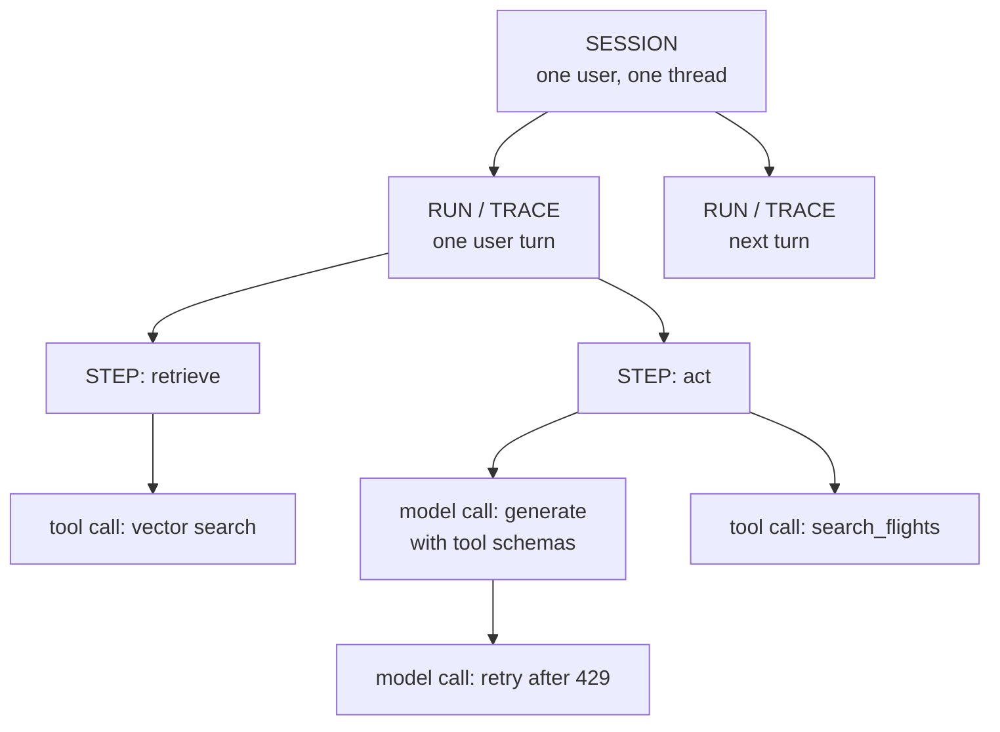
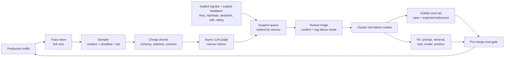

# Observability and tracing

LLM systems fail *successfully*: 200 OK, valid JSON, normal latency, wrong
answer. Nothing to page on and nothing to grep for, unless you decided in advance
to write it down. Anyone can say "we use tracing"; the follow-up is "what is in a
span", and that is where it gets specific or falls apart.

---

## What does observability mean for an LLM product, and how is it different from a normal service?

**One sentence:** in a normal service you observe *whether* it worked; here you
observe *what it did and why*, because success and failure look identical from
the outside.

A hallucinated citation and a correct one are both a 200 with similar tokens and
latency; the failure is in the *content*, and content is only inspectable if you
stored it. Three consequences: you store full outputs, an anti-pattern everywhere
else; "nothing changed" is never a valid conclusion, because the system is
non-deterministic and externally owned, so without the model id and params on
every call you cannot even ask; and you need the run as a structured object,
because the failure is usually step 4 taking a wrong turn and steps 5 to 11 being
reasonable given it.

**The trade-off to name.** All of that pushes toward recording more, which costs
money and creates privacy exposure. The design problem is high-fidelity traces
without an unlicensed copy of your users' data.

**The failure modes that leave no stack trace** are all 200s: a fluent wrong
answer, retrieval returning nothing with no error raised, silent truncation of the
important document, `finish_reason = length`, a polite refusal, a tool called with
plausible wrong arguments, an uncounted repair retry, a step-cap best effort, a
provider swapping the model behind an alias. Each is a metric you could have had,
and none is standard. You have to decide to emit them.

**The trap.** Bolting this onto the existing stack: request count, error rate,
p99. All three can be green while the product is useless. If you cannot ask "show
me the last fifty conversations where the user rephrased their question", you have
uptime monitoring.

---

## What is a trace and a span here, and what is the right unit?

**One sentence:** a span is one unit of work with a start, an end and attributes;
a trace is one user-visible request made of those spans; and the right unit is the
*run*, with the session above it and the model call below it. "We trace each LLM
call" is a level too low to debug anything.



| Level | Identity | What lives here | What you answer with it |
|---|---|---|---|
| **Session** | `session_id`, user/tenant | History, accumulated state, total cost and turns, eventual outcome | "Did this user get what they came for?" "Which accounts are expensive?" |
| **Run / trace** | `trace_id` | One user turn end to end: input, final output, latency, cost, tokens, step count, terminal status, feedback | "Which runs went wrong?" This is the row in your review queue |
| **Step / span** | `span_id`, `parent_span_id` | A phase — plan, retrieve, act, finalise — holding the *decision* made and the state entering it | "Where did it go wrong?" |
| **Model call** | span | One provider request: resolved prompt, params, output, tokens, cost, TTFT | "What exactly did the model see and say?" |
| **Tool call** | span | Name, arguments as sent, raw result, size, latency, error | "Did the tool do what the model thought it did?" |

The run is the right unit because it is what a human evaluates, what a user
experiences, what you attach feedback to, what you price and what you replay.
Per-call metrics say the average call is fine while the average *run* takes eleven
calls and costs four dollars. The session matters more than people expect: right
at turn one, corrected at turn two, nonsense by turn five because the bad turn is
still in context, and unlinked traces make you diagnose turn five in isolation.
Two things people get wrong: **spans too fine**, a 400-span trace nobody reads,
when you should span at the level you would *describe* the system; and **retries
as a field instead of a span**, losing the latency and tokens of failed attempts.
Retries are where cost hides.

---

## What do you log on every model call, and why does each field earn its place?

**One sentence:** enough to reconstruct the call exactly, price it exactly and find
its parent. The reasons matter more than the list; an interviewer picks one row
and asks "why do you need that".

| Field | Why it earns its place |
|---|---|
| `trace_id`, `span_id`, `parent_span_id` | Without the parent link a call is an orphan. You need to walk up to the run and down to the retry |
| `session_id`, `tenant_id`, hashed `user_id` | Cost attribution, per-tenant quality, and finding all the damage when one customer reports a problem |
| Step / node name | Lets you aggregate "the planner call" across runs. Free, and the axis you slice every metric by |
| **Model id, provider, served version** | The field people forget. An alias like "latest" is not an identifier. When quality moves and you cannot show which model served the traffic, you cannot prove anything |
| Params: temperature, top_p, max_tokens, stop, seed, response format | Half your incidents are a config change. Also required for replay keys |
| Tool schemas offered, or a hash of them | Behaviour depends on the tools it was *shown*. Log only the tool it called and you cannot explain why it stopped calling another |
| **The resolved prompt exactly as sent**, plus template id and version | The whole ballgame — see the next question. The version lets you group by "prompt v7" and diff when v8 regresses |
| Full output: text, and tool calls with arguments | The thing you are evaluating. Also the input to the next step |
| `finish_reason` | Separates "finished" from "cut off at max_tokens" from "stopped to call a tool" from a content filter. Four different bugs, one field |
| Prompt, completion, cached and reasoning tokens *separately* | They price at different rates, so a single "tokens" number cannot be priced. Reasoning tokens are billed and often invisible — a common reason a bill triples with no code change |
| Computed cost | Store the number, not the ingredients. Prices change; you want what it cost *then* |
| Latency: queue/wait, **TTFT**, total | TTFT is the perceived latency when streaming and behaves differently from total |
| Attempt number, retry reason, fallback provider used | So a fallback to a weaker model reads as a quality explanation, not a mystery |
| Cache status — hit, miss, partial — and the key | Explains both cost spikes and latency bimodality |
| Error class and the **provider request id** | The request id is what you give provider support. Nobody logs it; everybody needs it eventually |
| Input tokens vs the context limit, and a truncation flag | Silent truncation is a top-five cause of "it used to work" |

**What makes this affordable:** small queryable attributes on the span, large
payloads in blob storage keyed by span id and referenced.

---

## Why must you log the rendered prompt rather than the template?

**One sentence:** template plus variables is not the prompt — the prompt is what
came out the other end of your assembly code, and that is the only thing the model
actually saw.

Between template and provider sits a pile of code: interpolation, chunks injected
in some order, history trimmed to fit, tool schemas serialised, a framework's own
system prompt prepended, escaping, truncation. The bugs you hit are chunks joined
in the wrong order so the least relevant sits nearest the question, trimming that
dropped the turn where the user gave the constraint, a `None` variable rendered as
the literal "None", or a retrieved document containing a line that reads like an
instruction which the model followed. None of that is visible from "template v7
with these three variables".

**Say this line:** reconstructing the prompt from template plus variables means
re-running the assembly code, which is precisely the code you suspect. Storing the
rendered prompt is the difference between debugging and archaeology. The cost is
that rendered prompts are big and full of whatever the user typed.

---

## How do you reconcile full prompt logging with PII?

**One sentence:** treat the trace store as a separate, short-lived, restricted
data system rather than as part of your logs, and spend your effort on retention
and access control rather than on trying to redact perfectly.

1. **Separate the trace store from the log store.** App logs are widely readable,
   shipped to several tools, kept a year. Traces contain user content: different
   system, access policy, retention, and region if residency is in play.
2. **Classify fields, not blobs.** Content — prompt, output, tool arguments and
   results — is restricted and short-lived. Metadata — tokens, latency, model,
   cost, status — flows anywhere and is kept for years, and most questions you ask
   daily are metadata questions.
3. **Redact on the way in**, with typed placeholders like `<EMAIL_1>` so the
   structure survives. Lossy both ways: a risk reducer, not a guarantee, and never
   claim otherwise in an interview.
4. **Sample content, keep all metadata.** Attributes on 100% of spans; payloads on
   100% of errors, negative feedback, judge-flagged runs and debug-opted tenants,
   plus a few percent of the rest. **Tail sampling** — decide after the run, once
   you know it was interesting — beats head sampling, which throws the rare runs
   away.
5. **Short retention on content, long on metadata.** Make opt-out a per-tenant
   flag, or zero-retention for one enterprise customer is a quarter of work. And
   redact before content leaves your boundary: whatever a vendor SDK captures is
   what the vendor holds.

**The trap.** Teams redact the prompt and then log the raw user message at INFO
two lines earlier. Redaction has to be at the point of capture on every path.

---

## Which metrics actually matter?

**One sentence:** rate, errors and duration, plus LLM-specific ones that measure
*shape*. Latency and cost breakdowns are in the cost-and-performance file; two
things carry over. Keep TTFT and inter-token latency as separate distributions,
because they have different causes and fixes. Never report the mean: LLM latency
is bimodal, so it sits in the valley between two humps and describes nobody.

| Metric | Why |
|---|---|
| Output-contract failure rate | JSON parse, schema validation, missing required field. Your "the model broke" metric |
| `finish_reason = length` rate | Truncated answers. Users read them as low quality; you read them as a `max_tokens` bug |
| Empty-retrieval rate | Retrieval returning nothing above threshold. Pure silent failure |
| Refusal rate | Moves when prompts or models change, and looks like nothing in your dashboards |
| Error, timeout and 429 rate **by provider and model** | Providers degrade independently; aggregated, a bad hour is invisible |
| Retry rate, retry cost, fallback rate | Invisible spend and latency, and the direct explanation for quality dips |
| Tool failure rate, by tool | The most common non-model failure, and the easiest to fix |
| Steps per run, and tool calls per run by tool name | The most informative agent metric. Shows loops and shows unused tools |
| Step-cap-hit rate, and repeat rate (same tool, same arguments, twice) | Runs that gave up, and a specific detectable pathology |
| Human-handoff rate | Your product-level failure metric |

**The step-count distribution is where your money goes.** Median run: three steps,
half a cent. p99: thirty steps, two dollars, thirty times the latency — your cost
problem and your worst user experience at once, while the mean is dragged up but
stays unalarming. Plot the histogram: there is usually a spike at the step cap,
and that spike is runs that failed and charged you the maximum for it.

---

## Why alert on distributions and on cost, not just on errors?

**One sentence:** the error rate is roughly constant while the thing that actually
breaks is the shape of the traffic and the size of the bill.

Almost every failure above returns 200. A regression shows up as a *shift*: output
length up 40%, p95 steps from 6 to 14, refusals from 0.3% to 4%, cache hit rate
from 80% to 20%. In order of usefulness: **cost per run**, with hourly and daily
burn-rate alerts, because cost is the fastest proxy for "something structurally
changed" — a prompt edit that stops hitting the cache, a retry loop, a fallback, a
context leak — and unlike quality it is measured exactly and instantly;
**distribution shift rather than thresholds**, since "p95 steps is 2× yesterday"
catches what "steps > 20" never will, compared against the same hour last week;
**the silent-failure metrics** above, the LLM equivalent of a 500; **TTFT p95
separately from total**, because the divergence is diagnostic; and **provider
error rate per provider**, so one provider's bad hour is not diluted below
threshold by the healthy one.

**The trade-off.** Distribution alerts are noisier, and some become a daily digest
rather than a page. Page on cost burn and provider health, review the rest daily.
Quality regressions do not need a 3am page; they need catching before the next
deploy, which is what the eval gate is for.

---

## How do you debug an agent run from a trace?

**One sentence:** walk the run *forward* to the first step whose input was still
correct and whose output was wrong, then read exactly what that step saw.

1. **Start from the run, not the failure.** Get the shape: how many steps, which
   tools, where the time and tokens went.
2. **Find the first divergence.** Read forward. Later steps behave reasonably
   given a bad input, so the last error is rarely the first error.
3. **Classify that step.** Good context and bad reasoning → prompt, model or
   decomposition. Bad context → retrieval, or the step before. Right tool with
   wrong arguments → tool schema, description or validation. Tool returned
   something wrong or empty → not a model problem at all, and roughly half of "the
   agent is dumb" reports land here.
4. **Read the rendered prompt at that step.** Is the relevant document in there,
   near the end or buried in the middle, was anything truncated, is the history
   right, did a tool result land as a giant unreadable blob.
5. **Check `finish_reason` and token counts** before theorising — half the time it
   is "hit max_tokens" or "input was 3k tokens when it should have been 30k". Then
   check attempts and fallbacks: served by the fallback after a 429 is your
   explanation, and the fix is capacity, not prompting. Then replay and confirm.

**The rule that makes this possible:** *the context at every step must be
reconstructible from stored data alone* — not what you intended to pass, what was
passed. Hence the rendered prompt, and hence tool results stored raw before any
summarisation; the summariser is frequently the bug you are hunting. Surface a
short run id in the UI and in support tickets too, or every bug report is
"yesterday it said something weird" with nothing to search on.

---

## Record and replay

**One sentence:** record every provider response alongside its request so any run
can be re-executed offline against the recording — and build it early, it is the
highest-leverage piece of infrastructure in the whole system.

Without replay every fix is a live experiment: change a prompt, re-run against the
real provider, pay, wait, get a different answer for reasons unrelated to your
change. With it you get deterministic debugging of the failed run; free regression
tests, because a recorded run is a fixture and routing, parsing, the state machine
and truncation get tested with no network call; and honest comparison, because
replaying a thousand production runs after a parser change holds model outputs
fixed, so any diff is caused by your change. Every model call is keyed by a hash
of everything that determines the response:

```python
key = sha256(canonical_json({
    "model": model_id,             # the served version, not the alias
    "params": params,              # temperature, max_tokens, response_format...
    "messages": resolved_messages, # after templating, retrieval, trimming
    "tools": tool_schemas,
}))
```

Record mode calls the provider and writes `key -> response`; replay mode reads the
recording and never touches the network. Tool calls get the same treatment: the
HTTP cassette pattern, one layer up.

**The four traps, and they all bite.** *Non-determinism on your side breaks the
key* — a date, uuid or shuffled list in the prompt means no two runs hash the
same, so inject clock and randomness through an interface you can freeze.
*Temperature 0 is not determinism* — providers do not guarantee identical output
at temperature 0 and `seed` support is partial, so you get determinism by
recording, not by asking the model nicely. *A miss in replay mode must raise*, or
the test is neither deterministic nor free. *Replay tests orchestration, not model
quality* — change the prompt and the key changes, so you get a miss, correctly,
and prompt or model changes need real evaluation instead.

**Build order:** tracing first, replay second, evaluation third. Evaluation with no
traces has nothing to evaluate on, and iteration without replay is slow forever.

---

## How do you measure quality online when you have no ground truth?

**One sentence:** triangulate — implicit behavioural signals, a sampled
asynchronous judge and a little explicit feedback — and treat each as a noisy
pointer to traces worth looking at, not as a number. Implicit signals are the
strongest: free, unbiased by who bothers to click, available on 100% of traffic.

| Signal | What it usually means | Watch out for |
|---|---|---|
| Immediately regenerated / retried | The answer was wrong or unusable | Sometimes just curiosity |
| Rephrased the same question | Misunderstood the intent | Distinguish rephrase from genuine follow-up; semantic similarity to the previous turn is a decent heuristic |
| Abandoned mid-run | Too slow, or visibly going wrong | Confounded with normal drop-off |
| Conversation unusually long for the task type | Not converging | Some tasks are legitimately long |
| Edited the output before using it | Partially wrong. **The edit itself is a label** | Needs a surface where editing happens |
| Copied / accepted / shipped the output | Success, and the best signal you can get | Only instrumentable in some products |
| Escalated to a human, or asked the same thing next day | Hard failure; never got an answer | Lagging; needs session linking |

The strongest is your product's version of *acceptance* — copied the code, sent
the email, kept the suggestion. Instrument that one deliberately; it is worth more
than all the others combined, because it is the outcome you are selling. Slice
every quality signal by latency bucket first: abandonment correlates with latency,
and a latency regression misdiagnosed as a quality regression is a classic.

On top of that, a **sampled async judge**, off the request path always: stratify
the sample, run cheap deterministic checks first and send only survivors to the
judge, and report as "correlates with human judgement at roughly X", never as
accuracy (judge design in full is in the evaluation file). **Explicit feedback is
weak alone** — low single-digit response rate, biased toward the angry, and a
thumbs-down could mean wrong, slow, rude, refused or too long — so ask one
follow-up category to turn an alarm into a label, capture the user's edit, which
is the most underused channel there is, and attach the trace id to every feedback
event, because a rating with no trace behind it is a mood, not a bug report.

---

## How does production get back into your eval set? Close the loop.

**One sentence:** every production failure you find becomes a case in the golden
set, and the golden set gates every change — that loop is the entire answer to
"how does this get better over time".



The parts people leave out. **Triage is human and not optional**: a judge
nominates, a person confirms and *names the failure mode*, and that tag turns a
pile of bad outputs into "we have three problems and one is 60% of the volume".
**Rank the queue by volume, not severity**, clustering first, usually by embedding
the inputs. **Every golden case carries the expected behaviour** — "should have
cited document X" — or it is a sample, not a test. **The gate must block, not
warn**; an advisory suite decays within a quarter, and keep a held-out slice or
you overfit to the set you tune against.

**Say this if you can:** the loop is the product. A team that ships it improves at
a steady rate whatever the model does, because every incident permanently becomes
a test. A team without it re-fixes the same class of bug every month and cannot
tell whether the new model is better or worse *for their users*.

---

## Cost attribution and tooling

Compute cost at call time, store it on the span, and roll it up per run, tenant,
feature and **step name** — the step rollup tells you which part of the pipeline
is expensive. On tooling, emit OpenTelemetry spans so you get one trace across
gateway, orchestrator, vector store and model calls rather than an LLM-shaped
island; the GenAI semantic conventions are still evolving and agent concepts lag
single-call ones, so follow them where they exist and namespace your own where
they do not. On build versus buy the deciding factor is data residency, not
features: what you ship a vendor is the full text of your users' prompts. Middle
path — metadata-only spans to your existing stack, content in your own storage and
region, a vendor only where the UI is the value.
