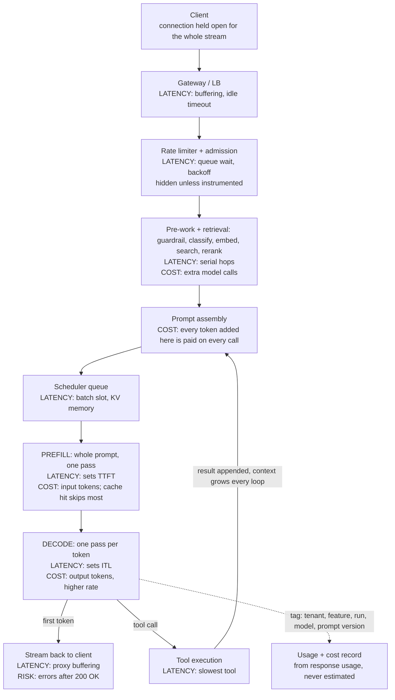

# Cost and performance

Why is it slow, why is it expensive, what would you do. Almost every answer falls out of one fact: **an LLM
request has two phases with completely different cost curves, and most questions are really asking which
phase you are in.** And **never quote prices, tokens-per-second or benchmark scores** — they move between
versions and tiers; say what you would measure instead.

## Where does the time actually go?

**Prefill** processes the whole input in one parallel forward pass — matrix-by-matrix, compute-bound. It
produces the KV cache and the first token, and its cost grows with input length: linear in most of the
model, quadratic in attention.

**Decode** generates one token at a time, each pass reading all model weights plus the whole KV cache to
produce one token's activations — matrix-by-vector, tiny arithmetic, enormous memory traffic. Decode is
**memory-bandwidth-bound**.

So **input length mostly costs TTFT**, since prefill happens once, while **output length costs everything
after, linearly** — a 1000-token answer is ~10× the wall-clock of a 100-token one. And **decode is why
batching works**: bandwidth-bound steps barely use compute, so each weight is read once for the whole batch.

**The trap.** People shrink the prompt when the complaint is "it takes ages to finish": prompt size is the
lever for TTFT, output tokens the lever for total time. Decode also slows as the KV cache it reads grows, so
long context plus long output is the worst quadrant.

## Why are TTFT and inter-token latency separate metrics?

Different causes, different fixes; averaging them makes both undiagnosable.

| Metric | Measures | Driven by |
|---|---|---|
| **TTFT** | Accepted → first token | Prompt length, queueing, retrieval, cache hit/miss, network |
| **ITL / TPOT** | Gap between output tokens | Model size, bandwidth, batch pressure, context length, buffering |
| **Total** | Request → last token | ≈ TTFT + output_tokens × ITL |

That identity is the useful part. When total latency regresses: did TTFT move, did ITL move, or did the
model start writing longer answers? The third is common after a prompt change and looks identical on a
total-latency dashboard, so report latency per output token alongside total. Use p50/p95. **High TTFT:**
shorten or cache the prefix, parallelise retrieval, drop the preflight call, leave the rate-limit queue.
**High ITL:** fewer tokens, smaller model, less concurrency, find the buffering proxy or the huge shared
batch.

## What does streaming buy, and what does it cost?

It converts total latency into TTFT for the user — a large perceived win for zero compute saving — and buys
early cancellation. The costs are what interviewers want:

1. **Errors after the response started.** You already sent 200, so failures must arrive in-band, and clients
   must treat "ended early" as distinct from "finished" or truncation looks complete.
2. **Retry is ambiguous.** Retrying after 200 tokens contradicts what the user just read. Rule: retry only if
   nothing was emitted, then fail visibly.
3. **Buffering kills it silently.** Proxies, LBs, CDNs, compression. Works locally, arrives as one lump in
   prod, nothing errors. Disable buffering per hop and test through the real edge.
4. **Timeouts are the wrong shape:** an idle timeout *plus* a total cap — idle-only lets a runaway live
   forever, total-only kills legitimate long answers. And **you cannot validate before you emit**: a check
   that fails at 90% output is a log line, not a guardrail.
5. **Connections stay open for the whole generation**, so capacity is concurrent connections, not RPS: async
   I/O, check your HTTP client's pool size, and cancel upstream on client disconnect.

**The senior move:** say where you would *not* stream — background jobs, a call whose output feeds another
call, anything needing validation first, tool-calling steps nobody sees.

## Why does batching raise throughput but hurt the individual request?

Reading one layer's weights costs the same for one token or sixty-four, so batching amortises it: throughput
climbs steeply, then flattens once you become compute- or memory-capacity-bound. The individual request pays
twice — **queue wait** while a static batch forms, and **shared bandwidth** during generation. Static
batching adds **head-of-line blocking**: the batch runs until every sequence finishes, so one long answer
holds a slot and delays everyone.

**Continuous batching** (in-flight, iteration-level) schedules per decode step, evicting finished sequences
and admitting waiting ones. Nobody waits for a batch to form or for the longest request, and slots stay
full. Default in modern inference servers, and the single biggest throughput change in serving. Two
behaviours to name: **chunked prefill**, since a long prompt run as one unit stalls everyone's decode, so it
is interleaved; and **preemption**, where a sequence is evicted when KV memory runs out, seen as an enormous
one-off ITL spike. Batch size is a dial between throughput and per-request latency, set from your SLO. **The
trap:** benchmarking at concurrency one.

## What is speculative decoding?

A small draft model guesses the next few tokens and the big model verifies them all in one forward pass,
since bandwidth-bound decode has spare compute; under heavy load it can *reduce* throughput.

## What does prompt caching do, and what does it require?

It stores the KV cache for a prefix so the server skips prefill for that part, cutting TTFT and input cost.
It requires an **exact, byte-identical, stable prefix starting from the first token**, which drives a layout
rule: **static first** (system prompt, tool schemas, few-shots, reference docs), **slowly-changing next**
(per-tenant config, history), **volatile last** (user message, retrieved chunks, timestamps).

One varying byte near the top invalidates everything below — a timestamp or "current date" line, a trace id
in the header, tool schemas from an unordered dict, personalisation at the top, a randomly sampled few-shot,
a whitespace change. Caches also **expire**, so a low-traffic feature may never be warm, and they are **per
serving location**, so cache-aware routing is a real self-hosted lever. Cached input is priced differently —
a discount on reads, sometimes a premium on writes — and it **only helps prefill**.

**Cache hit rate belongs on the dashboard**: a refactor that drops it to near-zero is a cost regression with
no other symptom. Related, a long system prompt is a cost decision, not a style one — paid on every call ×
calls per task, eating context you wanted for evidence, and rules buried mid-prompt get followed loosely.

## Where does queueing delay hide when you are rate limited?

Between "my service accepted the request" and "the first token arrived" — in places neither the provider's
reported latency nor a naive call timer sees.

| Where | What it looks like |
|---|---|
| Client-side limiter or token bucket | Your own code sleeping before it dials out |
| Retry backoff after 429/503 | Counted as "waiting" if you time only the successful attempt |
| Your own concurrency semaphore | In-flight cap reached; a queue you wrote |
| Connection pool exhaustion | Waiting for a free connection, worse with long streams |
| Provider admission queue | Accepted but not scheduled; visible only as TTFT |
| Self-hosted scheduler queue | Waiting for a batch slot or for KV memory |

**Instrumentation rule:** measure from when your service accepts the request to first token delivered, and
record attempt count, backoff and queue wait separately — time only the final successful HTTP call and you
will conclude the provider is fast while users experience the opposite. **Design point:** when rate limited,
adding concurrency makes it worse. Correct is a client-side limiter shaping traffic *below* quota, backoff
with jitter, priority classes and explicit shedding; an unbounded queue turns a capacity problem into a
timeout problem.

## How would you build a latency budget, and what do you cut first?

Start from a user-perceived target, split into TTFT and completion, assign a **p95 to every hop** — auth,
guardrail, embedding, search, rerank, assembly, model call, tools, output check, delivery — mark which are
serial, then add the invisible costs: retries, backoff, cold starts, and the **agent multiplier**, where N
sequential steps pay N times TTFT and alone often blows the budget. Then cut:

1. **Serial work before the first token** — parallelise retrieval, run guardrails concurrently, fold in the
   preflight classification call.
2. **Number of sequential model calls.** Two chained calls cost two TTFTs and two queue waits; merging a
   rewrite step into the main prompt is often the biggest win in a RAG pipeline.
3. **Output length** — the dominant term. Cap `max_tokens`, stop asking for reasoning you discard.
4. **Prompt size**, and prefix caching, which buys the same TTFT without deleting anything.
5. **Model size for sub-steps** — classification, routing, extraction, reranking.
6. **Perceived latency instead of real** — stream, show sources while the answer generates, render agent
   progress. Often worth more than a real 30% win.
7. **Move it off the request path** — precompute, cache, make it async.

**What you do not cut first:** correctness and safety checks. "We removed the grounding check for latency"
ends the discussion badly; run it concurrently and gate delivery on it. And check what is slow that is not
the model — embedding round trip, vector search, reranking, the slowest tool, serial assembly, JSON repair
retries. Agent-specific: appending every tool result makes later steps re-read a bigger context, so pruning
history is a performance fix too.

## The request path, and where latency and cost accrue



The outer loop — tool call, append, call again — is where agent cost and latency multiply, and prefill and
decode are the only place tokens are billed.

## How do you model the cost of a feature?

cost per task = **calls per task** × (input tokens × input rate + output tokens × output rate), plus
retrieval and infrastructure. The term people get wrong is almost always calls per task: retries, JSON
repair, guardrails, reranker, LLM judge, critique loops, agent steps. In multi-turn you resend the whole
history each turn, so conversation cost grows roughly quadratically in turns unless you truncate.

**Output tokens usually dominate the bill; input tokens dominate the context problem.** Output is priced
higher and generation is the expensive phase to serve, but shape differs: a RAG answer with huge context and
a short reply is input-dominated, a code generator is output-dominated. Split spend by input, cached input
and output first — that says which rung to pull. And **the unit is cost per successful outcome**: a cheaper
model that gets retried is not cheaper.

## Why is agent cost long-tailed, and why is the mean a bad planning number?

Most runs terminate quickly, a minority loop, and the looping minority consumes a disproportionate share of
spend — so the mean sits where nobody's run lands. Hard tasks retry tools, re-plan, and grow their own
context each step, so step 12 costs far more than step 2 in the same run: cost per step rises while step
count rises. A compounding tail, not a linear one.

So report **p50, p90, p99 and max** cost per run, and track **cap-hit rate** — runs terminated by your step,
token or wall-clock limit — which is the tail as one alertable number. Plan around a high percentile and
enforce a **hard cap**. **Segment before averaging**: tail cost concentrates in one tenant, task type or
failing tool, and if expensive runs are also the failing ones, early termination is both a cost and a
quality win. **The trap:** the average holds until a provider change or one customer's input shifts the
tail.

## What is the cost reduction ladder, in the order you would pull it?

The order is the answer: each rung is cheaper and safer than the one below, and skipping to the bottom is
the classic mistake.

**1. Measure and attribute.** Tag every call with tenant, feature, user, run, model and prompt version, take
token counts from the response, and split spend by all of them. Teams doing this find the bill concentrated
somewhere unexpected — an eval job, one customer, a debug path left on, a guardrail called twice.

**2. Cut prompt size.** Free, reversible, immediate. Delete few-shots that no longer change behaviour —
test, don't guess. Trim tool schemas to the tools available here. Stop pasting whole documents. Truncate
history. Send five good retrieved chunks instead of twenty mediocre ones, usually improving quality too.

**3. Cache.** Three kinds, not interchangeable:

| Kind | Matches on | Gives you | Main risk |
|---|---|---|---|
| **Exact** | Identical request | Full skip, no model call | Low hit rate outside repetitive workloads |
| **Prefix / KV** | Identical leading tokens | Cheaper, faster prefill | Any early variation kills it |
| **Semantic** | Embedding similarity | Skips the call for "similar" questions | Serving the wrong answer, confidently |

**What semantic caching gets wrong**, a favourite follow-up: similarity is not equivalence. "flights on
Friday" vs "Saturday", "is X covered" vs "is X not covered", or the same question from two users with
different entitlements all sit close in embedding space with different correct answers — negation, numbers,
dates and personalisation are what embeddings compress away, and the failure is silent and confident. If you
use it, scope the key by tenant and permission context, keep it to a narrow read-mostly domain with a TTL,
and **measure the wrong-hit rate, not the hit rate.**

**4. Route the easy cases to a smaller model** — the largest lever once the free ones are gone.

**5. Cap output length.** `max_tokens` as a hard stop, prompt for brevity, avoid wasteful formats, and check
whether you pay for reasoning tokens you never surface — tuned per task, not left globally at its most
expensive setting.

**6. Batch anything non-interactive** — offline eval, bulk classification, ingest-time enrichment. Providers
commonly offer async batch mode at a lower rate for a relaxed latency guarantee; the cost is turning a sync
call into a job with a result store.

**7. Only then consider self-hosting** — a fixed cost, an ops burden and a hiring question.

**The meta-point:** rungs 1–3 cost engineering hours and risk nothing, four and five risk quality and need
an eval set, and the last risks your roadmap.

## How do routing and cascading work, and how do you decide a request is easy?

**Routing** picks the model before the call; **cascading** tries the cheap model, checks, and escalates.
Route by task when you can decide up front, cascade when you cannot. Signals before the call: task type
(extraction and classification rarely need the biggest model, synthesis and multi-step reasoning do); input
complexity; whether tools are required; retrieval quality, since a strong unambiguous top hit means
near-extraction and a weak spread means synthesis.

| Gate after the cheap call | Cost | Reliability |
|---|---|---|
| Schema / format validation | ~zero | High, but only catches format failures |
| Deterministic verifier — code runs, SQL parses, cited ids exist | Low | High where it applies; the best case |
| Grounding check against retrieved text | Low–medium | Good for RAG |
| Model's self-reported confidence | ~zero | Poor — models are not calibrated about their errors |
| Sample twice, check agreement | Doubles cheap-model cost | Catches instability, not systematic error |
| LLM judge | Another call | Decent, but a judge on the big model destroys the saving |

**The honest arithmetic.** Cheap model on 100% of traffic, escalate 40%, judge on all of it, and you may
have *increased* cost while adding latency — escalated requests pay for both models plus the gate, serially.
A cascade wins only when the easy fraction is large, the gate is nearly free, and escalation is rarer than
intuition suggests, so compute the break-even first. Prefer **routing by task** and **deterministic
verifiers** as the gate. Escalate **once**, monitor quality **per route** since an aggregate moving 0.5%
hides a 20% regression on downgraded traffic, and keep the policy behind a kill flag.

## How do you attribute cost per tenant, feature and user?

Record a usage row for every model call carrying the dimensions you will slice by, and compute money from a
versioned rate card at query time, not write time.

```json
{"ts", "tenant_id", "user_id_hash", "feature": "support_summary", "run_id", "step": 3,
 "model": "<exact id served, not an alias>", "prompt_version": "v14", "attempt": 1,
 "input_tokens", "cached_input_tokens", "output_tokens", "finish_reason", "latency_ms", "ttft_ms",
 "call_kind": "generation | embedding | rerank | judge | guardrail", "environment": "prod | eval"}
```

1. **Take token counts from the provider's usage field, never estimate** — your tokenizer drifts from theirs,
   and only they know cached versus uncached input. With streaming, capture the final usage event; missing it
   is the most common reason a cost dashboard is quietly wrong.
2. **Store tokens, compute money later**, joining a rate card with effective dates, so a rate change does not
   rewrite history and you can recompute last month under another model.
3. **Record the exact model served.** Aliases move; "the default model" cannot explain a step change.
4. **Give non-user traffic its own bucket** — eval runs, guardrails, background jobs, load tests. Offline eval
   spend is often a large share, invisible if untagged, and the easiest thing to cut.
5. **Hash or omit user identifiers**, and **roll up to the business unit** — cost per conversation, per ticket
   resolved, per seat per month.

**The trap.** Attribution added after the spike only helps next month; you cannot backfill dimensions you
never logged.

## What do budgets and caps look like, and what happens when one is hit?

| Level | Limit | Enforced where |
|---|---|---|
| Per call | `max_tokens`, context size, timeout | Client wrapper, always |
| Per run | Total tokens, steps, tool calls, wall clock | Agent loop, every step |
| Per user | Requests and spend per day | Gateway, counter in a shared store |
| Per tenant | Spend per month, concurrency | Gateway, tied to the plan |
| Global | Total spend rate, total concurrency | Kill switch |

Three responses. **Degrade** — smaller model, shorter output, skip reranking, cached answer — when the
request is interactive and a reduced answer is still useful. **Queue** when nobody is waiting. **Refuse**,
naming the limit and how to raise it, when a partial answer would mislead or you are stopping a runaway. So:
if the user is not waiting, queue; if a reduced answer is still correct, degrade; if it would be wrong in a
way the user cannot detect, refuse, because a confidently wrong cheap answer is worse than an error.
Commercial limits should be raisable in-product; safety limits should not.

**Always tell someone** — surface degradation in response metadata and traces, or a later quality
investigation cannot tell which path a response took. **Soft cap before hard cap**; fine-to-refused is an
outage. **Enforce server-side.** **Fail closed on the runaway, open on the commercial limit**: if the spend
tracker breaks, the agent loop is still capped by step count — in-loop limits beat gateway ones.

## How do you detect a runaway before the invoice?

Treat spend as a real-time metric with alerts on its rate of change, per feature and per tenant — the
invoice lags by up to a month. Emit tokens and cost as a counter labelled by feature, tenant, model and
environment, and the alerts become ordinary: spend per minute above a multiple of the same hour last week;
one tenant's share crossing a threshold; p90 tokens per run above baseline; cap-hit rate rising; **cache hit
rate falling**, a cost incident with no other symptom; retry rate and calls per run rising.

| Shape | Signature |
|---|---|
| Agent loop that will not terminate | Calls per run climbs; cap-hit rate spikes |
| Retry storm on a transient error | Attempt count climbs with the error rate |
| Prompt change that doubled context | Input tokens per call steps up at a deploy |
| Prompt change that broke the cache prefix | Cached-input share collapses; cost up, quality flat |
| Eval or load test pointed at prod | Spend up in an environment that should be tagged |
| Leaked key or a scripted endpoint | One tenant or IP dominating; unusual request shape |
| Recursive tool calls | Same tool, same arguments, repeatedly, within one run |

**Structural defences, so detection is not the only line:** hard step and token caps inside the agent loop;
a wall-clock deadline per run; a circuit breaker on an identical repeated call; idempotency keys; a global
kill switch; and **cost as a release gate** — compare cost per request between canary and baseline and block
the rollout on a regression.

## Quantisation and self-hosting, briefly

**Quantisation.** Fewer bytes per weight means less memory bandwidth, and since decode is bandwidth-bound it
decodes faster, fits cheaper hardware and leaves room for more KV cache and so more concurrency; prefill
benefits less. Quality loss concentrates where aggregate benchmarks do not look — exact numbers, code, rare
entities, strict formats, and long-context recall first if you quantised the KV cache. Only a lever if you
self-host. Precision ladder and KV-cache arithmetic: `01-how-llms-work.md`.

**Self-host versus API** is about control, latency, residency and sustained scale, not a price crossover:
per-token pricing looks expensive next to an hourly GPU rate, but that compares your peak to their amortised
fleet, and a reserved GPU costs the same at 3am. Genuine reasons — data cannot leave your boundary,
residency, a fine-tuned or specific open model, version pinning, predictable tail latency, sustained high
utilisation, offline or edge. What you inherit — lumpy capacity planning on scarce hardware,
inference-server tuning, GPU on-call, and engineer time, the line item always left out. **The line that
lands:** "I'd default to the API, instrument cost per request from day one, and revisit when utilisation is
consistently high or a data constraint forces it."
