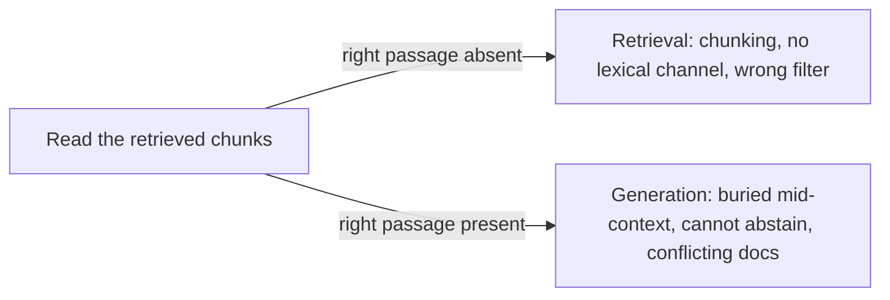

# Scenario questions

The situation round. You are handed a mess, not a question, and the interviewer
watches what you do first. A weak answer lists everything that could be wrong. A
strong answer names the **most likely** cause, says how it would confirm that in
an hour, and only then reaches for a fix. Seniority shows in the order.

# Quality and retrieval

## 1. The RAG assistant confidently answers from the wrong document

*Testing:* whether you debug retrieval and generation separately.

**Most likely cause: retrieval, not the model.** Generation failures are loud
and strange; retrieval failures are quiet and plausible, because the model
faithfully summarises whatever you handed it. Read the retrieved chunks for the
failing query: that splits the problem in half, and if you cannot do it in one
step, that is the finding — you are not logging retrieved chunk ids and text.

**The two causes that show up.** Fixed-size chunking puts a question's subject
in one chunk and its answer in the next, so neither scores well alone; chunking
on document structure with overlap fixes more RAG bugs than swapping the
embedding model. And dense retrieval is weak on exact tokens — part numbers,
error codes, surnames — so hybrid wins: lexical and dense fail on different
queries. **The confidence is a separate bug:** nothing gave the model permission
to say "not in the provided context", so instruct it to abstain, require a
citation per claim, and drop answers whose citation does not resolve to a
retrieved chunk. **Control:** evaluate retrieval alone, as recall@k over queries
with known correct documents. No judge, no opinion, and it regresses silently on
every re-index. A chunk retrieved but ranked third is a ranking problem, not
recall.

## 2. The feature demoed perfectly and fails on real user questions

*Testing:* whether you know a demo is a sample of five, chosen by its author.

**Most likely cause: the demo set is the development set.** The prompt was
tuned, consciously or not, until those examples worked, and real traffic has
typos, multi-part questions, questions the corpus cannot answer, and people
testing the bot rather than using it. **Confirm** by taking 100 real queries
from the logs, sampled not curated, reading 30 by hand, and bucketing the
failures — the fix depends on the bucket.

| Bucket | Fix |
|---|---|
| Answer not in the corpus | Abstain and route to a human. You cannot prompt past missing data |
| Retrieval missed it | Hybrid retrieval, better chunking, query rewriting |
| Retrieved but answered badly | Prompt, context order, output format constraints |
| Out of scope entirely | Scope detection, refusal, and a product conversation |

**Control:** build the golden set from production traffic and keep it growing,
with every reported failure becoming a case. You cannot evaluate an open-ended
system on examples chosen by the person who wants it to succeed.

## 3. The eval suite is green and users are complaining

*Testing:* whether you trust your tests over your users, which is the wrong way
round.

**Most likely cause: the eval measures something adjacent to what users care
about.** In rough order: the suite is stale and no longer resembles traffic; it
is easy, because hard cases got fixed and nobody added new ones; the judge is
lenient and rewards fluency, which is exactly what a wrong answer has; the
metric is not the complaint, which may be latency, tone or refusals; or the
failures live in a segment with three examples in the suite. **Confirm cheapest
first:** run ten real complaints through the harness, and if it passes them the
suite is wrong and you have ten new cases. Then re-score a sample by hand,
because judge–human agreement is the credibility of every eval number you quote.

**Fix and control.** Close the loop so every escalation becomes a case, and
split the suite by segment so a regression in one customer's document type
cannot be averaged away by four healthy ones. Measure quality online too —
abandonment, retries, escalation, edits to generated text need no labels and
move before the offline score. **The trap:** if 4% of queries are catastrophic,
a mean of 4.6 out of 5 looks healthy. Report the tail.

## 4. The provider silently changed the model and quality dropped

*Testing:* telling "they changed" from "we changed" from "our traffic changed".

**Most likely cause is not the provider** — say that first, because the order of
suspicion is our change, our data, our traffic mix, then the vendor, and blaming
the vendor first is a tell. Check your own timeline of deploys, prompt edits and
index rebuilds in the window the metric moved, then traffic mix, because a new
customer or locale moves an aggregate without anything breaking. Then the
decisive test: **replay a frozen set** through the current pinned configuration
against stored outputs — identical inputs with different behaviour means the
dependency moved, and an alias can resolve to a new build without your deploy
log noticing.

**Control:** a **canary eval** running that frozen set on a schedule, not only
in CI, catches a dependency moving when nothing of yours changed. Log the
rendered prompt rather than the template, pin versions explicitly, and watch
output shape — length, refusal rate, schema failures, tokens, latency — which
moves before quality scores and needs no labels. **The caveat:** models are
stochastic, so you need enough replayed cases to exceed run-to-run variance, and
you should say so rather than assert a number.

## 5. You must choose between fine-tuning and better retrieval

*Testing:* diagnosing which problem you have, not picking the impressive option.

**The diagnostic is one sentence:** does the model lack *knowledge* or lack
*behaviour*? Missing facts is retrieval; fine-tuning installs facts badly,
cannot cite, and still makes things up with more confidence. Consistently wrong
format, tone or judgement that no instruction fixes is fine-tuning territory.
**Confirm** by pasting the correct document into a failing prompt by hand: a
right answer means knowledge, wrong in the same way means behaviour.

Retrieval fixes missing or changing facts, refreshes with a reindex, can cite,
and fails visibly by retrieving the wrong thing. Fine-tuning fixes format, tone
and narrow judgement, needs a retrain to update, cannot cite, and fails
invisibly by being confidently wrong.

**The order almost always correct:** prompt and output format, retrieval
quality, few-shot examples, then fine-tuning. The one genuine case is
distillation: real production pairs, a narrow stable task, a smaller model
matching a large one. **The trap:** fine-tuning does not fix hallucination — you
get confident house-style text that is wrong and can no longer cite.

# Cost

## 6. LLM spend is up 10x in a month and nobody noticed

*Testing:* whether you instrument before you optimise — and who owns the bill.

**Most likely cause: one code path**, because cost is almost never uniformly up
— it is a new feature, a retry loop, a context that grew, or an agent taking
more steps. **Confirm, and the attribution is the whole job:** break spend down
by feature, endpoint, model, customer and prompt version, and it localises to
one cell. Split input from output tokens, since input growth means context bloat
and output growth means a removed length cap. Look at calls per user request,
because one to nine means retries or an agent looping. Check cache hit rate,
because a variable moved ahead of the stable prefix destroys it and roughly
doubles input cost with no relevant-looking code change.

**Controls, and this is the half being marked.** Cost per request, not per
month, because a monthly bill is a lagging indicator with no owner. Attribution
at the call, so "which path" is answerable during an incident. Alerts on the
derivative, since tokens-per-request p95 rising 40% week on week fires before
the bill does. Hard caps in code for steps, output tokens, retries and
per-tenant budget. And separate keys for eval, batch and production. **The
trap:** switching model is the visible lever and usually the wrong one — fix
call count and context size first, because those are free.

## 7. An agent loops and burns the budget on one task

*Testing:* whether you design termination conditions, or hope the agent stops.

**Most likely cause: the agent cannot tell it is not making progress.**
**Confirm** by reading the trace as tool calls with arguments hashed — repeats
are visible in seconds, and if you cannot see the sequence for one run, that
missing observability is the first finding.

The shapes: a retry loop, same tool and arguments and error repeatedly; two
states oscillating, each "fixing" the other; context poisoning, where an early
wrong belief stays in context and every step reasons from it; and no exit
condition, where nothing in the loop can declare done.

**Fix — three cheap limits, in the orchestrator, not the prompt.** A step and
token budget per run, because the model cannot enforce a limit that is not a
token it emits; loop detection on hashed tool name plus normalised arguments;
and a no-progress rule that terminates when N steps produce no state change. The
design fix matters more: give the loop something to terminate on, an explicit
success check, with escalation to a human as a normal outcome. **Control:**
those limits live in the harness, and you alert on the *distribution* of steps
per run, because p50 of three with p99 of forty is a loop already running. A
capped run fails loudly and keeps its trace; a silent cap is how you learn
months later that 8% never finished.

# Latency

## 8. p99 latency blows the budget while p50 is fine

*Testing:* whether you read a histogram, not an average.

**Most likely cause: output length variance.** Generation is sequential — each
token is a forward pass — so duration is roughly proportional to tokens emitted:
a p50 request writes a paragraph, a p99 writes a page, same model and prompt.
Then retries, which hide in p99 by construction; queueing at peak, visible as
latency correlated with request rate; and fan-out, where a step is as slow as
its slowest call. **Confirm** by plotting latency against output token count —
close to linear means the fix is about length, not infrastructure — then
splitting the trace by span, because people assume the model and find a
synchronous tool call in the path.

**Fixes, matched to cause:** cap max tokens and ask for terse output; budget
retries against a deadline for the whole request, not per attempt; add capacity
or a smaller overflow model for queueing; cut or hedge fan-out; and stream,
because a first token in a few hundred milliseconds changes how a duration
feels. **Control:** measure **time to first token** and **total duration**
separately, because they have different causes and one number hides both, and
alert on p95 and p99 — an average-latency dashboard for a generative system is
decoration. **The trap, and the next question:** streaming makes the tail feel
fine while the work is still slow, so put the SLO on the business event — answer
delivered and validated.

# Agents

## 9. The agent reports success but did not do the work

*Testing:* whether you know a claim of success is generated text, not an
observation.

**Root cause in one sentence.** The final message comes from the same next-token
process as everything else, and nothing in that machinery is connected to
whether the file was written or the test passed; if the only thing checking
success is the model, you have no check at all. **Confirm** on one failing run
by reading the tool call log rather than the summary and checking the side
effect in the real world. Two classic shapes: the tool returned an error and the
model narrated past it, because error strings are just more text; or it was
never called and the model described doing it, common when the prompt rewards a
confident summary.

**The fix is structural, not a prompt.** Success is decided outside the model by
a deterministic verifier that checks the post-condition — read the record back,
run the test, diff the file. The agent proposes done, the system decides done;
the orchestrator decides that a failed step fails the run; and any completion
claim must reference a tool call id that exists in the trace. If you cannot
state "done" mechanically, the task is not ready to be automated. **Control:**
track a **false success rate** — runs marked successful that a verifier or audit
finds incomplete. It is the single most important agent metric and almost nobody
has it. An agent that cannot fail is not reliable, it is uninstrumented.

## 10. A long conversation degrades after twenty turns

*Testing:* whether you treat context as a budget somebody has to manage.

**Most likely cause: the context is now mostly irrelevant history**, through
three compounding mechanisms. Dilution: attention spreads over everything, so
the instructions are a shrinking share of what the model conditions on. Position
effects: material mid-context is used less well, and the system prompt from turn
one is buried. Accumulated error: a wrong statement from turn six is still in
the transcript and the model treats its own earlier output as fact. Input tokens
grow per turn too, so it gets more expensive as it gets worse. **Confirm in
thirty seconds** by re-asking the current question in a fresh context with only
the relevant facts — a good answer means context, not capability.

**Fix: context management as an explicit component.** A rolling window when
recent turns matter most; a running summary that compacts older turns and keeps
recent ones verbatim; structured state as fields rather than prose for facts
that must carry, like an order id or a chosen plan; retrieval over history for
very long sessions; and always re-anchor the key instructions near the end of
the prompt, not only at the top. The most underrated fix is making it easy to
start over — a visible "new conversation" carrying the structured state forward.

**Control:** put context size on the dashboard and evaluate *multi-turn*,
because most suites are one-shot, which is why this reaches production
undetected. **The trap:** summarisation is lossy and compounds invisibly, so
keep raw history retrievable even when you do not send it.

## 11. A teammate wants to add a fifth agent to fix a reliability problem

*Testing:* whether you can push back on architecture that sounds sophisticated.

**Say the principle first.** Each agent is an independent source of error and
the errors multiply: five at 90% each is about 59% end to end, so adding an
agent to fix reliability usually lowers it. Multi-agent buys parallelism,
context separation and specialised tools; it does not buy correctness. **Then
ask, in order — this is the answer.** What is the fifth agent for, because if it
checks the other four it is a verifier, and a verifier should be deterministic
wherever the check can be: a model checking a model shares its blind spots.
Which of the four is failing, since per-agent success rates almost always name
one step with a vague task or a bad tool. Could this be one prompt, since two
agents that always run in sequence and share context are one call with extra
latency and a lossy hand-off. And where does information get lost, because the
failure is often the hand-off, which is an interface bug another agent cannot
fix.

**Propose instead:** fix the failing step, make it verifiable, add retries with
the failure fed back, and only then decompose. **Concede the real cases:**
separate agents are right when sub-tasks need different tools or permissions,
when contexts would pollute each other, or when work runs in parallel.
**Control:** per-step success rates in the trace — once the team sees step three
at 72%, the argument stops being taste.

# Security and privacy

## 12. You find prompt injection in production

*Testing:* whether you know this is architectural, not a bug to patch, and can
contain it.

**The mechanism in one sentence.** The model has one input channel: your
instructions and retrieved content arrive as the same kind of tokens, so any
text the model reads can act as an instruction — a web page, a PDF, a ticket, a
tool result, a filename. **Incident response:** find the blast radius — what
tools and data were in that context and where the output flows, not what it did
but what it *could* have done. Check for exfiltration by looking at outbound
requests, not only text, since the classic channel is a rendered link or image
carrying data in the URL. Then cut the risky capability on that path and
preserve the traces.

**The fix, and be honest about the first line.** You cannot solve this with
prompt engineering; "ignore instructions in the documents" raises the bar and
does not close the hole, and a candidate who claims otherwise fails the
question. What works: least privilege on tools, scoped to the current user;
human confirmation for anything irreversible or outbound; untrusted content
marked and kept out of the system prompt, never defining tools or policy; and a
constrained output channel: validated URLs, no auto-rendered images, no model
output into a shell or query builder unparameterised. Lead with the control that
holds even when the model is fully compromised: **authorise at the tool, not in
the prompt.** **Control:** injection cases live in the eval suite and run in CI,
tool calls are logged with their triggering content, and anomalous outbound tool
use alerts. Design as if the model will eventually follow a malicious
instruction, and make sure it cannot then reach anything that matters.

## 13. A user gets an answer containing another user's data

*Testing:* whether you run it as an incident, and know the cause is ordinary.

**Handle it as an incident first, and say so:** disable the path, preserve
traces, notify security and privacy, start the clock on disclosure. They are
listening for whether you reach for the process or for a hypothesis.

| Cause | How it happens |
|---|---|
| Missing tenant filter | Applied after ranking, or not at all on one retrieval path |
| Shared index without scoping | One store, no tenant field, or a query that forgets it |
| Cache key missing the user | A cached answer or prompt prefix served across users. The classic |
| Ingested contamination | Another user's data inside a legitimately shared document |

Three of those four are ordinary application bugs and the fourth is a data
pipeline bug — that framing is part of the answer. **Confirm** by taking the
leaked answer, finding its trace, and reading the retrieved chunk ids and their
tenant.

**The fix and the control are the same thing: authorise at the data layer, not
in the prompt.** The retrieval call must be incapable of returning another
tenant's document — filtered at query time in the store, with identity from the
authenticated request, never inferred from the conversation. Then a cross-tenant
test in CI on every retrieval path, cache keys including identity and permission
scope asserted by a test, and least-privilege credentials so a missing filter
fails closed.

# Stakeholders

## 14. Explain to an executive why you cannot just tell the model to stop hallucinating

*Testing:* explaining a mechanism without jargon, ending in a plan not an
excuse.

**One sentence:** the model is not looking something up and deciding to lie — it
produces the most plausible next piece of text, and a plausible wrong answer
looks identical, from the inside, to a correct one. The analogy that works is a
well-read person answering instantly from memory who is never allowed to say "I
am not sure": when they know it is right, when they do not it is still fluent,
and nothing in their voice changes. "Do not make things up" is more text in the
prompt — it helps a little, but it cannot give the model a fact it lacks, or a
sense of its own uncertainty.

**Then pivot to the plan, which is what they actually need.** Retrieve the
documents and require answers only from them, because most hallucination in a
business product is a missing-context problem. Require receipts, so every claim
cites a source and uncited claims are dropped. Let it say it does not know, and
measure how often, because abstention is a feature you are buying. Check what
can be checked, keep a person on anything expensive, and track the
unsupported-answer rate as a release criterion. **End with the honest
expectation:** we will not get this to zero, we will get it to a known,
monitored rate with the expensive cases behind a check, and anyone promising
zero is either not measuring, or selling.

---

## The pattern underneath all of these

They are testing whether you approach every failure the same way. **Reproduce**
— one failing case with its trace. **Localise** — which stage, remembering four
of the five are ordinary software. **Name the most likely cause and how you
confirm it** in an hour, and say what would prove you wrong. **Fix at the right
layer**, because a prompt change is the wrong fix for an authorisation, cost,
retrieval or truthfulness problem, and reaching for the prompt first is the most
common tell of inexperience. **Leave a control behind** — a metric, an alert, a
test, a cap — so the next occurrence is caught by you.

Two things to keep saying. **The model has no error channel**: it does not
throw, it returns a confident answer whether or not it should, and every control
you build compensates for that one property. And **everything you cannot
measure, you are guessing about** — cost and tokens per request, steps per run,
abstention rate, false success rate, judge–human agreement, TTFT, total
duration. If an answer stalls, the missing instrument is usually the finding.
