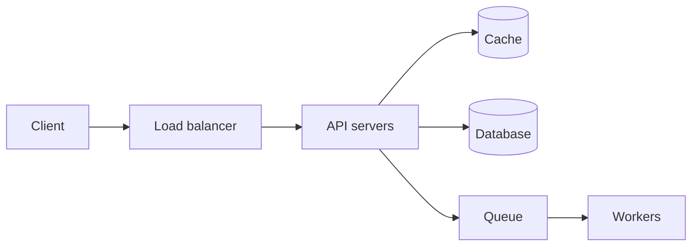

# The framework

45 minutes, four phases. The timings are the point — most failed interviews are
lost by spending 25 minutes on requirements or by drawing before asking.

| Phase | Minutes | What you produce |
|---|---|---|
| 1. Requirements | 5–8 | A scoped list, functional and non-functional |
| 2. Estimation | 3–5 | QPS, storage, bandwidth |
| 3. High-level design | 10–15 | The boxes-and-arrows diagram, API, data model |
| 4. Deep dive | 15–20 | Two or three components, in detail, with tradeoffs |

---

## 1. Requirements (5–8 min)

**Ask, do not assume.** The interviewer is deliberately vague and is waiting to
see whether you scope.

**Functional** — what does it do? Push for the *minimum*:

> "Let me scope this. For a URL shortener: shorten a URL, redirect a short URL,
> and optionally a custom alias and an expiry. I'll leave analytics and user
> accounts out unless you want them — is that the right cut?"

**Non-functional** — the part that actually shapes the design:

- **Scale** — DAU? QPS? Read:write ratio?
- **Latency** — p99 target? Is this user-facing?
- **Availability vs consistency** — which one gives, under partition?
- **Durability** — is losing a record acceptable? (For payments, no. For a "user
  is typing" indicator, completely.)

**The read:write ratio is the single most useful number.** 100:1 read-heavy says
cache and read replicas. Write-heavy says partitioning and a queue.

## 2. Estimation (3–5 min)

Round aggressively. Nobody wants precision; they want to see you reason about
orders of magnitude.

**The numbers worth memorising:**

| | |
|---|---|
| Seconds in a day | ~86,400 → **~100k** |
| 1 million writes/day | ~12 writes/sec |
| 1 billion writes/day | ~12k writes/sec |
| Peak traffic | 2–3× average |
| L1 cache reference | 1 ns |
| Main memory reference | 100 ns |
| SSD random read | 100 µs |
| Disk seek | 10 ms |
| Round trip within a datacentre | 500 µs |
| Round trip, cross-continent | ~150 ms |
| Reads/sec, single Postgres | ~10k (cached), ~1k (disk) |
| Rows before you should shard | ~10–50 million comfortably |

**A worked example, the URL shortener:**

```
100M new URLs/day
  writes:   100M / 100k sec  = ~1,000 writes/sec
  reads:    100:1 ratio      = ~100,000 reads/sec     ← the real constraint
  storage:  100M × 500 bytes = 50 GB/day = ~18 TB/year
  peak:     3× average       = ~300k reads/sec
```

That paragraph *is* the design brief. 100k reads/sec says the redirect path must
be a cache hit, not a database query. 18 TB/year says one machine will not hold
it. You did not guess either — you derived them.

## 3. High-level design (10–15 min)

Draw the boxes. Start simple and let the requirements force complexity — do not
open with Kafka.



Then define, briefly:

**The API** — three or four endpoints, with the shape of the request:

```
POST /urls        { longUrl, customAlias?, expiresAt? }  -> { shortUrl }
GET  /{shortCode}                                         -> 302 redirect
```

**The data model** — the tables and the *access patterns*. The access pattern is
what decides SQL vs NoSQL, not a preference.

## 4. Deep dive (15–20 min)

The interviewer picks, or you offer. Go deep on two or three, not shallow on
eight. Good things to go deep on:

- The bottleneck your estimate exposed
- How you generate IDs / partition data
- What happens when a component dies
- The consistency model, where it matters

**Always cover:** what breaks first at 10× the load, and what you would monitor.

---

## The things that actually fail people

**Not asking about scale.** Designing for 100 QPS and 100k QPS look nothing
alike. Guessing wrong and never checking is the most common failure.

**Reciting an architecture.** "We'll use Kafka, Cassandra and Redis" with no
reason attached. Every component must answer "what breaks without it?"

**No numbers.** "It'll be a lot of data" is not an answer. "50 GB/day, so ~18 TB
a year, so we shard by hash of the short code" is.

**Refusing to commit.** Interviewers want a decision plus its cost, not a survey.
Say "I'd pick X because Y; the tradeoff is Z, and if Z became a problem I'd
switch to W."

**Ignoring failure.** Every box you draw can die. Say what happens when it does —
even one sentence per component.

**Going silent while thinking.** They cannot grade what they cannot hear. "I'm
weighing fan-out on write against fan-out on read — let me think about the
celebrity case" is worth more than 30 seconds of quiet.
