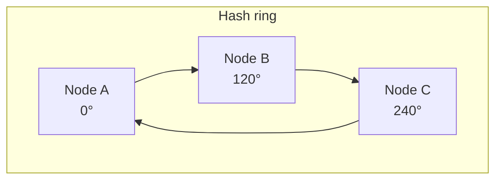

# Fundamentals

The vocabulary. You do not get asked these directly very often — you get asked to
*use* them, and the answer falls apart if the words are fuzzy.

---

## CAP, honestly

Under a **network partition**, you choose consistency or availability. That is
the whole theorem, and it only applies during a partition.

- **CP** — refuse requests rather than serve stale data. Banking, inventory,
  anything where two answers is worse than no answer.
- **AP** — serve possibly-stale data rather than fail. Feeds, likes, DNS, most
  of the internet.

**Where people go wrong:** treating it as a permanent label. A system is not
"AP"; it makes an AP *choice during a partition*. The rest of the time it can be
perfectly consistent.

**PACELC** is the useful extension: *if Partition, choose A or C; Else, choose
Latency or Consistency.* It names the tradeoff you make on a normal day, which is
the one you actually live with.

## Consistency models

| Model | Guarantee | Cost |
|---|---|---|
| **Strong** | A read sees the latest write | Coordination on every write |
| **Eventual** | Replicas converge, given time | Reads can be stale |
| **Read-your-writes** | *You* see your own writes | Route the user to the primary, or pin a session |
| **Monotonic reads** | You never see time go backwards | Sticky routing |
| **Causal** | Related events stay ordered | Version vectors |

**Read-your-writes is the one products actually need.** A user posts a comment
and must see it, even if nobody else does for two seconds. Eventual consistency
plus "read your own writes from the primary" covers most social features.

## Consistent hashing

**The problem it solves.** With `hash(key) % N` servers, adding one server
changes `N` and nearly *every* key remaps. Your cache goes cold all at once and
the database falls over.

**The idea.** Place servers and keys on a ring (hash space `0 … 2³²`). A key
belongs to the first server clockwise. Adding or removing a server only moves
the keys between it and its neighbour — roughly `1/N` of them.

**Virtual nodes are not optional.** With one point per server, the ring is lumpy
and one server gets far more keys than another. Each physical server is given
100–200 points on the ring, which smooths the distribution and makes removal
spread its load over many neighbours instead of dumping it all on one.

**Used by:** Cassandra, DynamoDB, Riak, memcached clients, most CDNs.

## Sharding / partitioning

| Strategy | How | Good | Bad |
|---|---|---|---|
| **Range** | `a–m` → shard 1 | Range scans are cheap | Hotspots (everyone named "S") |
| **Hash** | `hash(id) % N` | Even spread | No range scans; resharding is painful |
| **Consistent hash** | ring | Even, cheap to resize | More complex |
| **Directory** | a lookup table | Total flexibility | The lookup is now a SPOF |
| **Geographic** | by region | Low latency, data residency | Cross-region queries hurt |

**The shard key is the decision.** Pick it from your dominant access pattern. If
you shard messages by `message_id` but always query by `conversation_id`, every
read hits every shard and you have made things worse.

**Celebrity / hot-key problem:** one key gets a disproportionate share. Fixes:
add a random suffix to spread it across shards, cache it separately, or give it
dedicated capacity.

## Replication

- **Single leader** — all writes to one node, reads from followers. Simple,
  gives read scaling, and the leader is a write bottleneck and a failover event.
- **Multi leader** — writes anywhere, usually per-region. Fast local writes, and
  now you own a conflict-resolution problem.
- **Leaderless** (Dynamo-style) — write to `W` nodes, read from `R`. If
  `W + R > N` you get strong consistency; tuning `W` and `R` trades latency
  against staleness.

**Replication lag** is where read-your-writes bugs live: the user writes to the
leader, the next read hits a follower that has not caught up, and their comment
has vanished.

## Caching

**Where**: browser → CDN → API gateway → application → database.

| Pattern | Reads | Writes |
|---|---|---|
| **Cache-aside** | miss → load from DB → populate | write DB, **invalidate** cache |
| **Read-through** | cache loads on miss itself | — |
| **Write-through** | — | write cache and DB together; consistent, slower |
| **Write-behind** | — | write cache, flush later; fast, can lose data |

**Cache-aside is the default** and what you should say unless there is a reason.

**Eviction:** LRU usually; LFU when popularity is stable; TTL always as a
backstop.

**The three failure modes worth naming:**
- **Stampede** — a hot key expires and a thousand requests hit the DB at once.
  Fix with a lock/single-flight, or stagger the TTLs.
- **Penetration** — requests for a key that does not exist bypass the cache
  every time. Cache the negative result, or use a Bloom filter.
- **Avalanche** — many keys expire together. Jitter the TTLs.

## Queues

**Why:** decouple producer from consumer, absorb spikes, retry failures, and let
slow work happen out of the request path.

- **Queue** (SQS, RabbitMQ) — one consumer per message, work distribution.
- **Log** (Kafka, Kinesis) — many consumers, each with its own offset, messages
  retained and replayable.

**Delivery semantics.** At-most-once loses messages. At-least-once duplicates
them. Exactly-once is *effectively* once — at-least-once plus an idempotency key
that the consumer deduplicates on. Say it that way; claiming true exactly-once
invites a follow-up you will lose.

**Make consumers idempotent.** It is almost always cheaper than trying to make
delivery perfect.

## Load balancing

- **L4** — routes on IP/port. Fast, protocol-agnostic.
- **L7** — routes on path/header/cookie. Enables canaries, A/B, per-route rules.

Algorithms: round robin, least connections (better with uneven request cost),
consistent hash (session or cache affinity).

**Health checks are the point.** A balancer that keeps routing to a dead box is
worse than no balancer.

## Databases: choosing

**SQL when** you need transactions across rows, the relationships matter, or the
query patterns are not settled. `JOIN` is a real feature and "NoSQL is
web-scale" is not an argument.

**NoSQL when** the access pattern is known and narrow, the scale exceeds one
machine's write capacity, or the schema genuinely varies.

| Type | Example | Fits |
|---|---|---|
| Relational | Postgres | Transactions, complex queries |
| Document | MongoDB | Varying shape, nested reads |
| Wide-column | Cassandra | Huge write volume, time-series |
| Key-value | Redis, DynamoDB | Lookup by key, caching |
| Graph | Neo4j | Many-hop relationships |
| Search | Elasticsearch | Full-text, faceting |

**Say this if it fits:** "I'd start with Postgres. It handles this scale, and I'd
move the hot path to a key-value store when reads exceed what read replicas can
absorb." Committing to the simple thing, with a named trigger for changing your
mind, reads as senior.

## Idempotency

A retried request must not double-charge. The client sends an idempotency key;
the server records it with the result and returns the stored result on a repeat.

Essential for payments, order placement, and **anything behind a queue**, because
at-least-once delivery guarantees you will see duplicates.

## Rate limiting algorithms

| Algorithm | Bursts | Memory | Note |
|---|---|---|---|
| Fixed window | Allows 2× at the boundary | Tiny | Simplest |
| Sliding window log | Exact | O(requests) | Precise, expensive |
| Sliding window counter | Approximate | Tiny | The usual compromise |
| Token bucket | Allows a burst by design | Tiny | Most common in practice |
| Leaky bucket | Smooths output | Tiny | Constant outflow |

**Token bucket is the default answer.** Bursts are usually a feature, not a bug —
a user loading a page makes ten calls at once and should not be punished.

## Back-of-the-envelope numbers

| | |
|---|---|
| Char | 1 byte (ASCII) / 2–4 (UTF-8) |
| UUID | 16 bytes binary, 36 chars as text |
| Timestamp | 8 bytes |
| A "typical" row | 100 bytes – 1 KB |
| Web page | ~2 MB |
| Photo | ~200 KB – 2 MB |
| Minute of 1080p video | ~50 MB |
| 1 TB / month | ~3 Mbps sustained |
