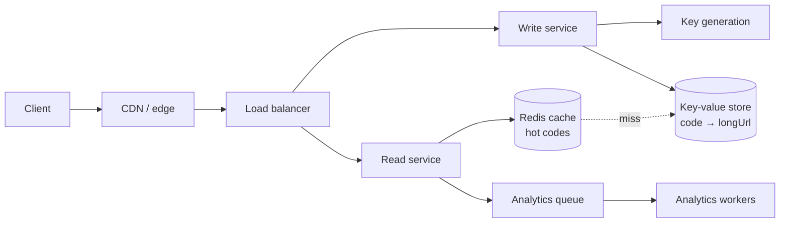

# Design a URL shortener

*Bitly, TinyURL, Pastebin. The most common opener, because it is small enough to
finish and rich enough to go deep.*

---

## 1. Requirements

**Functional**
- Shorten a long URL → short URL
- Visiting the short URL redirects to the original
- Optional: custom alias, expiry

**Out of scope** (say so): user accounts, analytics dashboards, link previews.

**Non-functional**
- **Read-heavy**, roughly 100:1
- Redirect latency must be low — this is in the user's critical path, so p99 < 100 ms
- Highly available; a dead shortener breaks every link ever shared
- Short codes are **not guessable** (or at least, not enumerable)

## 2. Estimation

```
100M new URLs/day
  writes   100M / 100k sec          = ~1,000/sec
  reads    100:1                    = ~100,000/sec      ← the real constraint
  peak     3×                       = ~300,000/sec
  storage  100M × 500 B             = 50 GB/day ≈ 18 TB/year
```

**What that paragraph decided:** 300k reads/sec means the redirect path cannot
touch a disk. 18 TB/year means one machine will not hold it. Both conclusions
came from arithmetic, not taste.

**How short can the code be?** Base62 (`a–z A–Z 0–9`):
- 6 chars → 62⁶ ≈ **56 billion**
- 7 chars → 62⁷ ≈ 3.5 trillion

At 100M/day, 6 characters lasts ~1,500 years. **Use 7** for headroom and because
it makes enumeration harder.

## 3. High-level design



**API**

```
POST /urls     { longUrl, customAlias?, expiresAt? }  → 201 { shortUrl }
GET  /{code}                                          → 302 Location: longUrl
```

**Use 302, not 301.** A 301 is cached permanently by the browser, so you never
see the click again — which kills analytics and makes expiry impossible. 302 costs
you a request; that is the trade you want.

**Data model** — a key-value store, because the only access pattern is "code →
URL". No joins, no scans.

```
code (PK) | longUrl | userId | createdAt | expiresAt
```

## 4. Deep dives

### Generating the short code

| Approach | How | Verdict |
|---|---|---|
| **Hash + truncate** | `base62(md5(url))[0..7]` | Collisions need a retry loop; same URL → same code, which may or may not be wanted |
| **Random** | 7 random base62 chars | Must check for existence; at low fill, collisions are rare |
| **Counter + base62** | global counter, encoded | No collisions ever, but **sequential and enumerable** |
| **Counter + key range** ✅ | each server pre-allocates a block of counters, encodes with base62 | No collisions, no per-request coordination |

The enumeration problem with a plain counter is real: `abc124` follows `abc123`,
so anyone can walk every link in the system. Fix by encoding the counter through
a keyed bijection (e.g. Feistel or multiply by a constant coprime to 62⁷) — you
keep uniqueness and lose the ordering.

**The key generation service** hands each app server a block of 10,000 counter
values. The server uses them locally with no coordination, and asks for another
block when it runs low. A restart wastes up to 10,000 codes out of 3.5 trillion,
which is nothing.

### Making the redirect fast

300k reads/sec, and the access pattern is heavily Zipfian — a few links carry
most traffic.

- **Redis, cache-aside, LRU.** 20% of links will serve ~80% of reads; ~100 GB of
  cache covers the working set comfortably.
- **On miss:** read the DB, populate, return.
- **Entries are immutable** — a code never points somewhere new — so invalidation
  is only needed for deletes and expiry. That is a large simplification, and
  worth saying out loud.
- **Put the CDN in front** for links with sustained traffic.

### Sharding

18 TB/year, so partition by **hash of the short code**. The access pattern is
always a point lookup by code, so hash partitioning costs nothing and spreads
evenly.

Consistent hashing so that adding capacity moves ~1/N of keys rather than all of
them.

### Failure

- **Cache down** → reads fall to the DB. Rate-limit and shed load rather than
  melting it; consider a small in-process LRU as a second line.
- **A DB shard down** → those codes 503. Replicas with automatic failover.
- **Key generation service down** → servers still have their current block, so
  writes continue for a while. That buffer is the point of the design.

## Tradeoffs to volunteer

**SQL vs NoSQL.** The pattern is a point lookup with no relationships, so a
key-value store fits — but Postgres would comfortably serve this too, with the
cache absorbing the reads. Say which you would start with and what would make you
change.

**Custom aliases** need a uniqueness check, so they are a conditional write, not
a blind one. They also collide with your generated space — keep them in the same
table so uniqueness is enforced in one place.

**Expiry.** A TTL in the store plus a lazy check on read. A background cleanup
job is cheaper than a scheduled delete per row.

**Analytics off the hot path.** Push click events to a queue and aggregate
asynchronously. A redirect must never wait on an analytics write.
