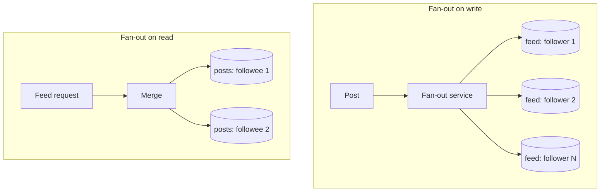
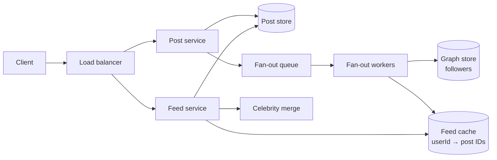

# Design a news feed

*Twitter timeline, Instagram feed, Facebook feed. Appears in every source. The
one question you must be able to answer cold.*

---

## 1. Requirements

**Functional**
- Post content
- Follow / unfollow
- View a feed of posts from the people you follow, newest first

**Out of scope:** ranking by ML relevance (mention it, then park it), ads,
stories, DMs.

**Non-functional**
- Very read-heavy: ~100:1
- Feed load p99 < 200 ms
- Eventual consistency is fine — a post appearing two seconds late is invisible
- Highly available; this is the product

## 2. Estimation

```
300M DAU, each opening the feed ~10×/day
  feed reads   3B / 100k sec       = ~30,000/sec   (peak ~90,000)
  posts        60M/day             = ~600/sec
  avg follows  ~200
```

**The number that decides the design:** 30k feed reads/sec against 600
writes/sec. Reads outnumber writes 50:1, which is the argument for doing the
work *at write time*.

## 3. The core decision: fan-out on write vs read

**Fan-out on read (pull).** Store posts once. When a user opens their feed, query
the posts of everyone they follow and merge.

- Writes are trivial — one row
- Reads are expensive — 200 queries, merged and sorted, every time
- New posts appear instantly

**Fan-out on write (push).** When you post, write a copy of the post ID into the
precomputed feed of every follower.

- Reads are one lookup — the feed is already built
- Writes are expensive — a post to 1M followers is 1M writes
- **The celebrity problem:** a user with 100M followers makes one post cost 100M
  writes



### The answer is: hybrid

**Fan-out on write for normal users.** 99.9% of accounts have few enough
followers that pushing is cheap, and it makes the common read a single lookup.

**Fan-out on read for celebrities.** Above a threshold — say 10k followers —
stop pushing. At read time, merge the user's precomputed feed with a live query
of the celebrities they follow.

This is the answer the interviewer is listening for, and **naming the threshold
as a tunable** is what makes it sound like you have run it rather than read it.

## 4. High-level design



**API**

```
POST /posts            { content, mediaIds? }      → 201 { postId }
GET  /feed?cursor=&limit=20                        → { posts, nextCursor }
POST /users/{id}/follow                            → 204
```

**Cursor pagination, not offset.** `OFFSET 40` re-scans and, on a feed that
changes under you, duplicates or skips posts. A cursor of
`(timestamp, postId)` is stable and O(1).

**Data model**

```
posts    postId (PK) | userId | content | createdAt
follows  followerId | followeeId        (index both directions)
feeds    userId → [postId, …]           list in Redis, capped at ~1000
```

**Store IDs in the feed, not post bodies.** Hydrate on read. A viral post is then
stored once, not a million times, and editing it does not require rewriting a
million feeds.

## 5. Deep dives

### Fan-out workers

Asynchronous, off a queue. A post returns 201 as soon as it is durable; the
fan-out happens behind it. A 1M-follower fan-out taking 30 seconds is fine — and
it is exactly why celebrities are excluded from this path.

**Cap each feed** at ~1,000 entries. Nobody scrolls past that, and it bounds
memory. Deeper scrolls fall back to the read path.

### Feed cache

Redis lists or sorted sets, keyed by user. ~30k reads/sec is comfortable.

**Only cache active users.** Precomputing feeds for accounts that have not opened
the app in 30 days is most of your fan-out cost for no benefit. Track
last-active, skip the rest, and build lazily on their return.

### The graph store

`follows` is read constantly and must be fast in both directions: "who follows
X" for fan-out, "who does X follow" for the read path. Index both.

At scale this is its own service, sharded by user ID.

### Ranking (if asked)

Chronological is the baseline. To rank: a scoring layer over the candidate set —
recency, affinity between the two users, engagement rate, media type. Generate
candidates, score, re-rank.

Say the funnel — **candidate generation → scoring → re-ranking** — because it is
the standard shape and it signals you know where ML fits without derailing into it.

## Tradeoffs to volunteer

**Consistency.** A follow taking a few seconds to affect your feed is acceptable.
Say so explicitly — it buys you the whole asynchronous design.

**Deletes.** A deleted post is already sitting in a million feeds. Filter at
hydration time rather than trying to scrub every feed; the feed holds IDs, and a
missing post is simply skipped.

**What breaks at 10×?** The fan-out queue. Watch consumer lag; partition by user
ID so it scales horizontally.
