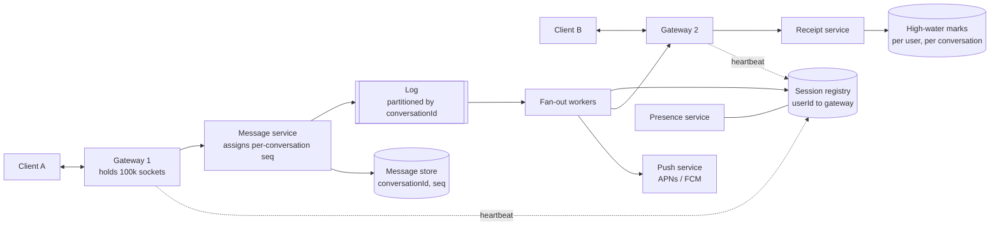

# Design a chat system

*WhatsApp, Slack, Messenger, Discord. The first problem in this set where the
server pushes to the client instead of waiting to be asked, and that one change
rewrites the whole architecture.*

---

## 1. Requirements

**Functional**
- 1:1 messaging
- Group messaging, with a member cap
- Delivery state per message: sent, delivered, read
- Offline delivery — a message sent while you are disconnected arrives when you
  come back
- Message history and scrollback
- Presence: online / last seen

**Out of scope** (say so): voice and video calls, message search, reactions and
threads, bots and app integrations. Media upload gets one sentence — the client
uploads to blob storage with a pre-signed URL and sends a message containing the
key, so the messaging path never carries bytes.

**Non-functional**
- **Low latency delivery.** p99 under ~500 ms end to end within a region. A chat
  that lags is a broken chat, not a slow one.
- **Durability is non-negotiable.** A feed can drop a post and nobody knows. A
  missing message is a visible bug that costs you the user.
- **Ordering within a conversation must be identical for every participant.**
  Two people seeing the answer above the question is a product defect.
- **Availability over global consistency**, but see the ordering requirement —
  per-conversation you need a total order, and only per-conversation.
- Not read-heavy in the way a feed is. In 1:1 chat the read:write ratio is near
  1:1. In large channels it swings read-heavy. The design has to survive both.

## 2. Estimation

```
500M DAU, 40 messages sent per user per day
  sends      500M × 40 = 20B/day
             20B / 100k sec           = ~200,000 sends/sec
  peak       3×                       = ~600,000 sends/sec
```

**Deliveries, not sends, are the load.** Assume 80% of sends are 1:1 and 20% go
to groups averaging 20 members:

```
  recipients per send   0.8 × 1  +  0.2 × 20   = 4.8  ≈ 5
  deliveries            200k × 5              = ~1,000,000/sec
  peak deliveries                             = ~3,000,000/sec
```

**Receipts are the load nobody budgets for.** Every delivery generates a
*delivered* event coming back, and most generate a *read* event too. That is
another ~2M events/sec at average, each one a write:

```
  receipt events   1M deliveries × 2 states   = ~2,000,000/sec
```

Receipts outnumber messages. That single line justifies the high-water-mark
design in the deep dive, and it is the kind of number an interviewer notices you
computed rather than assumed.

**Connections.** Assume half of DAU are connected at peak, and that a tuned box
holds ~100k idle sockets — the binding constraint is kernel buffer memory per
socket, not CPU:

```
  concurrent sockets   500M × 50%       = 250M
  gateway boxes        250M / 100k      = ~2,500
```

2,500 stateful boxes, each owning 100k sockets that cannot be moved. **That is
the problem this question is about.**

**Storage**, assuming a median message of ~200 bytes of text plus metadata:

```
  20B/day × 200 B   = 4 TB/day   ≈ 1.5 PB/year
```

Which forces a decision you have to make out loud: do you keep messages forever
(Slack — history and search *are* the product) or delete once every recipient
has them (WhatsApp — storage is a cost centre)? The answer changes your yearly
storage bill by roughly the whole 1.5 PB.

## 3. High-level design



**API.** Almost everything rides the socket; HTTP is only for catch-up and
history.

```
WS   /connect                        Upgrade with a bearer token

→  { type: "send",    conversationId, clientMsgId, body }
←  { type: "ack",     clientMsgId, messageId, seq, serverTime }
←  { type: "message", conversationId, messageId, seq, senderId, body }
→  { type: "receipt", conversationId, upToSeq, state: "delivered" | "read" }
→  { type: "ping" }   ←  { type: "pong" }

GET  /conversations?updatedAfter=              → list + per-conversation cursors
GET  /conversations/{id}/messages?afterSeq=&limit=50
```

Two things in that API carry weight:

**`clientMsgId` makes send idempotent.** The socket can drop mid-send and the
client has no idea whether the server got it. It retries with the same
`clientMsgId`, and the server returns the original `seq` instead of creating a
second message. This is [idempotency](../fundamentals.md) applied to the one
place users will definitely notice it — duplicate messages.

**`upToSeq`, not `messageId`.** A receipt is a prefix claim: "I have everything
through 412." That collapses a thousand receipt events into one, and it is the
entire reason the receipt load above is survivable.

### Data model

```
messages          (conversationId, seq)  |  messageId | senderId | body | createdAt
conversations     conversationId  | type | memberCount | lastMessageSeq
members           (conversationId, userId) | joinedAtSeq | leftAtSeq | role
user_conversations (userId, conversationId) | lastReadSeq | lastDeliveredSeq | lastMessageAt
sessions          userId → { deviceId → gatewayId, connId }   Redis, TTL 60s
presence          userId → lastActiveAt                        Redis, TTL 60s
```

**`messages` is partitioned by `conversationId` and clustered by `seq`.** The
chat screen has exactly two read shapes — "the last 50 in this conversation" and
"everything after seq X" — and both are a single-partition range scan on the
clustering key. Choosing the [shard key](../fundamentals.md) from the dominant
access pattern is the whole game here. Partitioning by `messageId` would be even,
and every screen load would hit every shard.

**`members` stores `joinedAtSeq` and `leftAtSeq`**, not just membership. That
range is what stops someone reading a channel's history from before they joined,
and what stops an ex-member reading anything after they left. One column,
enforced in one place.

**`user_conversations` is the conversation-list screen**, sorted by
`lastMessageAt`, and it is also what makes reconnect cheap — see below.

**Receipts have no table of their own.** Two integers on
`user_conversations` — `lastDeliveredSeq` and `lastReadSeq` — replace what would
otherwise be one row per message per member.

## 4. Deep dive: connection management at scale

Every other design in this set has stateless app servers behind a load balancer.
Here the server holds a socket for hours, so *which box* a user is on becomes a
fact the rest of the system must look up. This is the deep dive.

### Why a socket at all

Polling costs one request per interval per user and adds, on average, half the
interval to every message's latency — at 250M users, any interval short enough to
feel live is a traffic disaster. Long polling is a held connection anyway, but
with a request teardown and setup per message. Server-sent events are one
directional, so sends still need a separate POST and you pay for two channels.

A WebSocket is one full-duplex connection for the life of the session. Take it,
and keep a long-poll fallback for networks that block the upgrade.

### The registry: who holds whom

```
session:{userId}  →  hash { deviceId → "gw-1731:conn-88f2" }   TTL 60s
```

The **gateway** refreshes the TTL on a heartbeat, not the client. On a clean
disconnect the gateway deletes the field.

**The TTL exists for the unclean path.** A gateway that is OOM-killed or
partitioned away never runs its cleanup, and 100k stale entries would route
messages into a void. The TTL is the only thing that reliably cleans up after a
crash. If you take one operational detail from this section, take that one.

Sharded by `userId`, because the access pattern is a point lookup and nothing
else. Use [consistent hashing](../fundamentals.md) so that adding registry
capacity does not invalidate every mapping at once.

### Getting a message to a socket on another box

Three options, and the interviewer is waiting to see you weigh them.

| Approach | How it routes | Why it hurts |
|---|---|---|
| **Registry + direct RPC** | look up recipient's gateway, gRPC straight to it | one extra in-DC hop; breaks when the registry is stale |
| **Pub/sub bus** | every gateway subscribes to its users' channels; publish to `user:{id}` | 250M channels; Redis pub/sub in cluster mode broadcasts to every node rather than sharding, so it does not do what people assume |
| **Broadcast to all gateways** | every box gets every message, drops what it does not own | 2,500× the traffic; works at small scale and dies loudly |

**Pick registry + direct RPC, with a durable log in front of it.** The send path
is: gateway → message service → assign `seq` → append to the log and the store →
fan-out workers read the log, look up each recipient in the registry, RPC the
owning gateway, which writes to the socket.

The sentence that makes this design safe:

> **The message store is the source of truth. The socket is an optimisation.**

A reconnecting client always sends its cursor and asks for everything after it.
So a failed RPC, a stale registry entry, a gateway that died between lookup and
write — none of those lose a message. They cost latency, and the client's next
catch-up query repairs it. Once you have said that, the delivery path is allowed
to be best-effort, and best-effort is enormously cheaper than reliable.

### Heartbeats, and why presence lies without them

A TCP connection whose peer walked into a tunnel stays *open* from the server's
point of view, possibly for hours. Worse, a write to it succeeds — it lands in
the kernel send buffer and is never acknowledged. The gateway believes the user
is online and believes it delivered the message. Both are false.

Application-level ping/pong every ~30 seconds, with the connection torn down
after two missed pongs. **Half-open connections are the specific thing that makes
a presence indicator wrong**, and they are also why *delivered* cannot be
asserted by the server.

### Deploys and the thundering herd

Restarting one gateway drops 100k sockets simultaneously. They all reconnect at
once, land on the same load balancer, and hammer whichever boxes are healthy —
which can drop those too, in a widening circle.

- **Drain, don't kill.** Stop accepting new connections, send each client a
  "reconnect after N seconds" frame with N randomised over several minutes, and
  let the fleet leave gradually.
- **Exponential backoff with jitter** on the client, always. Without jitter, the
  backoff just synchronises everyone into the same retry waves.
- **L4 load balancing.** Connections pin to a box for their lifetime, so an L7
  proxy that re-establishes connections is actively harmful here.

### Multi-device

A user is not a connection; a user is a *set* of connections. The registry maps
one `userId` to many sessions, and a message goes to all of them.

The split worth stating: **delivery state is per-device, read state is per-user.**
Your laptop and your phone each have to acknowledge receipt separately, but
reading on the phone must clear the badge on the laptop. Getting that backwards
produces the bug where a conversation stays bold on one device forever.

## 5. Deep dive: sent, delivered, read

| State | Who can assert it | What it actually means |
|---|---|---|
| **sent** | the server | Durably stored, `seq` assigned. Returned to the sender as the ack. |
| **delivered** | the recipient's client | The bytes reached a device and it acked them. |
| **read** | the recipient's client | The UI put them on screen. |

**The server cannot assert delivered.** Writing to a socket means the data is in
a buffer, and the half-open-connection problem above is exactly the case where
that buffer is a lie. Delivered is a client-generated event that comes back over
the socket, and read is another one. That is why receipts are a write load
larger than messages themselves.

**The trick is that receipts are monotonic prefixes.** Nobody reads message 412
without having read 411. So a receipt is `max(current, incoming)` applied to one
integer per user per conversation, not a row per message:

```
user_conversations(userId, conversationId).lastDeliveredSeq = max(existing, upToSeq)
user_conversations(userId, conversationId).lastReadSeq      = max(existing, upToSeq)
```

Two consequences fall out:

**Idempotent and reorder-safe by construction.** Receipts arriving out of order,
or twice, cannot make the ticks go backwards, because `max` does not care. Store
a raw value instead and a late-arriving old receipt un-reads a conversation — a
bug users report as "the app forgot I read this."

**Group receipts become a small read.** A message in a 20-person group is
"delivered to everyone" when `min(lastDeliveredSeq)` across the 20 member rows is
at least its `seq`. That is 20 tiny rows, not 20 rows per message.

**Batch on the client too.** Send one receipt every ~500 ms covering everything
accumulated, rather than one per message. Scrolling through 200 unread messages
should produce one receipt, not 200.

**Unread counts are derived, never stored.** `lastMessageSeq − lastReadSeq` per
conversation, summed on the client from the conversation list it already has.
There is no counter to keep in sync, and therefore no counter to drift.

## 6. Deep dive: offline queues

Two designs, and the choice follows from your retention policy rather than from
performance.

**Per-user inbox.** On fan-out, push a pointer into each recipient's inbox table.
Reconnect is one read of one partition, regardless of how many conversations
changed.

**Cursor pull.** Store the message once per conversation. On reconnect the client
sends its cursors, and the server range-scans for `seq > cursor`.

**Default to cursor pull**, because the scan it needs is a read you already have
to support for scrollback — you are reusing an index rather than maintaining a
second copy of every message plus the fan-out writes to fill it.

The obvious objection: a user offline for a month with 500 conversations turns
reconnect into 500 partition scans. The fix is `user_conversations` — one read
returns every conversation whose `lastMessageSeq` exceeds the stored
`lastDeliveredSeq`, which is usually a handful. You scan only those, and you cap
the catch-up: past a few hundred messages, hand the client a cursor and let it
paginate instead of streaming a month at it.

**Flip to the inbox when your product deletes messages after delivery.** If the
server is allowed to drop a message once every recipient has it — the WhatsApp
model — there is no long-lived conversation partition to scan, the inbox *is* the
store, and cursor pull has nothing to pull from. That is the trigger, and naming
a trigger is better than naming a preference.

**For a disconnected user**, delivery ends at a push notification. That path
depends on Apple and Google, who rate-limit and occasionally have bad days, so it
goes through a [queue](../fundamentals.md) with retries and it never blocks the
message write.

## 7. Deep dive: group fan-out, write vs read

Same vocabulary as the news feed, opposite answer, and the reason is the
interesting part.

**Storage fan-out should be on read.** Store the message once against the
conversation. Three reasons chat differs from a feed:

- **Membership is bounded.** A WhatsApp group caps in the low thousands; a Slack
  channel in the tens of thousands. A follower list has no cap at all, which is
  what makes feed write-fan-out collapse on celebrities. Chat has no celebrity
  case of that magnitude.
- **Everyone reads the same partition, repeatedly.** A conversation's tail is hot
  in cache by definition, so the "expensive" read is a cache hit.
- **Clients are connected and stateful.** A feed client shows up cold and needs a
  precomputed answer. A chat client is already holding the conversation and needs
  a live push plus a cursor — a precomputed inbox buys it nothing.

**Routing fan-out is still on write.** You do have to deliver to N live sockets at
send time. Making this distinction explicitly — **fan-out on read at the storage
layer, fan-out on write at the transport layer** — is what separates a real
answer from a recited one.

**Where the crossover actually is.** For a 100k-member broadcast channel, the
routing fan-out breaks: one message becomes 100k registry lookups and RPCs, and
at a few messages a second that is the whole fleet. There you flip to pull —
clients that have the channel in the foreground poll or hold a lightweight
subscription, and everyone else learns about it when they next open it.

The number that decides this is **not total membership**. It is how many members
are currently connected *with that conversation on screen*, because those are the
only ones for whom the push is worth anything. Make it a tunable, set it around a
few thousand, and say that you would set it from measured data.

## 8. Deep dive: ordering

**Wall-clock time cannot order a conversation.** Client clocks are wrong,
sometimes by minutes, and a user can set them to anything. Server clocks drift
too; NTP gets you to a few milliseconds, and two messages landing on two servers
within the same millisecond have no defined order at all. The failure is visible:
two participants render the same conversation in two different orders, and one of
them sees the answer above the question.

**Assign a monotonic `seq` per conversation.** Only the conversation needs a total
order. Global ordering is not required by any product behaviour and would cost a
global coordination point — saying that out loud is the scoping move in this
section.

Getting a single writer per conversation cheaply:

| Mechanism | How | Cost |
|---|---|---|
| **Log partition** | partition the log by `conversationId`; a partition has one writer by construction | partition count is fixed early, because rehashing a conversation breaks its ordering |
| **Conditional insert** | `INSERT IF NOT EXISTS (conversationId, seq)`, retry on conflict | an extra round trip under contention |
| **Counter in Redis** | `INCR seq:{conversationId}` | fast, but the counter and the durable write can diverge on failure |

**Use the log partition for the single-writer property, and assign your own
counter inside the consumer.** The tempting shortcut is to use the partition
offset as `seq` directly — do not. The offset is per-partition, so it leaks your
partitioning into a number you have put in your public API, and it is not
contiguous per conversation. Keep `seq` yours: small, contiguous, and meaningful
to the client.

**Ordering is not delivery order.** The transport will deliver out of order —
retries, a reconnect racing a push, two paths. So the client sorts by `seq` and
**holds a gap**: with 41 and 43 in hand, it waits briefly for 42, then asks for
it. Without gap handling, a dropped-and-retried message lands at the bottom of
the thread and stays there, permanently out of place. That is a real bug in real
chat clients and naming it lands well.

**Optimistic send explains a visible behaviour.** The client renders the message
immediately in a pending state keyed by `clientMsgId`; the ack brings the real
`seq` and the client re-sorts. That is why a message you sent sometimes jumps
position a moment after you send it — the design is choosing perceived latency
over a stable render, deliberately.

## 9. Deep dive: end-to-end encryption, stated as what it forbids

The crypto is not the interesting part. **What the server is no longer allowed to
do** is the interesting part, because every item is a feature you now cannot
build.

With E2EE the server routes ciphertext it cannot read. Therefore it **cannot**:

- **Search.** Server-side search is gone entirely. Search becomes client-side over
  the local copy, which means a fresh device has nothing to search until history
  is transferred.
- **Generate link previews, or scan content** for spam, malware or abuse. Preview
  generation moves to the sender's device — which quietly leaks that the sender
  fetched that URL.
- **Fan out one ciphertext to a group.** Each recipient device has its own key, so
  naively the *sender's phone* encrypts once per recipient device: 100 members at
  2 devices each is 200 ciphertexts, produced on a battery. This is why E2EE
  group sizes are capped where they are. The real implementations use a sender
  key — encrypt the message once under a group key, distribute that group key
  pairwise — which is also why **removing a member forces a key rotation**: the
  ex-member still holds the old group key.
- **Sync history to a new device.** A new device cannot decrypt the backlog. You
  need device-to-device transfer, or an encrypted backup whose key the user holds
  and can lose.
- **Moderate.** Reporting works only by the reporting client handing over the
  plaintext it already has.

**What E2EE does not hide is metadata**: who talks to whom, when, how often, how
large the messages are, who is in which group. For most threat models that is the
more revealing dataset, and saying so is the sophisticated version of this
answer.

**The architecture above barely changes**, which is the point worth making.
Receipts, presence, ordering and routing all operate on the envelope, not the
body, so they keep working untouched. One new component appears: a **prekey
server** where each device uploads a batch of one-time public prekeys, and which
hands one out to anyone starting a session — plus an alert when a device's batch
runs low, because a device that runs out cannot receive new conversations.

**Slack is the deliberate counterexample.** Enterprise search, compliance export,
DLP and eDiscovery are what the product is sold on, and every one of them is on
the forbidden list. Slack not being E2EE is a product decision, not an
engineering failure — framing it that way is more useful than treating E2EE as
strictly better.

## 10. Bottlenecks and how you scale past them

| What saturates | Symptom | What you do |
|---|---|---|
| **Gateway memory** | sockets per box plateaus, OOM under reconnect storms | add gateways; tune per-socket kernel buffers down for idle connections; the registry must scale alongside |
| **Session registry lookups** | ~1M lookups/sec at average, 3M at peak | shard by `userId`; cache the mapping on the fan-out worker with a short TTL and accept the occasional stale route, which falls back to the store anyway |
| **Receipt writes** | the largest write stream in the system | high-water marks plus client-side batching; both are already in the design because the estimate exposed this |
| **A hot conversation partition** | one 100k-member channel is one partition key taking all of its own reads and writes | classic [hot key](../fundamentals.md): bucket the conversation by `seq` range so old ranges live on other shards, and cache the tail hard |
| **Log partition count** | one partition runs hot and you cannot rehash it, because rehashing breaks per-conversation ordering | over-provision partitions at the start; it is far cheaper than any reshard |
| **Push providers** | third-party rate limits and outages | queue with retry, entirely off the delivery path |
| **Cross-region** | 150 ms each way between continents | gateways at the edge everywhere, but pin each conversation's ordering authority to one home region chosen by where its members are. A genuinely intercontinental conversation pays the RTT; do not pretend otherwise |

**What breaks first at 10×:** the session registry lookup rate, then the receipt
write rate. Both are in the delivery path, and both are the direct consequence of
the deliveries-not-sends number in the estimate.

## Tradeoffs to volunteer

**Registry + RPC over a pub/sub bus.** The case for the bus is real: nothing to
keep fresh, no stale-route failure mode, and gateways become stateless as far as
addressing goes. Rejected because 250M channels is a harder scaling problem than
a sharded point lookup, and because the obvious implementation — Redis pub/sub in
cluster mode — broadcasts to every node rather than sharding, which is the
opposite of what you wanted.

**Cursor pull over a per-user inbox.** The case for the inbox is that reconnect is
always exactly one read, and it lets you delete messages the moment everyone has
them. Rejected because it stores the same data twice and adds fan-out writes to
the hot path — but it is the right answer for a retention-limited product, and
that is the trigger to switch.

**Your own `seq` over the log offset.** The case for the offset is that it is free
and already monotonic per partition. Rejected because it hard-codes your
partitioning into a value you hand to clients, and it is non-contiguous, so the
client's gap detection stops working.

**Postgres before Cassandra.** The case for Cassandra is the 1.5 PB/year and the
write rate, and it will eventually be right. But `seq` assignment is a one-line
`INSERT ... RETURNING` under a transaction in Postgres and a careful dance in
Cassandra, and partitioned Postgres will carry a long way. Start there, and move
the message store when write volume beats what a single leader can absorb.

**Cheap presence over accurate presence.** Exact presence means broadcasting every
state change to every contact — a user with 1,000 contacts flickering on a train
costs 1,000 pushes per flicker, for information nobody asked for. Instead, make
presence a pull with a ~30 s cached TTL, fetched only for the conversations
currently on screen. The trade is that "online" can be 30 seconds stale. Nobody
notices that. Everybody notices the battery cost of the accurate version.

## Follow-ups

**Editing and deleting a message?** Write a tombstone at a *new* `seq` referencing
the original `messageId`, and let clients apply it at render time. Never mutate
history in place — offline clients and replicas would diverge with no way to
detect it.

**Typing indicators?** Ephemeral, never persisted, fire-and-forget over the socket
with a ~5 s client-side expiry. Losing one is invisible, which is exactly why it
is allowed to be cheap.

**Stopping someone reading a conversation they left?** Scope every history query by
the `joinedAtSeq`–`leftAtSeq` range on their membership row. One check, one place.

**Same user sending from two devices at once?** Both go through the same
per-conversation sequencer, so they are totally ordered with respect to each
other. `clientMsgId` stops a retry from becoming a second message.

**Media?** Pre-signed upload straight to blob storage, then a message carrying the
key. Recipients fetch through a CDN. The messaging path never sees the bytes.

**Scheduled or reminder messages?** A separate delayed-delivery store keyed by fire
time; at fire time the message enters the normal send path and knows nothing
special about itself.

**Message reactions?** They look like messages — small, ordered, per-conversation —
so give them a `seq` and let the client fold them onto the target message at
render. Do not invent a second delivery path for them.

**How do you know it is working?** Client-measured end-to-end delivery latency
(send ack to delivered receipt), the ratio of messages delivered over the socket
versus recovered by catch-up query — a rising catch-up ratio means routing is
degrading before users complain — reconnect rate per gateway, and session
registry hit rate.
