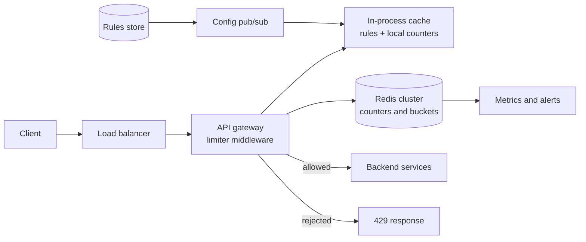

# Design a distributed rate limiter

*The one problem where the interesting part is not the architecture. The boxes
take five minutes. The other forty are about whether a counter shared by fifty
servers can be both correct and fast.*

---

## 1. Requirements

**Functional**
- Given an identity and a request, decide allow or reject, before the request
  reaches the backend
- Limits are configurable per identity and per endpoint, without a deploy
- A rejected caller is told it was rejected, and when to come back
- Limits hold across the whole fleet, not per server

**Out of scope** (say so): billing and quota accounting, WAF and bot detection,
DDoS absorption at L3/L4. Those live upstream of this and answer a different
question — rate limiting is about fairness and cost, not about attack traffic
that never reaches your application.

**Non-functional**
- **It sits on every request.** Its latency is added to every request you serve,
  so p99 overhead under ~5 ms, and a hard timeout below that
- Available, in the sense that it must not take the API down with it
- **Approximately correct is acceptable**, exactly correct is not required — say
  this early, it unlocks the entire design
- Distributed: any server can serve any request

**The one question to ask the interviewer:** is the limit a *policy* or a
*guarantee*? "Roughly 100 requests a minute so nobody hogs the pool" and "never
more than 100, because each one costs us money" are different systems. Most
answers are the first.

## 2. Estimation

Assume an API gateway fronting a large product.

```
1B requests/day, every one of them checked
  average   1B / 100k sec           = ~10,000 checks/sec
  peak      3x average              = ~30,000 checks/sec
```

**How much state?** Assume 1M active clients and ~10 live keys each — a global
limit, a few per-endpoint-class limits, an IP limit:

```
  keys      1M clients x 10         = ~10M live keys
  per key   ~100 B (key string + counter + store overhead)
  memory    10M x 100 B             = ~1 GB
```

**One gigabyte.** The entire state of a rate limiter for a billion requests a day
fits in memory on a single machine, with room to spare. That is the most
important line in this estimate: **this is not a storage problem.** Every design
decision below is about throughput, latency and coordination.

**Now price the sliding window log**, which keeps one timestamp per request
instead of one counter per key. Assume a limit of 1,000 requests per hour and
round a sorted-set entry to 100 B including overhead:

```
  per key   1,000 entries x 100 B   = ~100 KB
  memory    10M keys x 100 KB       = ~1 TB
```

A thousand times more memory for the same job. That single comparison is why the
log loses, and it is worth doing out loud rather than asserting it.

**Bandwidth and concurrency.** A check is ~100 B each way, so 30k/sec is ~3 MB/s
in each direction — nothing. With a 500 µs in-datacentre round trip
([latency numbers](../fundamentals.md)), Little's law gives
`30,000 x 0.0005 = 15` checks in flight at any moment. A handful of pooled
connections carries the whole fleet.

**Read that last number again.** It says the cost of a check is one round trip.
So a design that takes *two* round trips has doubled the latency of your entire
API for no functional gain. This is the first argument for the Lua script in
section 5, before correctness even comes up.

## 3. The core decision: which algorithm

[Fundamentals has the summary table](../fundamentals.md). Here is the failure each
one actually has, which is what gets asked.

**Fixed window.** One counter per key per wall-clock window. `INCR`, compare,
reset when the window rolls.

The failure is the boundary, and it is concrete. Limit is 100/min. A client sends
100 requests at 00:00:59 and 100 more at 00:01:00. Both windows are within their
limit. Your backend just took **200 requests in two seconds** against a limit of
100 per minute. Any fixed window admits 2x across the seam, always, by
construction — and a client that has noticed will aim for it.

**Sliding window log.** Keep the timestamp of every request in a sorted set, drop
everything older than the window, count what remains.

Exactly correct. The failure is cost: memory is O(limit) per key — the 1 TB
above — and rejected requests still get written before they are counted, so the
clients hammering you hardest are the ones consuming the most memory. It is the
right answer only for small limits where exactness is worth paying for, such as
"5 failed logins per hour".

**Sliding window counter.** Keep two fixed-window counters and interpolate:

```
count = current_window + previous_window x (overlap fraction of the window)
```

At 30 seconds into a minute, you charge half of the previous minute's count.
Memory is two integers. The failure is the assumption baked into the
interpolation: **it pretends the previous window's traffic was spread evenly.**
If a client sent all 100 of its previous-minute requests in that minute's last
second, the real sliding count is 100 and the estimate says 50, so you let it
through. The error is bounded by the limit and it is a smear, not the clean 2x of
a fixed window.

**Token bucket.** A bucket of capacity `B` refills at `r` tokens per second. Each
request spends a token; an empty bucket means reject.

Bursts are allowed **by design**, up to `B`. That is usually what you want — a
page load fires ten API calls at once and should not be punished — but say the
failure: `B` is a burst your backend has to absorb. If the thing you are
protecting is a database that falls over at 200 concurrent queries, a capacity of
500 is a loaded gun. Pick `B` from what downstream survives, not from what feels
generous.

**Leaky bucket.** A fixed-size queue draining at a constant rate.

Output is perfectly smooth, which is the only algorithm here that gives you that.
Two failures: it *queues*, so a request's latency now depends on how much traffic
preceded it, and there is no burst allowance at all, so a legitimate client
paying for 100/sec and sending 100 at once gets shaped instead of served. It is a
traffic shaper. Reach for it when a downstream has a hard, fixed intake — a
third-party API with a contractual QPS — and never for user-facing fairness.

### What to pick

**Token bucket as the default**, for the reason above: bursts are a feature. Use
**sliding window counter** when the policy has to be literally "N per minute"
because that is what the pricing page says. Use the **log** only for small,
security-relevant limits. Use the **leaky bucket** only in front of something
that cannot be burst.

Committing to one and naming the trigger for switching is the whole point here.

## 4. High-level design



**Where the limiter lives.** In the gateway, as middleware, before authentication
finishes but after enough of it to know who is calling. Not in each service — you
would then reimplement it per language and lose the shared view. Not at the CDN
alone — the edge has no idea what a user's plan is, though it is the right place
for a crude per-IP ceiling as a first layer.

**The decision path, in order:** resolve identity, look up the matching rules
from the in-process cache, run one atomic check per rule against Redis, take the
strictest verdict, attach headers, allow or reject.

**API**

```
Internal:   check(identity, ruleId, cost) -> { allowed, remaining, resetSeconds }
Admin:      PUT  /rules/{ruleId}   { scope, match, limit, windowSec, algorithm, burst }
            GET  /limits/{identity}   -> current state, for support and debugging
```

**`cost` is not decoration.** A search that fans out to five services should spend
five tokens, not one. Weighting by cost is the cheapest way to make a limiter
reflect real load, and it is free in the token bucket.

**Data model**

| Store | Key | Value | Why this store |
|---|---|---|---|
| Redis | `rl:{identity}:rule` | `tokens`, `ts` (token bucket) | Every request reads and writes it. It must be in memory, single-keyed, and support server-side atomic logic |
| Redis | `rl:{identity}:rule:window` | integer counter | Same, for window algorithms. TTL longer than the window |
| Relational | `rules` | scope, match pattern, limit, window, algorithm, burst | Written by humans, read almost never. Thousands of rows. Needs transactions and an audit trail, not throughput |

The access pattern decides both. The counters are a point read-modify-write by a
key you already have, at 30k/sec — that is a key-value store, in memory. The rules
are a small, relational, rarely-read config set with humans editing them — that is
Postgres, and it never appears on the hot path because every gateway holds the
whole ruleset in process and refreshes on a pub/sub notification.

**The braces in `{identity}` are load-bearing**, not formatting. In Redis Cluster
a hash tag forces every key for one identity into the same hash slot, which is
what makes a multi-key atomic script legal. Without it, a script touching a
client's global and per-endpoint keys is a cross-slot error at runtime.

## 5. Deep dive: making the counter distributed

This is the problem. One counter, fifty gateway servers, and no request may wait.

### Why `INCR` then `EXPIRE` is a race, concretely

The obvious code is two commands:

```
INCR  rl:user123:minute        -> 1
EXPIRE rl:user123:minute 60
```

Three things break.

**The key can outlive its window.** Between the two commands the process can
crash, the connection can drop, or a failover can move the primary. The counter
now exists with **no TTL**. It never resets. That user is rate-limited forever,
and nothing in your metrics says why — the counter just sits there above the
limit. This is the failure people actually hit in production, and it is the one
to lead with.

**The guard makes it worse, not better.** The usual patch is "only set the expiry
when the counter comes back as 1". That narrows the window without closing it,
and it adds a new bug: only the very first request of a window can ever install
the TTL, so if that one request is the one that dies, every subsequent request
sees a count above 1 and skips the `EXPIRE` forever.

**Two round trips.** Section 2 measured the budget: one round trip. This design
spends two on every request in the system.

And if you reach for `GET`, decide, then `SET` instead, you have a classic lost
update — two gateways read 99, both allow, both write 100, and the limit was 100.

**`MULTI`/`EXEC` does not fix it either**, and knowing why is the useful part:
a transaction is atomic, but the commands are queued before any of them runs, so
you cannot read the counter and *branch* on it. Rate limiting is inherently
read-decide-write. You need logic on the server side.

### One Lua script, one round trip

Redis runs a script atomically — it is single-threaded, and nothing interleaves.
Read, decide and write become one operation, and one network trip.

```lua
-- KEYS[1] = bucket key
-- ARGV    = capacity, refill_per_sec, cost, ttl_ms
local capacity = tonumber(ARGV[1])
local rate     = tonumber(ARGV[2])
local cost     = tonumber(ARGV[3])

local now      = redis.call('TIME')            -- server clock, not the caller's
local now_ms   = now[1] * 1000 + now[2] / 1000

local b        = redis.call('HMGET', KEYS[1], 'tokens', 'ts')
local tokens   = tonumber(b[1]) or capacity
local ts       = tonumber(b[2]) or now_ms

-- lazy refill: no timers, no background job, just elapsed time
tokens = math.min(capacity, tokens + (now_ms - ts) * rate / 1000)

if tokens < cost then
  return {0, tokens}
end

redis.call('HSET',    KEYS[1], 'tokens', tokens - cost, 'ts', now_ms)
redis.call('PEXPIRE', KEYS[1], tonumber(ARGV[4]))       -- cannot be skipped now
return {1, tokens - cost}
```

Four things in there are the actual content:

**The clock is the server's.** Take the time from `redis.call('TIME')`, not from
the gateway. Gateway clocks skew. A node running two seconds fast computes two
extra seconds of refill on every request it handles and quietly mints free
tokens for whichever clients happen to land on it. One clock, at the place the
state lives. Modern Redis replicates a script's *effects* rather than the script
itself, so a non-deterministic call like `TIME` is safe to use.

**The refill is lazy.** Nothing ticks. Tokens are computed from elapsed time at
read. A rate limiter with a background refill job is a rate limiter with 10M
timers in it.

**The expiry is inside the script**, so the crash window from the previous
section does not exist. There is no interleaving in which a key gets created
without a TTL.

**The TTL should be the time to refill from empty to full** — `capacity / rate`.
After that the bucket is indistinguishable from a fresh one, so dropping it loses
nothing. That property is specific to the token bucket and worth naming: **an
evicted bucket fails safe.** Window counters do not have it — evicting one resets
the count to zero and hands the client a free window, so their TTL must strictly
exceed the window.

Which leads to a configuration trap: **do not run the limiter on a Redis with
`allkeys-lru`.** Under memory pressure it evicts live counters, and the gate
silently opens at precisely the moment the system is under load. Use
`noeviction` or `volatile-ttl` and size for the working set you computed.

Load the script once with `SCRIPT LOAD` and call it by SHA with `EVALSHA`, so you
are not shipping the body on every request.

### Local caching, and exactly what accuracy it costs

One round trip is cheap, but it is not free, and at some scale you will want the
common case to answer from memory. There are two ways to do that and they fail in
opposite directions. Say which one you are choosing.

**Batched sync — trades over-admission.** Each gateway counts locally and pushes
its delta to Redis every `T` milliseconds, pulling back the global count. Between
syncs, nodes are blind to each other.

The cost is bounded and you should state the bound: with `N` gateways and a sync
interval `T`, the worst case is every node admitting its full local allowance
during the same `T` without seeing the others. Concretely, 10 gateways and a
1-second sync means the ceiling can be overshot by up to one second of traffic
per node before anyone notices. Shortening `T` shrinks the error linearly and
raises Redis traffic linearly. **You are buying accuracy with round trips**, and
`T` is the dial.

**Lease allocation — trades under-admission.** A gateway asks Redis for a lease
of `k` tokens, decrements the shared budget once, then spends the lease locally
with no further coordination. The global total is never exceeded, because every
token came out of the one counter.

The cost is the mirror image: a node holding 50 unused tokens while another node
is rejecting requests. You are stricter than the policy, not looser. Keep leases
small and short-lived, size `k` from the node's recent rate, and return unused
tokens on shutdown.

**Which to pick.** Under-admitting a paying customer is usually worse than briefly
over-admitting, so batched sync for ordinary fairness limits. Leases when each
request costs real money and the limit is a ceiling rather than a policy. Either
way the local layer should hold only hot keys — an LRU of a few thousand
identities covers most traffic, because request distributions are Zipfian, and
everything else takes the round trip.

### Hot keys

One identity is one key, and one key lives on one shard. A single large customer
can exceed what a shard will do. Plan on the order of ~100k simple ops/sec per
Redis shard.

The fix is the standard [hot-key split](../fundamentals.md): write to
`rl:{user}:0` through `rl:{user}:9`, each enforcing a tenth of the limit, and
route each request to one of them at random. The cost is accuracy, and you should
name it — traffic will not split perfectly evenly, so some sub-buckets exhaust
while others still have room, and the effective limit sits slightly below the
configured one. Apply it only to identities you have measured as hot, not to
everyone.

### When Redis is down: fail open or fail closed

The honest answer is that this is a product question, not an infrastructure one,
and that both pure answers are bad.

**Fail open** — allow everything the limiter cannot check. The limiter exists to
protect a backend. Redis going down does not reduce incoming traffic, so you
remove the protection at the exact moment it matters, and one dependency failing
takes the backend with it. Worse, the two failures correlate: whatever caused the
Redis problem is often the same load spike the limiter was there to blunt.

**Fail closed** — reject everything. A Redis blip is now a total API outage. You
have converted a degradation into an incident, and for a limiter that exists to
make traffic *fair*, that is a wildly disproportionate response.

**What to actually say:** do not choose between them — degrade to local
enforcement. Each gateway falls back to its in-process counters with a limit of
`global_limit / N`. If traffic is evenly balanced, total admission is roughly
correct. If it is skewed, you under-admit, which is the safe direction. You keep
protection, you keep serving, and you have a bounded, explainable error.

Then split by what the limit protects, because this is where the judgement shows:

| What the limit protects | Behaviour when Redis is unavailable |
|---|---|
| Fairness across tenants on elastic capacity | Local fallback, generous — availability wins |
| A fixed-capacity downstream | Local fallback at `limit / N`, strictly enforced |
| Spend: paid third-party calls, SMS, model inference | Fail closed, or fall back to a hard conservative local cap |
| Security: login attempts, password reset, OTP | Fail closed. An open login limiter is a credential-stuffing window |

**The timeout matters more than the policy.** Put a hard 5–10 ms deadline on the
limiter call and treat expiry as the failure path. Without it, a *slow* Redis —
far more common than a dead one — adds its latency to every request in the
system, and a limiter that makes your API slow has done more damage than one that
is simply wrong. Add a circuit breaker so you stop dialling a dead dependency
30,000 times a second, and make sure the breaker's half-open probe is a single
request rather than the full fleet retrying at once.

### The response contract: 429 and its headers

Getting this right is cheap and it is the part every reviewer of your API will
see.

```
HTTP/1.1 429 Too Many Requests
RateLimit-Limit: 100
RateLimit-Remaining: 0
RateLimit-Reset: 12
Retry-After: 12
Content-Type: application/json

{ "error": "rate_limited", "retryAfter": 12 }
```

**429, not 503, and not 403.** 429 means *you* exceeded your quota — the fault is
the client's, the server is healthy, and the same request will succeed later
unchanged. 503 means the server is unwell. Clients and SDKs retry them
differently, and conflating them sends well-behaved clients into the wrong
backoff. 403 means never, which is a different instruction entirely.

**Send the headers on success too**, not only on rejection. A client that can see
`RateLimit-Remaining: 3` can slow down before it hits the wall. A client that only
learns at the wall can only crash into it.

**`Retry-After` is the contract.** Give it in seconds. It must be honest —
derived from the actual reset or refill time, not a constant — because clients
build their backoff on it.

**Naming.** `X-RateLimit-Limit` / `-Remaining` / `-Reset` is the long-standing
de-facto convention; the IETF's RateLimit header work standardises the same three
fields without the `X-` prefix. Emit both for a transition period if you have
existing clients. Watch the `Reset` semantics: the IETF form is **seconds
remaining**, while plenty of deployed `X-RateLimit-Reset` headers carry a **Unix
timestamp**. A client that reads a delta as an epoch sleeps for zero; one that
reads an epoch as a delta sleeps for decades. Pick one, document it, never change
it.

**Jitter, or you have built a synchroniser.** If a thousand clients are rejected
in the same second and all told to retry in 12 seconds, they all come back in the
same second. You have converted a smooth overload into a periodic one. Vary
`Retry-After` by a small random amount per response, and tell clients in your docs
to add jitter of their own.

**A rejection must be cheap.** No database lookups, no template rendering, short
body, connection reused. The entire economic argument for a rate limiter is that
saying no costs far less than saying yes. Log rejections as counters and samples,
never one log line per rejected request — that is how the limiter becomes the
outage.

## 6. Bottlenecks, and scaling past them

| Breaks first | Symptom | What you do |
|---|---|---|
| A single Redis shard | Ops/sec plateaus, latency climbs | Shard by hash of identity. Every check is single-key, so this is clean — but keep an identity's keys in one slot with a hash tag |
| One hot identity | One shard hot, the rest idle | Split that key into sub-buckets as above, only for measured hot keys |
| The round trip itself | p99 of the whole API rises with traffic | Local-first with batched sync; the round trip becomes the slow path |
| Rules lookup | A config read appears on the hot path | Full ruleset in process, pub/sub invalidation. It is kilobytes |
| Cross-region coordination | Everything | See below |

**At 10x — 300k checks/sec — the shard count is the answer**, and the arithmetic
is the whole story: ~100k ops/sec per shard means three, so run four or five.
Nothing structural changes, which is the payoff for making every check a
single-key operation.

**Multi-region is where it genuinely stops working.** A globally exact limit needs
consensus across regions, and a cross-continent round trip is ~150 ms
([latency numbers](../fundamentals.md)). That is thirty times your entire latency
budget, so a globally exact limit is off the table. The options, in the order you
should offer them:

1. **Per-region limits of `global / regions`.** Simple, no coordination. The cost
   is skew — a region carrying 60% of traffic rejects while another sits idle.
2. **Per-region limits plus slow reconciliation.** Regions gossip their counts
   every few seconds and adjust their local allowance. Better utilisation, and
   the limit is now approximate by design.
3. **One home region per identity.** Route a client's checks to the region that
   owns them. Exact again, at the price of a cross-region hop for clients calling
   from elsewhere. Reasonable when clients are geographically stable.

**What to monitor:** rejection rate per rule (a rule that rejects nothing is not
protecting anything, and one that rejects 40% is misconfigured), limiter latency
p99 separately from API latency, fallback-mode activations, Redis memory against
your key estimate, and the count of keys sitting at zero remaining — that is your
early warning that a customer is about to open a support ticket.

## Tradeoffs to volunteer

**Approximate over exact.** Chosen. Exactness costs either the log's memory or
cross-node coordination on every request. *The case for exact:* when each request
triggers a metered third-party charge, being 5% over is a real invoice, and the
sliding window log against a small limit is genuinely the right tool. Exactness is
affordable precisely when the limit is small.

**Gateway over sidecar or library.** Chosen: one implementation, one place to
change policy, and it rejects traffic before it costs you anything downstream.
*The case for a sidecar:* it keeps the limiter's latency on the local loopback
instead of the network, survives the gateway tier, and lets each service set its
own limits. Worth it in a large service mesh where a central gateway becomes a
political bottleneck as much as a technical one.

**Reject over queue.** Chosen: a 429 is immediate, honest, and leaves the retry
decision with the client, who knows whether the request still matters. *The case
for queueing* — the leaky bucket — is a downstream with a hard intake where
dropping work is more expensive than delaying it: batch jobs, webhooks, anything
with no user waiting. Never queue a request a human is watching.

**Per-user and per-IP, not one or the other.** Per-user is the meaningful unit,
but it requires an authenticated identity, and the endpoints most in need of
limiting — login, signup, password reset — are the ones without one. Per-IP
covers those, and is weak on its own: a corporate NAT is thousands of users on
one address, and an attacker on IPv6 has effectively unlimited addresses. Layer
them, with a loose IP limit as the outer gate and a tight per-user limit inside.

**Redis over an in-memory-only design.** Chosen because a shared view is the
entire requirement. *The case against:* if you can accept per-node limits, you
delete a network dependency, a failure mode, and a whole category of on-call
pages. For a fleet of 5 nodes with a limit of 1,000/min, per-node limits of 200
are fine and the simpler system is the better one. This gets less true as the
fleet grows and autoscales, because `N` stops being a number you know.

## Follow-up questions

**How do you roll out a new limit without breaking customers?**
Shadow mode. Evaluate the rule, emit the metric, do not reject. Watch who *would*
have been rejected for a week, fix the rules or warn the customers, then enforce.
Every limiter needs this switch from day one.

**A customer says they are being rate limited but their logs show they are under
the limit. What do you check?**
Clock skew if the buckets still take client time; retries inside their SDK
counting as multiple requests; a `cost` weight above 1 on the endpoint they are
calling; and a second, stricter rule matching the same request — the verdict is
the strictest rule, so the one that fired may not be the one they are looking at.
The admin `GET /limits/{identity}` endpoint exists for this conversation.

**How do you limit by something expensive to compute, like the tenant of an
API key?**
Not on the hot path. Resolve key to tenant once, cache the mapping in process with
a short TTL, and limit on the resolved tenant. If the mapping is missing, limit on
the key itself and resolve asynchronously.

**Different limits for different endpoints — how do the rules compose?**
Evaluate every matching rule and take the strictest verdict, but return headers
for the rule that actually rejected, otherwise the client cannot tell which limit
it hit. Keep the number of rules per request small; each one is a key, and ten
rules is ten keys in a script.

**Can a client be rejected and still have consumed a token?**
It must not be, and the script above is careful about it: tokens are only written
back on the allow path. If you deduct before checking, a client stuck at its
limit can never recover, because every rejected retry pushes the bucket further
into deficit.

**Is a 429 safe for the client to retry?**
Yes, and say so explicitly: the request was not processed. That is what
distinguishes it from a 500, where the client cannot know, and it is why 429 pairs
so cleanly with [idempotency keys](../fundamentals.md) on the requests that do get
through.

**How would you rate limit by cost when the cost is only known afterwards?**
Charge an estimate up front, then reconcile: add or refund the difference to the
bucket after the response. The bucket goes temporarily negative on a bad estimate,
which is fine — that is what the refill is for. This is the right shape for
anything billed on output size, including model inference.
