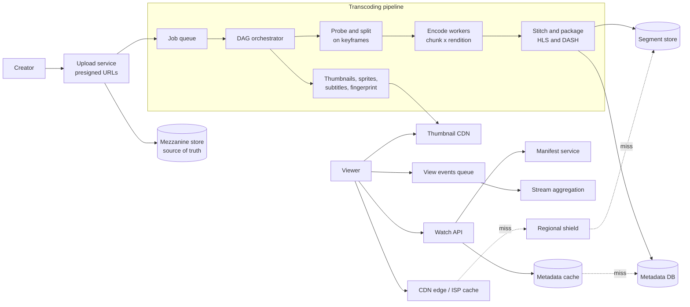

# Design a video streaming service

*YouTube, Netflix, Twitch VOD. The problem is not "store videos" — it is a batch
processing pipeline bolted to the largest content delivery problem on the
internet, with a small ordinary web app sitting next to both.*

---

## 1. Requirements

**Functional**
- Upload a video file, reliably, over a connection that drops
- Transcode it into multiple qualities so it plays on a phone and on a TV
- Watch a video, with quality adapting to the viewer's bandwidth
- Watch page: title, description, thumbnail, view count

**Out of scope** (say so and move on): recommendations, comments, live streaming,
monetisation, the social graph. Recommendations in particular — it is the same
candidate-generation → ranking funnel as the [news feed](02-news-feed.md), and
saying that earns the point without spending ten minutes.

**Non-functional**
- Overwhelmingly read-heavy, and "read" here means *bytes*, not requests
- Startup latency matters more than anything: time from click to first frame,
  p99 under ~2 seconds
- Rebuffering is the quality metric. A viewer forgives 480p; they do not forgive
  a spinner
- Upload → watchable in minutes, not hours. Not seconds — nobody expects that
- Availability over consistency everywhere. A view count that is two minutes
  stale is invisible; a video that will not play is the product failing
- Durability of the uploaded master is absolute. Everything else is derived and
  can be rebuilt

## 2. Estimation

Round everything. The point is which number forces which decision.

**Upload side** — assume 1M hours of video uploaded per day.

```
uploads      1M hrs/day ÷ 100k sec        = ~10 hours of video per second
1080p rate   ~5 Mbps × 3600 s             = ~2 GB per hour of video
full ladder  144p…1080p ≈ 2× the 1080p    = ~4 GB stored per source hour
mezzanine    high-bitrate master ≈ 2×     = ~4 GB per source hour

new bytes    1M hrs × (4 + 4) GB          = ~8 PB/day → ~3 EB/year
```

**Watch side** — assume 500M daily viewers watching ~40 minutes each.

```
watch time   500M × 0.7 hr                = ~300M hours/day
ratio        300M watched : 1M uploaded   = 300:1        ← the shape of the system
avg rendition most viewing is mobile      = ~2 GB/hr delivered
egress       300M hrs × 2 GB              = ~600 PB/day
bandwidth    600 PB ÷ 100k sec            = ~6 TB/sec = ~48 Tbps average
peak         3×                           = ~150 Tbps
concurrency  300M hrs ÷ 24 hr             = ~12M concurrent streams, ~37M peak
segments     37M streams ÷ 4 sec each     = ~9M segment requests/sec at peak
```

**Metadata side** — assume an average video is 10 minutes, so ~6M new videos/day.

```
metadata rows 6M/day × ~1 KB              = ~6 GB/day
video starts  300M hrs ÷ 10 min sessions  = ~1.8B/day = ~18k/sec, ~50k peak
```

**What the arithmetic decided, before any box was drawn:**

- **150 Tbps at peak.** You cannot buy that as transit, and you cannot serve it
  from datacentres. The CDN is not an optimisation here; it is the system.
- **9M segment requests/sec.** Nothing on that path may touch a database. It has
  to be static immutable files answered from a cache near the viewer.
- **3 EB/year.** You cannot keep everything hot, and you probably cannot keep
  every rendition of every video at all.
- **6 GB/day of metadata against 8 PB/day of video.** Those are six orders of
  magnitude apart. They are not the same system and should not share a design.

## 3. The core split: two systems, one video ID

Say this early, because it organises everything after it.

| | Bytes path | Metadata path |
|---|---|---|
| Size | petabytes/day | gigabytes/day |
| Mutability | immutable once published | edited constantly |
| Store | object storage + CDN | relational DB + cache + search index |
| Hot path | no application code at all | ordinary request/response |
| Failure looks like | video will not play | page renders with missing title |

They are joined by `video_id` and nothing else. The watch page is a normal web
request that returns a manifest URL; the actual video never passes through your
API tier in either direction. Uploads go **straight to object storage** via
presigned URLs and playback comes **straight from the edge**.

This is also why the thumbnail path is its own thing. Thumbnails are millions of
tiny immutable objects with a totally different size profile and cache behaviour
from 4 MB video segments. Same idea, different tuning, separate CDN
configuration.

## 4. High-level design



**API**

```
POST /uploads                  { filename, sizeBytes, sha256 }
                               -> { uploadId, parts: [{ n, url }] }
PUT  <presigned part url>      raw bytes                 -> 200 + ETag
POST /uploads/{id}/complete    { parts: [{ n, etag }] }  -> 202 { videoId }
GET  /videos/{id}              -> { title, desc, status, manifestUrl, thumbUrl }
GET  /videos/{id}/manifest.m3u8 -> master playlist
POST /videos/{id}/heartbeat    { positionSec }           -> 204
```

`complete` returns **202, not 201**. The video exists but is not watchable yet.
The client polls or subscribes for `status: ready`. Pretending transcoding is
synchronous is the most common way this design goes wrong in the first minute.

## 5. Data model

**`videos`** — relational. Point read by `video_id` on every single watch page,
plus range queries by channel, plus edits that need transactions with other
tables. That access pattern is exactly what a relational store is for.

```
video_id (PK) | owner_id | title | description | duration_sec
              | status | visibility | created_at | mezzanine_key
```

**`renditions`** — one row per (video, quality). Read together with the video,
written once by the pipeline. Could be a JSON column on `videos`; keep it a table
if you want to query "which videos still lack 1080p" during a re-encode campaign.

```
video_id | rendition | codec | bitrate | width | height | manifest_key | state
```

**`transcode_tasks`** — the pipeline's state machine, and the only write-heavy
table here. Queried by state, so index on `(state, priority, created_at)`.

```
task_id (PK) | video_id | chunk_idx | rendition | encoder_version
             | state | attempts | worker_id | lease_expires_at
```

**Segments are not in a database.** They are objects at a deterministic key —
`/{video_id}/{rendition}/{seq}.m4s` — and the manifest *is* the index. Putting
9M lookups/sec in front of any database is the mistake this avoids.

**View counts** go to an append-only event stream, aggregated by a stream
processor into an approximate counter, reconciled in batch. Never an `UPDATE …
SET views = views + 1` on the watch path — that is a single-row hot write on the
most popular rows in the system.

**Search** is a separate index (Elasticsearch-class) fed asynchronously. Titles
are text; the videos table should not be answering full-text queries.

## 6. Deep dive: the pipeline and the CDN

### 6a. Transcoding as a DAG of jobs

Encoding runs at roughly real time on one core. A one-hour video encoded serially
takes about an hour per rendition, and you have six renditions. That is
unacceptable, and it is the whole reason for the design: **split the video and
encode the pieces in parallel.**

The DAG for one upload:

```
probe  →  split into chunks  →  encode (chunk × rendition)  →  stitch per rendition
                                                            →  package + manifest  →  publish
       →  thumbnails / sprite sheet
       →  subtitles
       →  content fingerprint
```

A one-hour video split into 200 chunks × 6 renditions is 1,200 independent tasks.
On a fleet of a few hundred workers that is minutes, not hours. Fan-out, then
fan-in.

**The trap: where you split.** Video chunks are only independently decodable at
keyframe (GOP) boundaries. Split mid-GOP and the chunk references frames it does
not have — you get artifacts at every seam, or a decoder that refuses the file.
So the split points must land on keyframes, and the encoder must be forced to
place keyframes at fixed intervals so the same timestamps are keyframes **in
every rendition**. That last part is not an encoding detail, it is what makes
adaptive bitrate possible at all. If 720p and 1080p have keyframes at different
places, a player cannot switch between them cleanly.

**Every task is idempotent.** Key it on
`(video_id, chunk_idx, rendition, encoder_version)` and write the output to a
deterministic path. Now a retry, a duplicate delivery, or two workers racing on
the same task all produce the same bytes at the same key. This matters because
the fleet should run on preemptible capacity — encoding is the ideal spot-instance
workload, and that means workers die constantly. See
[idempotency and at-least-once delivery](../fundamentals.md).

**Stragglers.** Fan-in means the video publishes at the speed of its slowest
chunk. One chunk landing on a slow machine holds up the whole video. Fix it the
way batch systems do: when most tasks are done, speculatively re-run the
outstanding ones elsewhere and take whichever finishes first. Idempotency is what
makes that free.

**Publish progressively, cheapest first.** Encode 360p before 4K and publish the
manifest as soon as one rendition is complete. The video becomes watchable in a
minute while the top of the ladder is still encoding, and the manifest is
rewritten as renditions land. Time-to-watchable is a product metric; total
pipeline time is not.

**Keep the mezzanine forever.** It is the input to every future run of this DAG:
a new codec, a fixed encoder bug, a new rendition for a device that did not exist
when the video was uploaded. Renditions are derived data. Treat them as an
expensive cache, not as the asset.

**Per-title encoding, if you want the optimisation question.** A fixed ladder
gives a static talking-head video the same 16 Mbps as an action sequence. Instead,
encode a handful of test points, measure quality (VMAF-style), and pick the
ladder on the convex hull of quality-per-bit for *that* video. It costs analysis
CPU once and saves bitrate on every one of millions of views. The economics are
obvious once you notice egress is the dominant cost.

### 6b. Adaptive bitrate: manifests, segment size, and the client loop

The server serves numbered files. The client decides which ones to ask for. That
inversion is the entire trick — it is why the delivery tier can be a dumb static
cache, and why the system scales.

**The manifest is two levels.** A master playlist lists the variants with their
bitrates and resolutions. Each variant has its own media playlist listing that
rendition's segments in order. The player fetches the master once, then walks one
media playlist, and can jump to a different one at any segment boundary.

```
#EXT-X-STREAM-INF:BANDWIDTH=800000,RESOLUTION=640x360
360p/index.m3u8
#EXT-X-STREAM-INF:BANDWIDTH=2500000,RESOLUTION=1280x720
720p/index.m3u8
```

**Segment length is a real trade-off, and interviewers push on it.**

| Segment | Adaptation | Startup | Overhead |
|---|---|---|---|
| 2 s | Reacts within 2 s of a bandwidth drop | Fast — small first fetch | More requests, more keyframes, worse compression |
| 10 s | Sluggish; a drop means a stall | Slow first frame | Efficient encode, few requests |

Four to six seconds is the usual answer for on-demand. Keyframes cost bits, and
a 2-second segment forces a keyframe every 2 seconds whether the content needs
one or not. Live is the case that pushes shorter, and low-latency HLS goes
further by delivering partial segments over chunked transfer before the segment
is complete.

**The client decision loop**, once per segment:

1. Measure throughput of the segments already downloaded.
2. Read the buffer level — how many seconds of video are queued.
3. Pick the highest rendition whose bitrate the estimate supports, subject to the
   buffer.

**Rate-based estimation alone is the trap.** Segment download speed over a CDN is
noisy for reasons that have nothing to do with the viewer's link: a cache hit is
fast, a cache miss that walks back to origin is slow, and the player reads that
as "bandwidth collapsed" and drops to 360p on a perfectly good connection.
Buffer-based control is the counterweight — a full buffer means you can afford to
try higher regardless of what the last sample said. Shipping players run a hybrid
and are conservative going up, aggressive coming down: over-estimating costs you
a rebuffer, under-estimating costs you some sharpness.

**Start low, then climb.** First frame fast beats first frame pretty. The startup
request should be the smallest segment of the lowest sensible rendition, with the
ladder climbed over the next few segments once the buffer is healthy.

### 6c. CDN strategy, and why Netflix ships boxes and YouTube does not

At 150 Tbps peak, the only question that matters is how bytes get from your
storage to the viewer's ISP. There are two answers, and the choice is determined
by the *catalog*, not by the company.

**Netflix: pre-fill.** The catalog is small — tens of thousands of titles — and
it does not change during the day. Tomorrow's popular titles are predictable from
today's, per region, with high accuracy. Because of that, you can put an
appliance inside the ISP's own network, fill it overnight when the network is
idle, and serve peak-hour traffic entirely from inside the ISP. The working set
fits the box, so the hit rate approaches 100%. The ISP wants the box because it
removes their most expensive peak-hour transit; Netflix wants it because the
bytes never cross a paid link at peak. Both sides win, which is why it is
possible at all.

**YouTube: demand-fill.** The catalog is effectively unbounded, grows by millions
of videos a day, and which video goes viral in the next hour is not predictable.
Pre-positioning is meaningless when the working set is orders of magnitude larger
than any box and changes continuously. So the model is caches — including caches
inside ISPs — that are filled *on demand* over a private backbone, keeping the
long tail one hop away rather than pretending it can be local.

**The distinction to state out loud is pre-fill versus demand-fill, and the
input to that decision is catalog size and predictability.** Anyone can say
"Netflix puts servers in ISPs". The point is *why that is available to them and
not to a service with an unbounded catalog*.

**Tiered caching is how demand-fill survives the long tail.** A miss at 1,000
edges must not become 1,000 origin fetches. Put a regional shield between them:
edge → shield → origin. The first edge to want an obscure video pulls it through
the shield; the other 999 get it from the shield. Same idea as request coalescing,
one layer up, and it is what keeps origin egress flat as you add PoPs.

**Cache keys are trivially easy here, and that is the gift.** A segment URL
identifies immutable bytes. Content never changes at a URL — a re-encode writes a
new key — so TTLs can be effectively infinite and there is no invalidation
problem. Compare that to caching an HTML page. Half of what makes video CDNs work
is that the cacheable unit is perfect.

**The one hot-object problem.** A premiere is a single segment sequence requested
by millions of people in the same minute. Within a PoP, consistent hashing sends
one key to one machine, so the hottest object in the world lands on one box. Fix
it by replicating hot keys across several peers in the PoP and by coalescing
concurrent misses into one upstream fetch — the video version of a
[cache stampede](../fundamentals.md). For scheduled events you also get to
cheat: pre-warm the edges, which is demand-fill borrowing Netflix's trick for the
one case where the future is known.

### 6d. Resumable chunked upload

A 10 GB file over hotel wifi will fail. Retrying from zero is not a design.

```
POST /uploads            -> uploadId + presigned URL per part
PUT  part 1..N           (parallel, each with a checksum)
GET  /uploads/{id}       -> which parts have landed
POST /uploads/{id}/complete
```

**Upload directly to object storage.** Presigned URLs, bytes never touching your
API servers. Proxying them means your API tier needs the full ingress bandwidth
and you pay for the same bytes twice. It also means an API deploy interrupts
in-flight uploads.

Parts are 5–100 MB, uploaded in parallel, each independently retryable. Part
number plus checksum makes every PUT idempotent. Only `complete` is not, so guard
it with the `uploadId` and make a repeat return the same `videoId`.

**Deduplicate on content hash.** If the file already exists, skip transcoding
entirely and point the new video at the existing renditions. This saves real
money on re-uploads, and the same fingerprint is the first step of copyright
matching. Verify the hash server-side after assembly — a client-supplied hash is
a routing hint, never a trust boundary.

### 6e. Storage tiering by popularity

View distribution is brutally long-tailed: a small fraction of videos take almost
all views, and most videos are watched for a week and then effectively never
again. Storage policy should follow that shape.

| Tier | What lives there | Storage |
|---|---|---|
| Hot | Recently uploaded, currently popular — all renditions | Replicated, edge-adjacent |
| Warm | Steady long-tail views | Standard object storage, erasure coded |
| Cold | No views in months | Archive class; mezzanine + one low rendition only |

Two moves worth stating:

**Erasure coding instead of replication for anything not hot.** Three-way
replication costs 3× the bytes; erasure coding gets comparable durability at
around 1.4×. At exabyte scale that difference is the budget. The cost is slower
and more expensive reconstruction on read, which is exactly the trade you want
for data nobody reads.

**Delete cold renditions and re-encode on demand.** For a video with no views in
a year, keeping six renditions warm is paying rent on bytes nobody wants. Keep
the mezzanine and the cheapest rendition. If somebody does show up wanting 1080p,
re-run that branch of the DAG — a few seconds of encode, once, against months of
storage saved. This only works because you kept the mezzanine, which is the
second reason to keep it.

### 6f. The metadata and thumbnail path

Everything above is about bytes. The watch page is a completely ordinary web
application, and keeping that clear is worth saying.

- **Metadata reads** are ~50k/sec at peak against a row that barely changes.
  Cache-aside on `video_id`, invalidate on edit. Nothing exotic.
- **Thumbnails** are produced by the DAG: several candidate frames plus a sprite
  sheet for scrub-bar previews. They are tens of kilobytes, immutable, and served
  from a static CDN with its own configuration. A feed page fetches dozens of
  them, so the per-object request overhead dominates — the opposite of the video
  path, where a single 4 MB object dominates and request count is irrelevant.
- **View counts** are approximate by design. Emit an event, aggregate in a
  stream, write a rolled-up number. If asked whether the count is exact, say no,
  and say that exactness would require a coordinated write per view on the
  hottest rows in the system for no user-visible benefit.
- **Failure isolation falls out of the split.** Metadata down means a watch page
  with a missing title. Segment delivery down means no product. Those deserve
  different error budgets, different on-call urgency, and different dependency
  rules — the manifest URL should be derivable without a metadata read so that
  playback survives a metadata outage.

## 7. Bottlenecks, and what you do about them

| Breaks first | Why | What you do |
|---|---|---|
| CDN egress cost | 600 PB/day, and it is the largest line item | Peering and ISP-embedded caches; per-title encoding; better codecs on the head of the catalog only, because efficient codecs are expensive to encode and only pay back at high view counts |
| Transcode fleet at upload spikes | Bursty uploads, fixed capacity | Queue absorbs the burst; preemptible workers scale out; priority by rendition so time-to-watchable stays flat while the tail lags |
| Origin request rate | 9M segment requests/sec would obliterate any origin | Tiered caching and coalescing; origin should see a rounding error of total requests |
| One viral video | A single key, one machine per PoP | Replicate hot keys within the PoP, pre-warm scheduled events |
| Metadata DB reads | 50k/sec point reads | Cache-aside; the row is nearly immutable so invalidation is rare |
| Storage growth | 3 EB/year | Tiering, erasure coding, cold rendition deletion |
| Fan-in latency | Publish waits on the slowest chunk | Speculative re-execution of stragglers |

**What to monitor:** rebuffer ratio and time-to-first-frame per region and per
ISP, because they degrade for one network long before they show in an average;
CDN cache hit ratio per tier; queue depth and p99 upload-to-watchable; encode
cost per delivered hour.

## Tradeoffs to volunteer

**Transcode everything up front, or lazily on first view.** Eager is what I would
ship: the first viewer of any video gets an instant start, and pipeline cost is
predictable. The case for lazy is genuinely strong though — most videos are never
watched at 1080p, so most of that encode is wasted work on content nobody wants.
The honest answer is a split: eager for the cheap middle of the ladder, lazy for
the expensive top, which is the same policy as cold-tier re-encoding applied at
upload time instead of a year later.

**Pre-fill versus demand-fill.** Covered above. The thing to avoid is claiming
one is better. Pre-fill wins when the catalog fits and is predictable; it is
simply not available otherwise.

**Many small segment objects versus one file with byte ranges.** Separate
objects are simpler and cache trivially. The case against: tens of billions of
small objects is real operational weight, and packaging as CMAF with byte-range
requests cuts object count hard while staying cacheable. Worth naming as the
thing you would do at scale.

**Client-side ABR versus server-driven quality.** The server knows things the
client cannot — CDN health, congestion, its own cost model — and server-driven
selection would use that. I would still reject it: it puts per-viewer state in
the serving path and breaks the property that makes the whole delivery tier a
dumb cache. Ship client-side, and influence it by what you put in the manifest.

**Keep the mezzanine, or delete it.** Deleting halves the storage bill for bytes
that are never served. Keep it anyway. Every re-encode, codec migration and
encoder bug fix needs the original, and re-uploading is not an option you control.

**Strong consistency on view counts.** Not worth the coordination. Say it plainly
rather than hedging — an approximate count is the correct product decision, not a
compromise.

## Follow-ups

**How does live streaming change this?** The DAG becomes a pipeline — you cannot
random-access the future, so no chunk parallelism within a moment. Latency is
dominated by segment duration times buffer depth, so segments shrink and
low-latency HLS delivers partial segments as they are produced. Everything about
manifests, ABR and CDN survives unchanged.

**DRM?** Encrypt segments once under common encryption so one encrypted copy
serves all DRM systems, and keep keys out of the CDN. The license request is the
only per-viewer call in the playback path, which is exactly why it must not be on
the critical path for the first frame if you can avoid it.

**Can you stop people downloading videos?** No. Signed URLs with short TTLs bound
to a session raise the cost of casual hotlinking, and that is the real goal.
Anyone can re-record the decoded output. Say this rather than overclaiming.

**Resume playback across devices?** A periodic heartbeat writing
`(user_id, video_id, position)` to a key-value store. Small, idempotent, and
completely off the segment path.

**Subtitles?** Separate text tracks referenced from the manifest, generated as
their own DAG node. They must not block publish — a video should go live before
its captions are ready.

**Copyright matching?** A perceptual fingerprint computed as a parallel DAG node,
matched against a reference index. Asynchronous, and the policy decision on a
match — block, claim, or flag — is a business rule, not a pipeline concern.

**How do you roll out a new encoder version?** Version every task key by encoder
version, so old and new outputs live at different paths and nothing is overwritten.
Re-encode from the mezzanine in the background, swap the manifest when the new
ladder is complete, and keep the old renditions until you are confident.

**What if an entire region's CDN goes down?** Players retry against the next
resolved edge; the manifest is relative so nothing is pinned to a hostname. The
failure mode to plan for is not total loss but partial degradation — one ISP with
a bad path — which is why the quality metric is monitored per ISP.
