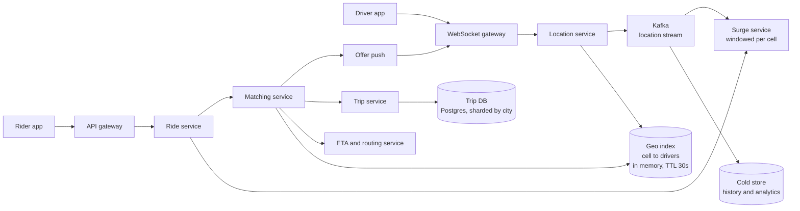

# Design a ride-hailing service

*Uber, Lyft, Ola, Grab. The proximity problem. Everything else in it — pricing,
state, payments — is ordinary; the location index is not, and that is what is
being tested.*

---

## 1. Requirements

**Functional**
- A rider requests a ride: pickup, dropoff, product class. They get a fare quote
  and an ETA before committing.
- Drivers report their location continuously while online
- The system finds a nearby available driver and offers them the trip
- The driver accepts or declines; on accept, both sides see the other move
- Trip lifecycle: driver en route → arrived → trip started → completed
- Surge pricing when demand outruns supply in an area

**Out of scope** (say so): payment rails and fraud, ratings and reviews, pooled
rides, the routing engine itself — treat "give me the driving ETA between two
points" as a service that exists. Driver onboarding and background checks.

**Non-functional**
- **Write-heavy on one path only.** Every online driver reports position every
  few seconds. This is the dominant load and nothing else comes close.
- Time-to-match must feel instant: p99 under ~5 seconds from request to
  "driver found"
- **A driver must never be assigned two trips.** This one transition is strongly
  consistent; nearly everything else is not.
- A driver's displayed position can be a few seconds stale. Nobody notices, and
  saying so out loud buys you the entire write path design.
- Traffic partitions geographically. A ride in Bangalore never touches a shard in
  Berlin. That is a gift most systems do not get — take it.

**The object model** — `Rider`, `Driver`, `Trip`, the state machine, the pricing
strategy — is the low-level design version of this problem. It lives in
[the LLD set](../lld/) and is not repeated here.

## 2. Estimation

Every number below has its assumption next to it.

```
Drivers
  5M drivers registered
  20% online at peak                    = 1M online drivers
  one location ping every 4 sec         = 1M / 4 = 250,000 writes/sec   ← the constraint
  ping payload ~100 B                   = 250k x 100 B = 25 MB/sec ingest

Rides
  20M rides/day
  20M / 100k sec                        = ~200 matches/sec
  peak 3x                               = ~600 matches/sec

Ratio
  250,000 location writes : 600 matches = ~400 : 1
```

**What that decides.** Location writes outnumber everything else by 400 to 1, so
the location store is the system and the trip store is a footnote. A write path
doing 250k/sec of data that is worthless four seconds later has no business
touching a disk, an index, or a transaction log.

```
Storage
  trips     20M/day x 1 KB              = 20 GB/day ≈ 7 TB/year        (keep)
  location  25 MB/sec x 100k sec        = 2.5 TB/day raw               (do not keep hot)
```

2.5 TB/day of location history is why the hot index holds only the *current*
position, one value per driver, and the history goes somewhere else entirely.

**Fan-out per match.** A search returns ~50–200 candidates in a dense city. You
score the top ~20 with a real ETA call, so 600 matches/sec × 20 = ~12,000 ETA
lookups/sec. That is a bigger number than the match rate and it is easy to miss.

## 3. High-level design



**API**

```
POST /rides            { pickup, dropoff, productType }   → 201 { rideId, quote, etaSec }
GET  /rides/{id}                                          → { state, driver?, driverLoc?, etaSec }
POST /rides/{id}/cancel                                   → 204

WS   driver → server   { driverId, lat, lng, heading, speed, ts }   every 4 s
POST /offers/{offerId}/accept                             → 200 | 409 taken
POST /trips/{id}/start | /complete                        → 200   (idempotency key required)
```

**The quote is not the price.** Return a `quote` with a short validity window and
honour it if the rider accepts inside the window. Recomputing surge between the
estimate and the confirm is how you get a support ticket.

### Data model

Three stores, because three access patterns that share nothing.

**1. Driver location — in-memory geo index**

```
key    cell_id                    →  set of { driverId, lat, lng, heading, ts }
key    driver:{id}:cell           →  cell_id          (so you can move them)
TTL    30 s on every driver entry
```

Access pattern: blind overwrite by driver ID, and "every driver within ~3 km of
this point". No reads of old values, no history, no transaction, no durability
requirement — a lost ping is replaced in four seconds. Every one of those
absences is an argument for memory over a database.

The TTL is doing real work: a driver whose phone dies never sends a "going
offline" message. The entry ages out on its own and you never write a reaper.

**2. Trips — relational, sharded by city**

```
trips    trip_id (PK) | rider_id | driver_id | state | pickup | dropoff
                      | quote | final_fare | requested_at | started_at | ended_at
drivers  driver_id (PK) | state | current_trip_id | current_offer_id | offer_expires_at
```

Access pattern: point read by `trip_id`, a guarded state transition on write, and
"my trips" by rider. It holds money and it holds the uniqueness guarantee that
stops double-assignment. That is a relational database's job description.

**3. Location history — Kafka into cold columnar storage**

Append-only, never read by the hot path. It exists for disputes ("where was my
driver at 21:04"), for surge backfill, and for offline analysis. Keeping it out
of the serving path is what lets the serving path be a hash map.

## 4. Deep dive: the location index

This is the problem. Everything above is setup.

### Why the obvious thing fails

```sql
SELECT * FROM drivers
WHERE lat BETWEEN 12.90 AND 12.98 AND lng BETWEEN 77.55 AND 77.63;
```

With a B-tree on `lat` and a B-tree on `lng`, the planner picks one and filters
the rest by hand. The `lat` index hands you every driver in a band that wraps the
entire planet, and you discard all but a few hundred. A composite index on
`(lat, lng)` does not rescue it either — the second column of a composite index
only helps once the first is pinned to a single value, and a range on the first
column leaves the second unsorted.

**The sentence that unlocks the rest: a one-dimensional index cannot answer a
two-dimensional range query.** So you either build a genuinely 2D structure
(quadtree, R-tree) or you project 2D down to 1D in a way that keeps neighbours
near each other (geohash, H3). Those are the only two families, and the choice
between them here is decided by the *update* cost, not the query cost.

### QuadTree

Split a square into four children; recurse until a leaf holds at most N points.
Dense Manhattan splits deep, empty ocean stays one node. Query by descending to
the leaf that contains the point and walking outward to neighbours.

It is the best structure in the family for reads. It adapts to density for free,
which is exactly what you want when one city block holds more drivers than a
county.

**What it costs on update.** A driver moving from one leaf to another is a remove
plus an insert, and either can trigger a merge or a split that propagates up the
tree. At 250,000 moves per second on a shared in-memory tree, the structural
mutations are constant and they contend with every read. You are now holding
write locks on interior nodes on the path that also serves matching. That is the
whole objection: the quadtree's cost is not the lookup, it is that the tree keeps
changing shape.

It is salvageable. Stop rebalancing on every move — update the point in place,
let the tree go lopsided, and rebuild on a schedule. Say that out loud if you
want to defend the quadtree; a tolerated-imbalance quadtree is a real design, not
a concession.

### Geohash

Interleave the bits of latitude and longitude, base32-encode the result. A prefix
is a rectangle: roughly 5 km at five characters, roughly 1 km at six.

**Update cost: arithmetic.** Compute the cell from the coordinates — no tree, no
comparison against existing data, no structural change. Then one write into one
bucket of a hash map. O(1), and the only contention is on that one bucket.
Against 250k updates/sec, that is the difference between a design that works and
one that does not.

**Query cost: a prefix scan, plus a trap.** Two drivers 10 metres apart can sit
on opposite sides of a cell boundary and share no prefix at all, because the bit
interleaving flips high-order bits at the boundary. Query only the rider's own
cell and you will miss the nearest driver — reliably, at every cell edge, which
is a large fraction of a city. **Always query the 3×3 neighbourhood**, and widen
to the parent cell when the candidate count comes back too low.

Second wrinkle worth one sentence: geohash cells are not equal area. They narrow
toward the poles, so "1 km cell" is true at the equator and optimistic in Oslo.
It rarely bites at city scale.

### H3

A hexagonal grid, open-sourced by Uber, with 16 resolutions. Resolution 8 cells
average under a square kilometre.

Update cost is the same as geohash: a pure coordinate-to-cell function and one
map write. The difference is on the query side, and it is about shape.

**Why hexagons.** On a square grid, a cell has four edge neighbours at distance
*d* and four corner neighbours at *d*√2. "The ring of cells around me" is
therefore not a ring — it is a lumpy square, and each step of radius expansion
adds distance unevenly. On a hex grid all six neighbours are equidistant from the
centre, so `kRing(cell, k)` really is an annulus and expanding the search radius
is uniform in every direction.

That matters for matching, and it matters much more for surge: you are computing
a per-cell ratio and smoothing it against neighbours. On a square grid, the
diagonal neighbours bleed in differently from the edge neighbours, and the
smoothing is quietly anisotropic.

The tell that you have actually used H3: **hexagons cannot tile a sphere**. H3
has 12 pentagons. They are positioned over water, so ride-hailing never sees one,
but `kRing` behaves differently there and code that assumes six neighbours
everywhere is wrong.

### The comparison that matters

| | Update cost | Query | Where it hurts |
|---|---|---|---|
| **QuadTree** | remove + insert, plus split/merge propagating up the tree; interior-node locking | Exact, adapts to density for free | Rebalancing contends with reads at 250k updates/sec |
| **Geohash** | Coordinate arithmetic, one bucket write. O(1), no structure changes | Prefix scan; must query the 8 surrounding cells | Cell edges silently drop the nearest driver; cells are not equal-area |
| **H3** ✅ | Coordinate arithmetic, one bucket write. O(1) | `kRing` is a true equidistant ring | Fixed resolution cannot adapt to density; 12 pentagons exist |

**Pick H3 at resolution 8 or 9, in memory, sharded by cell.** The reasoning is
one line: the write path is 400× the read path, and only the hash-based indexes
have a write path that does not mutate a shared structure. The quadtree is the
better query structure and the wrong write structure, and this workload is
overwhelmingly writes.

### The write path itself

- **Blind overwrite, no read-modify-write.** The new position replaces the old.
  If the driver changed cell, remove from the old cell's set and add to the new —
  that is two bucket writes, still no structure change.
- **TTL, not deletion.** 30 seconds. Offline drivers evaporate.
- **Fire-and-forget to Kafka** in parallel for history. The hot index never reads
  it back.
- **Adaptive ping intervals.** A stationary driver does not need four-second
  precision, and an idle driver needs less of it than one on a trip. Back off to 15–30
  seconds when speed is near zero and no trip is active. This is the cheapest
  win available and it comes off the top of the 250k.

## 5. Deep dive: matching, and the dispatch race

### The trip as a state machine

```
REQUESTED → MATCHING → OFFERED → ACCEPTED → ARRIVED → IN_TRIP → COMPLETED
                ↑          │
                └──────────┘   decline or offer timeout

terminal branches: NO_DRIVERS, CANCELLED_BY_RIDER, CANCELLED_BY_DRIVER
```

Not a bag of booleans, for a specific reason: every transition here has a timeout
and a money consequence. The bugs in this system are all *illegal transitions* —
completing a trip that never started, accepting an offer that already expired,
cancelling something already cancelled — and a transition table makes those
impossible rather than unlikely.

Do each transition as a guarded write:

```sql
UPDATE trips SET state = 'IN_TRIP', started_at = now()
WHERE trip_id = :t AND state = 'ARRIVED';
-- 0 rows updated = this event is out of order. Fail loudly, do not retry blindly.
```

A late or duplicated event from a phone on a bad connection then fails visibly
instead of corrupting the trip. Pair it with an idempotency key per transition,
because the phone *will* retry — see [idempotency](../fundamentals.md).

### The dispatch race

Two riders request at the same instant, three blocks apart. Both matchers query
the geo index, and the same driver is the best candidate for both.

**Two wrong fixes, worth naming so you can reject them:**

*Lock the driver while you search.* You would hold that lock across a push
notification to a phone that may take fifteen seconds to answer, or never answer.
Locks held across human latency are not locks, they are outages.

*Trust the index.* The geo index says the driver is `AVAILABLE`. It is an
eventually-consistent, TTL-expiring cache of a moving object. It was never a
source of truth about assignment and cannot be made into one.

**The fix: the index is a candidate generator, the database is the arbiter.**
One conditional write decides:

```sql
UPDATE drivers
SET state = 'OFFERED', current_offer_id = :offer, offer_expires_at = now() + 15s
WHERE driver_id = :d AND state = 'AVAILABLE';
-- 0 rows affected → you lost. Move to the next candidate; you already have the list.
```

One winner. The loser does not wait, retry, or coordinate — it walks down a
candidate list it fetched before the race started. No distributed lock manager,
no two-phase anything.

**Expiry, not release.** Note that the offer *expires* rather than being
unlocked. If the matching service crashes between the offer and the response, a
lock would leave that driver stranded forever; an expiry returns them to the pool
on its own. Prefer the failure mode that needs no cleanup code.

### Who gets offered, and in what order

**Not straight-line distance.** A driver 300 metres away across a river is twelve
minutes away. Straight-line distance is a *pre-filter*, not a score.

The two-stage shape: the geo index gives you ~100 candidates cheaply, then you
call the routing service for a real pickup ETA on the top ~20 and rank on that.
Cheap filter, expensive score, small set — the same shape as candidate generation
and ranking in [the news feed](02-news-feed.md).

Beyond ETA, the score usually mixes in the driver's heading (a driver already
pointed at the pickup is worth more than one who must turn around), time since
their last trip, and whether the dropoff strands them somewhere with no demand.

**Sequential offers or broadcast?** Sequential — offer to the best candidate,
wait 10–15 seconds, then the next — is fair and gives a real choice, but each
decline costs the rider the full timeout. Broadcast to N with first-accept-wins
minimises time-to-match, but N−1 drivers lose a race they were told to enter, and
the conditional write becomes a contended row. The practical middle is a single
offer with a short timeout, widening to a small batch only after repeated
declines.

## 6. Deep dive: surge as a signal

Surge is not a pricing feature bolted on. It is a supply/demand ratio computed
per cell, and pricing is just what it is wired to.

```
demand  = ride requests originating in the cell over the last ~5 minutes
supply  = distinct available drivers in the cell and its immediate ring
ratio   = demand / supply → step function → multiplier
```

**A step function, not a curve.** Riders must see a stable number, and a
continuous function derived from a noisy ratio oscillates visibly. Steps also
make the number explainable, which matters more than precision here.

**The feedback loop is the trap.** Surge rises, drivers head toward the cell,
supply rises, surge collapses, drivers leave, surge spikes again. You get an
oscillation with a period of roughly the driving time across a cell. Damping:
smooth over a window, cap the rate of change per interval, and freeze a quoted
multiplier for the life of the quote.

**Resolution is the second trap.** Compute at too fine a resolution and you get a
checkerboard — 2.1× on this street, 1.0× on the next — and riders simply walk one
block. Compute surge a resolution or two coarser than matching and smooth against
the neighbour ring.

Mechanically: the request stream and periodic supply snapshots feed a windowed
aggregation, which publishes a small `cell → multiplier` map into Redis. The
quote path does one map lookup. Never compute surge inside the request.

## 7. Why the two write paths want different databases

This is the part candidates skip, and it is the cleanest justification in the
whole design because the numbers make it for you.

| | Location writes | Trip writes |
|---|---|---|
| Rate | 250,000/sec | 600/sec |
| Shape | Blind overwrite of one key | Guarded state transition |
| Durability | None — replaced in 4 s | Absolute, it is money |
| History in the hot path | Never read | Read constantly |
| Correctness bar | Stale by seconds is fine | Must not double-assign |

A relational database asked to absorb 250k updates/sec would spend its life on
write-ahead logging, index maintenance and vacuum, all in service of values that
are garbage four seconds later. Every update also dirties a B-tree page for data
nobody will ever read.

So: an in-memory cell index for location, a sharded relational store for trips,
and Kafka between them for anything that must be replayable.

**Resist reaching for a wide-column store here.** Cassandra is built for enormous
write volume you intend to *keep*. You do not intend to keep this. Memory plus a
TTL is cheaper, simpler, and self-healing.

## 8. Bottlenecks, and scaling past them

**Location ingest.** Shard the geo index by cell. Because cells are geographic
and every query is local, a search touches a handful of shards at most — often
one. Before adding hardware, add adaptive ping intervals; halving the ping rate
for idle drivers is free capacity.

**Hot cells.** An airport at landing time or a stadium at the final whistle makes
one cell hot on read and write simultaneously. Use a finer resolution for known
hot cells only, or pin that cell to dedicated capacity. This is the standard
hot-key problem — see [sharding](../fundamentals.md).

**Connection count, not QPS.** A million drivers holding persistent connections
is a different scaling axis from request rate. Terminate them in a separate
gateway tier sized by connections, and keep the location service stateless behind
it.

**Matching is embarrassingly parallel by region**, because a match never crosses
a city. Region is the natural shard key for the entire system — which is why this
problem scales more gracefully than a social graph, where the edges refuse to
partition.

**The ETA service is the sleeper.** 12,000 lookups/sec from matching alone. Cache
by (origin cell, destination cell, time-of-day bucket); at H3 resolution 8 the
key space is small and the hit rate is high.

**The trip database grows slowly.** Trip volume is bounded by the number of
physical cars. Shard by city and stop thinking about it.

**What breaks first at 10×:** the geo index shard for the densest city, then the
ETA service. The trip database is nowhere near the front of that queue.

### When things die

- **A geo index shard dies.** Those cells produce no candidates; matching widens
  the radius into neighbouring shards and degrades rather than failing. When the
  shard restarts it refills itself within four seconds, because every driver is
  already re-reporting. A store that rebuilds from live traffic in one ping
  interval is an argument for the in-memory design all by itself.
- **The trip database is down.** No new rides. In-flight trips continue — the
  driver app holds the trip locally — and completion events queue for
  reconciliation.
- **A driver goes offline mid-trip.** Buffer locations on the device, upload on
  reconnect. Every transition is idempotent, so replay is safe.
- **A matcher crashes after making an offer.** The offer expires, the driver
  returns to the pool, the rider is re-matched. There is no cleanup path to get
  wrong.

## Tradeoffs to volunteer

**H3 over a quadtree.** The case for the quadtree: it is exact, it adapts to
density with no resolution to tune, and it needs no neighbour-ring trickery at
boundaries. If this workload were read-heavy over a mostly static point set —
searching restaurants, say — the quadtree or an R-tree is the better answer and I
would take it. It loses here only because updates outnumber queries 400 to 1.

**A single offer over broadcast.** The case for broadcast: time-to-match is the
metric riders actually feel, and broadcast minimises it. In a thin market with a
high decline rate, broadcast is correct and you accept the driver-side cost of
losing races. This is a market-density decision, not an architecture one, so make
it a tunable per city.

**Volatile location over durable.** The case for durability: disputes,
compliance, and "show me where my driver actually went". That requirement is
real — it is served from the Kafka stream landed in cold storage, not from the
serving index. Two stores, two jobs.

**Strong consistency on assignment only.** The conditional write serialises on
the driver row. The contention per driver is about one, so it is fine — but say
that you checked, because "we'll just use a transaction" without checking the
contention is where this design usually goes wrong.

**Push over polling for rider tracking.** The case for polling: it is
operationally trivial, a rider only watches for a few minutes, and a 3-second
poll is indistinguishable from push at that cadence. Most real systems run both,
with polling as the fallback when the socket drops.

## Follow-ups worth having an answer for

**Could drivers game surge by logging off together?** Compute supply from drivers
recently active in the cell, not only those currently marked available, and cap
how fast the multiplier can move. Both make coordinated log-offs slow and
unprofitable.

**How would pooled rides change this?** Matching stops being nearest-driver and
becomes a routing problem: insert two stops into an in-progress route subject to
a detour budget for the existing passenger. Different algorithm, same
infrastructure — the geo index and the state machine carry over unchanged.

**Scheduled rides?** A separate scheduler that injects the request into the
normal matching flow a few minutes before pickup. Do not reserve a driver in
advance; an idle reserved driver is pure lost supply.

**Who pays when a ride is cancelled?** The state machine answers it. A fee
applies only after `ACCEPTED` and past a grace window, and which side cancelled
determines who it lands on. This is a table lookup precisely because the states
are explicit.

**What about a match near a city boundary?** Query both regions' shards for cells
near the edge. It is rare, so pay the fan-out rather than complicating the
partitioning scheme.

**How do you test a change to dispatch?** Replay a recorded day of location and
request streams against the new matcher and compare assignment quality, then
shadow it against the live one before switching. You cannot A/B this honestly on
live traffic, because both arms compete for the same drivers.

**What if a driver accepts and then drives away?** Watch distance-to-pickup. If
it stops decreasing for long enough, auto-cancel, re-match, and flag the driver.

**Where do payments fit?** Out of scope for the design, but the shape is:
authorise at trip start, capture at completion, and use the trip ID as the
idempotency key so a retried capture cannot double-charge.
