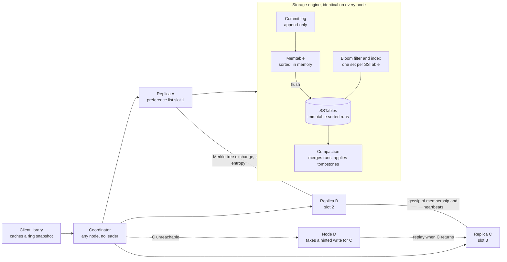

# Design a distributed key-value store

*Dynamo, Cassandra, Riak, Voldemort. The one problem in this set with no product
to hide behind. Every answer is a distributed systems primitive, named out loud
and defended — which is exactly why it is asked.*

---

## 1. Requirements

**Functional**
- `get(key)` → the value, or the set of conflicting values
- `put(key, value)` → durable
- `delete(key)`
- Keys and values are opaque bytes. Values are capped at ~1 MB

**Out of scope** (say so, and say why): range scans, secondary indexes,
multi-key transactions, joins, a query language. That is not modesty — each one
of them would change the partitioning decision, and partitioning is the first
thing you commit to. Scope them out *before* you commit, not after.

**Non-functional**
- **Always writable.** A write must succeed while a node is down or a link is
  partitioned. This is the [AP choice](../fundamentals.md), it is the single
  requirement that decides everything downstream, and it is worth making the
  interviewer confirm it.
- p99 under ~10 ms for both `get` and `put`, within one datacentre
- **Incremental scalability** — add one node, not double the cluster
- **Symmetry.** No leader, no config master, no special node. Every node runs
  the same code and can answer any request
- Durability: an acknowledged write survives losing a node, and a rack
- **Tunable per operation.** The caller chooses latency against staleness

**What that list already decided.** "Always writable" rules out a single leader,
because a leader is a write outage waiting for a failover. "No special node"
rules out a central directory of which node holds what. Between them you are
left with a ring, leaderless replication, and a conflict problem you now have to
solve rather than avoid. Everything below is the consequence.

## 2. Estimation

Two independent sizings. Do both, because they disagree, and the disagreement is
the interesting part.

**Capacity.** Assume 10 billion keys at a 1 KB average value — a plausible
session/profile/cart store:

```
  logical data          10B × 1 KB        = 10 TB
  replicated at N = 3   10 TB × 3         = 30 TB
  nodes at 2 TB usable  30 TB / 2 TB      = ~15 nodes      ← disk says 15
```

**Request rate.** Assume 1 billion writes and 10 billion reads a day, a 10:1
read-heavy shape:

```
  writes   1B  / 100k sec   = 10,000/sec     peak 3× = 30,000/sec
  reads    10B / 100k sec   = 100,000/sec    peak 3× = 300,000/sec
```

Those are client operations. The cluster does not see client operations, it sees
*internal* operations, and replication multiplies them by N:

```
  internal reads   300,000 × N=3   = 900,000/sec
  internal writes   30,000 × N=3   =  90,000/sec
```

Using [the framework's planning number](../framework.md) of ~10k cached
reads/sec per node — an LSM point read served from page cache is in that family:

```
  nodes by read rate    900k / 10k        = ~90 nodes      ← reads say 90
```

**Disk says 15, reads say 90, and the larger number wins.** Six times the
hardware, and the reason is the one line most people skip: *replication
multiplies your read load by N.* Fan-out sizes this cluster, not the dataset.

The follow-on numbers all come from the 90:

```
  disk used per node    30 TB / 90                 = ~350 GB    (disk sits idle)
  writes per node       90,000 / 90                = ~1,000/sec (trivial for an LSM)
  keys per node         10B × 3 / 90               = ~330M
  bloom filter memory   330M × 10 bits             = ~420 MB per node
  ring tokens           90 nodes × 256 vnodes      = ~23,000
```

Three things fall straight out of that:

**You are buying RAM and IOPS, not capacity.** 350 GB used on a 2 TB disk. The
lever worth pulling is anything that reduces read fan-out — contacting R=2
replicas instead of all 3, with the third as a speculative retry, takes 900k
internal reads down to 600k and the cluster from 90 nodes to 60. That is a
third of the hardware bill for one configuration change.

**Bloom filters have a real memory cost.** 420 MB per node is not free, and it
scales linearly with key count. It is also a tunable: moving the false-positive
rate from 1% to 5% roughly halves it, at the cost of a few more disk seeks.

**Rebuild time is a vnode argument, not a load-balance argument.** Replacing a
node means restoring ~350 GB:

```
  from one source at 200 MB/s     350 GB / 200 MB/s   = ~30 minutes
  from ~90 sources in parallel                        = minutes
```

Virtual nodes are usually sold as "the ring is less lumpy". The number that
actually matters is that they make a rebuild a parallel stream from every peer
instead of a serial copy from one.

## 3. High-level design



Every box in that diagram is the same binary. There is no tier, no master, and
no component whose loss is special — which is the design goal restated as a
picture.

**API**

```
get(key, R?)                  → { value | [siblings], context }
put(key, context, value, W?)  → ok
delete(key, context)          → ok   (writes a tombstone, not a removal)
```

**`context` is the whole API.** It is an opaque token the client received from
its last read and hands back on the next write. Inside it is the version
information — the vector clock. Without it the store cannot distinguish "I am
updating the value I just read" from "I am overwriting whatever is there
blindly", and those two need different answers. Making the client carry causality
is what buys conflict *detection* instead of conflict *guessing*.

**`R` and `W` are per operation, not per cluster.** A session write can be W=1
and a cart write W=2, in the same store, at the same time. That is the tunability
requirement made concrete.

**Data model**

```
key          hashed to a 128-bit token, which is its position on the ring
value        opaque bytes, ≤ 1 MB
vector clock [(nodeId, counter), …]   capped at ~10 entries
tombstone    flag + timestamp, for deletes
```

On disk, per node:

```
commit log   append-only, one per node; the fsync policy is the durability knob
memtable     sorted map, in memory, one per table
SSTable      immutable sorted run + index + bloom filter + min/max key
```

**The access pattern that justifies all of it:** the only operation is a point
lookup by key. That is why [hash partitioning](../fundamentals.md) costs nothing
here — there are no range scans to preserve, so the one real drawback of hashing
does not apply. It is also why an LSM tree fits: writes are blind appends and
reads are single-key probes that a bloom filter can answer negatively for free.

Worth saying out loud: Cassandra's model is *not* this. Its partition key groups
a clustered, ordered set of rows, so ordering within a partition matters and
range scans inside one are the point. Knowing where the two diverge is a better
signal than reciting either.

## 4. Deep dive: partitioning

[Consistent hashing](../fundamentals.md) covers the ring and why virtual nodes
exist. Four things it does not cover, all of which bite in practice.

### The preference list must skip duplicates

Hash the key to a token, walk clockwise, take the first N nodes. Except with 256
vnodes per physical node, the next three tokens clockwise can easily belong to
the *same physical machine*. You configured N=3 and you have one copy. The node
dies and the key is gone.

So the walk collects the first N **distinct physical nodes**, skipping any vnode
whose owner is already on the list. Then extend the same rule outward: distinct
rack, then distinct availability zone. Otherwise one rack losing power takes all
three replicas, and your "survives a rack failure" requirement was never true.

That list of nodes — ordered, deduplicated, rack-aware — is the **preference
list**, and it is the unit everything else in this design refers to.

### Token assignment: three strategies, and only one is operable

| Strategy | How | Why it matters |
|---|---|---|
| **T random tokens per node, ranges defined by tokens** | each node picks T random positions; the range is whatever sits between neighbouring tokens | ranges are variable and change shape whenever anyone joins or leaves |
| **T random tokens per node, fixed equal partitions** | the hash space is cut into Q equal partitions up front; tokens only decide who owns which | ranges are now stable; token placement is still random |
| **Q/S tokens per node, fixed equal partitions** | Q partitions total, S nodes, each node owns exactly Q/S of them | a membership change moves whole partitions between nodes |

The third is the one to argue for, and the reason is not load balance.

**Variable ranges break Merkle trees.** A Merkle tree (§8) is built over a key
range. Change the range and the tree is invalid and must be rebuilt by reading
the whole range off disk — which happens precisely when a node has just joined
or left and the cluster is already saturated streaming data. With fixed
partitions, a partition moves as a unit and its tree moves with it.

The cost, stated honestly: you pick Q up front and you live with it, because
changing Q rehashes everything. Over-provision it — Q should be large enough
that Q/S is still a sensible number at ten times your current node count.

### Routing is zero-hop

Every node learns the full ring through gossip, so any node can be a coordinator
for any key. A ring-aware client library caches that map and sends the request
straight to a node in the preference list, which removes the forwarding hop from
the p99.

The cost is a new failure mode: a stale client ring routes to a node that no
longer owns the key. The node forwards it anyway and tells the client its ring
is old; the client refreshes. Correct but slower, which is the right way to be
wrong.

### What consistent hashing does not solve

It distributes keys evenly. It does nothing about one key being hot, because
every replica of one key is by definition the same three nodes. That problem is
real and it is handled elsewhere — see the bottlenecks table.

## 5. Deep dive: replication and quorums

Three numbers. `N` replicas per key, `W` acks required for a write to succeed,
`R` responses required for a read.

### What R + W > N actually guarantees

The read set and the write set have more than N members between them, so they
must intersect in at least one node. Therefore a read is guaranteed to **touch a
node that holds the most recent successfully acknowledged write**.

That is the entire guarantee. It is worth saying in exactly those words, because
what people hear is "strong consistency", and it is not that. Here is what it
does not give you:

**1. It is not linearizability.** There is no consensus and no ordering
authority. Two clients writing the same key concurrently both succeed, and the
read finds two versions. The overlap tells you a conflict *exists*. It does not
tell you which one should win — nothing in the quorum can, because there is no
fact of the matter about which came first.

**2. Sloppy quorum voids it completely.** The intersection argument assumes the W
acks came from the preference list. Under sloppy quorum (§7) they may come from
hinted nodes that are not replicas for this key at all. R + W > N remains
arithmetically true and semantically empty. This is the most important caveat in
the whole design and it is the one candidates skip.

**3. A failed write is not rolled back.** A `put` that collected W-1 acks
returns an error to the client — and those W-1 writes are durable. A later read
can find that value, and read repair will happily propagate it to the rest.
"The write failed" and "the value is not stored" are different statements. Any
client that treats an error as "it did not happen" is wrong.

**4. Read-your-writes is not implied.** It holds only if the write actually
returned success, the quorum was strict, and nothing intervened. Two of those
three are things you cannot check from the client.

**5. Monotonic reads are not implied.** Two successive reads with R=2 can hit
different pairs of replicas and go *backwards* in time, until repair converges
them.

### Picking the numbers

| N | W | R | What you bought | What it costs |
|---|---|---|---|---|
| 3 | 2 | 2 | overlap, and one node may be down on either path | two round trips on both paths |
| 3 | 3 | 1 | the fastest possible read | any node down blocks every write — the direct opposite of "always writable" |
| 3 | 1 | 3 | the fastest possible write, always available | a read fails if any replica is down |
| 3 | 2 | 1 | fast reads, reasonably durable writes | no overlap; very common in practice, so be honest that it is eventually consistent |
| 3 | 1 | 1 | lowest latency in both directions | no overlap at all; a cache with durability |

**N=3, W=2, R=2 is the default and you should say so**, then say what would move
you. A write-heavy path that tolerates staleness moves to W=1. A read path that
must not be wrong moves to R=3.

**The latency argument for W=2 that nobody makes.** Waiting for the W-th ack
means your latency is the W-th fastest response, not the slowest. W=2 of 3
ignores the slowest replica by construction — one node in GC, one node behind a
degraded switch, and you never see it. W=3 waits for it every single time. A
quorum is a built-in tail-latency hedge, and that is a separate benefit from the
consistency one.

## 6. Deep dive: conflict detection

This is where the AP choice comes due. You said writes always succeed, so two
writes to one key will succeed concurrently, and now you own the result.

### Why last-write-wins loses data

LWW attaches a wall-clock timestamp to each write and keeps the larger one.
Three problems, in increasing order of how much they will hurt you.

**Clock skew decides your data.** NTP-synced hosts sit within a few milliseconds
of each other on a good day, and drift much further after a VM pause, under CPU
starvation, or when NTP itself is unreachable. The write that "wins" is the one
whose coordinator's clock is ahead, which has no relationship to which one
happened later. A node running five seconds fast wins every race it enters until
somebody notices. A node running five seconds slow silently loses every write it
accepts.

**It overwrites the whole object.** Two users add different items to the same
shared cart, at the same moment, through different coordinators. LWW keeps one
object and discards the other. An item the user added, and saw confirmed,
vanishes.

**It is silent.** There is no sibling, no conflict metric, no log line, no
counter you could have alerted on. The loss is indistinguishable from the write
never happening. You find out from a support ticket, weeks later, with no way to
reconstruct what was lost.

Cassandra softens the second problem by applying LWW at the **cell** level rather
than the row level, so concurrent writes to different columns both survive. That
is a genuine improvement and worth naming, because it is the version most people
have actually operated. It does nothing about the first or third.

### Vector clocks

A vector clock is a list of `(nodeId, counter)` pairs carried with the value. The
coordinator handling a write increments its own entry.

Comparison has exactly two outcomes:

- Clock A **descends** clock B if every counter in B has a counterpart in A that
  is greater or equal. A is causally newer; B can be discarded safely.
- Otherwise the two are **concurrent**. There is no causal order between them,
  so there is no correct automatic winner. Keep both as **siblings**.

A worked cart, with three coordinators:

```
put by Sx                  → clock [(Sx,1)]              value {book}
read, put by Sx            → clock [(Sx,2)]              value {book, pen}
read at [(Sx,2)], put Sy   → clock [(Sx,2),(Sy,1)]       value {book, pen, lamp}
read at [(Sx,2)], put Sz   → clock [(Sx,2),(Sz,1)]       value {book, pen, mug}
```

The last two are concurrent: Sy's clock has no Sz entry and Sz's has no Sy entry,
so neither descends the other. The next `get` returns both values plus a merged
context `[(Sx,2),(Sy,1),(Sz,1)]`. The client merges — for a cart, a union — and
writes back with that context, which descends both siblings and collapses them.

**The value a vector clock adds is that it knows when it does not know.** LWW
answers every question, including the ones with no correct answer. A vector clock
refuses those and hands them to the only layer that can decide: the application,
which knows that carts union and a "last seen page" does not.

### The costs, stated properly

**Reconciliation is application code, and it has to exist.** Union works for a
cart. There is no correct merge for a bank balance, which is the honest reason
you do not build a ledger on this. If the application will not write a merge
function, vector clocks are strictly worse than LWW — you get siblings that
nobody resolves, and they accumulate.

**Cart union has its own known bug.** Removing an item does not survive a union
with a sibling that still contains it, so deleted items reappear. Dynamo shipped
with this, knowingly, because a resurrected item in a cart is a smaller product
failure than a missing one. Naming that specific bug is the difference between
having read about vector clocks and having thought about them.

**Clock size grows.** Every new coordinator that touches a key adds an entry.
Cap it — keep the ~10 most recent entries, each with a timestamp, and drop the
oldest. Truncation can make two causally-ordered clocks look concurrent,
producing a false sibling. That is a spurious merge rather than a lost write,
which is the correct direction to be wrong in.

### The modern move: CRDTs

If the merge function is associative, commutative and idempotent, the *store* can
reconcile without waking the application: a grow-only counter, an observed-remove
set, an LWW register with explicit tie-breaking. Riak shipped these as first-class
types, and an OR-Set fixes the cart-delete bug properly rather than accepting it.

The trade is that you stop storing opaque bytes. The store now has to understand
the type, which means a schema, a type registry and a migration story — three
things this design was specifically built to avoid. Offer it as the upgrade path,
not the starting point.

## 7. Deep dive: hinted handoff and sloppy quorum

Temporary failure is the normal case, not the exception. A node restarts, a GC
pause runs long, a switch drops packets for eight seconds. None of those are
membership changes and none of them should move data.

A strict quorum handles them badly: one preference-list node down, W=2 becomes
unreachable, the write fails. That contradicts "always writable" directly.

**Sloppy quorum** walks *past* the first N nodes on the ring to the next healthy
ones, so it still collects N acks. The stand-in stores the value with a **hint**
in its metadata: *this belongs to node C*. A background scanner watches gossip;
when C returns, it replays the hints to C and deletes its local copies.

The mechanism is simple. The operational traps are where the answer lives.

**Hints expire, and the expiry must be set against the repair schedule.** Beyond
the window — typically hours — hints are dropped and the only remaining path to
convergence is anti-entropy. If hints expire after 3 hours and repair runs
weekly, you have a six-day window of undetected divergence that nobody chose.
Those two numbers are one decision, not two.

**The hint load lands on the healthy neighbours.** One node down during peak means
its neighbours are absorbing their own writes plus the hints, on their own disks.
A long outage turns a single-node failure into a disk-full second-order failure.
Cap hint storage per node and shed beyond the cap.

**Recovery is a thundering herd.** Node C comes back and is immediately hit with
hours of accumulated hints on top of its normal traffic, while its caches are
cold. Throttle the replay, and do not let a node take reads until it has caught
up — though it should take writes immediately, because a write it cannot yet
serve is still durable.

**And say the big one:** sloppy quorum is what actually delivers the availability
requirement, and it is also what voids R + W > N. Take the trade. State the cost.

## 8. Deep dive: anti-entropy with Merkle trees

Hinted handoff covers short outages. A node down past the hint window, a dropped
hint, a disk that silently corrupted a block — those leave replicas permanently
divergent, and something has to find it.

The naive comparison is to exchange every key and its hash. At ~330M keys per
node that is not something you run on a schedule.

**A Merkle tree** is a hash tree over a key range. Leaves hash individual keys or
small buckets of them; each parent hashes its children; the root is one value
that summarises the entire range.

Two replicas of the same range compare like this:

1. Exchange roots. Equal means the ranges are byte-identical, proved with one
   hash and one round trip. **This is the common case**, and it costs O(1).
2. Unequal: exchange the root's children, and descend only into subtrees whose
   hashes differ.
3. At the leaves, exchange the actual keys in the differing buckets and resolve
   each by vector clock.

Cost is proportional to the number of *differences*, not the number of keys.
Divergence is normally tiny, so the whole thing is nearly free — which is what
makes running it continuously affordable.

Four things to name:

**The tree is scoped to a key range, so a range change invalidates it.** This is
the direct payoff of fixed partitions from §4. With variable token-defined
ranges, every join or leave forces affected nodes to rebuild trees by reading
their whole range from disk, exactly when the cluster is already streaming data
and has no I/O to spare.

**Building a tree reads the range from disk.** Schedule it, rate-limit it, and
never run it on all replicas of a range simultaneously — you will take the range
offline for live traffic while proving it is fine.

**Leaf granularity is a real trade.** One key per leaf gives a precise diff and an
enormous tree. A thousand keys per leaf gives a compact tree, and one differing
key makes you ship a thousand.

**A tree proves the ranges differ. It does not say which side is right.** That is
the vector clock's job, per key, after the tree has narrowed the search.

## 9. Deep dive: membership and failure detection

Two events that look alike and must be handled completely differently:

- **A node is unreachable.** Temporary. Route around it, use hinted handoff,
  move no data.
- **A node is added or permanently removed.** Move data.

**Conflating them is the classic outage.** A node takes a 30-second GC pause,
the cluster declares it dead, the ring rebalances, terabytes start moving, the
node comes back healthy, and the ring rebalances again — all triggered by a
pause the node itself recovered from. Dynamo's answer was to make join and leave
an **explicit administrative action**, never inferred from a timeout. Cassandra
keeps both: gossip-driven failure detection for *routing* decisions, explicit
`decommission` and `removenode` for *membership* decisions. That split is the
answer, and it is worth stating as a principle: detection may be automatic,
rebalancing may not.

**Gossip.** Once a second, every node picks a random peer and exchanges its view
of the world: the member list, each member's tokens, and a heartbeat counter with
a version per member. Merge by keeping the higher version. It converges in
O(log N) rounds — for 90 nodes, a few seconds. There is no config server to fail
over, and the protocol behaves the same at 10 nodes and at 1,000. That is the
"no special node" requirement delivered.

**Failure detection: phi accrual, not a fixed timeout.** A fixed timeout forces a
binary answer out of a guessed constant. Set it low and a GC pause is death; set
it high and you route to a corpse for a minute. Phi accrual keeps a sliding
window of heartbeat inter-arrival times, fits a distribution to them, and outputs
a continuous suspicion level — roughly, how improbable this silence would be if
the node were alive. Each caller picks its own threshold against that number.

The point is that it calibrates itself to the network it is on. A link that
normally delivers in 1 ms and one that normally delivers in 80 ms end up with
very different effective timeouts, with nobody tuning anything.

**Seed nodes.** A new node needs somebody to gossip with first. Seeds are a small
static list and are not otherwise special. Get the list wrong — two groups each
seeded only from within themselves — and you can logically partition a cluster
that is physically fine: two rings that each converge internally and never meet.

## 10. Deep dive: the write path and the read path

### The write path

1. The client hashes the key and picks a coordinator. A ring-aware client picks a
   node already in the preference list, which is the zero-hop case; otherwise any
   node takes it and forwards.
2. The coordinator computes the preference list from its ring view.
3. It takes the `context` the client supplied, increments its own counter in the
   vector clock, and stamps the new version.
4. It writes locally and sends to the other N-1 replicas in parallel. Any
   unreachable replica is replaced by a hinted stand-in.
5. It returns success on the W-th ack, counting its own.

On each replica, the local write is two steps and no seeks:

1. **Append to the commit log**, fsync per policy. This is the durability
   boundary — everything after this point is recoverable after a crash.
2. **Insert into the memtable**, a sorted in-memory structure. Return.

That is why an LSM write is fast: one sequential append and one memory insert.
There is no read-modify-write of a disk page, which is what a B-tree does on
every update, and it is the entire reason a single node can absorb tens of
thousands of writes a second.

When the memtable crosses a size threshold it is **flushed** to an immutable
**SSTable** — a sorted run written out sequentially, with an index, a bloom
filter and min/max keys beside it. The corresponding commit log segment can then
be discarded.

### The read path

1. The coordinator sends the read to R replicas, picking the ones with the best
   recent latency, and holds the rest as speculative retries if those time out.
2. It collects R responses and compares their vector clocks.
3. If one version descends all the others, return it. If two or more are
   concurrent, return all of them with a merged context and let the client
   reconcile.
4. **Read repair:** *after* responding, push the reconciled version to any
   replica that was behind. The response leaves first. Repair is never in the
   latency path.

On each replica, the local read is a merge across everything that might hold the
key:

1. Check the memtable.
2. For each SSTable, newest first, ask its **bloom filter**. A negative is
   definitive — skip that file with zero disk I/O. A positive may be a false
   positive, so continue.
3. Consult the index — usually a summary index in memory pointing into a full
   index on disk — seek to the block, read it.
4. Merge everything found and pick the winner by version.

**Read amplification is the LSM tax.** A key can live in any number of SSTables
and you must look in all of them. Bloom filters eliminate the misses cheaply.
Compaction reduces how many files there are to miss in.

### Compaction

Compaction merges SSTables, discards superseded versions, and applies tombstones.
It is background I/O that competes directly with live traffic, and tuning it is
most of what operating one of these systems consists of.

| Strategy | How | Good | Bad |
|---|---|---|---|
| **Size-tiered** | merge SSTables of similar size together | cheap writes, few merge passes | high read amplification; compacting the largest tier needs free space equal to the data being merged |
| **Levelled** | fixed-size files in levels, each ~10× the last, non-overlapping within a level | a read touches roughly one file per level; bounded space overhead | much higher write amplification |

Size-tiered for write-heavy, levelled for read-heavy. The estimate above is 10:1
read-heavy, so this workload wants levelled — and that is a decision the
arithmetic made, not a preference.

### Deletes, and data coming back from the dead

An SSTable is immutable, so a delete cannot remove anything. It writes a
**tombstone**: a marker with a timestamp that shadows every older version of the
key. The tombstone is only discarded during compaction, after a grace period.

That grace period is where the trap lives. Suppose node C is down when a key is
deleted. A and B write tombstones. Compaction on A and B eventually drops the
tombstones, because they are old. C comes back holding the original live value —
and to anti-entropy, a live value on one side and *nothing at all* on the other
looks like C is ahead. The row resurrects, everywhere.

**The rule: the tombstone grace period must exceed the longest a node can be down
and still be allowed to rejoin.** Anything down longer than that must be wiped and
rebuilt from its replicas rather than rejoined. That is an operational procedure,
written down, with the two numbers cross-referenced — and volunteering it is a
strong signal, because it is the kind of thing you only know if you have had it
happen.

**The second tombstone trap:** they accumulate, and reads must scan through them.
A delete-heavy workload degrades reads until compaction catches up. If what you
are actually building is a queue, an LSM key-value store is the wrong shape and
no amount of tuning fixes it.

## 11. Bottlenecks and how you scale past them

| What saturates | Symptom | What you do |
|---|---|---|
| **Read fan-out** | per-node read rate climbs with N while the dataset does not move | this is what sized the cluster. Drop to R=2 with a speculative third, cache the hot set in front, and resist any proposal to raise N |
| **A hot key** | one key takes a disproportionate share; more vnodes change nothing, because every replica of one key is the same three nodes | outside what consistent hashing can fix. Cache it separately, or shard the key in the application by appending a bucket suffix and reading all buckets. See [hot keys](../fundamentals.md) |
| **Compaction I/O** | write latency spikes correlated with flushes; SSTable count climbing | the leading indicator is pending compactions, not latency — latency is the lagging signal. Throttle compaction, and give the commit log its own device |
| **Bloom filter and index memory** | ~420 MB per node here, growing linearly with keys | it is a tunable false-positive rate. 1% → 5% roughly halves the memory for a few more seeks |
| **Hint storage during an outage** | neighbours' disks filling while one node is down | cap hints per node, drop past the cap, and let anti-entropy clean up what was dropped |
| **Anti-entropy** | repair reads whole ranges from disk and competes with live traffic | rate-limit it, stagger it per range, and never run all replicas of a range at once |
| **Large values** | 1 MB values make the 1 KB arithmetic wrong by three orders of magnitude, on every replica | cap value size, put the bytes in blob storage, and keep only the key here |
| **Cross-region** | 150 ms each way makes a quorum spanning regions unusable | keep quorums inside a region — N=3 locally, asynchronous replication between regions, cross-region consistency is eventual. A cross-region strict quorum is a latency promise you cannot keep |

**What breaks first at 10×:** the per-node read rate, then compaction. Both trace
back to the same line in the estimate — replication multiplies reads by N, and a
read-heavy LSM spends its remaining I/O budget keeping the SSTable count down.

**What you monitor:** the read-repair rate and the fraction of reads returning
siblings. Both should sit near zero in steady state, both rise the moment
replicas start diverging, and neither requires running a repair to observe.

## Tradeoffs to volunteer

**Leaderless over single-leader.** The case for a leader is strong and you should
make it before dismissing it: one writer per key gives a total order per key,
which means no vector clocks, no siblings, no reconciliation code in every
client, and read-your-writes for free. Raft with a leader per shard is what most
systems should actually use. It is rejected here only because "always writable"
was a stated requirement, and a leader is an availability hole with a failover
window attached. Flip that requirement to "never serve stale data" and the whole
design flips with it.

**Vector clocks over LWW.** LWW's case: no siblings, no client-side merge
function, no metadata growth, one fewer concept in the API — and Cassandra chose
it and is enormously successful. Rejected because the failure mode is *silent*
data loss, and silence is what makes it expensive. But the condition matters: if
the application cannot write a sensible merge function, vector clocks are worse
than LWW, because unresolved siblings accumulate forever.

**Hash partitioning over range.** Range partitioning buys cheap range scans,
which this API does not have, and costs hotspots, which it cannot afford. The
trigger to revisit is the first range-scan requirement — at which point
partitioning is no longer a free decision.

**LSM over B-tree.** The B-tree case: predictable read cost, no compaction to
tune, no tombstone lifecycle, no read amplification. Rejected because an LSM
write is a sequential append where a B-tree write is a random page update, and
that difference is what lets one node take tens of thousands of writes a second.
Worth noting against yourself: this workload is 10:1 read-heavy, so if it were
write-once-read-many, the B-tree would be simpler and nobody would have to learn
what `gc_grace` means.

**Sloppy quorum over strict.** Sloppy is what actually delivers the availability
requirement. It costs the R + W > N guarantee, which most people believe they
still have. Take the trade and say the cost in the same sentence.

**Fixed partitions over random tokens.** Random tokens are what every ring diagram
shows. Fixed partitions are strictly better to operate: bootstrap moves whole
partitions, Merkle trees survive membership changes, and archiving a partition is
a file copy. The cost is choosing Q up front and never changing it.

## Follow-up questions

**How do I get read-your-writes?** Not from R + W > N alone. Either pin the client
to one coordinator for the session and use a strict quorum for that key, or have
the client keep the context it got back from its write and reject any read whose
clock does not descend it — which turns a consistency problem into a retry.

**Atomic counters?** Do not build them on read-modify-write over this store: two
concurrent increments read the same value and one increment disappears. Use a
CRDT counter — per-node sub-counters, take the max per node on merge, sum on read
— or move counters to something with a leader.

**Compare-and-set?** That needs consensus. Bolt a Paxos or Raft round onto the
keys that require it; Cassandra's lightweight transactions are exactly this, at
roughly four round trips instead of one. Use them for the 1% of operations that
need them and never as the default.

**Multi-key transactions?** Out of scope by construction. Keys are independently
partitioned, so any transaction is a distributed one, which needs two-phase
commit, which needs a coordinator — the leader this design specifically removed.

**How does a new node bootstrap?** It is assigned tokens, gossips its arrival, and
streams the ranges it now owns from the current owners. It accepts writes
immediately but serves reads only once streaming completes. That asymmetry is
deliberate: a write it cannot yet serve is still durable, whereas a read it
cannot yet serve is wrong.

**Rebalancing after a permanent removal?** Its ranges pass to the next nodes
clockwise, which stream from the surviving replicas. With vnodes those sources
are spread across the whole cluster, which is why the rebuild is minutes rather
than the half hour a single source would take.

**Multi-region?** N=3 within each region with local quorums, plus asynchronous
replication between regions. The cross-region link produces genuinely concurrent
writes, which is precisely the case vector clocks exist for. Do not stretch a
quorum across regions; 150 ms per round trip destroys the p99 budget you set in
the requirements.

**What if a value is much larger than 1 MB?** Cap it and store the bytes in blob
storage with the key here. Otherwise one large hot value multiplies your network
fan-out by N on every write, and the capacity arithmetic above is wrong by three
orders of magnitude.

**How would you test any of this?** Deterministic fault injection — kill nodes,
partition the network, skew clocks deliberately — plus a checker that records the
real history of operations and asks whether that history is explicable under the
consistency model you claim. Quorum bugs need a partition *and* a specific
interleaving to show up, so they will not appear under load testing, and they
will appear in production.
