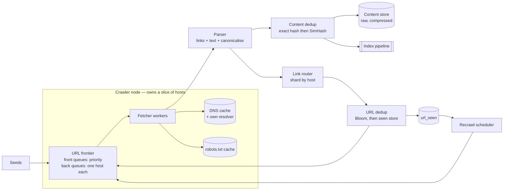
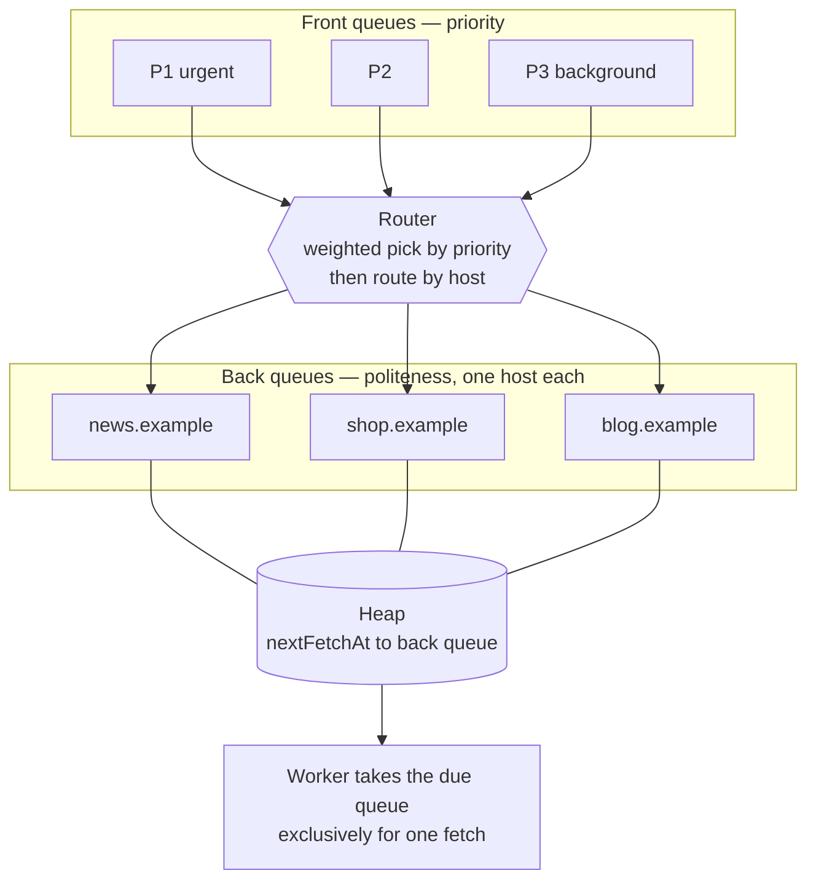

# Design a web crawler

*Googlebot, Bingbot, the Internet Archive, and every "we need our own index"
project. The only problem in this set where throughput, not latency, is the
metric — and where the thing stopping you going faster is not your hardware.*

---

## 1. Requirements

**Functional**
- Take a seed list of URLs and fetch them
- Extract links from each fetched page and queue the new ones
- Store the raw content for a downstream indexing pipeline
- Never fetch the same page twice by accident
- Obey each site's crawl rules
- Come back later: pages change, and a stale corpus is a broken product
- Survive a restart without re-crawling the web

**Out of scope** (say so): the index and the ranking on top of it, full-text
search, focused or topical crawling, login-walled content, media extraction
beyond a stub.

**JavaScript rendering gets one sentence and then parks.** A headless render is
roughly 10–50× the CPU of an HTTP fetch plus an HTML parse, so it cannot live in
the main fetch loop. It is a second tier: a classifier decides "this page's
useful content is not in the HTML", and those URLs go to a small, separately
budgeted render farm. Saying that shows you know it exists and know why it is
not in the hot path.

**Non-functional**
- **Throughput is the requirement.** Nobody is waiting on a response. The p99 of
  a single fetch does not matter; sustained pages per second does. Every other
  problem in this set is latency-shaped, and this one is not — say that out loud,
  because it changes which parts of the design you are allowed to make slow.
- **Politeness is a hard constraint, not a courtesy.** Hit one host too hard and
  you get rate-limited, then IP-banned, then legal mail. A banned crawler has a
  throughput of zero, so politeness is a *throughput* requirement wearing a
  manners costume.
- **The input is adversarial and malformed by construction.** Every assumption
  your parser makes will be violated, sometimes deliberately. Robustness is not
  a nice-to-have here; it is most of the code.
- **Freshness.** The corpus rots. A crawler that only ever crawls forward builds
  a museum.
- **Durability, but selectively.** The frontier and the seen-set must survive a
  crash — losing them means re-crawling the web. The content store can lose a
  page; you re-fetch it.
- **Extensibility.** New content types, new politeness rules, new priority
  signals. The dumbest version of this is a hard-coded loop, and it is why most
  hand-rolled crawlers die.

## 2. Estimation

Target: a corpus of **10 billion pages, refreshed monthly.**

```
month ≈ 30 days × 100k sec       = 3,000,000 sec
  fetch rate   10B / 3M sec      = ~3,300 pages/sec    → call it 3,000/sec
  peak         2×                = ~6,000/sec
```

**Bandwidth**, at ~100 KB of HTML on the wire per page:

```
  3,000 × 100 KB   = 300 MB/sec   = ~2.4 Gbps sustained
  per month        = ~900 TB in
```

That is the real money. Compute is cheap here; a sustained 2.4 Gbps of egress
and transit is not.

**Storage**, compressing HTML ~5:1 to ~20 KB per page:

```
  10B × 20 KB   = 200 TB per full corpus
```

**The URL space is much larger than the page count.** A page carries on the
order of 100 links, and almost all of them point at things you have seen:

```
  link instances   10B pages × 100   = 1 trillion per month
                   1T / 3M sec       = ~330,000 dedup checks/sec
  unique URLs ever seen              ≈ 100 billion   (10× what you crawl —
                                       the rest is junk, traps, and pages you
                                       chose not to spend budget on)
```

**330,000 dedup checks/sec against a set of 100 billion is the number that
decides the design.** At a 100 µs [random read](../fundamentals.md) each, you
would need 33,000 reads permanently in flight just to answer "have I seen this?"
That is the whole argument for a Bloom filter, and it came from arithmetic.

**Now the number that surprises people.** Politeness says one request per host
every 2 seconds, and a fetch takes ~0.5 s, so a single host yields one page
every 2.5 seconds:

```
  pages/sec per host    1 / 2.5          = 0.4
  hosts needed          3,000 / 0.4      = ~7,500 hosts in rotation
  concurrent sockets    3,000 × 0.5 s    = ~1,500 in flight
```

**Throughput is bounded by host diversity, not by machines.**
`throughput = Σ over hosts of (1 / delay_host)`. If your frontier only knows
1,000 hosts, you are capped at 400 pages/sec and buying servers changes nothing.
This is the least obvious constraint in the problem and the one worth saying
first.

Machines, for completeness: link extraction and parsing is ~20 ms of CPU per
page, so `3,000 × 20 ms = 60 CPU-seconds per second` — about 60 cores. Call it
20 nodes with headroom for the dedup and scheduling work. The crawl is not CPU
bound at this rate. It is bound by politeness and bandwidth.

## 3. High-level design



The loop is: frontier → fetch → parse → two independent dedup stages → back into
the frontier. The scheduler is a second producer into the frontier that competes
with discovery for the same budget, which is a fight you have to adjudicate
explicitly.

**API.** A crawler has no public API; what it has is internal service boundaries,
and those are where the design lives.

```
# Frontier
POST /frontier/urls       { urls: [{ url, priority, srcDocId, depth }] }  → 202
POST /frontier/lease      { workerId, n }  → [{ url, hostId, leaseId, expiresAt }]
POST /frontier/complete   { leaseId, httpStatus, fetchedAt, nextEligibleAt }

# Control plane
POST /seeds               { urls[], maxDepth, pageBudget }
GET  /hosts/{host}        → { crawlDelayMs, budgetRemaining, robotsFetchedAt,
                              errorRate, ip, nextFetchAt }
POST /hosts/{host}/pause  { untilAt, reason }
```

**Lease, not pop.** A worker that crashes mid-fetch must not lose the URL, so the
frontier hands out a lease with a deadline and re-offers it on expiry. This is
[at-least-once delivery](../fundamentals.md) and it has one crawler-specific
sting: **advance the host's politeness clock when the lease is issued, not when
it completes.** Get that backwards and a crash-looping worker retries the same
URL against the same poor server with no delay between attempts.

### Data model

```
url_seen      hash64(canonicalUrl) → firstSeen | lastCrawled | lastChangedAt
                                     changeCount | checkCount | httpStatus
                                     contentHash | priorityScore
frontier      per host: an on-disk append log of (priority, discoveredAt, url)
hosts         hostId → robotsBody | robotsFetchedAt | crawlDelayMs | ip
                       ipExpiresAt | pagesBudget | avgLatencyMs | errorStreak
content       contentHash → gzip(raw bytes)            write-once blob store
simhash_idx   permutation prefix → (simhash64, docId)  N tables, see §7
link_graph    (srcDocId, dstDocId)                     append-only
```

**`url_seen` is keyed by a 64-bit hash of the canonical URL, not by the URL.**
The URL text averages ~64 bytes and you have 100 billion of them; the hash is 8.
You never need to read the URL back out of this table — the frontier carries the
text — so the table is a pure existence-and-state lookup. `100B × 64 B ≈ 6.4 TB`
of state, which shards fine.

**Everything is sharded by `hash(host)`, not `hash(url)`.** This is the single
most load-bearing choice in the design and §4 explains why: it makes politeness
a local invariant instead of a distributed lock. The cost is that hosts are
Zipfian, so one shard can own a host with 100 million pages —
a [hot key](../fundamentals.md) you have to plan for.

**The frontier is per-host queues on disk, not one big table.** The access
pattern is "give me the next URL for host H", never "give me the next URL
globally", so the storage should match. Keeping the head of each queue in memory
and the tail on disk is what lets a 10-billion-entry frontier run on machines
with normal amounts of RAM.

**`content` is keyed by content hash, not by URL.** Ten URLs serving identical
bytes store one copy, and the content store becomes immutable and trivially
cacheable.

**Store raw HTML, not just the parse.** The parsed form is 10× smaller and it is
the wrong thing to keep, because every parser improvement would then require
re-crawling the web. Raw and compressed, re-parse offline.

## 4. Deep dive: the frontier

This is the problem. Everything else here is a supporting act.

The frontier has to satisfy two requirements that pull in opposite directions:

- **Priority.** Crawl the important pages first. You have a budget; spending it
  on a forum's pagination while a news site's front page goes stale is the
  failure mode.
- **Politeness.** Never have two workers on the same host at once, and leave a
  gap between consecutive requests to a host.

A single priority queue gives you the first and destroys the second: pop the top
1,000 URLs from a global priority queue and a large fraction of them will be the
same host, because that is what a well-linked site looks like. A single
per-host round-robin gives you the second and destroys the first.

**The resolution is two layers of queues, and a table that enforces an
invariant.**



**Front queues: one per priority band.** A URL is enqueued into the band its
score puts it in. The router picks a band by weighted random choice, not strict
priority — strict priority starves the low bands forever, and the low bands are
where your long-tail coverage lives.

**Back queues: one per host, and this is where the invariant lives.**

> Each back queue holds URLs for exactly one host, and each host maps to at most
> one back queue.

That sentence is the entire politeness guarantee. A worker takes a back queue
exclusively for the duration of one fetch. Two workers cannot be on the same
host, because two workers cannot hold the same back queue, because a host maps
to exactly one. **No locks, no coordination, no distributed anything — the
concurrency control is the data structure.** That is the insight worth saying
slowly.

**The heap schedules.** Each back queue has a `nextFetchAt`. A min-heap ordered
by that timestamp lets a worker pop the queue that is due soonest, sleep until
it is due, fetch, compute `nextFetchAt = now + delay(host)`, and push it back.

**How many back queues?** Enough that workers are never all sleeping on delays.
From the estimate, 3,000 pages/sec at 2.5 s per host per page needs ~7,500 hosts
in rotation, so provision a few times the worker count and keep them full —
typically a few thousand back queues per node. If back queues sit empty while
front queues are full of URLs for hosts that already own a queue, you are
throughput-starved and the fix is more host diversity, not more workers.

**The refill rule.** When a back queue drains, it is freed. The router then pulls
from the front queues until it finds a URL whose host does not already own a
back queue; that host claims the free slot. URLs for hosts that already have a
queue get appended to that queue instead. This is where the priority signal
actually gets applied — the moment a host is *admitted*, not the moment a URL is
discovered.

### Priority: what goes into the score

- **Host authority.** A crude PageRank over the link graph you are building,
  recomputed offline. Circular, and it works: good hosts link to good hosts.
- **Depth from the seed.** Not as a hard filter, as a decay. Depth 30 on a site
  is usually pagination or a trap.
- **Recrawl urgency.** From §9 — a page whose estimated change rate says it is
  due now outranks an unseen page of mediocre quality.
- **Sitemap `priority` and `lastmod`.** A hint from the site owner. Trust it
  loosely; it is attacker-controlled input.
- **Discovery breadth.** A URL linked from 50 distinct hosts is more interesting
  than one linked 50 times from one host. Count distinct source hosts, not
  links, or link farms will trivially promote themselves.

### Distributing the frontier

**Shard by `hash(registrable domain)` with
[consistent hashing](../fundamentals.md).** All URLs for a host land on one node,
so the back-queue invariant is enforced inside one process and the politeness
problem never becomes a distributed one.

Three consequences, all of which you should volunteer:

1. **Links must be shuffled.** A page fetched on node 7 links to hosts owned by
   node 12. So there is a link-router stage with a queue in front of it —
   naturally a partitioned [log](../fundamentals.md), keyed by host so ordering
   per host is preserved and the consumer is a simple sharded sink.
2. **All host-level state is local.** robots.txt cache, DNS entry, crawl delay,
   remaining budget, error streak — one owner, no replication, no cache
   coherence problem. This falls out of the sharding choice for free and it is a
   large simplification.
3. **Rebalancing is the one dangerous moment.** When a node joins or leaves,
   hosts move, and the new owner does not know when the old owner last fetched
   them. Bound it: **on taking over a host, wait one full crawl delay before the
   first fetch.** One line, and it closes the only window where the invariant
   could be violated.

### Persistence

The frontier is the expensive thing to lose. It is append-heavy and read-only at
the head, so per-host append-only files with an in-memory head, checkpointed
offsets, and a write-ahead log for the back-queue assignment table. On restart,
replay from the checkpoint. Re-fetching a few thousand URLs is fine; rebuilding
100 billion URLs of discovery state is not.

## 5. Deep dive: URL dedup at 100 billion

330,000 checks per second against a set of 100 billion entries, and the answer is
"seen" about 99% of the time. Two facts to design around: the set does not fit in
memory as exact data, and the common answer is the cheap one.

**Exact storage**, at an 8-byte key and ~56 bytes of value:

```
  100B × 64 B   = 6.4 TB     → a random read per check
```

**A Bloom filter over the same set**, at `1.44 × log2(1/p)` bits per entry:

```
  p = 1%     ~10 bits    100B × 10   = 1,000 Gbit = 125 GB
  p = 0.1%   ~14 bits    100B × 14   = 1,400 Gbit = 175 GB
```

Sharded by host across 20 nodes, that is **6–9 GB of RAM per node.** The exact
set is 320 GB per node on disk with a random read per check. The gap between
those two lines is the reason the Bloom filter exists.

### What a false positive actually costs

Get the direction right, because candidates routinely get it backwards.

- **"Not in the set"** is certain. The URL is new; enqueue it, no I/O.
- **"Probably in the set"** is where the error lives. A URL that is genuinely
  new gets reported as already seen, and you **silently never crawl that page.**

There is no error message, no retry, no metric that lights up. A page is simply
absent from your index for reasons nobody will ever be able to debug from the
outside. At steady state you discover ~10B genuinely new URLs a month:

```
  p = 1%     → 100,000,000 pages/month silently dropped
  p = 0.1%   →  10,000,000 pages/month silently dropped
```

**And the loss is permanent, not transient.** This is the part people miss. The
same URL, hashed by the same functions, sets the same bits and gets dropped
again next month, and the month after. It is not a 0.1% sampling error; it is a
deterministic 0.1% of the URL space that your crawler is structurally blind to.

**Two fixes, and use both.**

**Rebuild the filter with new hash seeds each cycle.** Rebuild from the
authoritative `url_seen` store, which — crucially — never contained the falsely
dropped URLs. New seeds mean a different 0.1% of the space is blind, so a page
missed this month is very likely caught next month. The blindness stops being
permanent and becomes a rotating sample.

**Verify the "probably seen" branch, but in batches.** Never as a point lookup:
that is 330k random reads/sec, which is exactly what you were avoiding. Instead
buffer the probably-seen hashes, and once the buffer is large, **sort it and
merge-sweep it against the sorted seen-store.** Random point lookups become one
sequential pass over 6.4 TB. This is the trick that makes exactness affordable,
and it is worth naming as a general move: when you have too many random reads,
delay them until you have enough to sort.

The cost of batching is latency in the discovery path — a new URL may sit for
minutes before it reaches the frontier. For a crawler that is free, because
nothing is waiting. Say that: it is the throughput-not-latency requirement from
§1 paying for itself.

### Watching the filter

A Bloom filter sized for 100B entries does not degrade gracefully past it. At 2×
the design load, a filter tuned to 1% drifts to roughly 14% — an order of
magnitude worse, and worse *silently*. **Monitor the fill ratio, not the entry
count,** and rebuild at a threshold. This is the crawler version of
[cache penetration](../fundamentals.md), with the failure pointed the other way.

### Canonicalisation comes first

None of this works if `HTTP://Example.com:80/a/./b?utm_source=x#frag` and
`https://example.com/a/b` hash differently. Before hashing:

- Lowercase scheme and host, punycode the host, strip the default port
- Resolve `.` and `..` segments, decode unreserved percent-escapes
- Drop the fragment entirely — it never reaches the server
- Strip known tracking parameters (`utm_*`, `fbclid`, `gclid`, session IDs)
- Normalise the empty path to `/`

**Canonicalisation is the highest-leverage dedup step and the most dangerous
one.** Every rule you add merges URLs, and a wrong rule merges two genuinely
different pages, permanently, with no way to notice. Sorting query parameters is
the classic trap — order is semantically meaningful on plenty of real sites. Be
aggressive about tracking parameters, which you can enumerate, and conservative
about anything general.

## 6. Deep dive: robots.txt and the politeness contract

**Cache it per host, TTL ~24 hours.** Without a cache you fetch robots.txt before
every page, which doubles your request count and doubles the load on every site
you crawl — the politeness mechanism becoming the politeness violation.

Four details that separate people who have run a crawler from people who have
read about one:

**The scope is scheme + host + port, not domain.** `https://x.example` and
`http://x.example` have separate files, and so does `x.example:8443`. Key the
cache accordingly.

**Cache the failures, and know what each one means.** 404 means allow
everything, and you must cache that negative result or you re-fetch a missing
file forever. A 5xx or a timeout means **treat the host as fully disallowed for a
period** — the spec's position, and the right one, because an unreachable rules
file is not permission. Candidates almost always default 5xx to "allow", which
is exactly wrong.

**Enforce at dequeue, not at discovery.** Rules change; a URL may sit in the
frontier for weeks. The check that counts is the one against the rules in force
at the moment of fetch.

**`Crawl-delay` is non-standard and you should honour it anyway,** clamped to a
sane ceiling so a hostile or careless `Crawl-delay: 86400` cannot pin a back
queue forever. The `Sitemap:` directive in the same file is a free discovery
channel — take it.

### Politeness by IP, not just by hostname

Shared hosting puts 50 hostnames on one server. Treating them as 50 independent
hosts at one request per 2 seconds means 25 requests/sec at a single machine that
is probably a small VPS, and you will be banned for behaviour that looked polite
at every individual layer.

**Key the back queue by resolved IP where hosts share one**, or at minimum
enforce a second, coarser rate limit per `/24`. The frontier is already
per-host; make the *delay* a function of the IP's observed load rather than the
hostname's.

### Adaptive delay

A fixed 2 s everywhere is unfair in both directions: too fast for a struggling
blog on shared hosting, absurdly slow for a large site that would happily serve
you 100 requests/sec. Make the delay a function of what the host is telling you:

- **Observed latency.** A standard move is `delay = k × lastResponseTime`. A
  server that slows down under your load automatically gets crawled less. It is
  a feedback loop that needs no configuration and no per-site tuning.
- **HTTP 429 and 503 with `Retry-After`** are explicit instructions. Obey them
  exactly, and back off exponentially per host on a streak of errors.
- **A per-host circuit breaker.** After N consecutive failures, park the host for
  hours. A dead host otherwise burns a back queue slot indefinitely, which costs
  you throughput as well as goodwill.
- **Identify yourself.** A `User-Agent` with a URL explaining who you are and how
  to complain. Sites block anonymous crawlers, and a blocked crawler is a slow
  crawler.

## 7. Deep dive: content dedup, and why exact hashing is not enough

**Exact dedup is the easy half.** SHA-256 the normalised body; identical bytes
collapse to one `contentHash`. That catches mirrors and multiple URLs serving the
same file, and it is cheap enough to do inline.

It catches almost nothing else. The same article with a rotated ad, a different
"related posts" block, a session ID echoed into the page, a `?sort=price`
variant of the same 200 products, a printer-friendly version — every one of
these is a distinct byte string and a duplicate page. Assume ~30% of the pages
you fetch are near-duplicates of something you already hold. At 10B pages a
month that is **3 billion pages of wasted storage, wasted index and wasted crawl
budget.**

### SimHash

A locality-sensitive hash: similar documents get *similar* fingerprints, which is
exactly the property a cryptographic hash is designed not to have.

1. Break the page into features — word shingles, after stripping boilerplate.
2. Hash each feature to 64 bits and weight it by frequency.
3. For each of the 64 bit positions, sum `+weight` where the feature's bit is 1
   and `-weight` where it is 0.
4. The fingerprint's bit is 1 where the sum is positive.

One document, 64 bits. Near-duplicates land within a **Hamming distance of about
3.**

**The lookup is the hard part, not the hash.** "Find any of 10 billion
fingerprints within 3 bits of this one" is not an index lookup — a brute-force
scan is 10B comparisons per page at 3,000 pages/sec.

**The unlock is the pigeonhole principle.** Split the 64 bits into 6 blocks. If
two fingerprints differ in at most 3 bits, then at most 3 blocks are dirty, so
**at least 3 blocks are bit-identical.** So: build one table per choice of 3
blocks — `C(6,3) = 20` tables — each keyed by those 3 blocks concatenated
(~32 bits) and sorted by that key. A query probes 20 tables for an exact 32-bit
match, and any true near-duplicate is guaranteed to be found by at least one of
them.

The arithmetic on the candidate set is the trade:

```
  20 tables, 32-bit key   10B / 2^32   = ~2 candidates per probe, 20 probes
   4 tables, 16-bit key   10B / 2^16   = ~150,000 candidates per probe
```

Four tables is a quarter of the memory and 600,000 Hamming comparisons per page,
which at 3,000 pages/sec is dead. Twenty tables is ~40 comparisons per page and
`10B × 16 B × 20 ≈ 3 TB`, sharded. **State it as the trade it is: table count
buys you candidate-set size, and you pick a point on that curve based on whether
RAM or CPU is scarcer.** Narrow it further for free by scoping candidates to a
content-length bucket first.

**Strip boilerplate before fingerprinting.** Navigation, footer and sidebar are
most of the bytes on a small page, and they are identical across a whole site —
fingerprint the raw HTML and every page on a site looks like a near-duplicate of
every other. Fingerprint the extracted main text.

## 8. Deep dive: crawl traps

A trap is a site that generates unbounded distinct URLs. Usually accidental,
sometimes not. The list is short and every one of them is real:

| Trap | What it looks like | What it costs |
|---|---|---|
| **Calendar** | `/events?month=2031-07`, with a "next month" link, forever | Infinite depth, all near-identical |
| **Faceted navigation** | `/shoes?color=red&size=9&sort=price&page=3` | 10 facets × 10 values is 10 billion URLs over 200 products |
| **Session IDs in the path** | `/s/8f3c2a/product/12` | A fresh universe of URLs per visit, including per crawl |
| **Path repetition** | `/a/b/a/b/a/b/…` from a bad relative link or a symlink loop | Unbounded depth on one physical page |
| **Soft 404** | HTTP 200 with a "page not found" body | Every wrong URL looks like a real page |
| **Link farms** | Thousands of hosts, densely interlinked, no content | Consumes host diversity, which is your scarcest resource |

**The defences layer, and the most important one is already in your design.**

**A per-host page budget, enforced by the frontier.** This is the answer that
matters. With per-host back queues and a budget attached to each host, a trap can
waste at most *that host's* budget and never the crawl. The blast radius is
bounded structurally rather than by detection, which means it works on traps you
have never seen. Scale the budget by host authority so a good site gets a big
budget and an unknown one gets a small one — and note that link farms attack
exactly this, which is why authority has to come from *distinct* linking hosts.

Then the cheap heuristics, in the canonicaliser and the parser:

- **Cap path depth** (~20 segments) and **URL length** (~2,000 chars)
- **Detect repeated path segments** — `/a/b/a/b/` is a loop, drop it
- **Cap distinct query-parameter *keys* per host.** A site with 40 distinct
  parameter names in its URL space is doing faceted navigation, and you should
  keep a sorted subset and drop the rest
- **Cap depth from the seed** as a decay on priority rather than a hard cut; deep
  pages are usually low value but not always
- **Detect soft 404s** by fingerprinting the "not found" page a host serves for a
  deliberately nonsense URL, then discarding matches

**And SimHash is a trap detector, not just a storage saver.** A trap emits
thousands of near-identical pages. A host whose near-duplicate rate crosses a
threshold gets its budget cut automatically. This is the feedback loop worth
pointing at, because it catches novel traps without a rule for each one.

## 9. Deep dive: DNS, the surprise bottleneck

The step nobody budgets for, and the one that quietly caps a real crawler.

**It is slow.** A cold recursive resolution is 50–200 ms, with a tail into
seconds. That is comparable to the whole rest of the fetch.

**It is blocking.** The standard library resolver on most platforms —
`getaddrinfo` — is synchronous and not cancellable. The naive crawler therefore
burns a thread per outstanding lookup. To sustain 3,000 fetches/sec with an
uncached 100 ms resolution:

```
  outstanding lookups   3,000/sec × 0.1 s   = 300 concurrent
```

300 OS threads doing nothing but waiting, plus the memory and context-switching
that implies, for a step that is not the point of the program. This is where
hand-rolled crawlers plateau at a few hundred pages/sec and the author blames
their bandwidth.

**The fix is a host-level cache, and the numbers are decisive.** You fetch ~200
pages per host, so if you resolve once per host you convert 3,000 lookups/sec
into ~15.

The catch is TTLs. A 60-second TTL against one fetch per host every 2.5 seconds
means you re-resolve every 24 fetches — a 4% miss rate, back to 120 lookups/sec.

**Floor the TTL for crawling purposes** — an hour, say — and accept that you may
fetch a moved host at a stale IP for up to an hour. For a crawler that is a
non-event; for a payment gateway it would be unacceptable. Naming *why* the rule
is safe here and not elsewhere is the point.

The rest of the fix:

- **Run your own recursive resolver** on each crawler node, with a large cache.
  Public resolvers rate-limit, and at 3,000 requests/sec you are a problem
  customer.
- **Use an async resolver** so lookups are events, not threads.
- **Resolve at discovery time, not fetch time.** When a new host enters the
  frontier, prefetch its address in the background. By the time a back queue is
  allocated and the URL is due, the answer is warm and the fetch path never
  blocks on DNS at all.
- **Pin the resolved IP into the host record** and reuse it for the whole crawl
  of that host. It also gives you the per-IP politeness key from §6 for free.
- **Cache negative results.** NXDOMAIN on a dead host will otherwise be re-queried
  for every one of the thousands of URLs pointing at it.

## 10. Deep dive: recrawl by observed change rate

A corpus is a liability the moment you stop maintaining it. The naive schedules
are both bad: crawl everything every N days wastes most of your budget on pages
that never change, and crawl nothing again gives you a museum.

**Model each page's changes as a Poisson process with rate λ, and estimate λ per
URL from its own history.** `url_seen` already carries `checkCount`,
`changeCount` and `lastChangedAt`, so the estimator is a division. Schedule the
next visit proportional to `1/λ̂`.

**The trap in the estimator is worth knowing.** Your observations are censored:
if a page changes five times between two of your visits, you observe exactly one
change. So naive `changes / checks` **systematically underestimates λ for
fast-changing pages** — precisely the pages you most need to get right, and it
underestimates them more the more wrong you already are. The standard correction
(Cho and Garcia-Molina) accounts for the unobserved changes. Even without the
maths, say the bias exists and which direction it goes, because getting the sign
of your own error right is the signal.

**A recrawl check is much cheaper than a crawl.** Send
`If-Modified-Since` / `If-None-Match` and a 304 costs one round trip and
essentially no bytes. That changes the economics completely: you can afford to
probe far more often than you can afford to fetch, so the schedule can be
aggressive. Note that a 304 still consumes the host's politeness slot — it is
free in bandwidth, not in politeness — and politeness is your scarce resource.

**Schedule by change rate × importance, not change rate alone.** The highest
change rates on the web belong to pages nobody wants: a forum footer's visitor
counter, a rotating ad slot, a "last updated" timestamp that updates on render.
Two defences:

- **Compute "changed" from the SimHash of the extracted main text**, not from the
  raw bytes or an ETag. The boilerplate-stripping you already do for §7 turns
  most spurious changes into non-events.
- **Weight by page value.** A page that changes daily and nobody reads gets a
  monthly visit. A page that changes weekly and is heavily linked gets a daily
  one.

**Take the hints.** `sitemap.xml` gives `lastmod` and change-frequency hints for
free, and push protocols let a site tell you it has changed. Both are
publisher-controlled, so treat them as priority inputs that are verified by your
own observations, not as truth. A site that claims hourly changes and never
changes gets its hints discounted.

## 11. Bottlenecks and how you scale past them

| What saturates | Symptom | What you do |
|---|---|---|
| **Host diversity** | pages/sec plateaus with idle workers and full front queues | The real ceiling. Every back queue that is empty while its host has URLs waiting elsewhere is throughput you lost. Raise per-host rate adaptively for hosts that can take it, and prioritise *breadth* of discovery when the crawl is host-starved |
| **Bandwidth** | 2.4 Gbps sustained at target, and it is the line item | Crawl from multiple regions close to the content; send `Accept-Encoding: gzip` everywhere; range-cap huge responses and skip non-HTML by `Content-Type` before downloading the body |
| **DNS** | fetch latency rises with no change in server response times | §9: own resolver, floored TTLs, prefetch at discovery |
| **URL dedup checks** | 330k/sec against 100B | Bloom in front, sharded by host so each node holds only its own slice; batch-verify by sorted merge instead of point reads |
| **Bloom fill ratio** | nothing — it degrades silently | Alert on fill ratio; rebuild with fresh seeds on a schedule. This is the failure mode that produces no error at all |
| **A giant host** | one shard owns a 100M-page site | [Hot key](../fundamentals.md). Split that host across several back queues keyed by path prefix, with one *shared* rate limiter across them so politeness still holds |
| **SimHash index** | ~3 TB of tables, 20 probes per page | Shard by table; scope candidates by content-length bucket; drop to a smaller distance threshold if recall can give |
| **Frontier disk** | 10B+ URLs of queued state | It is append-only with reads at the head, so it is sequential. Spill per host, keep only heads in memory, checkpoint offsets |
| **Parser CPU** | 20 ms/page × 3,000/sec = 60 cores | Embarrassingly parallel and stateless. Scale horizontally, and hard-cap per-document parse time so one pathological page cannot pin a core |

**What breaks first at 10×:** host diversity, then bandwidth. Not compute, and
not the databases — which is the opposite of every other problem in this set, and
is the answer worth having ready.

## Tradeoffs to volunteer

**Sharding by host over sharding by URL.** The case for URL sharding is real and
it is the one you would reach for by default: it spreads perfectly evenly, and no
single node can be crushed by one enormous site. Rejected because politeness then
requires a distributed lock or a shared rate limiter on *every single fetch* —
you would be paying a network round trip to ask permission before each request.
Sharding by host converts that into a local data-structure invariant. The price
is a hot shard when one host is huge, and that is a much smaller problem with a
much simpler fix.

**A Bloom filter over an exact store alone.** The case for the exact store is
that it never loses a page and there is one system instead of two. Rejected on
the arithmetic: 330k random reads/sec sustained. Worth saying plainly that the
Bloom filter is bought with a permanent, invisible blind spot, and that the blind
spot is what the seed rotation and the batched verification are for.

**SimHash over MinHash and shingling.** The case for MinHash is genuine: it
estimates Jaccard similarity directly, it degrades more gracefully for partial
overlap, and it is the textbook choice for near-duplicate clustering. Rejected
because at 10 billion documents it costs 100+ hashes per document plus an LSH
banding scheme, versus 64 bits and one Hamming query — 10–100× the memory for
precision this threshold does not need. If the requirement changed to "cluster
documents by degree of similarity" rather than "is this a duplicate", MinHash
wins and that is the trigger to switch.

**A priority frontier over plain BFS.** The case for BFS is better than it
sounds: it approximates quality for free, because high-authority pages sit close
to the seeds, and it needs no scoring, no tuning and no offline job. Rejected
because it gives you no way to spend a budget deliberately and no way to
interleave recrawls with discovery — and recrawl scheduling is not an add-on, it
is half the product.

**A bespoke frontier over a managed log or queue.** The case for Kafka or SQS is
strong: durable, partitioned, operationally solved, and you write far less code.
Rejected for one specific reason — **you cannot delay or reprioritise an entry
that is already in a log.** The frontier's whole job is to hold a URL until its
host is due and to change its mind about ordering as new signals arrive. A log
gives you neither. Use the log for the link-router stage, where it is exactly
right, and build the frontier.

**Raw HTML over parsed-only storage.** Parsed-only is 10× smaller and that is a
real saving at 200 TB. Rejected because the parser is the part of the system you
will change most often, and re-crawling the web to pick up a parser fix is not a
thing you can do. Store raw, compressed, and re-parse offline.

**Cheap freshness over accurate freshness.** Perfect freshness means crawling
everything constantly, which spends the whole budget on pages that did not
change. The trade is that some pages are stale between visits, and the design
decides *which* ones by weighting change rate against importance. Say which
pages you are choosing to let rot; that is the substance of the decision.

## Follow-ups

**A page that needs JavaScript?** A separate render tier with its own budget,
fed by a classifier. Never in the main loop — at 10–50× the CPU per page it would
set the throughput of the whole crawler.

**Redirect chains?** Follow up to ~5 hops, then stop. Record the final URL as
canonical and write the intermediate URLs into `url_seen` pointing at it, so you
never walk the chain twice. **Every hop counts against the host's politeness
budget** — a 5-hop redirect is 5 requests, and forgetting that is how you get
banned by a site you thought you were barely touching. Detect loops by tracking
the hops you have already seen in this chain.

**`rel=canonical`, `noindex`, `nofollow`?** Canonical is a strong dedup hint —
merge into it, but verify, because it is attacker-controlled and cross-domain
canonicals are a known abuse. `noindex` means fetch it, follow its links, store
nothing. `nofollow` means do not pass authority; whether you still enqueue the
link is your policy call.

**Discovery outrunning crawl capacity?** It will: 1 trillion link instances
against a 10-billion-page budget. That is not a failure, it is the normal state,
and it is exactly why the frontier is a priority queue and not a queue. The
frontier grows without bound unless you also evict — drop the tail of low-priority
URLs per host rather than letting disk decide for you.

**Crawling from multiple regions?** Yes, for bandwidth and for latency to the
content. Keep host ownership globally unique — the region owns the host, the
politeness invariant stays single-owner — and route by where the host's IP
actually is.

**Recovering from a total outage?** The frontier and `url_seen` are the durable
state; the content store is re-derivable. On restart, replay frontier checkpoints
and **stagger the restart per host** — 3,000 workers coming back simultaneously
and all hitting their hosts at once is a self-inflicted thundering herd against
thousands of innocent servers.

**Proving you were actually polite?** Audit it from the fetch log: group by host,
diff consecutive timestamps, alert on any gap below the configured delay. Do not
assume the invariant held because the design says it should — a rebalance, a
retry or a redirect chain will eventually break it, and you want to find out
before the site owner does.

**The legal and ethical side?** robots.txt is the floor, not the ceiling. Honour
terms of service, rate-limit conservatively on anything that looks like personal
data, publish an identifying user agent with a contact address, and act on
removal requests. It is also just good engineering: the sites that block you are
the ones you were rude to.

**How do you know it is working?** Pages/sec sustained against target. Frontier
size trend — steadily growing means you are under-capacity, shrinking means you
are running out of web. Fetch error rate broken down by host, because a single
misconfigured host can look like a global regression. Near-duplicate rate, which
is both a storage metric and a trap detector. The 304 ratio on recrawls, which
tells you directly whether your change-rate model is over-crawling. Staleness
distribution across the corpus, not the mean — the mean hides the tail that
users actually notice. And the Bloom fill ratio, which is the one number here
that will never announce itself.
