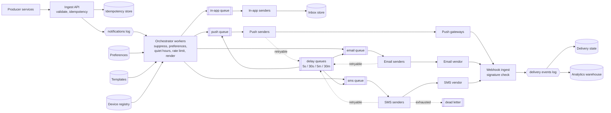

# Design a notification system

*The problem where every hard part is on the other side of a network boundary you
do not control. The architecture is a fan-out and some queues. The interview is
about what happens when the SMS vendor takes five seconds instead of two hundred
milliseconds, and about the user who wakes up to forty copies of the same push.*

---

## 1. Requirements

**Functional**
- A service asks for a user to be notified; the system decides the channels and
  delivers
- Channels: push, email, SMS, in-app
- Templates with variables, per channel and per locale
- Per-user preferences by category, quiet hours, unsubscribe
- A per-user cap, so no bug can deliver two hundred notifications to one person
- Delivery and open tracking, queryable per message and in aggregate

**Out of scope** (say so): the campaign builder and audience segmentation, the
in-app inbox UI, and real-time chat delivery — that is a
[different problem](03-chat-system.md) with a socket in it. Rich channels like
WhatsApp are just another adapter; mention that and move on.

**Non-functional**
- **Write-heavy, and bursty in a way the average hides.** A campaign is a step
  function, not a curve
- Transactional messages have a latency budget — an OTP is worthless after a few
  minutes. Campaign messages have none
- **Never lose an accepted request.** Once you return 202 you own it
- **At-least-once delivery, no perceived duplicates.** These are different
  claims, and the gap between them is most of section 5
- The third-party vendors are the least reliable component in the system. The
  design has to assume that, not hope otherwise

**The one question to ask the interviewer:** is this transactional traffic,
campaign traffic, or both? "Your code is 123456" and "50% off this weekend" go
through the same pipeline and want opposite things from it — one wants latency,
the other wants throughput and does not care about either. If the answer is
both, you need separate lanes, and that decision shapes everything downstream.

## 2. Estimation

Assume 100M users, each receiving ~5 notifications a day.

```
500M notification requests/day
  average    500M / 100k sec       = ~5,000 req/sec
  peak 3x                          = ~15,000 req/sec
  a campaign to 20M users that
  product wants out in 10 min      = 20M / 600 sec = ~33,000 req/sec ON TOP
```

**The campaign is twice the peak of everything else, and it arrives in one
step.** You cannot size a synchronous system for that and you should not try.
That single line is the argument for a durable queue with independently scaled
workers, and for the campaign living in its own lane.

**Sends, not requests, are the real load.** Assume the channel split is 70% push,
15% email, 10% in-app, 5% SMS, and that a user has ~2 registered devices, so one
push request is two sends:

```
  push     0.70 x 500M = 350M x 2 devices = 700M sends/day = ~7,000/sec
  email    0.15 x 500M =  75M                              =   ~750/sec
  in-app   0.10 x 500M =  50M                              =   ~500/sec
  SMS      0.05 x 500M =  25M                              =   ~250/sec
                                          total ~800M/day  = ~8,000/sec
```

**Now price the channels, because they are not comparable.** Assume $0.01 per
SMS — the real figure is a carrier contract, but the order of magnitude is the
point:

```
  SMS      25M/day x $0.01   = ~$250,000/day
  push     700M/day          = ~free
```

SMS is 3% of your sends and effectively all of your marginal cost. That has a
concrete design consequence: **a retry on push is free and a retry on SMS is an
invoice**, so the retry policy is not allowed to be one global setting.

**Storage.** One row per send attempt, ~300 B of status, timestamps, vendor ids
and error text:

```
  800M sends/day x 300 B     = ~250 GB/day  = ~90 TB/year
```

Ninety terabytes a year of append-only, time-ordered rows that are read either by
primary key (support: "what happened to my message") or as aggregates over a date
range (product: "what is the open rate"). **That is not one store.** It is a
key-value store with a TTL for the first pattern and a columnar warehouse for the
second, and noticing that here saves you from defending a Postgres table with 90
TB in it later.

**Everything else is small**, which is worth saying because it tells you where
not to spend the interview:

```
  device tokens    100M users x 2 x 100 B  = ~20 GB
  preferences      100M x 200 B            = ~20 GB
  dedup keys       500M/day x 100 B, 24h   = ~50 GB
```

Preferences and device tokens are read on *every* notification and fit in memory
several times over, so they get cached in process and never appear on the hot
path as a database read. The dedup set is 50 GB **because the window is 24
hours** — at 30 days it is 1.5 TB and a different conversation. The retention
window is the design decision, and the arithmetic is how you defend it.

## 3. High-level design



**Three tiers, and the boundaries are deliberate.** Ingest does almost nothing —
validate, deduplicate, make durable, return. The orchestrator decides *whether*
and *what*. The channel senders do one thing: call a vendor. Keeping the senders
stupid is what lets you scale, restart and circuit-break them per channel without
thinking about anything else.

**API**

```
POST /notifications
  Idempotency-Key: <caller-supplied>
  { userId, templateId, category, data: {...},
    channels?: ["push","email"], priority: "transactional" | "campaign",
    sendAfter?, expiresAt? }
  -> 202 { notificationId, status: "accepted" }

POST /campaigns            { templateId, audienceId, throttle, window } -> 202 { campaignId }
GET  /notifications/{id}   -> per-channel status, attempts, last vendor error
PUT  /users/{id}/preferences  { category, channels, quietHours, timezone }
POST /webhooks/{vendor}    vendor delivery receipts -> 200
```

**202, never 200 with a delivery result.** You accepted the request and made it
durable. Delivery happens behind it and may take seconds, or hours if the phone
is off. An API that returns "sent" synchronously is either lying about what
"sent" means or holding an HTTP connection open against a vendor's p99, and both
are worse than a status endpoint.

**`expiresAt` belongs on the request, not in your retry config.** The caller is
the only party who knows that this OTP is dead in five minutes and that the
shipping update is fine tomorrow. Section 4 spends it.

**`priority` is a lane, not a number.** See section 4 — a priority field inside
one queue does not do what people expect.

### Data model

| Store | Key | Holds | Why this store |
|---|---|---|---|
| Key-value | `notificationId` | the accepted request, payload, caller, category | Written once, read by id for support. No joins, no scans, 500M/day. Point lookup by a key you already have |
| Key-value | `notificationId` + `channel` + `address` | status, attempt count, vendor message id, timestamps | The unit that is actually updated. One row per send, 800M/day, TTL 90 days |
| Key-value | `vendorMessageId` | `deliveryId` | Exists only because webhooks arrive keyed by *their* id, not yours. See section 7 — this reverse map is load-bearing |
| Relational | `userId` | preferences, quiet hours, IANA timezone, unsubscribes | 20 GB, edited by humans, needs transactions and an audit trail for compliance. Read via cache, never directly on the hot path |
| Relational | `templateId` + `version` | per-channel, per-locale bodies, category, criticality | Small, versioned, immutable once published. Whole set fits in every orchestrator's memory |
| Key-value | `userId` | device tokens, platform, last seen | Read on every push, written on app launch. 20 GB, cache-friendly |
| Redis | `idem:{key}` | `notificationId`, 24h TTL | Conditional write on the accept path. Must be atomic and must expire |
| Redis | `rl:{userId}:{category}` | token bucket | Read-modify-write per notification. Same shape as a [rate limiter](04-rate-limiter.md) |
| Columnar | day + template + channel | delivery events | 90 TB/year answered with group-bys over date ranges. Never serve this from the OLTP store |

**The access pattern picked every one of those**, and two are worth defending out
loud. Preferences are relational because unsubscribes are a legal record and you
will be asked to prove when one was set. The delivery log is a separate columnar
store because its two readers want incompatible things: support wants one row by
id, product wants a scan over a billion. Trying to serve both from one table is
the most common way this design goes wrong.

## 4. Deep dive: the queue topology

This is the part the problem is testing. Everything else here is competent
plumbing.

### One queue for everything fails, and the arithmetic says exactly how

Put push, email and SMS on one queue with one worker pool. Sizing looks fine on a
normal day. Little's law gives the workers you need as `rate x latency`:

```
  push     7,000/sec x 0.02 s  = ~140 workers
  email      750/sec x 0.10 s  =  ~75 workers
  SMS        250/sec x 0.20 s  =  ~50 workers
                                 ~265 workers, so run 400
```

Now the SMS vendor degrades — not down, just slow, 5 seconds instead of 200
milliseconds. Nothing else changed. Recompute the one line:

```
  SMS        250/sec x 5.0 s   = ~1,250 workers
```

You have 400. **The SMS traffic, 3% of your volume, now demands three times your
entire worker pool**, and because a worker is blocked for five seconds it is
unavailable to the push messages queued behind it. Push delivery latency goes
from milliseconds to minutes and eventually the queue grows without bound. Your
OTPs are late because a marketing SMS vendor is having a bad afternoon.

That is head-of-line blocking, and note what it is *not*: it is not solved by
adding workers, because a shared pool sized for the worst case is a pool that
sits idle at 3% utilisation the rest of the time. It is not solved by a priority
field on the message either — in a partitioned log you consume a partition in
order, so a high-priority message sitting behind a thousand slow ones is still
behind them. **You cannot skip ahead in a queue; you can only be in a different
queue.**

### One queue per channel, and per lane inside that

Each channel gets its own topic, its own consumer group, its own worker pool, its
own concurrency cap, its own retry policy and its own circuit breaker. A slow SMS
vendor now fills the SMS queue and nothing else. The blast radius is one channel,
by construction rather than by luck.

Then split again by priority: **transactional and campaign are separate topics
per channel**, not a flag inside one. A 20M-recipient campaign is 33,000
messages a second arriving in ten minutes; if it shares a topic with OTPs, the
OTPs wait behind it no matter what the flag says. Two topics, two consumer
groups, and the campaign group is capped so it can never consume more than its
share of vendor throughput.

Split a third time when you have two vendors for one channel — a queue per
(channel, vendor). Failing over then means "stop consuming queue A, start
consuming queue B", which is an operation you can perform in seconds and reverse
just as fast. With one queue and vendor selection inside the worker, failover is
a deploy.

**The cost of all this is real and you should name it:** more topics to operate,
more consumer groups to monitor, more dashboards, and a partitioning scheme to
keep straight. You are buying isolation with operational surface area. At three
channels it is arguably over-engineered. At the scale in section 2 it is the
difference between one channel degrading and the product going dark.

**Partition key: `userId` for transactional**, which gives per-user ordering for
free and keeps a user's rate-limit state on one consumer. **`notificationId` for
campaigns**, because campaigns do not need per-user ordering and keying by user
makes your heaviest users hot partitions during exactly the window you least want
them.

### Concurrency limits are a contract, not a tuning knob

Each sender pool has a hard cap on in-flight requests to its vendor. This is a
bulkhead: it stops one channel from consuming all your sockets, file descriptors
and memory, and it stops you from breaching the vendor's contractual QPS. Exceed
that and you get 429s, or worse, silent throttling and a reputation problem that
takes days to unwind. The sender needs an *outbound*
[rate limiter](04-rate-limiter.md), sized from the contract — the inbound one in
section 6 protects users, this one protects the relationship.

### Retry: backoff, and jitter for a specific reason

**First, classify the failure. Retrying the wrong error is worse than not
retrying.**

| Vendor says | Meaning | Do |
|---|---|---|
| Timeout, 5xx, connection reset | Unknown or transient | Retry with backoff |
| 429 | You are over the limit | Retry, honouring `Retry-After`, not your own schedule |
| 400, invalid payload | Your bug | Dead-letter immediately. Retrying a malformed message 6 times is 6 identical failures |
| Invalid or expired device token | The user uninstalled | Terminal, **and feed it back** — delete the token from the registry |
| Hard bounce, number unreachable | The address is dead | Terminal, mark the address, stop sending to it |

That fourth row is the one people skip. Without the feedback loop you push to
dead tokens forever, your delivery-rate metric decays quietly, and you pay a
vendor to fail. The failure stream is the only accurate source of truth about
which addresses still exist.

**Backoff:** 1s, 2s, 4s, 8s, capped, six attempts over about an hour. But the
budget belongs to the message: **a worker that picks up a message past its
`expiresAt` drops it to the dead-letter queue with reason `expired` and never
calls the vendor.** Otherwise you spend an hour retrying an OTP and deliver it
long after the user gave up and requested three more — which is both useless and,
on SMS, billed.

**Jitter, and exactly what breaks without it.** A vendor blips for thirty
seconds; 50,000 messages fail together. With a pure exponential schedule all
50,000 retry at t+1s, then all 50,000 at t+3s, then t+7s. You have built a
synchronised hammer that re-creates the outage the instant the vendor recovers,
and each collapse re-synchronises the next wave. Use full jitter:

```
  delay = random(0, min(cap, base * 2^attempt))
```

Not "equal jitter", not a fixed 10% wobble — full jitter spreads the retries
flattest, and the thing it costs you is predictability of a single message's
latency, which for notifications is not something anyone is measuring.

**Retries are not sleeps.** A worker that sleeps for 30 seconds is a worker you
are paying for and cannot use. Re-enqueue to a **delay queue** keyed by
visible-at time. Four or five fixed tiers — 5s, 30s, 5m, 30m — are enough; a
per-message timer wheel is a system you do not need. The message carries its
attempt count and the tier it goes to next.

**A circuit breaker in front of each vendor, and it must stop consumption.** After
N consecutive failures, open the breaker and **pause the consumer group** rather
than continuing to pull messages and fail them. This is the part people get
wrong: if you keep consuming during a vendor outage, you convert a thirty-minute
vendor problem into a dead-letter queue holding two million messages that you now
have to triage and replay by hand. Leave them in the queue, where retention is
already holding them safely, and resume when the half-open probe succeeds.

**Trip the breaker on latency and in-flight count, not only on errors.** A vendor
returning 200s at 30 seconds each will never trip an error-rate breaker and will
consume your entire pool. That is the failure mode that actually happens.

### The dead-letter queue, and what makes it useful

A message lands there when retries are exhausted, when it expired, when the
vendor rejected it permanently, or when it failed to deserialise — the poison
message that would otherwise crash the same worker forever.

**Carry the reason and the last vendor response with it.** A DLQ of opaque
message bodies is a bin, not a tool; you cannot triage it and nobody ever does.
With a reason code you can answer "how many of these are expired versus
genuinely broken" in one query, and the answer is usually "most of them are
expired and none of them should be replayed".

**Alert on DLQ *rate*, not depth.** Depth alerts fire long after the incident
started and stay red long after it ended.

**Replay is part of the design or the DLQ is a dead end.** You need to replay
selectively — by reason, by time window, by channel — and replay re-enters at the
channel queue, not at ingest, so it skips preference and quiet-hours checks that
have already run. It is safe to replay because of the next section: the
idempotency key means a replayed message that actually did go out will not go
out twice.

## 5. Deep dive: exactly-once, as users perceive it

Say the honest version first, because the interviewer is waiting for it: **there
is no exactly-once delivery across a network you do not control.** What you build
is at-least-once transport plus deduplication at every boundary, so that the
user sees one message. That is the claim you can actually defend.

There are three independent sources of duplicates and each needs its own
defence. Conflating them is the mistake.

### 1. The caller retried

Their POST timed out. They have no idea whether you received it, so they send it
again — correctly, because the alternative is losing the notification.

**Caller-supplied `Idempotency-Key`**, recorded at ingest with the resulting
`notificationId` and a 24-hour TTL. On a repeat, return the same 202 with the
same id and do not enqueue anything.

**The write must be conditional and atomic**, `SET key value NX`, not
"check, then write". Two concurrent retries from a client with a hedged request
policy will hit that race, and they will hit it on the busiest day of the year.

**If the same key arrives with a different body, return 409.** Silently serving
the first result for a genuinely different request is a much worse bug than a
loud rejection, and it is nearly impossible to debug from the outside.

### 2. Your queue delivered it twice

At-least-once is what every broker gives you and it is the right choice. A worker
that calls the vendor and then crashes before acking will see that message again.

**Claim before you send.** Derive a deterministic delivery key —
`hash(notificationId, channel, address)` — and take a lease on it before the
vendor call: `SET dedupe:{key} workerId NX EX <lease>`, or a compare-and-set on
the delivery row moving `pending -> sending`. If the claim fails, another worker
owns it; drop the message and ack.

**The lease length is a real tradeoff, so state it.** Too short and a slow-but-
alive worker loses its claim while its vendor call is still in flight, and you
send twice. Too long and a crashed worker's message is stuck until the lease
expires. Set it to a few multiples of the vendor call timeout, which is the only
number that bounds how long a legitimate send can take.

### 3. You crashed between the vendor call and recording it

This is the irreducible one. You called the SMS vendor, the connection died, and
you do not know whether a message went out. There are exactly two options and no
third:

- **Pass your own idempotency key to the vendor.** Most push, email and SMS APIs
  accept a client-supplied message id and deduplicate on it. Use it everywhere it
  exists. This is the real fix.
- **Where it does not exist, choose which failure to prefer.** A duplicate OTP is
  a mild annoyance. A missing OTP is a support ticket and an abandoned signup.
  **Default to sending again.** A second copy is almost always cheaper than a
  miss — the exception is anything that costs the *user* something, which
  notifications generally do not.

### 4. The product sent two of them

Two services both notify on the same event; a retried upstream job re-emits;
someone deploys a loop. This is the duplicate users actually complain about, and
none of the machinery above catches it, because these are genuinely distinct
requests with distinct idempotency keys.

**Content-level suppression.** Derive an identity from what the notification
*means* — `(userId, category, entityId)` — and suppress an identical one inside a
window. Same store as the idempotency set, different key, and the window is a
product decision per category: seconds for a chat summary, a day for "your
subscription renews".

**On push, also set a collapse key.** Both mobile platforms support replacing an
undelivered notification with a newer one carrying the same key. A phone that has
been off for six hours then wakes to one current message instead of forty stale
ones. It costs one header and it is the single most visible quality improvement
in the whole system.

## 6. Deep dive: the decision layer

Everything between "accepted" and "enqueued" runs in the orchestrator, and the
**order is cheapest-and-most-likely-to-reject first**. Every check a message
passes is work you might be about to throw away.

```
  1. suppression / dedup        Redis lookup
  2. global kill switch          in-process config
  3. category enabled            in-process config
  4. compliance: unsubscribed?   cached, authoritative
  5. user preference by channel  cached
  6. quiet hours                 pure computation
  7. per-user rate limit         Redis token bucket
  8. render template             in-process
  9. enqueue per channel
```

**Record a reason for every drop.** A message that vanishes without a counter is
a support ticket you cannot answer, and the suppression counters turn out to be
the best bug detector in the system — a spike in "rate limited" or "quiet hours"
almost always means a producer is misbehaving, not that users changed their
habits.

### Preferences, and the one that is not a preference

Preferences are per user, per category, per channel. Categories are the unit
because "turn off notifications" is a blunt instrument that loses you the
channel entirely; "turn off marketing, keep security alerts" is what people
actually want.

**Unsubscribe and regional consent rules are law, not preference**, and they
cannot be bypassed by a caller passing `critical: true`. The transactional versus
marketing classification therefore lives on the **template**, in a registry a
human reviews, not on the request. Callers will set whatever flag gets their
message through; that is not malice, it is incentives.

Preferences are read on every single notification, so they are cached in process
with pub/sub invalidation — the same shape as rules in the
[rate limiter](04-rate-limiter.md). 20 GB across the fleet is nothing, and a
preference read has no business appearing in your database QPS graph.

### Quiet hours

**Store the IANA timezone and a local wall-clock window, never a UTC offset.** An
offset is wrong twice a year on every DST boundary and permanently wrong for
anyone who travels. Convert at evaluation time.

**Defer, do not drop** — for most categories. But then name the trap you just
created: a user with quiet hours from 22:00 to 08:00 accumulates eight hours of
deferred notifications that all fire at 08:00:00 sharp. You have moved the flood,
not removed it. Two fixes, and you want both: **collapse the deferred set into a
digest** — one message saying what happened overnight — and **jitter the release**
across several minutes so you do not hand your push gateway a synchronised spike
of ten million messages.

**Some categories drop instead of deferring**, and this is a per-category
property, not a global policy. "Your driver is arriving" delivered eight hours
later is worse than nothing. Time-sensitive categories carry a short `expiresAt`
and let it do the work.

**Critical categories bypass quiet hours entirely** — OTPs, security alerts,
anything the user actively triggered in the last minute. Again: a property of the
template, not a flag on the request.

### Per-user rate limiting, which is the highest-leverage check here

A token bucket per `(userId, category)` plus a global per-user ceiling. Mechanics
are in [fundamentals](../fundamentals.md) and
[the rate limiter write-up](04-rate-limiter.md); what matters here is *why it
exists*.

A producer ships a bug, or an upstream retry loop misfires, and one user receives
two hundred notifications in a minute. Without the cap you deliver all two
hundred. That user then disables notifications for your app at the OS level, or
uninstalls. **Both of those are irreversible from your side** — there is no API
to win back a revoked permission. Every other failure in this system is
recoverable by retrying; this one is permanent, which makes the per-user cap the
most valuable line of code in the design.

**Excess is dropped with a reason, not queued.** Deferring the flood delivers the
flood later.

### Template rendering

**Templates are versioned and immutable.** Publishing an edit creates a new
version; the send records which version it used. Without that you cannot
reproduce what a user actually saw when they complain, and that conversation
happens weekly.

**Render before the channel queue, not in the sender.** The sender's only job
becomes "call the vendor", which is what makes it cheap to scale, restart and
circuit-break. It also means a template-store outage cannot fail messages that
are already in a channel queue. The cost is honest: bigger queue payloads, and a
template fix cannot reach anything already enqueued.

**For campaigns, invert that.** Rendering 20M bodies at fan-out time and pushing
20M rendered payloads through a queue is a lot of bytes to move for messages that
differ by a first name. Enqueue the template version plus the variables and
render in the sender. So this is a **per-lane decision**, and saying that rather
than picking one globally is the better answer.

**Per-channel bodies under one template id.** The same notification is a 40-
character SMS, a subject line plus HTML, and a push title plus body. Per-locale
variants underneath, and a missing locale falls back to the default — never to a
raw template key, which is how `{{user.first_name}}` ends up on a customer's lock
screen.

**Sandbox the engine and use a logic-less one.** Templates are input that gets
executed. Server-side template injection is a real vulnerability class and the
people editing templates are not reviewing each other's code.

**The payload carries its own variables.** If the renderer looks up the user's
name, their order and their balance from three services, then 33,000 campaign
messages a second becomes 100,000 internal RPCs a second, all of them against
services that were not sized for it. Require the caller to pass what the template
needs, or snapshot it once at ingest.

## 7. Deep dive: delivery and open tracking

The state machine, and the honest names for each state:

```
accepted -> suppressed | deferred -> queued -> sent -> delivered -> opened -> clicked
                                        \-> failed | bounced | expired
```

**"Sent" means the vendor took it. That is all it means.** A 200 from a push
gateway says the gateway accepted the request, not that a phone has the message
— the phone may be off, out of storage, or have had the app removed hours ago.
Anyone reporting "sent" as a delivery rate is reporting the health of their own
HTTP client. Delivery is only ever confirmed by something that comes *back*.

### Webhooks, and the four things that go wrong

Vendors post delivery receipts to you. All four of these will bite:

**They are unauthenticated unless you check.** An open endpoint that writes
delivery state lets anyone corrupt your metrics and, if you act on bounces
automatically, mark real addresses dead. Verify the signature, every time.

**They arrive out of order.** A late `sent` receipt must not overwrite
`delivered`. Give each state a rank and only ever move forward; a transition to a
lower rank is discarded, not applied. This makes the handler idempotent and
reorder-safe for free, which also solves the next one.

**They arrive more than once.** Vendors retry too, for exactly the reasons you
do.

**They arrive keyed by the vendor's message id, not yours** — which is why the
reverse map is in the data model. And there is a genuine race here worth naming:
**a vendor can call your webhook before your own "I sent this" write has
committed.** The handler then looks up an id that does not exist yet. Do not drop
it. Park it on a short retry — a few seconds on a delay queue — and it resolves
itself. Dropping it silently loses a delivery confirmation and makes your metrics
pessimistic in a way nobody will ever trace.

**They arrive late, sometimes by hours.** A carrier holding an SMS for a phone
that is off will confirm when the phone comes back. Any delivery-rate number
computed before a maturity window has passed is noise, and a dashboard that
reports the last ten minutes will always look like an incident.

### Open tracking, and its accuracy per channel

- **Email:** a 1x1 pixel for opens, wrapped links for clicks. Both are
  approximations and the pixel has become much weaker — image blocking suppresses
  real opens, and privacy proxies that pre-fetch images manufacture fake ones. It
  is directionally useful for comparing two templates and worthless as an
  absolute number. Clicks are far more trustworthy than opens.
- **Push:** the client SDK reports a tap. The app has to run to report it, so
  counts trail reality and undercount anyone who reads the banner without opening
  the app.
- **In-app:** exact, because you own both ends.

Say which numbers you trust. An interviewer who has run this has been burned by
someone treating email open rate as ground truth.

### The pipeline

Every event — yours and the vendors' — goes onto one log, and two consumers read
it. A stream consumer folds events into per-delivery state, which is what the
support endpoint reads. A sink writes to the columnar warehouse, which is what
dashboards read.

**Never serve a dashboard from the delivery table.** The queries are group-bys
over date ranges across 90 TB; that is a columnar scan, and pointing it at the
store that is also absorbing 800M writes a day takes down the thing it is
measuring.

**Keep every state transition per delivery for 30-90 days** for the support
question, then drop to aggregates. Sampling is fine for aggregate metrics and
unacceptable for "what happened to *my* message", which is the only question
anyone ever asks angrily.

## 8. Bottlenecks, and scaling past them

| Breaks first | Symptom | What you do |
|---|---|---|
| Vendor throughput | 429s, then silent throttling, then reputation damage | Outbound rate limit per vendor from the contract; a second vendor per channel with a router |
| One channel's sender pool | That channel's queue lag climbs, the others stay flat | Scale that consumer group. The fact that the others stayed flat is the payoff for section 4 |
| A campaign step function | Queue depth spikes, transactional lag rises with it | Separate lanes, and cap the campaign consumer so it cannot take vendor capacity from transactional |
| Orchestrator lookups | Preference and template read QPS tracks send QPS | Full set in process, pub/sub invalidation. It is 20 GB and it belongs nowhere near the hot path |
| Dedup store memory | Redis grows until it evicts, and evictions cause duplicates | Bounded TTL. The 24-hour window from section 2 is this constraint, not a guess |
| Delivery log writes | 800M rows/day into an OLTP store | Append-only, time-partitioned, TTL'd. Wide-column for state, columnar for analytics |
| Webhook ingest | Vendor retries pile up when you are slow | It is stateless; scale it, and make it write to the log rather than to the database |

**At 10x, the ceiling is not your code — it is the vendor relationship**, and
saying that plainly is the senior answer. You cannot autoscale someone else's SMS
gateway. What you can do is: run two or more vendors per channel with a routing
policy that weighs cost, per-country delivery rate and current health; negotiate
burst capacity ahead of the campaign that needs it; and **throttle your own
demand** — "deliver this campaign over an hour instead of ten minutes" is a
product lever that deletes a systems problem, and it is usually available for the
asking.

**What to monitor**, in priority order:
- **Queue lag per channel.** The single best health signal in the system. Every
  vendor problem shows up here first
- Vendor error rate and latency p99, per vendor, per channel — latency separately,
  because the slow-not-down failure never trips an error alert
- DLQ rate broken down by reason
- Suppression counts by reason. A spike in "rate limited" is a producer bug
  roughly every time
- Delivery rate per channel against its own baseline, evaluated only after the
  maturity window
- Invalid-token rate, which is how you notice the feedback loop has stopped
  working

## Tradeoffs to volunteer

**A queue per channel over one queue with priorities.** Chosen, for the Little's
law arithmetic in section 4. *The case for one queue* is genuinely strong at
small scale: one consumer to operate, one dashboard, one deploy, and a priority
field is trivial to implement. It works right up until one channel gets slow,
which is a certainty rather than a risk — but if you have three thousand
notifications a day, the isolation is not worth the operational surface and you
should say so.

**At-least-once plus suppression over chasing exactly-once.** Chosen because the
vendor boundary makes true exactly-once impossible, so any system claiming it is
hiding the gap rather than closing it. *The case for chasing it* is real where a
send costs money — SMS at a cent each and a bug that duplicates 10% of a 25M-a-day
volume is $25,000 a day. That argues for a tighter claim lease and a vendor-side
idempotency key on the expensive channel specifically, not for a different
architecture.

**Deferring quiet-hours notifications over dropping them.** Chosen as the
default. *The case for dropping* is that a stale notification is often worse than
none, and the digest you build to make deferral bearable is a product feature
with its own cost. The resolution is per category, driven by `expiresAt`, not one
global policy.

**Vendors over direct integration.** Chosen. *The case for going direct* is cost
at volume and removing a third party from your critical path. Against it:
deliverability is an operational specialty — IP warming, sender reputation,
carrier relationships, regional registration — and a team that has never done it
will spend a year learning why their email lands in spam. Buy it, and keep two.

**A log for the spine, work queues for the channels.** *The case for pure Kafka:*
replay, per-key ordering, one log feeding both the pipeline and analytics.
*The case for pure SQS-style queues:* per-message visibility timeouts, native
delay queues and a native DLQ are exactly the primitives retry wants, and
building them on a log is work. The honest answer is the hybrid — a log where you
want replay and multiple consumers, a queue where you want per-message ack
semantics — and saying "one of them for everything" is the answer that has not
operated either.

**Render before the queue for transactional, after it for campaigns.** Covered in
section 6. Worth volunteering because picking one globally is the more common
answer and it is wrong at one end or the other.

## Follow-up questions

**How do you send to 20M users without fan-out taking an hour?**
Do not materialise 20M requests at ingest. Accept the campaign as one row plus an
audience reference, then a chunker splits the audience into batches of a few
thousand and enqueues the batches; workers expand a batch into individual
deliveries. Ingest stays O(1), progress is resumable per chunk, and a failure
retries one batch rather than the campaign. Same shape as
[news feed fan-out](02-news-feed.md).

**A campaign is half sent and you need to stop it.**
A per-campaign kill switch, checked by the chunk workers before expanding each
batch and by the orchestrator before enqueueing to a channel. Batch granularity,
not per message. Anything a vendor has already accepted is gone — say that
plainly, because "stop the campaign" and "unsend the campaign" are different
requests and only one of them is possible.

**A user changes their preferences while messages for them are in flight.**
Preferences are evaluated at orchestration, so anything already in a channel
queue goes out. For most categories that is fine and you should say so rather
than over-engineering it. Where it is not — an unsubscribe, which is legal — add a
cheap final check in the sender against the cached preference version.

**How do you stop a bug from spamming everyone?**
Four independent brakes, because one will be bypassed: the per-user cap from
section 6; a rate limit on the *producer*, not just the recipient; a kill switch
per template and per category; and a canary — any campaign above some size goes to
1% and pauses for a human to continue.

**How do you test this?**
Vendor adapters with a sandbox mode, a seed list of internal addresses that every
campaign includes, and a fake vendor in CI that always fails, always times out, or
always returns 429 — otherwise your retry and circuit-breaker paths are code that
has never executed. Shadow sends for template changes.

**A vendor is slow rather than down. What trips?**
Nothing, if your breaker only watches error rate — which is why it must also watch
in-flight count and latency. A vendor returning 200s at thirty seconds each is the
worst case: it consumes the pool, generates no errors, and looks healthy on every
dashboard that averages.

**What ordering do you guarantee?**
Per user per channel, best effort, and explicitly broken by retries — a message
that failed once and succeeded on attempt three arrives after messages that were
queued behind it. Notifications are not a conversation. Any product that needs
strict ordering should not be using this system for it.

**Do you store the rendered body?**
For a bounded window, for support, then drop it. Bodies contain personal data and
the delivery log is your largest store; keeping 90 TB of rendered marketing copy
serves nobody. Keep the template version and variables, which reproduce the body
if you need it.

**Scheduled and recurring notifications?**
A separate store keyed by fire time with a sweeper that moves due rows into
ingest. Keep it out of the main pipeline — its failure mode (a sweeper that stalls
and then floods) is completely different from everything else here, and the
recurrence rules are a product feature that will change monthly.

**Who owns the notification a user never asked for?**
The category registry, and it should have a named human owner per category. It is
a process answer to a systems question, but the systems answer — kill switches,
caps, canaries — only limits the damage. The thing that actually keeps a
notification system trusted is that someone has to approve a new category, and
that is worth saying.
