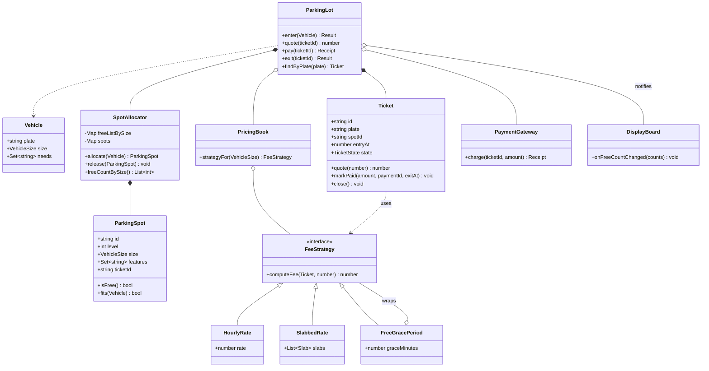

# Design a parking lot

*The canonical LLD warm-up. Small enough that you will finish it, which is
exactly why the grading is about modelling and not about scope.*

You are asked for a multi-level lot that admits vehicles of a few sizes, assigns
each one a spot, issues a ticket, and charges on the way out. Nothing in that
sentence is hard. What the interviewer is actually probing is three decisions:
whether you reach for an inheritance hierarchy where a value would do, whether
your pricing rules live in a `switch` inside the lot or behind an interface, and
whether "find a free spot" is a scan over every spot or a pop off a free list.
Get those three right and the rest of the problem writes itself.

---

## Requirements

**Functional**
- A lot has multiple levels; each level has spots of several sizes
- A vehicle arrives, is assigned a spot that fits it, and gets a ticket
- A vehicle leaves: the fee is computed from how long it stayed, it pays, the spot is freed
- Display boards show free capacity per size
- Rates differ by vehicle type and may be slabbed (first two hours at one rate, then another)

**Non-functional / constraints**
- Assignment must be O(1). A rush hour at a 3,000-spot lot cannot afford a linear scan per car.
- Several entry and exit gates act at the same time. One spot must never be handed to two vehicles.
- A rate change must not require touching the allocation code.
- Money must not be lost or double-charged if a gate crashes mid-transaction.

**Out of scope** — say this out loud: payment gateway internals, licence-plate
recognition, valet, reservations made in advance, and multi-lot / multi-city
routing. Each of those is a real feature; none of them changes the core model,
so they belong in the follow-ups.

## Clarifying questions to ask

**Can a small vehicle occupy a larger spot?** If yes, allocation is not one free
list but an ordered cascade — try the exact size, then each larger size. If no,
sizes are independent buckets and a full compact row turns cars away while large
spots sit empty. This single answer decides the shape of the allocator.

**Is pricing flat hourly, slabbed, or does it vary by time of day and vehicle
type?** Flat hourly is a multiplication and needs no pattern at all. The moment
slabs, weekends and vehicle type combine, a `switch` becomes a cross-product and
Strategy starts paying for itself. Ask before you build the abstraction.

**How many gates, and do they share one process?** One process means the
allocator can be a plain in-memory structure. Several gate machines against a
shared database means allocation has to be a conditional write, and "pick a
spot" and "mark it taken" must be the same operation.

**Do we need to answer "where did I park" or handle a lost ticket?** Both force a
plate index alongside the ticket index. It is two lines if you plan for it and a
schema change if you do not.

**Are there spots with capabilities — EV chargers, accessible spots?** If yes,
a spot is not just a size. That is the concrete argument for giving a spot a set
of features rather than inventing `ElectricLargeSpot`, which is where the
inheritance hierarchy explodes.

**When a spot is freed, does the next car get the nearest one or any one?** "Any"
is a stack pop, O(1). "Nearest to the lift" is a priority queue keyed by walking
distance, O(log n). Both are defensible; only one of them is O(1), so commit to
which requirement you are serving.

## Core entities

| Entity | Owns | Must never own |
|---|---|---|
| `Vehicle` | Plate, its size, any capability it needs | Any knowledge of spots, tickets or price |
| `ParkingSpot` | Id, level, size, features, which ticket holds it | Fee logic; deciding which vehicle gets it |
| `SpotAllocator` | The free lists, allocate and release | Pricing, ticket lifecycle, payment |
| `Ticket` | Id, plate, spot id, entry time, state, the strategy snapshot | The rate table itself; the ability to free a spot |
| `FeeStrategy` | One pricing rule, duration in and money out | Any mutation of the ticket or the spot |
| `PricingBook` | The vehicle-size to strategy mapping | How a fee is actually computed |
| `ParkingLot` | Gates, orchestration, the ticket and plate indexes | Rate arithmetic; the free lists directly |
| `PaymentGateway` | Charging, and idempotency per ticket | Releasing spots or closing tickets |

The row worth defending is `Ticket`. It holds a reference to the strategy that
was in force when the car entered, not a price and not a rate table. That keeps
a mid-stay rate change from applying retroactively, and it keeps the arithmetic
out of the entity.

## Class diagram



Notice what is missing: there is no `Car`, `Truck` or `Motorcycle` class.

## Implementation

Three things in the code are worth reading closely, because they are the three
things being graded.

**Size is a value, not a type.** The instinct is `class Car extends Vehicle`.
Ask what `Car` overrides. Nothing — it differs from `Truck` by a size constant
and a rate lookup, both of which are data. Then the requirement "EV cars need a
charger" arrives and the hierarchy has to double: `ElectricCar`, `ElectricTruck`.
Composition keeps it flat: a vehicle has a size and a set of needs, a spot has a
size and a set of features, and `fits` is one comparison plus a subset check. New
capability, zero new classes.

**`allocate` is a pop, not a scan.** Spots are held in one stack per size. The
common case — a car needing nothing special — is `list.pop()` on the exact size,
falling through to larger sizes only when that list is empty. Three sizes means
at most three list-head checks, so it is O(1) regardless of lot size. Release is
a `push`. The trap here is using an array plus `indexOf` to remove on release,
which drags you back to O(n) on the path you were trying to make fast; the
swap-remove in the feature branch avoids the same trap.

**Pricing is behind an interface.** A `switch (vehicle.type)` inside the lot
means every rate change edits the class that also allocates spots, and slabs
crossed with vehicle type crossed with weekends is a cross-product of cases. As
separate objects, each rule is one small class you can unit-test on its own, and
`FreeGracePeriod` wraps any of them rather than adding a branch to all of them.

```js
// ---------- sizes ----------
// Ordered, because "a small car fits a big spot" is an ordering, not a type check.
const VehicleSize = Object.freeze({ MOTORCYCLE: 0, COMPACT: 1, LARGE: 2 });
const SIZES_ASC = [VehicleSize.MOTORCYCLE, VehicleSize.COMPACT, VehicleSize.LARGE];
const SIZE_NAME = ['MOTORCYCLE', 'COMPACT', 'LARGE'];

// ---------- domain objects ----------
// No Car/Truck/Motorcycle subclasses: nothing overrides behaviour, only data varies.
class Vehicle {
  constructor(plate, size, needs = []) {
    this.plate = plate;
    this.size = size;
    this.needs = new Set(needs); // e.g. 'EV_CHARGER'
  }
}

class ParkingSpot {
  constructor(id, level, size, features = []) {
    this.id = id;
    this.level = level;
    this.size = size;
    this.features = new Set(features);
    this.ticketId = null; // single source of truth for occupancy
  }
  get isFree() {
    return this.ticketId === null;
  }
  fits(vehicle) {
    if (vehicle.size > this.size) return false;
    for (const need of vehicle.needs) if (!this.features.has(need)) return false;
    return true;
  }
}

// ---------- allocation ----------
class SpotAllocator {
  constructor(spots) {
    this.spots = new Map();
    this.free = new Map(SIZES_ASC.map((s) => [s, []])); // size -> stack of free spots
    for (const spot of spots) {
      this.spots.set(spot.id, spot);
      this.free.get(spot.size).push(spot);
    }
  }

  allocate(vehicle) {
    for (const size of SIZES_ASC) {
      if (size < vehicle.size) continue; // cannot shrink a car
      const list = this.free.get(size);
      if (list.length === 0) continue;
      if (vehicle.needs.size === 0) return list.pop(); // common case: one pop
      for (let i = list.length - 1; i >= 0; i--) {
        if (!list[i].fits(vehicle)) continue;
        const spot = list[i];
        list[i] = list[list.length - 1]; // swap-remove keeps it O(1)
        list.pop();
        return spot;
      }
    }
    return null;
  }

  release(spot) {
    if (spot.isFree) throw new Error(`double release of spot ${spot.id}`);
    spot.ticketId = null;
    this.free.get(spot.size).push(spot);
  }

  freeCountBySize() {
    return SIZES_ASC.map((s) => this.free.get(s).length);
  }
}

// ---------- pricing ----------
const HOUR_MS = 3600000;
const startedHours = (from, to) => Math.max(1, Math.ceil((to - from) / HOUR_MS));

class FeeStrategy {
  computeFee() {
    throw new Error('FeeStrategy.computeFee is abstract');
  }
}

class HourlyRate extends FeeStrategy {
  constructor(rate) {
    super();
    this.rate = rate;
  }
  computeFee(ticket, exitAt) {
    return startedHours(ticket.entryAt, exitAt) * this.rate;
  }
}

class SlabbedRate extends FeeStrategy {
  // slabs: [[hours, rate], ...], last span Infinity
  constructor(slabs) {
    super();
    this.slabs = slabs;
  }
  computeFee(ticket, exitAt) {
    let left = startedHours(ticket.entryAt, exitAt);
    let total = 0;
    for (const [span, rate] of this.slabs) {
      if (left <= 0) break;
      const used = Math.min(left, span);
      total += used * rate;
      left -= used;
    }
    return total;
  }
}

class FreeGracePeriod extends FeeStrategy {
  constructor(inner, graceMinutes) {
    super();
    this.inner = inner;
    this.graceMinutes = graceMinutes;
  }
  computeFee(ticket, exitAt) {
    const minutes = (exitAt - ticket.entryAt) / 60000;
    return minutes <= this.graceMinutes ? 0 : this.inner.computeFee(ticket, exitAt);
  }
}

class PricingBook {
  constructor(fallback) {
    this.fallback = fallback;
    this.bySize = new Map();
  }
  set(size, strategy) {
    this.bySize.set(size, strategy);
    return this;
  }
  strategyFor(size) {
    return this.bySize.get(size) ?? this.fallback;
  }
}

// ---------- ticket ----------
const TicketState = Object.freeze({ ISSUED: 'ISSUED', PAID: 'PAID', CLOSED: 'CLOSED' });

class Ticket {
  constructor(id, plate, spotId, entryAt, strategy) {
    this.id = id;
    this.plate = plate;
    this.spotId = spotId;
    this.entryAt = entryAt;
    this.exitAt = null;
    this.strategy = strategy; // snapshot at entry
    this.state = TicketState.ISSUED;
    this.amount = null;
    this.paymentId = null;
  }
  quote(now) {
    return this.strategy.computeFee(this, now);
  }
  markPaid(amount, paymentId, exitAt) {
    if (this.state !== TicketState.ISSUED) throw new Error(`ticket ${this.id} is already ${this.state}`);
    this.exitAt = exitAt;
    this.amount = amount;
    this.paymentId = paymentId;
    this.state = TicketState.PAID;
  }
  close() {
    if (this.state !== TicketState.PAID) throw new Error(`ticket ${this.id} cannot close from ${this.state}`);
    this.state = TicketState.CLOSED;
  }
}

class PaymentGateway {
  constructor() {
    this.charges = new Map(); // ticketId -> receipt, so a retry cannot double-charge
  }
  charge(ticketId, amount) {
    if (!this.charges.has(ticketId)) {
      this.charges.set(ticketId, { id: `P${this.charges.size + 1}`, amount });
    }
    return this.charges.get(ticketId);
  }
}

class DisplayBoard {
  constructor(name) {
    this.name = name;
    this.counts = [0, 0, 0];
  }
  onFreeCountChanged(counts) {
    this.counts = counts;
  }
  render() {
    return `${this.name}  ` + SIZES_ASC.map((s) => `${SIZE_NAME[s]}:${this.counts[s]}`).join('  ');
  }
}

// ---------- orchestration ----------
class ParkingLot {
  constructor({ spots, pricing, gateway = new PaymentGateway(), clock = () => Date.now() }) {
    this.allocator = new SpotAllocator(spots);
    this.pricing = pricing;
    this.gateway = gateway;
    this.clock = clock;
    this.tickets = new Map();
    this.openByPlate = new Map(); // plate -> ticketId, for the lost-ticket case
    this.boards = [];
    this.seq = 0;
  }

  subscribe(board) {
    this.boards.push(board);
    return this;
  }
  notify() {
    const counts = this.allocator.freeCountBySize();
    for (const b of this.boards) b.onFreeCountChanged(counts);
  }
  mustFind(ticketId) {
    const t = this.tickets.get(ticketId);
    if (!t) throw new Error(`unknown ticket ${ticketId}`);
    return t;
  }

  // Synchronous on purpose: no await sits between picking a spot and taking it.
  enter(vehicle) {
    if (this.openByPlate.has(vehicle.plate)) return { ok: false, reason: 'ALREADY_INSIDE' };
    const spot = this.allocator.allocate(vehicle);
    if (!spot) return { ok: false, reason: 'LOT_FULL' };
    const ticket = new Ticket(
      `T${++this.seq}`,
      vehicle.plate,
      spot.id,
      this.clock(),
      this.pricing.strategyFor(vehicle.size)
    );
    spot.ticketId = ticket.id;
    this.tickets.set(ticket.id, ticket);
    this.openByPlate.set(vehicle.plate, ticket.id);
    this.notify();
    return { ok: true, ticket, spot };
  }

  quote(ticketId) {
    return this.mustFind(ticketId).quote(this.clock());
  }

  pay(ticketId) {
    const t = this.mustFind(ticketId);
    if (t.state !== TicketState.ISSUED) return { amount: t.amount, paymentId: t.paymentId, replayed: true };
    const now = this.clock();
    const amount = t.quote(now);
    const receipt = this.gateway.charge(t.id, amount);
    t.markPaid(amount, receipt.id, now);
    return { amount, paymentId: receipt.id };
  }

  exit(ticketId) {
    const t = this.mustFind(ticketId);
    if (t.state === TicketState.ISSUED) return { ok: false, reason: 'UNPAID' };
    if (t.state === TicketState.CLOSED) return { ok: true, replayed: true };
    const spot = this.allocator.spots.get(t.spotId);
    t.close(); // state first, so a crash here leaves the spot held, never double-sold
    this.allocator.release(spot);
    this.openByPlate.delete(t.plate);
    this.notify();
    return { ok: true, spotId: spot.id, amount: t.amount };
  }

  findByPlate(plate) {
    const id = this.openByPlate.get(plate);
    return id ? this.tickets.get(id) : null;
  }
}

// ---------- usage ----------
let now = Date.parse('2026-01-01T09:00:00Z');
const clock = () => now;
const advance = (hours) => (now += hours * HOUR_MS);

const spots = [
  new ParkingSpot('L1-M1', 1, VehicleSize.MOTORCYCLE),
  new ParkingSpot('L1-C1', 1, VehicleSize.COMPACT),
  new ParkingSpot('L1-C2', 1, VehicleSize.COMPACT),
  new ParkingSpot('L1-L1', 1, VehicleSize.LARGE, ['EV_CHARGER']),
  new ParkingSpot('L1-L2', 1, VehicleSize.LARGE),
];

// Pricing is keyed by the VEHICLE, not by the spot it happened to land in.
const pricing = new PricingBook(new FreeGracePeriod(new HourlyRate(20), 15))
  .set(VehicleSize.MOTORCYCLE, new HourlyRate(10))
  .set(VehicleSize.LARGE, new SlabbedRate([[2, 60], [Infinity, 40]]));

const board = new DisplayBoard('LEVEL 1');
const lot = new ParkingLot({ spots, pricing, clock }).subscribe(board);
lot.notify();
console.log(board.render());

const bike = lot.enter(new Vehicle('KA-01-BIKE', VehicleSize.MOTORCYCLE));
const car = lot.enter(new Vehicle('KA-02-CAR', VehicleSize.COMPACT));
const ev = lot.enter(new Vehicle('KA-03-EV', VehicleSize.COMPACT, ['EV_CHARGER']));
const van = lot.enter(new Vehicle('KA-04-VAN', VehicleSize.LARGE));
console.log('bike', bike.spot.id, '| car', car.spot.id, '| ev', ev.spot.id, '| van', van.spot.id);
console.log(board.render());

// Only one compact left, then the lot is full for anything car-sized or bigger.
lot.enter(new Vehicle('KA-05-CAR', VehicleSize.COMPACT));
console.log('next car ->', lot.enter(new Vehicle('KA-06-CAR', VehicleSize.COMPACT)));
console.log(board.render());

advance(3);
console.log('exit unpaid ->', lot.exit(car.ticket.id));
console.log('quote       ->', lot.quote(car.ticket.id));
console.log('pay         ->', lot.pay(car.ticket.id));
console.log('pay again   ->', lot.pay(car.ticket.id));
console.log('exit        ->', lot.exit(car.ticket.id));
console.log(board.render());

// Slab for a LARGE vehicle, 3 started hours: 2 x 60 + 1 x 40 = 160
console.log('van fee     ->', lot.pay(van.ticket.id).amount);
console.log('lost ticket ->', lot.findByPlate('KA-01-BIKE').id);
```

## Design patterns used

| Pattern | Where | What it buys |
|---|---|---|
| Strategy | `FeeStrategy` and its implementations, selected by `PricingBook` | A new rate is a new class, not an edit to `ParkingLot`. Each rule is testable in isolation. |
| Decorator | `FreeGracePeriod` wrapping any other `FeeStrategy` | Grace periods, discounts and caps compose with every existing rate instead of multiplying the cases inside each one. |
| State | `Ticket` with `ISSUED → PAID → CLOSED` and guarded transitions | "Exit without paying" and "pay twice" become impossible states rather than checks scattered across the gates. |
| Observer | `DisplayBoard` subscribing to `ParkingLot` | Signage, mobile apps and analytics attach without the allocator learning what a screen is. |
| Composition over inheritance | `Vehicle` and `ParkingSpot` carrying a size plus a feature set | Adding EV or accessible spots adds data, not a branch of the class tree. |

`Singleton` for the lot is the expected answer and is usually wrong here. It
makes the lot un-instantiable in tests, and the moment there are two lots you
rewrite it. Inject the lot instead.

## Concurrency / edge cases

**Two gates, one spot.** The dangerous shape is `const spot = await
findFreeSpot(); await markOccupied(spot);`. Two gates hit the `await` and both
receive the same spot. Node's single thread does not save you, because the event
loop can interleave at every `await`. The fix in this code is that `allocate`
is synchronous and mutates the free list *before* returning — selection and
claim are one uninterruptible step. Across processes, the same principle becomes
a conditional write: `UPDATE spots SET ticket_id = ? WHERE id = ? AND ticket_id
IS NULL`, and you check the affected row count rather than trusting a prior read.

**Crash between payment and exit.** The order in `exit` is deliberate: the
ticket transitions to `CLOSED` first, then the spot is released. A crash between
the two leaves the spot held by a car that has gone, which costs one spot until
reconciliation. Reversing the order would free the spot while the ticket still
claims it, which sells the same spot twice. When you must choose, leak capacity,
never double-sell.

**Double charging.** `PaymentGateway.charge` is keyed by ticket id, so a retried
request returns the original receipt instead of a second charge. `pay` also
short-circuits when the ticket is no longer `ISSUED`. Both matter: the gate may
retry because the response was lost, not because the charge failed.

**States that must not be reachable.** A spot occupied with no open ticket, or a
closed ticket whose spot is still held. `spot.ticketId` is the single source of
truth for occupancy — there is no separate boolean that can drift from it — and
`release` throws on an already-free spot rather than silently pushing a duplicate
onto the free list. A duplicate there is the bug that hands one spot to two cars
an hour later, far from where it was introduced.

**Lost ticket.** `openByPlate` gives the reverse lookup. Charge a flat maximum
rather than guessing the entry time, and say so — the interviewer is checking
that you noticed the ticket is not the only key into the record.

**A rate change while a car is parked.** The ticket snapshots the strategy at
entry, so the driver is billed the price they were quoted on the way in. The
alternative, pricing at exit, is easier to implement and impossible to explain to
a customer.

**Full lot.** `enter` returns `LOT_FULL` and no ticket is created. Note the
consequence of the size cascade: once compacts run out, cars start consuming
large spots, so a run of small cars can shut out every van. If that matters,
restrict the cascade to one size up, or reserve a floor of large spots.

## Follow-ups they will ask

**"Assign the nearest free spot to the entrance."** The free list stops being a
stack and becomes a min-heap keyed by walking distance, per size per level. You
trade O(1) for O(log n) and should say so before they ask.

**"Support reservations."** Add `RESERVED` as a third spot state with a TTL, and
a sweeper that reclaims expired holds. The risk is a reserved spot leaking if the
sweeper dies, so the expiry must be a stored timestamp checked on read, not a
timer held in memory.

**"Run this across many lots."** The free lists move to Redis, one list per
`(lot, level, size)`, and `allocate` becomes an atomic `LPOP`. The shape of the
code does not change — the allocator interface is the same — which is the payoff
of having kept it behind one class.

**"Monthly passes and a two-hour free window for shoppers."** Both are
strategies. A pass is a `FeeStrategy` that returns zero when the plate is on the
active-pass list; the free window is another decorator over whatever rate is
already configured. No change to `ParkingLot`.

**"Charge by the minute after the first hour, and cap the daily total."** A new
`SlabbedRate` variant plus a `DailyCap` decorator. Worth pointing out that
because the ticket snapshots its strategy, you can roll the new pricing out to
new arrivals only and leave parked cars on the old scheme.
