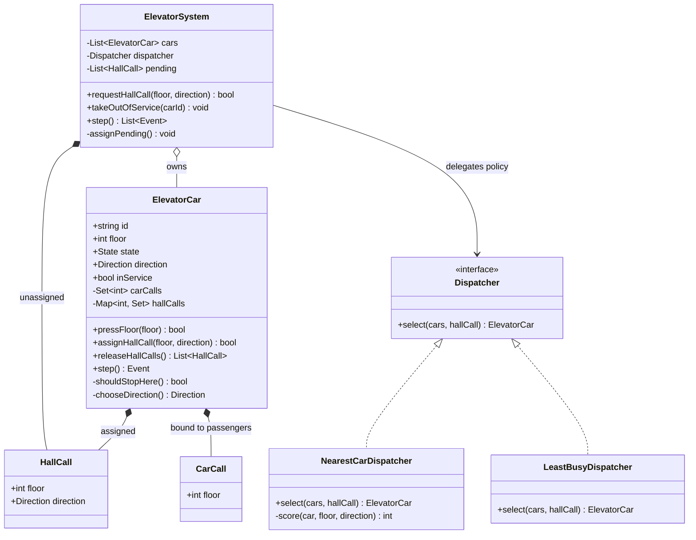
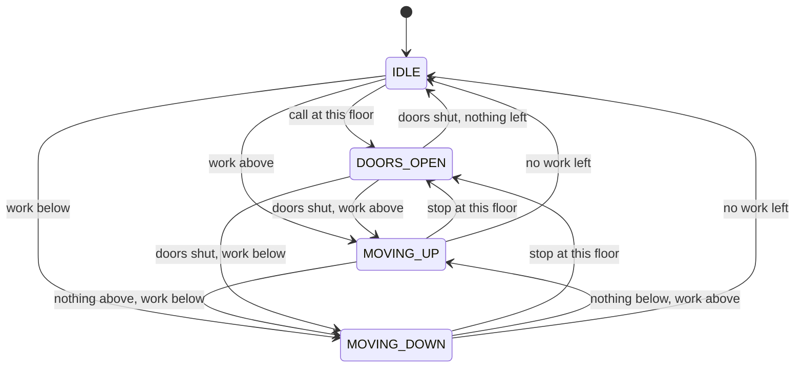

# Design an elevator system

*A bank of elevators in one building, one controller, passengers pressing
buttons on floors and inside cars.*

The problem looks like modelling hardware and is really two questions. First,
can you write a car as an explicit state machine — `IDLE`, `MOVING_UP`,
`MOVING_DOWN`, `DOORS_OPEN` — so that "moving with the doors open" is a state
you cannot reach rather than a bug you have to remember not to write. Second,
can you keep *what has been requested* separate from *who serves it*, so that
nearest-car, LOOK and round-robin are three lines of swap rather than three
rewrites. The mistake that sinks most answers is smaller than either: treating a
hall call (someone on floor 5 wants to go down) and a car call (someone inside
car B pressed 5) as the same kind of request. They are not. A hall call belongs
to the building and can be handed to any car. A car call belongs to a person
physically inside one specific car and can never be reassigned.

---

## Requirements

**Functional**
- A passenger presses up or down on a floor; the system sends a car
- A passenger inside a car presses a destination floor
- Cars move one floor at a time, stop, open doors, close doors
- Several cars serve one building under one controller
- A car can be taken out of service and its waiting passengers re-served

**Non-functional**
- **No lost calls.** An accepted request is served or stays visibly queued. It is
  never silently dropped — a dropped hall call is a person standing in a corridor
- **No starvation.** Every accepted call is eventually served
- **Policy is swappable.** Changing dispatch must not touch the car's motion code
- **Deterministic.** Driven by a tick, not by wall-clock sleeps, so the whole
  thing is unit-testable

**Out of scope** (say so): door obstruction sensors, weight and capacity limits,
fire service and emergency override, express zones and sky lobbies, the motor
control loop with its acceleration curves, per-floor access control.

## Clarifying questions to ask

**One bank, or several independent banks?**
One bank means one controller with one pending queue. Several banks means the
top-level object is a router, and "which bank" becomes a decision before "which
car".

**Does each floor have separate up and down buttons, or one button?**
This is the question that decides the whole model. Separate buttons make a hall
call *directional*, which is what forces you to be careful about which call you
clear when a car arrives. One button collapses that and makes the problem much
easier — and much less interesting.

**Is the goal average wait or worst-case wait?**
Nearest-car minimises average wait and will happily starve the top floor during
a lobby rush. If the worst case is graded, the score needs an aging term and you
should say so before you write the dispatcher.

**Does every car serve every floor?**
Restricted or express floors turn dispatch into a feasibility filter followed by
a cost comparison, rather than a pure cost comparison. That is a different method
signature, so it is worth knowing up front.

**Real time, or a discrete tick?**
A tick makes every behaviour assertable in a test with no sleeps and no
flakiness. Real time needs a scheduler. Build on the tick and put the scheduler
on the outside.

**What happens to the people inside a car that breaks down?**
The answer — that they cannot be transferred to another car — is exactly why
hall calls and car calls have to be separate types.

## Core entities

| Entity | What it owns | What it must never own |
|---|---|---|
| `ElevatorSystem` | The car list, the unassigned hall calls, the clock | How a car moves, or which floor a car stops at |
| `ElevatorCar` | Its floor, motion state, doors, and its own two call sets | Which car serves a given hall call |
| `Dispatcher` | The scoring rule for placing a hall call | Any mutable state about a car — it reads, it does not write |
| `HallCall` | A floor plus a direction | A car id; it is reassignable by definition |
| `CarCall` | A destination floor inside one car | Any existence outside its car — it is not transferable |

The two call types are the crux. `hallCalls` lives on the car only because the
dispatcher put it there, and can be taken back. `carCalls` lives on the car
because a human is standing in it.

## Class diagram



The car's state machine, which is the part the code has to make unreachable-by-
construction rather than merely correct:



There is no arrow from `DOORS_OPEN` that changes `floor`. That is the safety
property, and in the code it holds because `step()` branches on state first and
the only line that assigns to `this.floor` sits inside the motion branch.

## Implementation

The car serves its own calls with LOOK: keep going while there is work ahead in
the current direction, then turn round. It never sweeps to the top floor for no
reason, which is what separates LOOK from plain SCAN. The dispatcher is a
separate object that only reads cars and returns one.

```javascript
const Direction = Object.freeze({ UP: 'UP', DOWN: 'DOWN' });

const State = Object.freeze({
  IDLE: 'IDLE',
  MOVING_UP: 'MOVING_UP',
  MOVING_DOWN: 'MOVING_DOWN',
  DOORS_OPEN: 'DOORS_OPEN',
});

// ---------------------------------------------------------------------------
// The car: a state machine plus two separate call sets.
// ---------------------------------------------------------------------------
class ElevatorCar {
  constructor(id, { minFloor = 1, maxFloor = 10, startFloor = 1, doorTicks = 2 } = {}) {
    this.id = id;
    this.minFloor = minFloor;
    this.maxFloor = maxFloor;
    this.doorTicks = doorTicks;

    this.floor = startFloor;
    this.state = State.IDLE;
    this.direction = null;      // committed travel direction; null only when parked
    this.inService = true;

    this.carCalls = new Set();  // floors pressed inside this car
    this.hallCalls = new Map(); // floor -> Set(Direction), assigned by the dispatcher
    this._doorTicksLeft = 0;
  }

  // --- intake --------------------------------------------------------------

  pressFloor(floor) {
    this.#assertFloor(floor);
    if (floor === this.floor && this.state !== State.IDLE) return false;
    this.carCalls.add(floor);
    return true;
  }

  assignHallCall(floor, direction) {
    this.#assertFloor(floor);
    if (!this.inService) return false;
    if (!this.hallCalls.has(floor)) this.hallCalls.set(floor, new Set());
    this.hallCalls.get(floor).add(direction);
    return true;
  }

  // Taken out of service: hall calls go back to the system for reassignment,
  // car calls stay, because those passengers are physically inside this car.
  releaseHallCalls() {
    this.inService = false;
    const released = [];
    for (const [floor, dirs] of this.hallCalls) {
      for (const direction of dirs) released.push({ floor, direction });
    }
    this.hallCalls.clear();
    return released;
  }

  // --- one tick ------------------------------------------------------------

  step() {
    if (this.state === State.DOORS_OPEN) return this.#tickDoors();
    return this.#tickMotion();
  }

  #tickMotion() {
    if (this.#shouldStopHere()) return this.#openDoors();

    const dir = this.#chooseDirection();
    if (!dir) {
      this.state = State.IDLE;
      this.direction = null;
      return null;
    }

    this.direction = dir;
    this.state = dir === Direction.UP ? State.MOVING_UP : State.MOVING_DOWN;
    this.floor += dir === Direction.UP ? 1 : -1;

    return this.#shouldStopHere() ? this.#openDoors() : null;
  }

  #tickDoors() {
    this._doorTicksLeft -= 1;
    return this._doorTicksLeft > 0 ? null : this.#closeDoors();
  }

  #openDoors() {
    this.state = State.DOORS_OPEN;
    this._doorTicksLeft = this.doorTicks;
    return { type: 'DOORS_OPEN', carId: this.id, floor: this.floor };
  }

  #closeDoors() {
    this.carCalls.delete(this.floor);

    // Pick the departure direction BEFORE clearing hall calls. The direction we
    // leave in is what tells us which waiting passengers actually boarded.
    const departing = this.#chooseDirection();
    const hall = this.hallCalls.get(this.floor);
    if (hall) {
      if (departing) hall.delete(departing);
      else hall.clear();                       // nothing left anywhere: everyone boarded
      if (hall.size === 0) this.hallCalls.delete(this.floor);
    }

    this.direction = departing;
    this.state = departing
      ? (departing === Direction.UP ? State.MOVING_UP : State.MOVING_DOWN)
      : State.IDLE;
    return { type: 'DOORS_CLOSED', carId: this.id, floor: this.floor };
  }

  // --- policy --------------------------------------------------------------

  #shouldStopHere() {
    if (this.carCalls.has(this.floor)) return true;
    const hall = this.hallCalls.get(this.floor);
    if (!hall || hall.size === 0) return false;
    if (!this.direction) return true;                  // parked here: take anyone
    if (hall.has(this.direction)) return true;         // same way: they board
    return !this.#hasWorkBeyond(this.direction);       // end of the run: we reverse here
  }

  // LOOK: keep going while there is work ahead, then turn round.
  #chooseDirection() {
    const above = this.#hasWorkBeyond(Direction.UP);
    const below = this.#hasWorkBeyond(Direction.DOWN);
    if (this.direction === Direction.UP && above) return Direction.UP;
    if (this.direction === Direction.DOWN && below) return Direction.DOWN;
    if (above && below) return this.#nearestTargetDirection();
    if (above) return Direction.UP;
    if (below) return Direction.DOWN;
    return null;
  }

  #nearestTargetDirection() {
    let best = null;
    let bestDistance = Infinity;
    for (const floor of this.workFloors()) {
      const distance = Math.abs(floor - this.floor);
      if (distance > 0 && distance < bestDistance) {
        bestDistance = distance;
        best = floor > this.floor ? Direction.UP : Direction.DOWN;
      }
    }
    return best;
  }

  #hasWorkBeyond(dir) {
    return this.workFloors().some((f) =>
      dir === Direction.UP ? f > this.floor : f < this.floor);
  }

  #assertFloor(floor) {
    if (!Number.isInteger(floor) || floor < this.minFloor || floor > this.maxFloor) {
      throw new RangeError(`floor ${floor} is outside ${this.minFloor}..${this.maxFloor}`);
    }
  }

  // --- introspection -------------------------------------------------------

  workFloors() { return [...this.carCalls, ...this.hallCalls.keys()]; }
  load() { return new Set(this.workFloors()).size; }
  hasWork() { return this.workFloors().length > 0; }
  toString() { return `${this.id}@${this.floor} ${this.state} load=${this.load()}`; }
}

// ---------------------------------------------------------------------------
// Dispatch policies. Swappable: the system only calls select().
// ---------------------------------------------------------------------------
class NearestCarDispatcher {
  select(cars, { floor, direction }) {
    let best = null;
    let bestScore = Infinity;
    for (const car of cars) {
      if (!car.inService) continue;
      const score = this.#score(car, floor, direction);
      if (score < bestScore) { bestScore = score; best = car; }
    }
    return best;
  }

  #score(car, floor, direction) {
    const distance = Math.abs(car.floor - floor);
    const span = car.maxFloor - car.minFloor;
    if (car.state === State.IDLE) return distance;

    const willPass =
      (car.direction === Direction.UP && floor >= car.floor) ||
      (car.direction === Direction.DOWN && floor <= car.floor);

    if (willPass && car.direction === direction) return distance;  // free pickup
    if (willPass) return distance + span;                          // passes, wrong way
    return distance + 2 * span;                                    // must finish and come back
  }
}

class LeastBusyDispatcher {
  select(cars) {
    const available = cars.filter((c) => c.inService);
    if (available.length === 0) return null;
    return available.reduce((a, b) => (b.load() < a.load() ? b : a));
  }
}

// ---------------------------------------------------------------------------
// The system: owns the cars, the unassigned hall calls, and the clock.
// ---------------------------------------------------------------------------
class ElevatorSystem {
  constructor({ cars, dispatcher }) {
    this.cars = cars;
    this.dispatcher = dispatcher;
    this.pending = [];   // hall calls no car has accepted yet
    this.tick = 0;
  }

  setDispatcher(dispatcher) { this.dispatcher = dispatcher; }
  carFor(id) { return this.cars.find((c) => c.id === id); }

  // Pressing a lit button is a no-op, not a second request.
  requestHallCall(floor, direction) {
    if (this.#isKnown(floor, direction)) return false;
    this.pending.push({ floor, direction });
    return true;
  }

  takeOutOfService(carId) {
    const car = this.carFor(carId);
    if (!car) return;
    this.pending.push(...car.releaseHallCalls());
  }

  step() {
    this.tick += 1;
    this.#assignPending();
    const events = [];
    for (const car of this.cars) {
      const event = car.step();
      if (event) events.push({ ...event, tick: this.tick });
    }
    return events;
  }

  #assignPending() {
    const stillPending = [];
    for (const call of this.pending) {
      const car = this.dispatcher.select(this.cars, call);
      // No car took it: keep it queued. A dropped hall call is a stranded person.
      if (!car || !car.assignHallCall(call.floor, call.direction)) stillPending.push(call);
    }
    this.pending = stillPending;
  }

  #isKnown(floor, direction) {
    if (this.pending.some((c) => c.floor === floor && c.direction === direction)) return true;
    return this.cars.some((c) => c.hallCalls.get(floor)?.has(direction));
  }

  idle() { return this.pending.length === 0 && this.cars.every((c) => !c.hasWork()); }
}

// ---------------------------------------------------------------------------
// Usage
// ---------------------------------------------------------------------------
const system = new ElevatorSystem({
  cars: [
    new ElevatorCar('A', { startFloor: 1 }),
    new ElevatorCar('B', { startFloor: 6 }),
  ],
  dispatcher: new NearestCarDispatcher(),
});

system.requestHallCall(7, Direction.DOWN);  // B is parked at 6, one floor away
system.requestHallCall(2, Direction.UP);    // A is parked at 1
system.requestHallCall(7, Direction.DOWN);  // duplicate press: ignored

const destinations = { 7: 1, 2: 9 };        // where each waiting passenger wants to go
const boarded = new Set();

for (let t = 0; t < 30 && !(system.idle() && t > 0); t++) {
  for (const e of system.step()) {
    console.log(`t=${String(e.tick).padStart(2)}  ${e.type.padEnd(13)} car ${e.carId} @ ${e.floor}`);
    if (e.type === 'DOORS_OPEN' && !boarded.has(e.carId) && destinations[e.floor]) {
      boarded.add(e.carId);
      const dest = destinations[e.floor];
      system.carFor(e.carId).pressFloor(dest);
      console.log(`      passenger boards ${e.carId} and presses ${dest}`);
    }
  }
}

console.log('\nfinal:', system.cars.map(String).join(' | '));
```

Running it:

```
t= 1  DOORS_OPEN    car A @ 2
      passenger boards A and presses 9
t= 1  DOORS_OPEN    car B @ 7
      passenger boards B and presses 1
t= 3  DOORS_CLOSED  car A @ 2
t= 3  DOORS_CLOSED  car B @ 7
t= 9  DOORS_OPEN    car B @ 1
t=10  DOORS_OPEN    car A @ 9
t=11  DOORS_CLOSED  car B @ 1
t=12  DOORS_CLOSED  car A @ 9

final: A@9 IDLE load=0 | B@1 IDLE load=0
```

## Design patterns used

| Pattern | Where | What it buys |
|---|---|---|
| **Strategy** | `Dispatcher` with `NearestCarDispatcher` / `LeastBusyDispatcher`, injected and swappable via `setDispatcher` | Dispatch policy changes without touching a line of motion code. This is the point of the whole separation |
| **State machine** | `ElevatorCar.state` with `step()` branching on it | Illegal states stop being something you remember to avoid. `step()` cannot move the car while the doors are open because the door branch returns first |
| **Observer (light)** | `step()` returns events; the caller reacts to `DOORS_OPEN` | The car knows nothing about passengers. The test harness, a simulator and a real button panel all attach the same way |

`Singleton` is the pattern people reach for here — one global controller. Resist
it. It buys nothing and it makes two tests in the same process share a building.

## Concurrency / edge cases

**Two people press the same button.** `requestHallCall` checks pending *and*
every car's assigned calls before queueing. Without that check the same floor is
dispatched twice and two cars race to an empty corridor. The physical button is
already idempotent — it is lit or it is not — so the model must be too.

**Two cars racing for the same call.** Assignment happens in exactly one place,
`#assignPending`, in one pass, on the controller. `Dispatcher.select` is pure: it
reads cars and returns one, mutating nothing. The mutation is the following
`assignHallCall`. In a real threaded controller, select-then-assign is the
critical section and must be held together — scoring against a snapshot and
assigning later is how you get two cars sent to floor 5.

**Clearing both directions at a stop.** A car arrives at floor 5 going up. Floor
5 has both up and down lit. Clear both and the down passenger is left with an
unlit button and no car coming — the system believes they were served. The code
picks its departure direction first and clears only that one, so the down call
survives and gets picked up on the way back. This is the single most common bug
in this problem, and the reason hall calls are keyed by `(floor, direction)`
rather than by floor.

**A car fails mid-run.** `takeOutOfService` returns its hall calls to the pending
queue for reassignment, and keeps its car calls, because those passengers are
physically inside it. The car accepts no new work, finishes dropping the people
it has, and parks. A hall call clears only when the doors close, so a car pulled
out of service while standing at a floor with doors open hands that call back
too — nobody is stranded by a well-timed failure.

**No car available at all.** The call stays in `pending` and is retried every
tick. It is visibly queued rather than quietly gone. The failure is loud, which
is the property you want.

**A state that must not be reachable.** `MOVING_*` while the doors are open. The
door countdown and the motion logic are different branches of `step()` and the
door branch returns early, so `this.floor` cannot change while
`state === DOORS_OPEN`.

**Pressing the floor you are standing on.** Accepted when idle, ignored while
moving. Without the guard, a passenger pressing the floor the car has just left
makes it stop where it already was.

**Starvation.** `NearestCarDispatcher` has no aging term, so a busy lobby can
keep floor 10 waiting indefinitely. Name this before the interviewer does; the
fix is the first follow-up below.

## Follow-ups they will ask

**How do you stop the top floor starving?**
Add elapsed wait time to the score: `score = distance - k * ticksWaiting`. It
bounds worst-case wait at the cost of a slightly worse average. The point is
that it is a change to one private method on the dispatcher and nothing else.

**Destination dispatch — passengers enter their floor in the lobby.**
Hall and car calls collapse into one request type that is known *before*
boarding, which lets the controller group passengers by destination and assign
whole groups to a car. It makes dispatch much better and the model simpler, and
it is why modern high-rises do it.

**Multiple banks, or express floors.**
Give the car a `servesFloor(floor)` predicate. The dispatcher filters on
feasibility first, then scores what is left. Do not fold it into the score — an
infeasible car with a low distance will win.

**Real time instead of ticks.**
Keep `step()` as the unit of behaviour and drive it from a scheduler that fires
once per floor-travel-time, with a separate timer for the door dwell. Tests keep
calling `step()` directly and stay fast and deterministic.

**What survives a controller restart?**
Hall calls should be persisted — the buttons in the building are still lit and
the people are still waiting. Car calls should not: the car will be re-entered
and the floors re-pressed, and restoring stale ones sends an empty car on a tour.
The asymmetry falls straight out of the entity split.

**Fire service and emergency recall.**
Model it as a mode flag checked at the top of `step()`, not as a fifth motion
state. It drops every call, runs the car to the designated floor and parks with
the doors open. Making it a state would mean every existing transition has to
learn about it.
