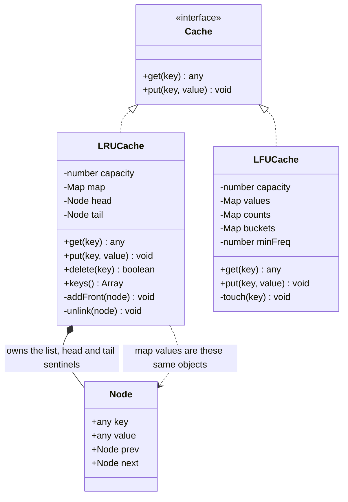

# LRU Cache

Build a fixed-capacity key-value store where `get` and `put` are both O(1), and
when the store is full the least recently used entry is evicted to make room.
The design decision being probed is not eviction policy — it is that **no single
data structure gives you both properties**. A hash map gives you O(1) lookup and
no notion of order. A list gives you order and O(n) lookup. The answer is to run
both over *the same node objects*: the map's value is a pointer into the list, so
finding a key lands you exactly at the position you need to splice. Everything
else in this problem is bookkeeping around that one idea.

---

## Requirements

**Functional**
- `get(key)` returns the value, or a miss, and marks the key as most recently used
- `put(key, value)` inserts or updates, and marks the key as most recently used
- When inserting past capacity, evict the least recently used key
- `delete(key)` removes an entry early

**Non-functional / constraints**
- `get` and `put` are O(1) worst case, not amortised-with-an-occasional-scan
- Memory is O(capacity) — no tombstones, no growing side structures
- Capacity is fixed at construction and counted in entries
- Single process, single logical owner of the cache

**Out of scope**, and worth saying out loud: TTL expiry, persistence across
restarts, eviction by memory footprint rather than entry count, coherence across
processes or machines, and metrics. Each one changes the design; I'd rather scope
them out and be asked to add one back than silently assume.

## Clarifying questions to ask

**"Is capacity entries or bytes?"** Entries means evicting exactly one item per
insert. A byte budget means every value needs a size function and eviction
becomes a loop that runs until there is room — and a single oversized value can
empty the cache.

**"On a miss, does `get` just return nothing, or does it load the value?"** A
plain cache is synchronous and trivial. A *loading* cache is async, which drags
in cache stampede (N callers missing the same key), and what to store when the
loader throws. Completely different problem.

**"Does overwriting an existing key count as a use?"** It decides whether `put`
promotes a key to most-recent. Almost always yes, but if the answer is no, a
write-heavy workload will evict keys that were just written.

**"Do you need an eviction hook?"** If values hold file handles, sockets or
anything that must be released, eviction has to call back into the caller. That
turns a silent internal operation into part of the public contract, and it must
fire for `delete` and capacity-resize too.

**"Is this accessed concurrently?"** This is the one people skip. `get` *mutates*
— it reorders the list. So a reader-writer lock buys nothing, because there are
no pure readers. That single fact reshapes the whole design.

**"Can capacity change at runtime?"** Shrinking means evicting in a loop, and it
is the only path that evicts more than one entry at a time.

## Core entities

| Entity | Owns | Must never own |
|---|---|---|
| `Node` | `key`, `value`, `prev`, `next` | Any reference to the cache, the capacity, or the eviction rule. It is a record, not an actor. |
| The linked list (head/tail sentinels) | Recency order, and the splice operations that maintain it | The key→node index, or the decision that an eviction should happen |
| `LRUCache` | Capacity, the map, and the policy — *when* to evict | The pointer surgery. It says "unlink this node"; it does not rewrite four pointers inline. |

The line worth defending in the interview: **`Node` carries its own `key`**. It
looks redundant — you reached the node *through* the key. But eviction starts at
the tail of the list, where you have a node and no key, and you still have to
remove it from the map. Without the back-reference you cannot, and the map leaks
an entry pointing at a node that is no longer in the list. That is the single
most common bug in this problem.

## Class diagram



Two edges between `LRUCache` and `Node` on purpose. There is exactly one `Node`
per entry, reachable two ways — by key through the map, and by position through
the list. Drawing it as one relationship hides the whole trick.

## Implementation

### The version to write in an interview

```js
class Node {
  // No default values. `new Node(key, undefined)` with a default would quietly
  // rewrite a legitimately-stored undefined into null. The sentinels are built
  // with no arguments and their key and value are never read.
  constructor(key, value) {
    this.key = key;
    this.value = value;
    this.prev = null;
    this.next = null;
  }
}

class LRUCache {
  constructor(capacity) {
    if (!Number.isInteger(capacity) || capacity <= 0) {
      throw new RangeError('capacity must be a positive integer');
    }
    this.capacity = capacity;
    this.map = new Map();

    // Sentinels. head.next is the most recent, tail.prev is the least recent.
    // They are never removed, so unlink() and addFront() never see a null
    // neighbour and need no branches at all.
    this.head = new Node();
    this.tail = new Node();
    this.head.next = this.tail;
    this.tail.prev = this.head;
  }

  unlink(node) {
    node.prev.next = node.next;
    node.next.prev = node.prev;
    node.prev = null;
    node.next = null;
  }

  addFront(node) {
    node.prev = this.head;
    node.next = this.head.next;
    this.head.next.prev = node;
    this.head.next = node;
  }

  get(key) {
    const node = this.map.get(key);
    if (node === undefined) return undefined;
    this.unlink(node);
    this.addFront(node);
    return node.value;
  }

  has(key) {
    return this.map.has(key);
  }

  put(key, value) {
    const existing = this.map.get(key);
    if (existing !== undefined) {
      existing.value = value;
      this.unlink(existing);
      this.addFront(existing);
      return;
    }

    if (this.map.size === this.capacity) {
      const lru = this.tail.prev;
      this.unlink(lru);
      this.map.delete(lru.key); // only possible because the node knows its key
    }

    const node = new Node(key, value);
    this.map.set(key, node);
    this.addFront(node);
  }

  delete(key) {
    const node = this.map.get(key);
    if (node === undefined) return false;
    this.unlink(node);
    this.map.delete(key);
    return true;
  }

  get size() {
    return this.map.size;
  }

  // Most recent first. Useful for tests, and for proving the order is right.
  keys() {
    const out = [];
    for (let n = this.head.next; n !== this.tail; n = n.next) out.push(n.key);
    return out;
  }
}
```

Every operation is a fixed number of pointer writes and one hash operation. No
loops, no scans, so the O(1) claim is worst case, not amortised.

Two details that carry weight. `unlink` nulls `prev` and `next` after detaching —
a detached node holding stale pointers keeps its old neighbours alive and hides
double-unlink bugs, since the second call would happily corrupt the list instead
of crashing. And `put` writes the eviction *before* the insertion, so the cache
is never transiently over capacity.

### The JavaScript shortcut

`Map` iterates in insertion order, and `delete` then `set` moves a key to the
end. So the end of a `Map` is the most recent key, and `map.keys().next().value`
is the oldest — the LRU — in O(1).

```js
class LRUCacheMap {
  constructor(capacity) {
    this.capacity = capacity;
    this.map = new Map();
  }

  get(key) {
    if (!this.map.has(key)) return undefined;       // has(), not a truthy check
    const value = this.map.get(key);
    this.map.delete(key);
    this.map.set(key, value);                       // re-insert at the end
    return value;
  }

  put(key, value) {
    if (this.map.has(key)) {
      this.map.delete(key);
    } else if (this.map.size >= this.capacity) {
      this.map.delete(this.map.keys().next().value); // the first key is the LRU
    }
    this.map.set(key, value);
  }

  get size() {
    return this.map.size;
  }

  keys() {
    return [...this.map.keys()].reverse();           // most recent first
  }
}
```

Fifteen lines instead of eighty, and it is correct.

**Write the map-plus-list version anyway.** Say the `Map` trick out loud first —
it takes twenty seconds and it shows you know the language — then write the real
one, for three reasons:

- The interviewer is checking whether you understand *why* O(1) is reachable
  here. `Map` insertion order is a language guarantee you are borrowing; it is
  not an argument you made.
- You cannot build the variants on top of it. TTL ordering, segmented LRU,
  frequency buckets, an eviction callback that needs the node — every follow-up
  question needs the explicit structure back.
- Every `get` becomes a hash delete plus a hash insert, instead of four pointer
  writes on objects you already hold. Same complexity class, more work per call
  on the hottest path in the system.

The one time to ship the `Map` version: it is a warm-up in a JavaScript-heavy
round and they want the whole thing in five minutes. Then it is the right answer
and reaching for sentinel nodes reads as not knowing your own runtime.

### Usage

```js
const cache = new LRUCache(3);
cache.put('a', 1);
cache.put('b', 2);
cache.put('c', 3);
console.log(cache.keys());        // [ 'c', 'b', 'a' ]

cache.get('a');                   // 'a' is now most recent
console.log(cache.keys());        // [ 'a', 'c', 'b' ]

cache.put('d', 4);                // full, so 'b' (the tail) is evicted
console.log(cache.keys());        // [ 'd', 'a', 'c' ]
console.log(cache.get('b'));      // undefined

cache.put('a', 99);               // update, not insert: size stays 3
console.log(cache.size, cache.get('a'));  // 3 99
```

## LFU, and why it is the harder question

LRU asks "who was touched longest ago". LFU asks "who was touched fewest times".
They disagree in exactly the case that matters: a key hit a thousand times last
week and not since is the *first* thing LRU throws away and the *last* thing LFU
does.

The naive LFU is a map of key to count, and eviction scans for the minimum. That
is O(n) per eviction, and it is where most people stop. The step up is the same
step as in LRU: **stop searching for the minimum, maintain it.**

Three pieces:

1. `counts` — key to its current frequency.
2. `buckets` — frequency to the set of keys at that frequency, kept in insertion
   order so ties break by least-recently-used.
3. `minFreq` — an integer pointing at the lowest non-empty bucket.

The insight that makes `minFreq` cheap is that it only ever moves in two ways.
A new key enters at frequency 1, so `minFreq` drops to 1. A key is touched, which
moves it from bucket `f` to bucket `f + 1`; if that emptied bucket `f` *and* `f`
was the minimum, then the new minimum is exactly `f + 1` — nothing can sit
between them, because frequencies increase one at a time. So `minFreq` is updated
by an increment, never by a search.

Here a `Map` used as an ordered set is the right tool rather than a shortcut,
because "oldest key in this bucket" is exactly the query and there is no pointer
splicing to do. In a language without ordered maps you would hang a doubly linked
list off each bucket, which is the canonical textbook answer.

```js
class LFUCache {
  constructor(capacity) {
    if (!Number.isInteger(capacity) || capacity <= 0) {
      throw new RangeError('capacity must be a positive integer');
    }
    this.capacity = capacity;
    this.values = new Map();   // key -> value
    this.counts = new Map();   // key -> frequency
    this.buckets = new Map();  // frequency -> Map used as an insertion-ordered set
    this.minFreq = 0;
  }

  bucket(freq) {
    let b = this.buckets.get(freq);
    if (b === undefined) {
      b = new Map();
      this.buckets.set(freq, b);
    }
    return b;
  }

  touch(key) {
    const freq = this.counts.get(key);
    const from = this.buckets.get(freq);
    from.delete(key);

    if (from.size === 0) {
      this.buckets.delete(freq);
      // The only bucket that could have been the minimum is this one, and the
      // key just landed in freq + 1, so that is the new minimum. No scan.
      if (this.minFreq === freq) this.minFreq = freq + 1;
    }

    this.counts.set(key, freq + 1);
    this.bucket(freq + 1).set(key, true);
  }

  get(key) {
    if (!this.values.has(key)) return undefined;
    this.touch(key);
    return this.values.get(key);
  }

  put(key, value) {
    if (this.values.has(key)) {
      this.values.set(key, value);
      this.touch(key);
      return;
    }

    if (this.values.size === this.capacity) {
      const victims = this.buckets.get(this.minFreq);
      const victim = victims.keys().next().value; // oldest at the lowest frequency
      victims.delete(victim);
      if (victims.size === 0) this.buckets.delete(this.minFreq);
      this.values.delete(victim);
      this.counts.delete(victim);
    }

    this.values.set(key, value);
    this.counts.set(key, 1);
    this.bucket(1).set(key, true);
    this.minFreq = 1; // a brand new key is always the least frequent
  }

  get size() {
    return this.values.size;
  }
}
```

```js
const lfu = new LFUCache(2);
lfu.put('a', 1);
lfu.put('b', 2);
lfu.get('a');            // 'a' is now at frequency 2, 'b' at 1
lfu.put('c', 3);         // evicts 'b', the least frequent
console.log(lfu.get('b'), lfu.get('a'), lfu.get('c')); // undefined 1 3
```

**Say the weakness before they ask.** LFU has no forgetting. A key that was hot
during a launch and is now dead carries its count forever and is effectively
pinned, while genuinely useful new keys churn through frequency 1 and get evicted
before they can build a count. The production fixes are aging (periodically halve
every counter) or a windowed approximate counter such as a count-min sketch with
decay — which is what modern caches actually do, paired with a small LRU window
to admit new keys. LRU has the mirror weakness: one sequential scan over a large
table touches every key once and flushes the entire working set.

| | LRU | LFU |
|---|---|---|
| Evicts | Oldest touch | Lowest touch count, ties by oldest |
| State per key | Position in one list | A count plus a position in one bucket |
| Breaks on | A sequential scan flushes everything | Stale hot keys never leave |
| Cost of a hit | Splice one node | Move between two buckets, maybe move `minFreq` |
| Reach for it when | Recency predicts reuse — most workloads | A stable, skewed popularity distribution |

## Design patterns used

| Pattern | Where | What it buys |
|---|---|---|
| Sentinel node | `head` and `tail` dummies that hold no data and are never removed | `unlink` and `addFront` have no null checks and no special case for an empty list or a single element. The branch-free version is the correct version because there is nothing left to get wrong. |
| Intrusive container | `Node` carries `prev`, `next` *and* `key`, and the map stores the node itself | The lookup result *is* the splice point. A non-intrusive list would hand you a value and leave you scanning for its position, which is the O(n) you were trying to avoid. |
| Strategy | `LRUCache` and `LFUCache` behind the same `get`/`put` surface | The eviction policy is swappable without the caller knowing. Which is the point — callers care that the cache is bounded, not how it chooses. |
| Facade | `LRUCache` over a map plus a list | The two-structure invariant is never exposed, so no caller can put them out of sync. There is no public method that touches only one of them. |

Note what is absent. There is no factory, no builder, no observer. An eviction
callback would be an observer and is a reasonable extension, but it is not here,
so it does not go in the table. A four-row honest list reads better than an
eight-row one where half the rows are aspirational.

## Concurrency / edge cases

**`get` is a write.** This is the trap, and it is worth stating unprompted. A
reader-writer lock is useless here because there are no readers: every successful
`get` reorders the list. In a threaded runtime the whole operation needs the
exclusive lock, which makes the cache a single point of contention exactly when
it is most valuable. Real systems avoid that by sharding — N independent caches,
key hashed to a shard, each with its own lock — which also gives N independent
LRU orders, a deliberate approximation. Or they drop the list entirely for CLOCK
/ second-chance, where a hit sets one bit and needs no lock at all.

**Two callers racing to fill the same missing key.** In Node the cache methods
themselves cannot interleave, but an async loader around them can: two callers
both miss, both start the expensive fetch, both write. The fix is to store the
*promise* in the cache, not the value, so the second caller finds the in-flight
promise and awaits it. That turns N concurrent misses into one load.

**Partial failure mid-load.** If you cache promises, a rejected promise is now a
cached failure that every future caller will await and re-throw. Delete the entry
in the rejection path, and delete it by identity — check that the entry still
holds *this* promise before deleting, or a retry that already succeeded gets
wiped by the previous attempt's cleanup.

**The state that must never be reachable: map and list disagreeing.** A node in
the list with no map entry leaks memory that no `get` can ever reach. A map entry
pointing at an unlinked node returns values that eviction can never remove, so
the cache grows past capacity forever. Both come from the same mistake — a path
that touches one structure and not the other. Every mutating path here changes
both, in the same method, with no early return between them. If you want one
assertion in a test, assert `map.size === keys().length`.

**Re-entrancy.** If an eviction callback, a getter on a stored value, or a proxy
calls back into the cache while `put` is mid-flight, it observes a half-updated
state. Fire eviction callbacks *after* the structures are consistent, not between
the unlink and the map delete.

**Capacity 1.** Every insert evicts the previous entry. Worth tracing by hand,
because a `put` of a key that is already the only entry must take the update path
and not evict itself.

**Storing `undefined` as a value.** `get` returning `undefined` then means both
"missing" and "present, holding undefined". That is why the map lookup is checked
against `undefined` on the *node*, which is never undefined for a live key, and
why a separate `has()` exists.

**Eviction picks the node, not the key.** Always `this.tail.prev`, never a key
you happen to be holding. The tail sentinel guarantees that pointer is valid even
mid-operation.

## Follow-ups they will ask

**"Add a TTL."** Store an expiry on the node and check it lazily on `get`,
treating an expired entry as a miss and deleting it. Eager cleanup needs a second
ordering by expiry time — a min-heap or a set of time buckets — because the LRU
list is ordered by recency, and recency order is not expiry order.

**"Make it thread-safe."** Shard by `hash(key) % N` into N independent caches,
each with its own lock. Contention drops by roughly N, at the cost of a global
LRU order becoming N local ones — which is a fine trade, since nobody can observe
the difference. The alternative is CLOCK, which replaces the ordered list with a
ring and one reference bit per entry, so a hit is a single non-blocking write.

**"Capacity in bytes, not entries."** Each value needs a size, eviction becomes
`while (bytes > budget) evictOne()`, and you must reject or specially handle a
single value larger than the whole budget — otherwise the loop empties the cache
and still has no room.

**"Distribute it across machines."** Consistent hashing puts each key on one
node, and each node runs this exact structure locally. The hard part is not the
cache, it is invalidation: with one owner per key you get cheap correctness, and
the price is that losing a node cold-starts its whole key range.

**"Both recency and frequency."** This is the real production answer, and it is
where LRU-versus-LFU stops being a binary choice. Segmented designs admit new
keys into a small recency-ordered window and promote survivors into a larger
frequency-governed region, so a scan only pollutes the window. ARC and W-TinyLFU
are the two names worth having ready.
