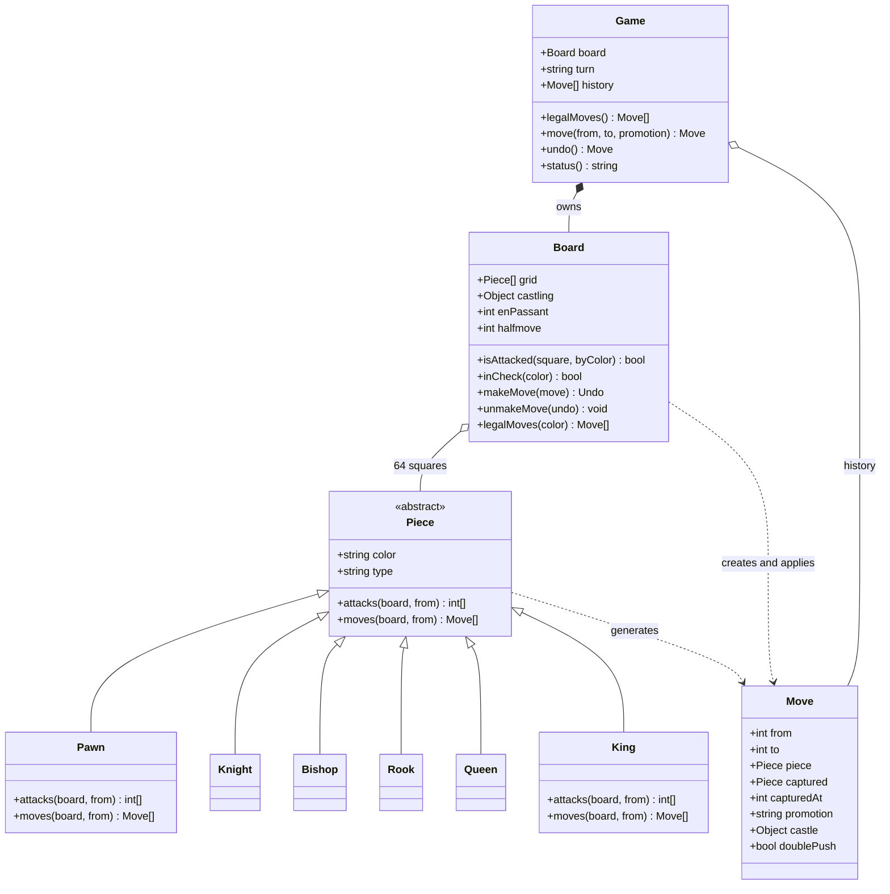

# Design chess

*The polymorphism problem. Six pieces, six movement rules, one board — and a
pile of rules that do not belong to any single piece.*

---

The obvious model writes itself: an abstract `Piece`, six subclasses, each one
answering "where can I go from here". That takes ten minutes and it is not what
is being graded.

What is being graded is the second half: **castling, en passant, promotion and
check do not belong to a piece.** Castling moves two pieces and depends on
history. En passant depends on the opponent's previous move. Whether a move is
legal at all depends on the resulting position, not the current one — a pinned
knight generates eight moves and can play none of them. So the real design
decision is *where the rules live*: pieces know shapes, the board knows
legality, and the two are joined by a filter that plays each candidate move,
asks one question, and takes it back.

Do not write an engine. Write the model and the validation pipeline.

## Requirements

**Functional**
- Set up a standard game; two players alternate, White first
- Generate the legal moves for the side to move
- Accept or reject a submitted move
- Support the full move set: sliding pieces, knight, pawn push and double push,
  castling both sides, en passant, promotion to any of four pieces
- Detect check, checkmate, stalemate, and the drawn positions (fifty-move,
  threefold repetition, insufficient material)
- Take a move back

**Non-functional / constraints**
- Rule correctness is the product. A single bad move invalidates the game.
- One board object is the single source of truth. No rule may be enforced in two
  places, or the two copies will drift.
- Adding a piece with new movement must not touch the board, the game loop, or
  any other piece.
- Move generation must be fast enough to run thousands of times per position —
  the legal-move filter already multiplies the work by the cost of a simulation.

**Out of scope:** move evaluation and search (no engine), opening books, clocks
and time control, network transport, rendering, PGN/FEN parsing, variants.

## Clarifying questions to ask

| Question | Why it changes the design |
|---|---|
| Am I building a rules engine or a playing engine? | A playing engine needs bitboards, incremental attack maps and a transposition table. A rules engine can afford an object per piece and a 64-slot array. These are different programs. |
| Does the caller submit a move and expect a verdict, or ask for the legal moves and pick one? | Ask-then-pick means generation is the primary API and validation falls out of it for free. Submit-then-verdict tempts you into a separate validation path, which is the same rules written twice. |
| Do I need undo, or only forward play? | Undo forces a move to carry everything the position lost — captured piece, castling rights, en passant square, halfmove clock. That reverses the data flow, and it is exactly what the legal filter needs anyway. |
| Do draws count, and which ones? | Threefold repetition needs a hash of the *position*, not the move list. Fifty-move needs a halfmove counter reset on pawn moves and captures. Both are board state you will not add later cheaply. |
| Multiple games in one process, or one? | Multiple means no global state and no singletons, and it makes the board's mutability an explicit, owned thing. |
| Is the board always 8×8 with the standard army? | If Chess960 or a custom setup is in scope, castling cannot be hardcoded to e1–g1 and the rook file becomes state. |

## Core entities

| Entity | Owns | Must never own |
|---|---|---|
| `Piece` | Its colour and its movement shape from a square, given the occupancy it is handed | Its own coordinates; knowledge of check; the board array |
| `Move` | A complete, replayable description of one action — from, to, captured piece *and the square it stood on*, promotion, rook relocation | Any rule about whether it is allowed |
| `Board` | The 64 squares, castling rights, the en passant target, the halfmove clock, make/unmake, attack detection, the legal-move filter | Turn order, move history, game result |
| `Game` | Whose turn it is, the move history, repetition counts, the terminal verdict | Any movement rule; it asks the board and never decides |

The line that matters is the third row. A piece is handed a board and returns
squares. It never asks whether the king is safe, because the answer depends on
pieces it cannot see.

## Class diagram



`Pawn` and `King` are drawn with both methods because they are the two that
override `moves` as well as `attacks`. The other four inherit the default: take
the squares I attack, drop the ones holding my own pieces, wrap each in a move.

## Implementation

Squares are integers 0–63, row 0 being rank 8. Integers compare with `===`,
which objects and `[r, c]` pairs do not — and a move set is something you look
things up in constantly.

```js
const WHITE = 'w', BLACK = 'b';
const other = c => (c === WHITE ? BLACK : WHITE);
const FILES = 'abcdefgh';
const idx = (r, c) => r * 8 + c;
const rowOf = i => i >> 3;
const colOf = i => i & 7;
const onBoard = (r, c) => r >= 0 && r < 8 && c >= 0 && c < 8;
const alg = i => FILES[colOf(i)] + (8 - rowOf(i));
const sq = s => idx(8 - Number(s[1]), FILES.indexOf(s[0]));

const ORTHO = [[-1, 0], [1, 0], [0, -1], [0, 1]];
const DIAG = [[-1, -1], [-1, 1], [1, -1], [1, 1]];
const STAR = [...ORTHO, ...DIAG];
const KNIGHT = [[-2, -1], [-2, 1], [-1, -2], [-1, 2], [1, -2], [1, 2], [2, -1], [2, 1]];

// Walk `deltas` from `from`, stopping at the first occupied square (inclusive).
function ray(board, from, deltas, limit = 8) {
  const out = [], r0 = rowOf(from), c0 = colOf(from);
  for (const [dr, dc] of deltas) {
    for (let k = 1; k <= limit; k++) {
      const r = r0 + dr * k, c = c0 + dc * k;
      if (!onBoard(r, c)) break;
      const to = idx(r, c);
      out.push(to);
      if (board.get(to)) break;
    }
  }
  return out;
}
```

One `ray` with a step limit covers five of the six pieces. A knight is a
one-step walk down eight directions; a king is a one-step walk down the queen's
eight. Writing separate loops per piece is the first place this design leaks.

A `Move` must carry enough to be undone, which means the captured piece *and*
the square it occupied. Those differ only for en passant, and that one
divergence is why `capturedAt` exists as a field rather than being assumed equal
to `to`.

```js
class Move {
  constructor(spec) {
    Object.assign(this, {
      captured: null, capturedAt: null, promotion: null,
      castle: null, doublePush: false, enPassant: false,
    }, spec);
  }
  toString() { return alg(this.from) + alg(this.to) + (this.promotion || ''); }
}
```

Now the hierarchy. Each piece exposes two things, and the split between them is
the load-bearing decision in the whole design.

`attacks` answers "which squares do I control", and is used by check detection.
`moves` answers "which moves may I write down", and is used by the generator.
For four pieces they are the same set. For a pawn they are emphatically not — a
pawn moves forward and attacks diagonally, and a check-detector that confuses
the two will let a king walk in front of a pawn and call it safe. For a king,
`attacks` is the eight neighbours and `moves` additionally includes castling.

```js
class Piece {
  constructor(color) { this.color = color; }
  get type() { throw new Error('abstract'); }
  get char() { return this.color === WHITE ? this.type.toUpperCase() : this.type; }
  // Squares this piece controls. Never consults castling or check.
  attacks(board, from) { throw new Error('abstract'); }
  // Pseudo-legal moves: shape-correct, may still leave the king in check.
  moves(board, from) {
    return this.attacks(board, from)
      .filter(to => { const p = board.get(to); return !p || p.color !== this.color; })
      .map(to => new Move({
        from, to, piece: this,
        captured: board.get(to), capturedAt: board.get(to) ? to : null,
      }));
  }
}

class Knight extends Piece {
  get type() { return 'n'; }
  attacks(board, from) { return ray(board, from, KNIGHT, 1); }
}
class Bishop extends Piece {
  get type() { return 'b'; }
  attacks(board, from) { return ray(board, from, DIAG); }
}
class Rook extends Piece {
  get type() { return 'r'; }
  attacks(board, from) { return ray(board, from, ORTHO); }
}
class Queen extends Piece {
  get type() { return 'q'; }
  attacks(board, from) { return ray(board, from, STAR); }
}
```

Four pieces, four lines of movement each. That is what the `attacks`/`moves`
split buys.

The pawn is the piece that breaks every simplifying assumption: it is the only
one that moves and captures differently, the only one with a first-move bonus,
the only one that captures a square it does not land on, and the only one that
changes type. Promotion is emitted as **four separate moves**, not one move with
a to-be-decided piece — otherwise the move is not a complete description of an
action and every consumer has to ask a follow-up question.

```js
class Pawn extends Piece {
  get type() { return 'p'; }
  get dir() { return this.color === WHITE ? -1 : 1; }
  attacks(board, from) {
    const r = rowOf(from) + this.dir, c = colOf(from), out = [];
    for (const dc of [-1, 1]) if (onBoard(r, c + dc)) out.push(idx(r, c + dc));
    return out;
  }
  moves(board, from) {
    const out = [], r = rowOf(from), c = colOf(from), d = this.dir;
    const home = this.color === WHITE ? 6 : 1;
    const last = this.color === WHITE ? 0 : 7;
    const add = spec => {
      if (rowOf(spec.to) === last) {
        for (const t of ['q', 'r', 'b', 'n']) out.push(new Move({ ...spec, promotion: t }));
      } else out.push(new Move(spec));
    };
    if (onBoard(r + d, c) && !board.get(idx(r + d, c))) {
      add({ from, to: idx(r + d, c), piece: this });
      if (r === home && !board.get(idx(r + 2 * d, c))) {
        out.push(new Move({ from, to: idx(r + 2 * d, c), piece: this, doublePush: true }));
      }
    }
    for (const dc of [-1, 1]) {
      if (!onBoard(r + d, c + dc)) continue;
      const to = idx(r + d, c + dc), target = board.get(to);
      if (target && target.color !== this.color) {
        add({ from, to, piece: this, captured: target, capturedAt: to });
      } else if (!target && board.enPassant === to) {
        out.push(new Move({
          from, to, piece: this, enPassant: true,
          captured: board.get(idx(r, c + dc)), capturedAt: idx(r, c + dc),
        }));
      }
    }
    return out;
  }
}
```

En passant is only one extra branch because the *availability* of the capture is
board state, not pawn state. The board remembers one square — the square the
double-pushed pawn skipped — and clears it after any move. A pawn asks "is that
square the en passant target"; it never inspects history. That is the
simplification that makes the rule cheap.

The king generates castling, and castling is where two traps live. The first:
the rook must actually be a rook of the right colour sitting on the corner, not
merely a right that says it may be. The second, more dangerous: castling
legality asks whether squares are attacked, and attack detection iterates every
enemy piece. If the enemy king's move generator also generated castling, that
call would recurse forever. It does not, because `attacks` never mentions
castling. This is the concrete payoff of splitting the two methods.

```js
class King extends Piece {
  get type() { return 'k'; }
  attacks(board, from) { return ray(board, from, STAR, 1); }
  moves(board, from) {
    const out = super.moves(board, from);
    const row = this.color === WHITE ? 7 : 0;
    if (from !== idx(row, 4)) return out;
    const foe = other(this.color);
    const empty = (...cs) => cs.every(c => !board.get(idx(row, c)));
    const safe = (...cs) => cs.every(c => !board.isAttacked(idx(row, c), foe));
    const rookAt = c => {
      const p = board.get(idx(row, c));
      return p && p.type === 'r' && p.color === this.color;
    };
    const side = this.color === WHITE ? 'w' : 'b';
    if (board.castling[side + 'K'] && rookAt(7) && empty(5, 6) && safe(4, 5, 6)) {
      out.push(new Move({ from, to: idx(row, 6), piece: this,
        castle: { rookFrom: idx(row, 7), rookTo: idx(row, 5) } }));
    }
    if (board.castling[side + 'Q'] && rookAt(0) && empty(1, 2, 3) && safe(4, 3, 2)) {
      out.push(new Move({ from, to: idx(row, 2), piece: this,
        castle: { rookFrom: idx(row, 0), rookTo: idx(row, 3) } }));
    }
    return out;
  }
}

const TYPES = { p: Pawn, n: Knight, b: Bishop, r: Rook, q: Queen, k: King };
const make = (type, color) => new TYPES[type](color);
```

Note `safe(4, 5, 6)` includes square 4 — the king's own square. You may not
castle *out of* check, *through* check, or *into* check, and all three are the
same check on three squares.

Castling rights are board state, not a `hasMoved` flag on the piece, for two
reasons. They must be snapshotted and restored on undo, and they die when the
**rook is captured on its home square** — an event the rook is not around to
observe. Keying invalidation on both the origin and the destination of every
move handles moving and capturing in one rule.

```js
// Moving from or to one of these squares kills the listed castling rights.
const RIGHTS_KILLED = [
  [idx(7, 4), ['wK', 'wQ']], [idx(7, 0), ['wQ']], [idx(7, 7), ['wK']],
  [idx(0, 4), ['bK', 'bQ']], [idx(0, 0), ['bQ']], [idx(0, 7), ['bK']],
];
```

Now the board. It holds occupancy plus the three pieces of state that are not
occupancy — castling rights, the en passant square, the halfmove clock — and it
is the only object permitted to say whether something is legal.

```js
class Board {
  constructor() {
    this.grid = new Array(64).fill(null);
    this.castling = { wK: true, wQ: true, bK: true, bQ: true };
    this.enPassant = null;
    this.halfmove = 0;
  }
  get(i) { return this.grid[i]; }
  set(i, p) { this.grid[i] = p; }

  static initial() {
    const b = new Board(), back = 'rnbqkbnr';
    for (let c = 0; c < 8; c++) {
      b.set(idx(0, c), make(back[c], BLACK));
      b.set(idx(1, c), make('p', BLACK));
      b.set(idx(6, c), make('p', WHITE));
      b.set(idx(7, c), make(back[c], WHITE));
    }
    return b;
  }
  static from(map) {
    const b = new Board();
    for (const [name, ch] of Object.entries(map)) {
      b.set(sq(name), make(ch.toLowerCase(), ch === ch.toUpperCase() ? WHITE : BLACK));
    }
    return b;
  }

  findKing(color) {
    return this.grid.findIndex(p => p && p.type === 'k' && p.color === color);
  }
  isAttacked(target, byColor) {
    for (let i = 0; i < 64; i++) {
      const p = this.grid[i];
      if (p && p.color === byColor && p.attacks(this, i).includes(target)) return true;
    }
    return false;
  }
  inCheck(color) {
    const k = this.findKing(color);
    return k >= 0 && this.isAttacked(k, other(color));
  }
```

`makeMove` returns an undo record rather than mutating in a way that must be
reconstructed later. Everything the move destroys is captured before it is
destroyed.

```js
  makeMove(m) {
    const undo = { move: m, castling: { ...this.castling },
                   enPassant: this.enPassant, halfmove: this.halfmove };
    if (m.capturedAt !== null) this.set(m.capturedAt, null);
    this.set(m.from, null);
    this.set(m.to, m.promotion ? make(m.promotion, m.piece.color) : m.piece);
    if (m.castle) {
      this.set(m.castle.rookTo, this.get(m.castle.rookFrom));
      this.set(m.castle.rookFrom, null);
    }
    this.enPassant = m.doublePush
      ? idx((rowOf(m.from) + rowOf(m.to)) / 2, colOf(m.from)) : null;
    this.halfmove = (m.piece.type === 'p' || m.captured) ? 0 : this.halfmove + 1;
    for (const [s, keys] of RIGHTS_KILLED) {
      if (m.from === s || m.to === s) for (const k of keys) this.castling[k] = false;
    }
    return undo;
  }
  unmakeMove(undo) {
    const m = undo.move;
    this.set(m.to, null);
    this.set(m.from, m.piece);
    if (m.captured) this.set(m.capturedAt, m.captured);
    if (m.castle) {
      this.set(m.castle.rookFrom, this.get(m.castle.rookTo));
      this.set(m.castle.rookTo, null);
    }
    this.castling = undo.castling;
    this.enPassant = undo.enPassant;
    this.halfmove = undo.halfmove;
  }
```

`unmakeMove` restores `m.piece` to `from`, so promotion reverses for free: the
queen created on `to` is discarded and the original pawn object goes back. En
passant reverses for free too, because `capturedAt` was never assumed to equal
`to`.

And the filter — eleven lines that turn a shape generator into a rules engine.

```js
  // The legal-move filter: generate, simulate, keep only what leaves you safe.
  legalMoves(color) {
    const out = [];
    for (let i = 0; i < 64; i++) {
      const p = this.grid[i];
      if (!p || p.color !== color) continue;
      for (const m of p.moves(this, i)) {
        const undo = this.makeMove(m);
        if (!this.inCheck(color)) out.push(m);
        this.unmakeMove(undo);
      }
    }
    return out;
  }

  key(turn) {
    const c = Object.entries(this.castling).filter(([, v]) => v).map(([k]) => k).join('');
    return this.grid.map(p => (p ? p.char : '.')).join('') + turn + c + this.enPassant;
  }
  toString() {
    let s = '';
    for (let r = 0; r < 8; r++) {
      s += (8 - r) + ' ';
      for (let c = 0; c < 8; c++) s += (this.grid[idx(r, c)]?.char ?? '.') + ' ';
      s += '\n';
    }
    return s + '  a b c d e f g h';
  }
}
```

There is no pin detection anywhere in this code, and there does not need to be.
A pin is not a thing you detect; it is what you observe when you play the move
and find your own king attacked. The same eleven lines handle pins, discovered
check, the obligation to respond to check, and the rule that a king may not move
next to the enemy king. Every one of those is "the resulting position is
illegal".

Finally `Game`, which owns sequencing and the verdict and contains no movement
rule at all.

```js
class Game {
  constructor(board = Board.initial(), turn = WHITE) {
    this.board = board;
    this.turn = turn;
    this.history = [];
    this.seen = new Map();
    this.#count(1);
  }
  #count(delta) {
    const k = this.board.key(this.turn);
    this.seen.set(k, (this.seen.get(k) || 0) + delta);
  }
  legalMoves() { return this.board.legalMoves(this.turn); }

  move(from, to, promotion = null) {
    const chosen = this.legalMoves().find(m =>
      alg(m.from) === from && alg(m.to) === to && m.promotion === promotion);
    if (!chosen) throw new Error(`illegal move ${from}${to}${promotion || ''}`);
    this.history.push(this.board.makeMove(chosen));
    this.turn = other(this.turn);
    this.#count(1);
    return chosen;
  }
  undo() {
    if (!this.history.length) return null;
    this.#count(-1);
    const undo = this.history.pop();
    this.board.unmakeMove(undo);
    this.turn = other(this.turn);
    return undo.move;
  }

  #insufficient() {
    const pieces = this.board.grid.filter(Boolean);
    if (pieces.some(p => 'pqr'.includes(p.type))) return false;
    for (const c of [WHITE, BLACK]) {
      if (pieces.filter(p => p.color === c && p.type !== 'k').length > 1) return false;
    }
    return true;
  }
  status() {
    const moves = this.legalMoves();
    const check = this.board.inCheck(this.turn);
    if (!moves.length) return check ? `checkmate: ${other(this.turn)} wins` : 'stalemate: draw';
    if (this.board.halfmove >= 100) return 'draw: fifty-move rule';
    if (this.seen.get(this.board.key(this.turn)) >= 3) return 'draw: threefold repetition';
    if (this.#insufficient()) return 'draw: insufficient material';
    return check ? `check: ${this.turn} to move` : `in progress: ${this.turn} to move`;
  }
}
```

`move()` does not validate. It searches the legal list for a match, which means
validation and generation cannot disagree — there is only one implementation of
the rules and both callers go through it. Rejecting a move is just "not found".

Checkmate and stalemate are the same test: no legal moves. The only difference
is whether you are currently in check. Both fall out of the filter; neither
needs its own logic.

```js
// ---------- usage ----------
const g = new Game();
console.log('opening legal moves:', g.legalMoves().length);       // 20

for (const m of ['f2f3', 'e7e5', 'g2g4', 'd8h4']) {               // fool's mate
  g.move(m.slice(0, 2), m.slice(2, 4));
}
console.log('after 2...Qh4:', g.status());                        // checkmate: b wins
g.undo();
console.log('after undo:', g.status());                           // in progress: b to move

const castle = new Game(Board.from({ e1: 'K', a1: 'R', h1: 'R', e8: 'k' }));
castle.move('e1', 'g1');
console.log('\ncastled king side:\n' + castle.board);             // K on g1, R on f1

const ep = new Game(Board.from({ e5: 'P', d7: 'p', e1: 'K', e8: 'k' }), BLACK);
ep.move('d7', 'd5');
const taken = ep.move('e5', 'd6');
console.log('\nen passant:', String(taken), '| d5 now', ep.board.get(sq('d5')));

const promo = new Game(Board.from({ a7: 'P', e1: 'K', e8: 'k' }));
promo.move('a7', 'a8', 'q');
console.log('promotion:', promo.board.get(sq('a8')).char, '->', promo.status());

const dead = new Game(Board.from({ e1: 'K', e8: 'k', b1: 'N' }));
console.log('bare kings + knight:', dead.status());
```

Output:

```
opening legal moves: 20
after 2...Qh4: checkmate: b wins
after undo: in progress: b to move

castled king side:
8 . . . . k . . .
7 . . . . . . . .
6 . . . . . . . .
5 . . . . . . . .
4 . . . . . . . .
3 . . . . . . . .
2 . . . . . . . .
1 R . . . . R K .
  a b c d e f g h

en passant: e5d6 | d5 now null
promotion: Q -> check: b to move
bare kings + knight: draw: insufficient material
```

**How to prove this is right, in one line.** Count the leaf nodes of the move
tree to depth *n* and compare against the published counts for that position.
From the opening position the answer is 20, 400, 8902, 197281 — and any bug in
castling, en passant, promotion or pins shows up as a wrong number long before
you would notice it in a game.

```js
function perft(board, color, depth) {
  if (depth === 0) return 1;
  let n = 0;
  for (const m of board.legalMoves(color)) {
    const u = board.makeMove(m);
    n += perft(board, other(color), depth - 1);
    board.unmakeMove(u);
  }
  return n;
}
```

Offer this in the interview. "I would validate move generation with a node-count
test against known positions" is a stronger closing sentence than any class you
could add.

## Design patterns used

| Pattern | Where | What it buys |
|---|---|---|
| **Strategy** | `attacks` per piece subclass | Movement is a swappable rule object. A new piece is one class; nothing else is touched. |
| **Template method** | `Piece.moves` | The default — take my attacked squares, drop my own pieces, wrap in moves — is written once. Only `Pawn` and `King` need to override it, and the diff shows exactly why they are special. |
| **Command** | `Move` | A move is a first-class value carrying everything needed to apply it. That is what makes history, undo, serialisation and the legal filter possible without re-deriving anything. |
| **Memento** | The undo record from `makeMove` | Castling rights, en passant and the halfmove clock cannot be recomputed from the board after the fact, so they are snapshotted. Undo becomes exact rather than approximate. |
| **Factory method** | `make(type, color)` | One place maps a character to a class. Promotion and board setup both use it, so neither needs a switch statement. |
| **Facade** | `Game` | Callers see `legalMoves` / `move` / `status` and never touch make/unmake. The dangerous mutating API stays internal. |

## Concurrency / edge cases

**Two players submitting a move for the same position.** The board is mutable
and `makeMove`/`unmakeMove` are not reentrant, so a game must have a single
writer — one lock or one actor per game, not per server. Beyond that, the client
must send the position it believes it is moving from (a version number or the
`key()` hash). Without it, a move that was legal when displayed gets applied to a
position where it means something else. Note that this is not solved by
validation: the move may be perfectly legal in the new position and still not be
the move the player intended.

**Failure part-way through a simulation.** The legal filter mutates the board
and relies on reaching `unmakeMove`. If `inCheck` throws — a corrupted position
with no king, say — the board is left in the middle of a move and every
subsequent answer is wrong, silently. Wrap the pair in `try/finally`, or accept
the cost and clone the board per candidate. The clone is 10–20× slower and
immune; make/unmake is fast and requires the discipline. Say which you picked
and why.

**The king that walks backwards along a check.** A naive validator asks "is the
destination square attacked?" against the *current* board. A king on e1 checked
by a rook on e8 will find e1 attacked and e2 also attacked — but not e1 to e2
*after the move*, because in the current position the king's own body blocks the
ray at e1. Simulating first fixes this and nothing else does. This is the single
most common bug in a hand-rolled chess validator, and it is why the filter plays
the move rather than inspecting it.

**Infinite recursion between castling and attack detection.** Castling asks
`isAttacked`; `isAttacked` iterates enemy pieces; if it asked them for *moves*
rather than *attacks*, the enemy king would try to generate castling and recurse.
The `attacks`/`moves` split is not stylistic — it is the cycle break.

**States that must not be reachable.** The side that just moved is in check;
a board with fewer or more than one king per side; castling rights set for a
corner with no rook. The first is impossible because the filter rejects any move
leaving your own king attacked. The second is a setup-time invariant — validate
it in `Board.from`, since nothing at move time can repair it. The third is
handled twice on purpose: rights are invalidated on the destination square as
well as the origin, *and* the king's generator re-checks that a friendly rook is
actually there. Belt and braces, because a position can also arrive from a
loaded FEN that was never played.

**Draws that need memory, not position.** Threefold repetition compares
positions including castling rights, the en passant square and the side to move
— two boards with identical pieces are not the same position if one side has
lost the right to castle. Hashing the piece array alone declares draws that are
not draws. The counter must also decrement on undo, or a takeback poisons the
repetition table.

**Promotion under-specified.** A move that says "pawn to a8" without saying
which piece is not a move, it is a question. Emitting four moves keeps every
consumer — validator, history, serialiser, search — free of a round trip to the
UI.

## Follow-ups they will ask

**"Add clocks."** The clock is not board state and must not go on `Board` — it is
wall-time, it runs while no move is happening, and it can end the game without a
move being played. A separate `Clock` per player that `Game` consults in
`status()`; flag-fall is a terminal condition alongside checkmate.

**"Add FEN and PGN."** FEN is exactly the fields `Board` already owns —
occupancy, side to move, castling rights, en passant square, halfmove clock,
fullmove number. That correspondence is a check on the model: if a field is hard
to serialise, it is probably in the wrong object. PGN needs move disambiguation
("which knight can reach f3"), which the legal-move list answers directly.

**"Now make it play."** Add an evaluator and alpha-beta search on top of
`legalMoves` — the model does not change, but the cost does. Allocating a `Move`
object per candidate and a `.includes()` per attack query is fine for rules and
hopeless for search. That is when you move to bitboards, incremental attack
tables and a move-ordering pass, and you keep this implementation around as the
reference that the fast one is tested against.

**"Support Chess960."** Castling can no longer be hardcoded to e1–g1, because
the king and rooks start on random files. Castling rights become "the rook on
file *x*", and the destination squares stay fixed (c/g file) while the origin
varies. Everything else is untouched — which is the argument that the rules
really did end up in the right objects.

**"Two clients watching one game."** `Game` becomes the write-side aggregate,
moves become an append-only log, and spectators replay the log. `Move` is
already a serialisable command, so the event log needs no new type. Reconnecting
means replaying from the start rather than syncing a board, which also removes
any question about whose copy is authoritative.
