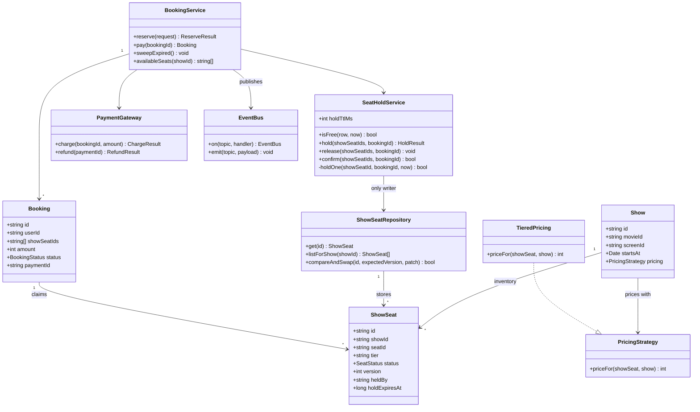

# Movie ticket booking

*BookMyShow, Fandango, AMC. On the surface it is a catalogue and a shopping
cart. It is not. The entire problem is two people tapping seat A2 in the same
second, and everything else in the design exists to make that moment
unambiguous.*

The interviewer is probing concurrency. They want to see you notice that
"check the seat is free, then take it" is two operations with a gap in the
middle, and that the gap is where the double booking lives. Then they want the
harder half: the seat has to stay yours for the two minutes a human spends
typing a card number, and you cannot hold a database lock for two minutes. The
answer is a **hold with a TTL written into the row**, taken with a
**compare-and-swap on a version column**, and a payment-failure path that gives
the seat back without stepping on whoever took it in the meantime.

---

## Requirements

**Functional**
- Browse cinemas, movies and shows; see a live seat map for a show
- Select one or more seats and hold them while the user pays
- Pay, and get a confirmed booking with those exact seats
- A hold that is not paid for expires and the seats return to the pool
- A failed or abandoned payment releases the hold immediately

**Non-functional**
- **A seat is sold once.** This is the only hard invariant. Everything else can
  degrade.
- Seat map reads vastly outnumber writes, and spike hard when a blockbuster
  opens
- Hold TTL is a product decision, but it must exceed the payment provider's
  worst-case timeout
- The booking and payment paths must be safe to retry — mobile networks drop
  requests mid-flight all the time

**Out of scope**: search and recommendations, the payment provider's internals,
food and beverage add-ons, refunds beyond the mechanical release, seat-map
rendering, loyalty points.

## Clarifying questions to ask

| Question | Why it changes the design |
|---|---|
| Is the seat layout fixed per screen, or can it differ per show? | Fixed means one template and show inventory is generated from it. Per-show means layout is versioned and an old booking must still resolve to a seat that existed then. |
| How long is the hold, and what is the payment provider's timeout? | If the TTL is shorter than the gateway's worst case you will routinely take money for a seat you already resold. The TTL is derived from the gateway, not chosen. |
| Can one booking span two shows? | Single-show means every seat in a booking lives in one partition and the confirm is one transaction. Cross-show drags in a two-phase commit or a saga. |
| Are there seat-adjacency rules, like no orphaned single seat? | That turns seat selection from "take this list" into a server-side validation the request can fail on layout grounds, before concurrency is even involved. |
| Is payment synchronous, or a webhook? | Synchronous lets you confirm inline. A webhook makes confirmation a second, independent entry point that arrives late, out of order, and sometimes twice. |
| Are cancellations in scope? | A BOOKED seat that can go back to AVAILABLE reopens the race after the sale. The version column is what keeps that safe, so it is worth knowing up front. |

## Core entities

| Entity | Owns | Must never own |
|---|---|---|
| **Movie** | Title, runtime, certification, cast | Anything about a time, a place or a price |
| **Cinema** | Name, location, its screens | Seat state |
| **Screen** | The physical layout: rows, seat ids, tiers | Availability. Layout is permanent; availability is per show. |
| **Show** | One movie, on one screen, at one time, plus its pricing strategy | The layout. It borrows the screen's and generates inventory from it. |
| **ShowSeat** | The only mutable truth: status, version, owning booking, hold expiry | Price. Price is derived from tier and show, so a price change never touches a million inventory rows. |
| **Booking** | Which show seats, which user, the amount charged, the lifecycle status | Availability. It asks the inventory; it never asserts. |
| **Payment** | The gateway id, the amount, the outcome | The booking lifecycle. A successful charge does not by itself mean a confirmed booking. |

The load-bearing split is **Seat** versus **ShowSeat**. A Seat is a piece of
furniture and never changes. A ShowSeat is that seat for one screening, and it
is the row every concurrent writer fights over. Conflating them is the most
common modelling mistake here, and it leaves you with no place to put a version
number.

## Class diagram



Note the arrow that is missing. `BookingService` never writes to
`ShowSeatRepository`. Every mutation of seat state goes through
`SeatHoldService`, which is the only place the compare-and-swap lives. One
writer, one invariant, one file to read when something goes wrong.

## Implementation

The database here is a `Map`, and `compareAndSwap` stands in for one SQL
statement:

```sql
UPDATE show_seats SET status = ?, held_by = ?, hold_expires_at = ?, version = version + 1
 WHERE id = ? AND version = ?
```

Everything else is built on that single primitive. If the statement updates
zero rows, someone beat you, and you lost.

```js
// ---------------------------------------------------------------- enums

const SeatStatus = Object.freeze({ AVAILABLE: 'AVAILABLE', HELD: 'HELD', BOOKED: 'BOOKED' });

const BookingStatus = Object.freeze({
  PENDING_PAYMENT: 'PENDING_PAYMENT',
  CONFIRMED: 'CONFIRMED',
  PAYMENT_FAILED: 'PAYMENT_FAILED',
  EXPIRED: 'EXPIRED',
  REFUND_REQUIRED: 'REFUND_REQUIRED',
});

// ---------------------------------------------------------------- clock

class SystemClock { now() { return Date.now(); } }

class FakeClock {
  constructor(t = 1_700_000_000_000) { this.t = t; }
  now() { return this.t; }
  advance(ms) { this.t += ms; }
}

// ---------------------------------------------------------------- events

class EventBus {
  constructor() { this.handlers = new Map(); }
  on(topic, fn) {
    if (!this.handlers.has(topic)) this.handlers.set(topic, []);
    this.handlers.get(topic).push(fn);
    return this;
  }
  emit(topic, payload) {
    for (const fn of this.handlers.get(topic) || []) fn(payload);
  }
}

// ---------------------------------------------------------------- pricing

class TieredPricing {
  constructor(tiers, weekendMultiplier = 1) {
    this.tiers = tiers;
    this.weekendMultiplier = weekendMultiplier;
  }
  priceFor(showSeatRow, show) {
    const base = this.tiers[showSeatRow.tier] ?? this.tiers.DEFAULT;
    const day = new Date(show.startsAt).getUTCDay();
    const weekend = day === 0 || day === 6;
    return Math.round(base * (weekend ? this.weekendMultiplier : 1));
  }
}

// ---------------------------------------------------------------- show

class Show {
  constructor({ id, movieId, screenId, startsAt, pricing }) {
    Object.assign(this, { id, movieId, screenId, startsAt, pricing });
  }
}

// ---------------------------------------------------- show-seat repository
//
// One table, one atomic primitive. Every concurrency guarantee in this file
// is built out of compareAndSwap and nothing else.

class ShowSeatRepository {
  constructor() { this.rows = new Map(); }

  seed(showId, seats) {
    for (const { id: seatId, tier } of seats) {
      const id = `${showId}:${seatId}`;
      this.rows.set(id, {
        id, showId, seatId, tier,
        status: SeatStatus.AVAILABLE,
        version: 0,
        heldBy: null,        // the booking that owns this row, held or booked
        holdExpiresAt: 0,
      });
    }
  }

  // Reads return a copy. A caller can never mutate the table by accident,
  // which is also true of a row that came back over the wire from Postgres.
  get(id) {
    const row = this.rows.get(id);
    return row ? { ...row } : null;
  }

  listForShow(showId) {
    return [...this.rows.values()].filter((r) => r.showId === showId).map((r) => ({ ...r }));
  }

  // UPDATE show_seats SET <patch>, version = version + 1
  //  WHERE id = ? AND version = ?
  // Returns whether one row changed. false means somebody got there first.
  compareAndSwap(id, expectedVersion, patch) {
    const row = this.rows.get(id);
    if (!row || row.version !== expectedVersion) return false;
    Object.assign(row, patch, { version: row.version + 1 });
    return true;
  }
}

// ------------------------------------------------------------ seat holding

class SeatHoldService {
  constructor(repo, clock, holdTtlMs = 10 * 60 * 1000) {
    this.repo = repo;
    this.clock = clock;
    this.holdTtlMs = holdTtlMs;
  }

  // Lazy expiry: a lapsed hold IS free, whatever the sweeper has got round to.
  isFree(row, now) {
    if (row.status === SeatStatus.AVAILABLE) return true;
    return row.status === SeatStatus.HELD && row.holdExpiresAt <= now;
  }

  #holdOne(showSeatId, bookingId, now) {
    const row = this.repo.get(showSeatId);
    if (!row || !this.isFree(row, now)) return false;
    return this.repo.compareAndSwap(row.id, row.version, {
      status: SeatStatus.HELD,
      heldBy: bookingId,
      holdExpiresAt: now + this.holdTtlMs,
    });
  }

  // All or nothing. Sorted order so concurrent callers walk the same sequence.
  hold(showSeatIds, bookingId) {
    const now = this.clock.now();
    const sorted = [...showSeatIds].sort();
    const acquired = [];
    for (const id of sorted) {
      if (this.#holdOne(id, bookingId, now)) { acquired.push(id); continue; }
      this.release(acquired, bookingId);
      return { ok: false, conflict: id };
    }
    return { ok: true, seats: acquired, expiresAt: now + this.holdTtlMs };
  }

  // Guarded by heldBy. If our hold already lapsed and someone else took the
  // seat, we must leave their hold alone.
  release(showSeatIds, bookingId) {
    for (const id of showSeatIds) {
      const row = this.repo.get(id);
      if (!row || row.status !== SeatStatus.HELD || row.heldBy !== bookingId) continue;
      this.repo.compareAndSwap(row.id, row.version, {
        status: SeatStatus.AVAILABLE, heldBy: null, holdExpiresAt: 0,
      });
    }
  }

  // Verify every seat is still ours and unexpired, then flip all of them.
  // In one database this is a single transaction; the rollback below is what
  // you write when the seats can live on different shards.
  confirm(showSeatIds, bookingId) {
    const now = this.clock.now();
    const staged = [];
    for (const id of showSeatIds) {
      const row = this.repo.get(id);
      const mine = row && row.status === SeatStatus.HELD
        && row.heldBy === bookingId && row.holdExpiresAt > now;
      if (!mine) return false;
      staged.push(row);
    }
    const done = [];
    for (const row of staged) {
      const ok = this.repo.compareAndSwap(row.id, row.version, {
        status: SeatStatus.BOOKED, holdExpiresAt: 0,
      });
      if (ok) { done.push(row.id); continue; }
      for (const id of done) {
        const r = this.repo.get(id);
        this.repo.compareAndSwap(id, r.version, {
          status: SeatStatus.HELD, heldBy: bookingId, holdExpiresAt: now + this.holdTtlMs,
        });
      }
      return false;
    }
    return true;
  }
}

// ---------------------------------------------------------------- payment

class FakePaymentGateway {
  constructor() { this.mode = 'approve'; this.charges = new Map(); }

  // Keyed on bookingId, so a retried charge returns the first result rather
  // than taking the money twice.
  charge(bookingId, amount) {
    if (this.charges.has(bookingId)) return this.charges.get(bookingId);
    const result = this.mode === 'approve'
      ? { ok: true, paymentId: `pay_${bookingId}`, amount }
      : { ok: false, reason: 'card_declined' };
    this.charges.set(bookingId, result);
    return result;
  }

  refund(paymentId) { return { ok: true, refundId: `rf_${paymentId}` }; }
}

// ---------------------------------------------------------------- booking

class Booking {
  constructor({ id, userId, showId, showSeatIds, amount, holdExpiresAt }) {
    Object.assign(this, { id, userId, showId, showSeatIds, amount, holdExpiresAt });
    this.status = BookingStatus.PENDING_PAYMENT;
    this.paymentId = null;
  }
}

class BookingService {
  constructor({ repo, holds, gateway, clock, events, shows }) {
    Object.assign(this, { repo, holds, gateway, clock, events, shows });
    this.bookings = new Map();
    this.byIdempotencyKey = new Map();
    this.seq = 0;
  }

  #price(showSeatIds, show) {
    return showSeatIds.reduce(
      (sum, id) => sum + show.pricing.priceFor(this.repo.get(id), show), 0,
    );
  }

  reserve({ idempotencyKey, userId, showId, seatIds }) {
    const replay = this.byIdempotencyKey.get(idempotencyKey);
    if (replay) return { ok: true, replay: true, booking: this.bookings.get(replay) };

    const show = this.shows.get(showId);
    const showSeatIds = seatIds.map((s) => `${showId}:${s}`);
    const bookingId = `bk_${++this.seq}`;

    const held = this.holds.hold(showSeatIds, bookingId);
    if (!held.ok) return { ok: false, conflict: held.conflict };

    const booking = new Booking({
      id: bookingId, userId, showId,
      showSeatIds: held.seats,
      amount: this.#price(held.seats, show),
      holdExpiresAt: held.expiresAt,
    });
    this.bookings.set(booking.id, booking);
    this.byIdempotencyKey.set(idempotencyKey, booking.id);
    this.events.emit('booking.reserved', booking);
    return { ok: true, replay: false, booking };
  }

  pay(bookingId) {
    const booking = this.bookings.get(bookingId);
    if (!booking) throw new Error(`unknown booking ${bookingId}`);
    if (booking.status === BookingStatus.CONFIRMED) return booking;   // re-entrant
    if (booking.status !== BookingStatus.PENDING_PAYMENT) return booking;

    const result = this.gateway.charge(booking.id, booking.amount);
    if (!result.ok) {
      booking.status = BookingStatus.PAYMENT_FAILED;
      this.holds.release(booking.showSeatIds, booking.id);
      this.events.emit('booking.failed', booking);
      return booking;
    }

    if (!this.holds.confirm(booking.showSeatIds, booking.id)) {
      // Money taken, seats gone. Never leave CONFIRMED without the seats.
      this.gateway.refund(result.paymentId);
      booking.status = BookingStatus.REFUND_REQUIRED;
      this.events.emit('booking.refund_required', booking);
      return booking;
    }

    booking.paymentId = result.paymentId;
    booking.status = BookingStatus.CONFIRMED;
    this.events.emit('booking.confirmed', booking);
    return booking;
  }

  // Housekeeping only. Correctness already comes from lazy expiry on read.
  sweepExpired() {
    const now = this.clock.now();
    for (const booking of this.bookings.values()) {
      if (booking.status !== BookingStatus.PENDING_PAYMENT) continue;
      if (booking.holdExpiresAt > now) continue;
      this.holds.release(booking.showSeatIds, booking.id);
      booking.status = BookingStatus.EXPIRED;
      this.events.emit('booking.expired', booking);
    }
  }

  availableSeats(showId) {
    const now = this.clock.now();
    return this.repo.listForShow(showId)
      .filter((r) => this.holds.isFree(r, now))
      .map((r) => r.seatId)
      .sort();
  }
}
```

### Usage

```js
const clock = new FakeClock();
const repo = new ShowSeatRepository();
const holds = new SeatHoldService(repo, clock, 10 * 60 * 1000);
const gateway = new FakePaymentGateway();
const events = new EventBus().on('booking.confirmed',
  (b) => console.log(`  [email] ticket for ${b.id}, seats ${b.showSeatIds.map((s) => s.split(':')[1]).join()}`));

const show = new Show({
  id: 'S1', movieId: 'm-dune2', screenId: 'sc-4',
  startsAt: '2026-03-14T18:30:00Z',                       // a Saturday
  pricing: new TieredPricing({ DEFAULT: 250, RECLINER: 450 }, 1.2),
});
const shows = new Map([[show.id, show]]);
repo.seed(show.id, [
  { id: 'A1', tier: 'RECLINER' }, { id: 'A2', tier: 'RECLINER' },
  { id: 'B1', tier: 'DEFAULT' }, { id: 'B2', tier: 'DEFAULT' },
]);

const svc = new BookingService({ repo, holds, gateway, clock, events, shows });

console.log('free at open     :', svc.availableSeats('S1').join());

// 1. Two users race for the same pair of seats.
const asha = svc.reserve({ idempotencyKey: 'k-asha-1', userId: 'u1', showId: 'S1', seatIds: ['A1', 'A2'] });
const bala = svc.reserve({ idempotencyKey: 'k-bala-1', userId: 'u2', showId: 'S1', seatIds: ['A2', 'B1'] });
console.log('asha reserve     :', asha.ok ? `${asha.booking.id} amount ${asha.booking.amount}` : `conflict ${asha.conflict}`);
console.log('bala reserve     :', bala.ok ? `${bala.booking.id}` : `conflict on ${bala.conflict}`);
console.log('free after hold  :', svc.availableSeats('S1').join());

// 2. Retrying the same request must not create a second booking.
const ashaRetry = svc.reserve({ idempotencyKey: 'k-asha-1', userId: 'u1', showId: 'S1', seatIds: ['A1', 'A2'] });
console.log('asha retry       :', `${ashaRetry.booking.id} replay=${ashaRetry.replay}`);

// 3. Her card is declined. The hold comes back immediately.
gateway.mode = 'decline';
console.log('asha pays        :', svc.pay(asha.booking.id).status);
console.log('free after fail  :', svc.availableSeats('S1').join());

// 4. Bala tries again and now wins.
gateway.mode = 'approve';
const bala2 = svc.reserve({ idempotencyKey: 'k-bala-2', userId: 'u2', showId: 'S1', seatIds: ['A2', 'B1'] });
console.log('bala reserve 2   :', bala2.ok ? `${bala2.booking.id} amount ${bala2.booking.amount}` : `conflict ${bala2.conflict}`);
console.log('bala pays        :', svc.pay(bala2.booking.id).status);

// 5. A hold nobody pays for. Clock moves past the TTL, seat frees itself.
const chen = svc.reserve({ idempotencyKey: 'k-chen-1', userId: 'u3', showId: 'S1', seatIds: ['B2'] });
console.log('chen holds B2    :', chen.booking.id, '| free:', svc.availableSeats('S1').join());
clock.advance(11 * 60 * 1000);
console.log('free after TTL   :', svc.availableSeats('S1').join());

const dia = svc.reserve({ idempotencyKey: 'k-dia-1', userId: 'u4', showId: 'S1', seatIds: ['B2'] });
console.log('dia takes B2     :', dia.ok ? dia.booking.id : `conflict ${dia.conflict}`);

// 6. Chen's late payment cannot confirm a seat he no longer holds.
console.log('chen pays late   :', svc.pay(chen.booking.id).status);
console.log('final seat map   :', repo.listForShow('S1').map((r) => `${r.seatId}=${r.status}`).join(' '));
```

Output:

```
free at open     : A1,A2,B1,B2
asha reserve     : bk_1 amount 1080
bala reserve     : conflict on S1:A2
free after hold  : B1,B2
asha retry       : bk_1 replay=true
asha pays        : PAYMENT_FAILED
free after fail  : A1,A2,B1,B2
bala reserve 2   : bk_3 amount 840
  [email] ticket for bk_3, seats A2,B1
bala pays        : CONFIRMED
chen holds B2    : bk_4 | free: A1
free after TTL   : A1,B2
dia takes B2     : bk_5
chen pays late   : REFUND_REQUIRED
final seat map   : A1=AVAILABLE A2=BOOKED B1=BOOKED B2=HELD
```

Bala's second booking is `bk_3`, not `bk_2`, because the id is minted before
the hold is attempted and his first attempt burned one. That is deliberate:
the booking id is the idempotency key handed to the payment gateway, so it has
to exist before anything can go wrong.

## Design patterns used

| Pattern | Where | What it buys |
|---|---|---|
| **Repository** | `ShowSeatRepository` | Confines every seat mutation to one `compareAndSwap` method. Swapping the `Map` for Postgres or DynamoDB changes one class, and the concurrency argument does not move. |
| **Strategy** | `PricingStrategy` / `TieredPricing` | Weekend surcharges, recliner tiers and surge pricing are pricing changes, not booking changes. `BookingService` never learns what a recliner costs. |
| **State machine** | `BookingStatus` transitions in `pay` | Makes the illegal transitions explicit. `CONFIRMED` is only reachable from `PENDING_PAYMENT` *and* a successful seat confirm, which is the invariant the whole design exists to protect. |
| **Observer** | `EventBus` | Tickets, SMS and analytics subscribe to `booking.confirmed`. None of them sit on the critical path, and none of them can fail the booking. |
| **Dependency injection** | `Clock`, gateway, repo passed into every service | The TTL-expiry case in the demo above is testable because time is an argument. With `Date.now()` hard-coded, that test would take eleven minutes. |
| **Idempotency key** | `reserve` keyed by client key, `charge` keyed by booking id | A retried request returns the original result instead of creating a second booking or a second charge. Not a GoF pattern, but the one that saves you the most money. |

## Concurrency and edge cases

**Two users, one seat.** The naive version reads the seat, sees `AVAILABLE`,
and writes `BOOKED`. Two requests can both read `AVAILABLE` before either
writes. Nothing in that code is wrong line by line; the bug is the gap between
line one and line two. The fix is to make the check and the write the same
operation: `UPDATE ... WHERE id = ? AND version = ?`. The database evaluates
the predicate and applies the write atomically, and the loser gets zero rows
updated.

**Why not just lock the row?** `SELECT ... FOR UPDATE` is correct and it is the
first thing people reach for. The problem is duration. The seat must stay
reserved for the several minutes the user spends finding their wallet, which
means holding a transaction open across a third-party network call. You will
exhaust the connection pool, and one slow gateway will take the whole booking
service down. The insight that unlocks the design: **the hold belongs in the
data, not in the lock manager**. Write `status = HELD, hold_expires_at = now +
10min` into the row. The transaction lasts microseconds. The hold lasts ten
minutes. They are no longer the same thing.

**Why a version column and not `WHERE status = 'AVAILABLE'`?** Because of ABA.
Between your read and your write, the seat can go `AVAILABLE → HELD →`
(hold lapses) `→ effectively available again`. A status-only predicate passes,
and you have written on top of a state transition you never saw — silently
clobbering the `heldBy` and expiry another request just set. The version is a
monotonic counter that any intervening write bumps, so your CAS fails on a row
that changed even if it changed back. It also lets you write the whole row —
status, owner and expiry — as one safe unit.

**Partial acquisition of a multi-seat request.** A user picks four seats and
gets three; a racer takes the fourth. Holding three is worse than holding none,
because those three are now unsellable for ten minutes for a booking that will
never complete. `hold` releases what it took and returns the conflicting seat
so the UI can say which one went. Seats are acquired in sorted order, which
costs nothing here and is what keeps the pessimistic variant of this design
deadlock-free.

**An expired hold, reclaimed, then the original owner releases.** Chen's hold
lapses, Dia takes B2, then Chen's abandoned session finally fires its release.
A naive release sets B2 back to `AVAILABLE` and silently steals Dia's seat.
`release` is guarded on `heldBy === bookingId`, so it is a no-op on a row it no
longer owns. Every write in this design is conditional on something; none of
them are blind.

**Payment succeeds after the hold lapsed.** The money is taken and the seats
are gone. This is the state the whole design is built to make unreachable in
one specific form: there must never be a `CONFIRMED` booking without its seats.
So `pay` confirms the hold *after* the charge, and if the confirm fails it
refunds and lands on `REFUND_REQUIRED` — an explicit, alertable state — rather
than confirming a booking with no seats. The real mitigation is upstream: the
hold TTL must be longer than the gateway's worst-case timeout, so this path is
rare rather than routine.

**Crash between charge and confirm.** The charge landed at the provider and
nothing moved locally. A reconciliation job walks the gateway's charges by
booking id and re-runs confirm-or-refund for anything still `PENDING_PAYMENT`.
That replay is only safe because the gateway is keyed on the booking id — retry
the charge and you get the first result back, not a second withdrawal.

**Clock skew.** The hold comparison is against a wall clock. If one app server
runs two minutes fast, it will see live holds as expired and hand out seats
that are still someone else's. Do the expiry comparison in the database
(`hold_expires_at > NOW()` inside the same statement as the CAS) so there is
exactly one clock in the system.

**The sweeper is not the source of truth.** `isFree` treats a lapsed hold as
available on read, so correctness never waits for a background job. The sweeper
exists to keep the seat map and the booking list tidy, and if it is down for an
hour, nothing is oversold — the display is just slightly pessimistic.

**On-sale thundering herd.** Correct is not the same as fast. Fifty thousand
people hitting the same two hundred rows produces a storm of failed CAS
attempts with no throughput to show for it. The answer is not a different
locking scheme; it is to stop the herd arriving at once, with a virtual waiting
room that admits users in batches.

## Follow-ups they will ask

**How do you serve the seat map at scale?** Cache the rendered map per show and
keep a `seat_map_version` counter on the show that every seat write bumps.
Clients poll the counter, which is cheap, and refetch the map only when it
moves. Never cache the map itself as the basis for a booking decision — reads
can be stale, the CAS cannot.

**How would cancellation work?** A `BOOKED → AVAILABLE` transition through the
same CAS, which means a cancelled seat re-enters the race safely with no new
machinery. The hard part is not the seat, it is the refund policy and making
the cancel itself idempotent so a double tap does not refund twice.

**Would you use Redis for the hold instead?** `SET key value NX PX 600000` is a
genuinely good fit — TTL is native and it is far faster than a database round
trip. The cost is that the hold and the booking now live in two systems that
can disagree, and a Redis failover can drop holds silently. Redis for the hold,
the database as the source of truth for `BOOKED`, and accept that a lost hold
means an occasional double-checkout that the final CAS still rejects.

**How do you enforce a no-orphan-seat rule?** Validate the post-hold layout
before returning success: after acquiring, check no single gap was created
between booked blocks, and release everything if one was. It has to happen
after the hold, not before, or the layout you validated is not the layout you
bought.

**What changes with dynamic pricing?** Nothing structural — `PricingStrategy`
already takes the show. What must change is that the price is captured onto the
booking at reserve time and the charge uses that captured amount. A price that
moves between the seat map and the payment page is a support ticket.
