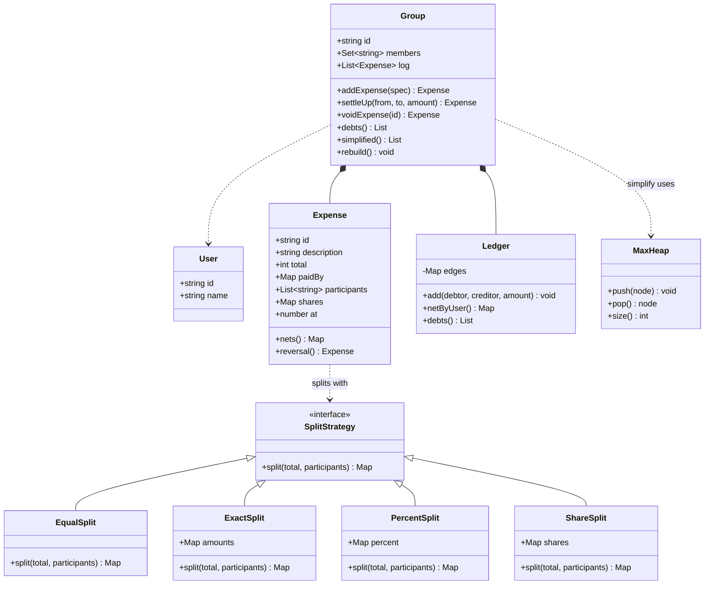

# Design Splitwise

*A shared expense tracker. The one LLD problem that has a real algorithm in it,
which is why it gets asked when the interviewer wants more than a class diagram.*

You are asked for a system where a group of people record who paid for what,
split each bill by some rule, and later find out who owes whom. Two decisions
carry the grade. The first is whether "split this bill" is a `switch` on a split
type inside the expense class or a strategy you can hand in — because equal,
exact, percentage and share are four rules today and six next quarter. The
second is the settlement algorithm: whether you hand back the raw pairwise IOUs,
or net every person to a single number and greedily match the largest creditor
against the largest debtor. The second one is where a strong candidate separates
themselves, mostly by knowing that the greedy answer is a heuristic and saying so
before being asked.

---

## Requirements

**Functional**
- Users, and groups of users
- Record an expense: a description, a total, who paid, who it is split across, and how
- Split rules: equal, exact amounts, percentages, and shares (2:1:1)
- Show every pairwise balance — who owes whom, how much
- Show a simplified settlement plan that clears the group in as few transfers as possible
- Record a settlement (A actually paid B) and have the balances reflect it
- Edit or delete an expense, with balances staying correct

**Non-functional / constraints**
- Money is exact. Splits must sum to the total to the last paisa, always.
- Two people adding an expense to the same group at the same time must both land. No lost update.
- Balances must be reconstructable. If the balance table is wrong, the expense log is the truth.
- A group of 50 people on a two-week trip is a few thousand expenses, not a few million. This is not a scale problem; it is a correctness problem.

**Out of scope** — say it: payment rails, currency conversion rates, friend
requests and the social graph, receipt OCR, notifications, and sharding. Each is
real; none of them changes the model.

## Clarifying questions to ask

**Can one expense have more than one payer?** Splitwise allows it, and it is the
question that decides whether an expense produces one fan-out of debts or a
little many-to-many settlement of its own. Answer "yes" and the clean move is to
reuse the same matcher you already need for the whole group. Answer "no" and the
expense is a loop.

**Do we keep pairwise debts, or only each person's net?** Nets are one number per
person and make simplification trivial, but they throw away "Alice owes Bob for
the hotel". People want to see that. Keeping pairwise means simplification is a
*view*, computed on demand, and never written back — which turns out to be the
single most important structural decision in the problem.

**Is a settlement just another expense?** If yes, the whole system is one
append-only log and one fold, and "undo a payment" is the same code path as "undo
a dinner". If you model settlements separately you will write the reversal logic
twice and get one of them wrong.

**Multiple currencies in one group?** If yes, a balance is keyed by `(pair,
currency)` and you must never add two of them. Deciding this after you have
written `amount` as a bare number is a rewrite.

**Are edits destructive, or an append?** Deleting an expense by mutating balances
in place means a crash halfway leaves the group permanently wrong. Appending a
reversing entry means the log stays the truth and the balance is always
re-derivable. Ask, then argue for the append.

**Should simplification run automatically, or on request?** Automatic
simplification rewrites who owes whom, so a later edit to a three-week-old dinner
can no longer be reversed against the people it actually involved. Advisory is
the safe default, and knowing why is the point.

## Core entities

| Entity | Owns | Must never own |
|---|---|---|
| `User` | Id, display name | Any balance. A balance is a property of a pair, not a person |
| `SplitStrategy` | One rule: total and participants in, per-person amounts out | The expense, the ledger, or which rule applies |
| `Expense` | Description, total, payers, participants, the computed shares, timestamp | How to split. It is handed a strategy and holds the result |
| `Ledger` | The pairwise net edges, and the arithmetic on them | Expenses, split rules, or what a settlement means |
| `Group` | Membership, the expense log, its ledger | Split arithmetic, and the matching algorithm |
| `simplify` | Nets in, a transfer list out | Any mutation of anything |

Two rows are worth defending. `Expense` holds the *computed* shares, not the
strategy object — once the bill is split, the numbers are a fact, and a later
change to how percentages round must not retroactively change a settled dinner.
And `simplify` is a free function, not a method on `Group`, because it touches no
state: it takes a map of nets and returns a list of transfers. That makes it
testable on the adversarial inputs below without constructing a group at all.

## Class diagram



## Implementation

Four things in the code carry the weight.

**Money is an integer.** Every amount is minor units — paise, cents. The moment
you store rupees as a float, a bill of `0.1 + 0.2` is not `0.3`, and a group that
runs for a month drifts by an amount nobody can account for. This is not
pedantry; it is the most common real bug in this exact product.

**Three of the four split strategies are the same function.** Equal is weights of
all ones. Shares is weights of the share counts. Percentage is weights of the
percentages. They differ only in where the weights come from, so they all call
one `distribute`, and only `ExactSplit` — which validates rather than computes —
is genuinely different. Spotting that collapse is worth saying out loud.

**`distribute` uses largest remainder.** Split 1000 paise three ways and the
honest answer is 333.33 each, which does not exist. Floor everything, then hand
the leftover units one at a time to the largest fractional parts: 334, 333, 333.
The invariant that matters is that the parts sum to *exactly* the total, and the
code asserts it. Dividing and rounding independently breaks that invariant
silently, and the group's balances stop summing to zero, which is the symptom you
will be debugging six months later.

**Simplification is net-then-greedy.** Person by person, collapse every edge into
one number: positive means owed, negative means owes. The sum of all nets is zero
by construction. Push the positives into one max-heap and the negatives into
another, repeatedly pop the largest of each, transfer the smaller of the two
amounts, and push back whatever is left over. Each transfer zeroes at least one
person, so you emit at most `n-1` transfers for `n` people. It is O(n log n).

```js
// ---------- money ----------
// Integer minor units everywhere. Floats lose a paisa per split and the group's
// balances quietly stop summing to zero.
const rupees = (r) => Math.round(r * 100);
const fmt = (m) => (m < 0 ? '-' : '') + (Math.abs(m) / 100).toFixed(2);
const sum = (xs) => xs.reduce((a, b) => a + b, 0);

// Split `total` across `weights` into integers that sum to EXACTLY total.
// Largest remainder: floor everything, then give the leftover units to the
// biggest fractional parts. Deterministic, so two servers agree.
function distribute(total, weights) {
  const w = sum(weights);
  if (w <= 0) throw new Error('weights must sum to something positive');
  const exact = weights.map((x) => (total * x) / w);
  const parts = exact.map(Math.floor);
  let left = total - sum(parts);
  const order = exact
    .map((v, i) => ({ i, frac: v - Math.floor(v) }))
    .sort((a, b) => b.frac - a.frac || a.i - b.i);
  for (let k = 0; left > 0; k++, left--) parts[order[k % order.length].i] += 1;
  return parts;
}

// ---------- split strategies ----------
class SplitStrategy {
  // (totalMinor, participantIds) -> Map<userId, minorUnits>, summing to total
  split() {
    throw new Error('SplitStrategy.split is abstract');
  }
}

const byWeights = (total, participants, weights) =>
  new Map(distribute(total, weights).map((amt, i) => [participants[i], amt]));

class EqualSplit extends SplitStrategy {
  split(total, participants) {
    return byWeights(total, participants, participants.map(() => 1));
  }
}

class ShareSplit extends SplitStrategy {
  constructor(sharesByUser) {
    super();
    this.shares = sharesByUser; // { alice: 2, bob: 1 }
  }
  split(total, participants) {
    return byWeights(total, participants, participants.map((u) => this.shares[u] ?? 0));
  }
}

class PercentSplit extends SplitStrategy {
  constructor(percentByUser) {
    super();
    this.percent = percentByUser;
  }
  split(total, participants) {
    const pct = participants.map((u) => this.percent[u] ?? 0);
    const t = sum(pct);
    if (Math.abs(t - 100) > 1e-9) throw new Error(`percentages sum to ${t}, not 100`);
    return byWeights(total, participants, pct);
  }
}

// The only strategy that validates instead of computing.
class ExactSplit extends SplitStrategy {
  constructor(amountByUser) {
    super();
    this.amounts = amountByUser;
  }
  split(total, participants) {
    const out = new Map(participants.map((u) => [u, this.amounts[u] ?? 0]));
    const t = sum([...out.values()]);
    if (t !== total) throw new Error(`exact splits sum to ${fmt(t)}, expense is ${fmt(total)}`);
    return out;
  }
}

// ---------- expense ----------
let SEQ = 0;

class Expense {
  constructor({ description, total, paidBy, participants, strategy, at = Date.now(), reverses = null }) {
    const paid = sum(Object.values(paidBy));
    if (paid !== total) throw new Error(`payers put in ${fmt(paid)}, expense is ${fmt(total)}`);
    if (participants.length === 0) throw new Error('an expense needs participants');
    this.id = `E${++SEQ}`;
    this.description = description;
    this.total = total;
    this.paidBy = { ...paidBy };
    this.participants = [...participants];
    this.at = at;
    this.reverses = reverses;
    this.shares = strategy.split(total, this.participants);
    // The strategy contract, enforced once here rather than trusted everywhere.
    const s = sum([...this.shares.values()]);
    if (s !== total) throw new Error(`split produced ${fmt(s)} for a ${fmt(total)} expense`);
  }

  // What this expense alone did to each person: paid minus owed.
  nets() {
    const net = new Map();
    const bump = (u, v) => net.set(u, (net.get(u) ?? 0) + v);
    for (const [u, amt] of Object.entries(this.paidBy)) bump(u, amt);
    for (const [u, amt] of this.shares) bump(u, -amt);
    return net;
  }

  // Undo is an append, never a mutation.
  reversal() {
    const negated = Object.fromEntries([...this.shares].map(([u, a]) => [u, -a]));
    return new Expense({
      description: `reverse: ${this.description}`,
      total: -this.total,
      paidBy: Object.fromEntries(Object.entries(this.paidBy).map(([u, a]) => [u, -a])),
      participants: this.participants,
      strategy: new ExactSplit(negated),
      reverses: this.id,
    });
  }
}

// ---------- ledger ----------
// One edge per unordered pair. Key "x|y" with x < y; a positive value means y
// owes x. Storing one direction makes "A owes B and B owes A" unrepresentable.
class Ledger {
  constructor() {
    this.edges = new Map();
  }
  static key(a, b) {
    return a < b ? `${a}|${b}` : `${b}|${a}`;
  }
  add(debtor, creditor, amount) {
    if (debtor === creditor || amount === 0) return;
    const k = Ledger.key(debtor, creditor);
    const signed = debtor > creditor ? amount : -amount;
    const next = (this.edges.get(k) ?? 0) + signed;
    if (next === 0) this.edges.delete(k);
    else this.edges.set(k, next);
  }
  netByUser() {
    const net = new Map();
    const bump = (u, v) => net.set(u, (net.get(u) ?? 0) + v);
    for (const [k, v] of this.edges) {
      const [x, y] = k.split('|');
      bump(x, v);
      bump(y, -v);
    }
    return net;
  }
  debts() {
    return [...this.edges].map(([k, v]) => {
      const [x, y] = k.split('|');
      return v > 0 ? { from: y, to: x, amount: v } : { from: x, to: y, amount: -v };
    });
  }
}

// ---------- the matcher ----------
class MaxHeap {
  constructor() {
    this.a = [];
  }
  get size() {
    return this.a.length;
  }
  push(node) {
    const a = this.a;
    a.push(node);
    let i = a.length - 1;
    while (i > 0) {
      const p = (i - 1) >> 1;
      if (a[p].amount >= a[i].amount) break;
      [a[p], a[i]] = [a[i], a[p]];
      i = p;
    }
  }
  pop() {
    const a = this.a;
    const top = a[0];
    const last = a.pop();
    if (a.length) {
      a[0] = last;
      let i = 0;
      for (;;) {
        const l = 2 * i + 1;
        const r = l + 1;
        let m = i;
        if (l < a.length && a[l].amount > a[m].amount) m = l;
        if (r < a.length && a[r].amount > a[m].amount) m = r;
        if (m === i) break;
        [a[m], a[i]] = [a[i], a[m]];
        i = m;
      }
    }
    return top;
  }
}

// Net everyone to one number, then repeatedly settle the largest creditor
// against the largest debtor. Each pass zeroes at least one person, so this
// emits at most n-1 transfers. O(n log n). It is a heuristic, not a proven
// minimum -- see the note below.
function simplify(netByUser) {
  const creditors = new MaxHeap();
  const debtors = new MaxHeap();
  for (const [user, net] of netByUser) {
    if (net > 0) creditors.push({ user, amount: net });
    else if (net < 0) debtors.push({ user, amount: -net });
  }
  const transfers = [];
  while (creditors.size && debtors.size) {
    const c = creditors.pop();
    const d = debtors.pop();
    const m = Math.min(c.amount, d.amount);
    transfers.push({ from: d.user, to: c.user, amount: m });
    if (c.amount > m) creditors.push({ user: c.user, amount: c.amount - m });
    if (d.amount > m) debtors.push({ user: d.user, amount: d.amount - m });
  }
  return transfers;
}

// ---------- group ----------
class Group {
  constructor(id, members) {
    this.id = id;
    this.members = new Set(members);
    this.log = []; // append-only; the source of truth
    this.ledger = new Ledger();
    this.reversed = new Set();
  }

  addExpense(spec) {
    for (const u of [...Object.keys(spec.paidBy), ...spec.participants]) {
      if (!this.members.has(u)) throw new Error(`${u} is not a member of ${this.id}`);
    }
    return this.#append(new Expense(spec));
  }

  // A settlement is an expense: the payer "pays for" the other person entirely.
  // Same code path, so undoing a payment needs no new logic.
  settleUp(from, to, amount) {
    if (amount <= 0) throw new Error('a settlement must be positive');
    return this.addExpense({
      description: `settle ${from} -> ${to}`,
      total: amount,
      paidBy: { [from]: amount },
      participants: [to],
      strategy: new ExactSplit({ [to]: amount }),
    });
  }

  voidExpense(expenseId) {
    if (this.reversed.has(expenseId)) throw new Error(`${expenseId} is already reversed`);
    const original = this.log.find((e) => e.id === expenseId);
    if (!original) throw new Error(`unknown expense ${expenseId}`);
    this.reversed.add(expenseId);
    return this.#append(original.reversal());
  }

  #append(expense) {
    this.log.push(expense);
    this.#project(expense);
    return expense;
  }

  // One expense projected onto the pairwise ledger through the SAME matcher used
  // for the whole group. With a single payer this degenerates to "everyone owes
  // the payer", which is what you would have written by hand; with several
  // payers it does the right thing for free.
  #project(expense) {
    for (const t of simplify(expense.nets())) this.ledger.add(t.from, t.to, t.amount);
  }

  // The ledger is a fold over the log, so it can always be thrown away.
  rebuild() {
    this.ledger = new Ledger();
    for (const e of this.log) this.#project(e);
  }

  debts() {
    return this.ledger.debts();
  }
  netByUser() {
    return this.ledger.netByUser();
  }
  simplified() {
    return simplify(this.netByUser());
  }
}

// ---------- usage ----------
const show = (label, ts) =>
  console.log(
    label.padEnd(22),
    ts.length ? ts.map((t) => `${t.from}->${t.to} ${fmt(t.amount)}`).join('  ') : '(settled)'
  );

const trip = new Group('goa', ['alice', 'bob', 'carol', 'dave']);

// Equal: 3000 four ways.
trip.addExpense({
  description: 'dinner',
  total: rupees(3000),
  paidBy: { alice: rupees(3000) },
  participants: ['alice', 'bob', 'carol', 'dave'],
  strategy: new EqualSplit(),
});

// Shares: Alice had the big room, 2:1:1.
trip.addExpense({
  description: 'hotel',
  total: rupees(4000),
  paidBy: { bob: rupees(4000) },
  participants: ['alice', 'bob', 'carol'],
  strategy: new ShareSplit({ alice: 2, bob: 1, carol: 1 }),
});

// Percentage.
trip.addExpense({
  description: 'car rental',
  total: rupees(2500),
  paidBy: { carol: rupees(2500) },
  participants: ['carol', 'dave'],
  strategy: new PercentSplit({ carol: 40, dave: 60 }),
});

// Exact amounts, and two payers on one bill.
trip.addExpense({
  description: 'groceries',
  total: rupees(1200),
  paidBy: { dave: rupees(800), alice: rupees(400) },
  participants: ['alice', 'bob', 'carol', 'dave'],
  strategy: new ExactSplit({
    alice: rupees(500),
    bob: rupees(200),
    carol: rupees(300),
    dave: rupees(200),
  }),
});

// An indivisible bill: 1000 paise three ways is 334/333/333, not 333.33 each.
const odd = new EqualSplit().split(1000, ['a', 'b', 'c']);
console.log('1000 paise / 3 ->', [...odd.values()].join(' '), '| sums to', sum([...odd.values()]));

console.log('\nnets:', [...trip.netByUser()].map(([u, v]) => `${u} ${fmt(v)}`).join('  '));
show('pairwise debts', trip.debts());
show('simplified', trip.simplified());
console.log('transfers:', trip.debts().length, '->', trip.simplified().length);

// Settling is just another expense.
const plan = trip.simplified();
trip.settleUp(plan[0].from, plan[0].to, plan[0].amount);
show('after one payment', trip.simplified());

// Undo the car rental. Appended as a reversal, not deleted.
trip.voidExpense(trip.log[2].id);
show('car rental voided', trip.simplified());

// The ledger is derived, so it can be rebuilt from the log and must match.
const before = JSON.stringify(trip.debts().sort((a, b) => a.from.localeCompare(b.from)));
trip.rebuild();
const after = JSON.stringify(trip.debts().sort((a, b) => a.from.localeCompare(b.from)));
console.log('rebuild matches:', before === after);

// Greedy is a heuristic. Here it needs 4 transfers where 3 suffice:
// {-6, +6} settles in one, {-7, +2, +5} settles in two.
const adversarial = new Map([
  ['a', -700], ['b', -600], ['c', 200], ['d', 500], ['e', 600],
]);
console.log('greedy on adversarial nets:', simplify(adversarial).length, 'transfers; optimal is 3');
```

### On the simplification being a heuristic

Greedy max-creditor against max-debtor always terminates in at most `n-1`
transfers, and for most real groups it hits the true minimum. It is not
guaranteed to. The true minimum is `n` minus the largest number of disjoint
subgroups whose balances each sum to zero — because a subgroup of size `k` that
cancels internally needs exactly `k-1` transfers, and every extra zero-sum
subgroup you find saves you one. Finding the maximum number of such subgroups is
a partition problem, and it is NP-hard.

The failure mode is concrete. Take nets of `-7, -6, +2, +5, +6`. The optimum is
three transfers: the `-6` and the `+6` cancel exactly, and `-7` against `+2, +5`
takes two more. Greedy never sees that, because its first move is the largest
creditor `+6` against the largest debtor `-7`, which breaks the pair that would
have cancelled. It finishes in four. The code above prints exactly this.

Say this in the interview. Claiming the greedy answer is minimal is the wrong
kind of confident; saying "it is `n-1` bounded, usually optimal, and the exact
version is NP-hard so I would only reach for the exponential DP on small groups"
is the answer they are listening for.

## Design patterns used

| Pattern | Where | What it buys |
|---|---|---|
| Strategy | `SplitStrategy` and its four implementations, passed into `Expense` | A new split rule is a new class. `Expense` never learns what a percentage is, and each rule is unit-testable against one total. |
| Event sourcing | `Group.log` append-only, `Ledger` as a fold over it, `rebuild()` | Edits and deletes become appends. A corrupt balance is recoverable, and every number on screen has a provenance. |
| Command / reversal | `Expense.reversal()` producing the negated entry | Undo is the same write path as do, so there is no second code path to get wrong. |
| Composite reuse | `simplify` used both for the whole group and for one multi-payer expense | Many-to-many payers cost no extra code, and the single-payer case falls out identically. |

Two patterns people reach for here and should not. `Observer` for balance updates
is fine but adds nothing to the model — mention it for the activity feed and move
on. `Singleton` for the expense manager makes the thing you most want to test
un-instantiable.

## Concurrency / edge cases

**Two people adding an expense at once.** The wrong shape is `const b = await
readBalance(a, c); await writeBalance(a, c, b + share)`. Both requests read the
same balance and the second write erases the first. The fix is that a balance
update is a *delta*, never a read-modify-write: `UPDATE balances SET amount =
amount + ? WHERE ...`, or, better, do not store a balance at all and append a
ledger entry, aggregating on read. Deltas commute, so concurrent adds converge in
any order. The code here relies on the same property — `Ledger.add` only ever
increments.

**Simplification racing a new expense.** The plan is computed from a snapshot. If
someone adds a dinner between "show me the plan" and "I paid Bob ₹800", the plan
is stale. This design is safe against that because a settlement is recorded as a
real expense with its own amount, not as "mark these balances cleared". The new
dinner and the payment both land, and the next plan reflects both. The dangerous
alternative — writing the simplified graph back into the ledger as the new truth
— quietly destroys the provenance that a later edit needs.

**Partial failure mid-write.** The expense append and the balance update must be
one transaction. If they cannot be, make the log the durable write and treat
balances as a cache: a crash after the log write leaves stale balances, which
`rebuild()` fixes. A crash after the balance write with no log entry leaves money
that came from nowhere, and nothing can fix it. Order the writes so the
recoverable failure is the one that happens.

**A split that does not sum to the total.** This is the state that must not be
reachable, and it is checked twice — once inside `ExactSplit`, which rejects the
input, and once in the `Expense` constructor, which enforces the contract on
every strategy including future ones. Without that second check, a rounding bug
in a new strategy manifests as balances that do not sum to zero, days later, with
no clue where it came from.

**Someone paying themselves.** An expense where Alice is the only payer and the
only participant nets to zero and produces no edge. `Ledger.add` also drops
`debtor === creditor` outright, so a self-edge is unrepresentable rather than
merely unlikely.

**A retried settlement.** A dropped response makes the client send the payment
again, and the naive design double-credits it. Settlements need an idempotency
key supplied by the client and stored with the expense; a repeat returns the
original expense rather than appending a second one. The same key protects the
mobile app's offline queue when it drains.

**Reversing an expense someone has already settled against.** The reversal is
correct arithmetically — the ledger moves back — but it can push a balance
negative, meaning the group now owes the payer. That is a real state, not an
error, and the UI has to render it. Blocking the edit instead is the tempting
wrong answer, because it makes a mistyped amount permanent.

**Leaving a group with a non-zero balance.** The membership check must not be the
only guard. Either force settlement first or keep the person as an inactive
member whose edges remain. Removing them and dropping their edges makes the
group's nets stop summing to zero, which is the invariant everything else leans on.

**Mixed currencies.** `Ledger` keys edges by pair only. With two currencies in
play, that key must become `(pair, currency)` and nets must be computed per
currency, because there is no honest way to add ₹ to $ without pinning a rate,
and pinning a rate at read time makes yesterday's balance change overnight.

## Follow-ups they will ask

**"Give me the actual minimum number of transfers."** Bitmask DP over the
non-zero participants: for each subset, whether it sums to zero, then find the
maximum number of disjoint zero-sum subsets covering everyone. O(3ⁿ) over
subsets, so it is fine up to about 20 people and useless beyond that. Run it when
the group is small and fall back to greedy when it is not.

**"Support multiple currencies."** Balances become per-currency, and
simplification runs once per currency. Conversion, if offered at all, is a
separate explicit expense recording the rate used, so the historical balance
never moves.

**"Let a group turn simplification on permanently."** Then the ledger stores the
simplified edges and you lose the ability to reverse an old expense against its
real participants. The honest implementation keeps the raw log regardless and
re-derives, so "simplify on" becomes a display setting plus a nudge to settle,
not a different data model.

**"Recurring expenses — rent on the first of every month."** A schedule that
appends a new `Expense` on a cron, not a single expense with a repeat flag.
Balances have to reflect what has actually happened so far, and a flag makes
"what do I owe today" a function of the calendar rather than of the log.

**"A group of 5,000 people."** The pairwise edge count is the problem: it is
O(n²) in the worst case, though real groups are sparse. Store append-only ledger
entries partitioned by group, aggregate per pair on read with a materialised
rollup, and compute simplification asynchronously rather than on every page load.
The class boundaries do not move, which is the payoff of having kept `simplify`
a pure function over nets.
