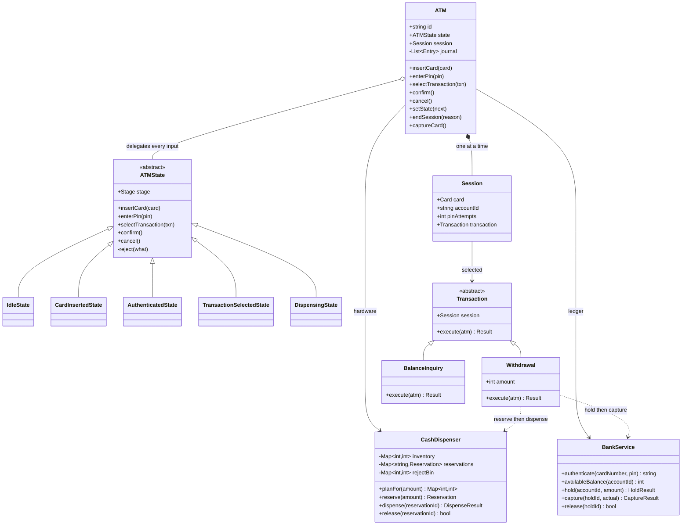
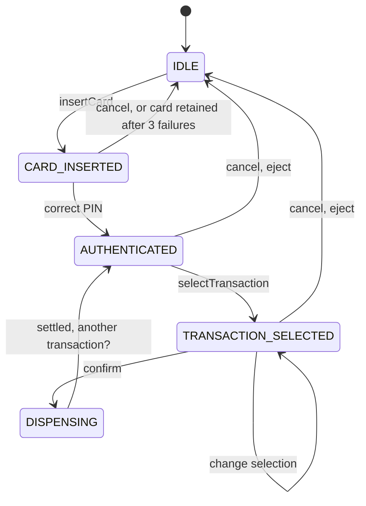

# Design an ATM

*Card in, PIN, pick a transaction, take the cash, card out. One machine, one
customer at a time.*

The hardware is a distraction. This problem is the State pattern with the
clearest possible motivation: a machine that is `IDLE`, `CARD_INSERTED`,
`AUTHENTICATED`, `TRANSACTION_SELECTED` or `DISPENSING`, where "dispense cash to
someone who never entered a PIN" has to be a call that cannot compile a path to
success rather than a bug you remember not to write. Then there is the second
half, which is where most answers thin out: the machine holds physical notes and
the bank holds a number, and those two have to agree afterwards. The rule that
makes them agree is one sentence — **the ledger is debited only after the
dispenser reports what actually left the slot** — and everything else in the
withdrawal path exists to make that sentence enforceable when the hardware jams
halfway through a stack of notes.

---

## Requirements

**Functional**
- Insert a card, authenticate with a PIN, limited attempts, card retained after
  the last one
- Balance inquiry
- Withdraw cash, dispensed as actual notes from actual cassettes
- Cancel at any point before the notes start moving
- Eject the card and return to idle at the end of every path, including failures

**Non-functional**
- **Money is conserved.** Every rupee is in the account, in the machine, in the
  customer's hand or in the reject bin. No path creates or destroys one
- **Debit follows dispense, never precedes it.** A customer who got no money must
  not have a smaller balance
- **Idempotent settlement.** A retried commit after a network timeout must not
  debit twice
- **Every transition is journalled**, because reconciliation the next morning is
  done from that journal
- **Single session.** The card slot is the mutex; concurrency lives in the bank,
  not in the machine

**Out of scope** (say so): the card network message format and EMV
cryptography, real motor and sensor drivers, cash replenishment scheduling and
routing, multi-currency cassettes, fraud scoring, screen layout, cheque and
envelope deposits.

## Clarifying questions to ask

**Is the ledger local to the machine or a remote bank service?**
This is the first question and it decides everything downstream. A local ledger
makes the debit a transaction you can wrap around the dispense. A remote one
makes it a network call that can time out *after* succeeding, which forces a
hold-then-capture protocol and an idempotency key.

**Can the dispenser fail partway through a stack of notes?**
If yes — and in real hardware it is yes — then "did the withdrawal succeed" is
not a boolean. The dispenser has to report an amount, and the ledger has to be
able to capture less than it held.

**Which denominations, and can a cassette run empty mid-day?**
This is the question behind the whole note-planning section. A full machine
makes greedy correct. An empty cassette makes greedy return "impossible" for
amounts the machine can plainly pay.

**Does the machine hold the card for the session, or is it a dip reader?**
A held card means card retention is a real state with a real failure mode: any
path that ends without an eject leaves a customer's card inside a machine. A dip
reader makes "eject" a no-op and removes an entire class of bugs.

**Where do withdrawal limits live — per transaction, per day, per account?**
Per-transaction is a machine rule and can be checked locally. Per-day is an
account rule and belongs to the bank, because the same card will be used at
another ATM ten minutes later.

**What should the machine do when the bank is unreachable?**
Either refuse everything, which is honest, or serve a small stand-in limit
offline and settle later, which is a real product decision with real losses
attached. Ask rather than assume.

## Core entities

| Entity | What it owns | What it must never own |
|---|---|---|
| `ATM` | The current state object, the active session, the journal | Whether a PIN is right, which notes to pick, what a balance is |
| `ATMState` | Which operations are legal here, and the next state | The business rule of any transaction |
| `Session` | Card, account id, PIN attempts, the selected transaction | Anything that must outlive the card being ejected |
| `CashDispenser` | Note inventory, reservations, the reject bin | Balances. It counts paper and knows nothing about money |
| `BankService` | Balances, holds, daily totals | Denominations. It knows amounts, not notes |
| `Transaction` | One customer intent and the order its steps commit in | The state machine it runs inside |

The split that carries the design is the last two. `CashDispenser` can tell you
"600 came out as three 200s"; only `BankService` can turn that into a debit. If
either one knows about the other, the failure paths stop being separable.

## Class diagram



The state machine itself, which is the part that has to make the bad states
unreachable rather than merely unvisited:



Two things are true of that diagram and both are deliberate. There is no arrow
from `IDLE` or `CARD_INSERTED` into `DISPENSING`, so cash cannot leave the
machine without a PIN having been checked. And `DISPENSING` has no cancel edge —
it is the only state that does not — because once the picker has started pulling
notes there is nothing a cancel button could undo.

## Implementation

Two phases on each side. The dispenser reserves notes before it moves them; the
bank holds funds before it captures them. The transaction commits in an order
that means every crash point leaves the customer either whole or holding exactly
what they were charged for.

```javascript
'use strict';

const Stage = Object.freeze({
  IDLE: 'IDLE',
  CARD_INSERTED: 'CARD_INSERTED',
  AUTHENTICATED: 'AUTHENTICATED',
  TRANSACTION_SELECTED: 'TRANSACTION_SELECTED',
  DISPENSING: 'DISPENSING',
});

class IllegalOperation extends Error {}

// ---------------------------------------------------------------------------
// Cash. Owns notes and knows nothing about accounts.
// ---------------------------------------------------------------------------
class CashDispenser {
  constructor(inventory) {
    this.inventory = new Map(Object.entries(inventory).map(([d, c]) => [Number(d), c]));
    this.reservations = new Map();
    this.rejectBin = new Map();   // notes that failed to leave the machine
    this.seq = 0;
    this._jamAfter = null;
  }

  get total() {
    let t = 0;
    for (const [d, c] of this.inventory) t += d * c;
    return t;
  }

  // What greedy would do. Kept only to show where it breaks.
  greedyPlan(amount) {
    const plan = new Map();
    let left = amount;
    for (const d of [...this.inventory.keys()].sort((a, b) => b - a)) {
      const k = Math.min(Math.floor(left / d), this.inventory.get(d));
      if (k > 0) { plan.set(d, k); left -= k * d; }
    }
    return left === 0 ? plan : null;
  }

  // Exact change, fewest notes, respecting how many of each note actually exist.
  planFor(amount) {
    const denoms = [...this.inventory.keys()].sort((a, b) => b - a);
    const unit = denoms[denoms.length - 1];
    if (!Number.isInteger(amount) || amount <= 0 || amount % unit !== 0) return null;

    const n = amount / unit;
    const INF = Infinity;
    const layers = [new Array(n + 1).fill(INF)];
    layers[0][0] = 0;

    for (const d of denoms) {                      // one layer per denomination
      const prev = layers[layers.length - 1];
      const cap = this.inventory.get(d);
      const step = d / unit;
      const cur = new Array(n + 1).fill(INF);
      for (let a = 0; a <= n; a++) {
        for (let k = 0; k <= cap && k * step <= a; k++) {
          const v = prev[a - k * step];
          if (v !== INF && v + k < cur[a]) cur[a] = v + k;
        }
      }
      layers.push(cur);
    }
    if (layers[denoms.length][n] === INF) return null;

    const plan = new Map();                        // walk the layers back
    let a = n;
    for (let i = denoms.length - 1; i >= 0; i--) {
      const d = denoms[i], step = d / unit, cap = this.inventory.get(d);
      const cur = layers[i + 1], prev = layers[i];
      for (let k = 0; k <= cap && k * step <= a; k++) {
        if (prev[a - k * step] !== INF && prev[a - k * step] + k === cur[a]) {
          if (k > 0) plan.set(d, k);
          a -= k * step;
          break;
        }
      }
    }
    return plan;
  }

  // Phase 1: take the notes out of inventory, but not out of the machine.
  reserve(amount) {
    const plan = this.planFor(amount);
    if (!plan) return null;
    for (const [d, k] of plan) this.inventory.set(d, this.inventory.get(d) - k);
    const id = `R${++this.seq}`;
    const reservation = { id, amount, plan, status: 'HELD' };
    this.reservations.set(id, reservation);
    return reservation;
  }

  release(id) {
    const r = this.reservations.get(id);
    if (!r || r.status !== 'HELD') return false;
    for (const [d, k] of r.plan) this.inventory.set(d, this.inventory.get(d) + k);
    r.status = 'RELEASED';
    return true;
  }

  jamAfter(noteCount) { this._jamAfter = noteCount; }   // fault injection for tests

  // Phase 2: the hardware. Reports what actually left the slot, not what was asked for.
  dispense(id) {
    const r = this.reservations.get(id);
    if (!r || r.status !== 'HELD') throw new Error(`reservation ${id} is not dispensable`);

    const notes = [];
    for (const [d, k] of [...r.plan].sort((a, b) => b[0] - a[0])) {
      for (let i = 0; i < k; i++) notes.push(d);
    }
    const limit = this._jamAfter === null ? notes.length : Math.min(this._jamAfter, notes.length);
    this._jamAfter = null;

    const out = notes.slice(0, limit);
    const stuck = notes.slice(limit);
    // Stuck notes go to the reject bin, never back to inventory. Until an
    // operator counts them, the machine must not believe it can spend them.
    for (const d of stuck) this.rejectBin.set(d, (this.rejectBin.get(d) || 0) + 1);

    r.status = stuck.length ? 'PARTIAL' : 'DISPENSED';
    return {
      status: r.status,
      dispensed: out.reduce((s, d) => s + d, 0),
      notes: out,
      retracted: stuck.reduce((s, d) => s + d, 0),
    };
  }
}

// ---------------------------------------------------------------------------
// The ledger. Two-phase: hold, then capture what actually left the machine.
// ---------------------------------------------------------------------------
class BankService {
  constructor(accounts) {
    this.accounts = new Map(accounts.map(a => [a.id, { ...a, held: 0, withdrawnToday: 0 }]));
    this.cards = new Map();
    this.holds = new Map();
    this.seq = 0;
  }

  registerCard(number, pin, accountId) { this.cards.set(number, { pin, accountId }); }

  authenticate(number, pin) {
    const c = this.cards.get(number);
    return c && c.pin === pin ? c.accountId : null;
  }

  availableBalance(accountId) {
    const a = this.accounts.get(accountId);
    return a.balance - a.held;
  }

  // Holds count against both the balance and the daily limit, so two ATMs
  // cannot each pass the check on the strength of the other's uncommitted cash.
  hold(accountId, amount) {
    const a = this.accounts.get(accountId);
    if (!a) return { ok: false, reason: 'NO_SUCH_ACCOUNT' };
    if (amount > a.balance - a.held) return { ok: false, reason: 'INSUFFICIENT_FUNDS' };
    if (a.withdrawnToday + a.held + amount > a.dailyLimit) {
      return { ok: false, reason: 'DAILY_LIMIT_EXCEEDED' };
    }
    a.held += amount;
    const id = `H${++this.seq}`;
    this.holds.set(id, { id, accountId, amount, status: 'HELD' });
    return { ok: true, holdId: id };
  }

  // Idempotent by hold id: a retried capture returns the first answer.
  capture(holdId, actual) {
    const h = this.holds.get(holdId);
    if (!h) return { ok: false, reason: 'NO_SUCH_HOLD' };
    if (h.status !== 'HELD') return { ok: true, captured: h.captured ?? 0, replayed: true };

    const a = this.accounts.get(h.accountId);
    const amount = Math.min(actual, h.amount);    // never more than was held
    a.held -= h.amount;
    a.balance -= amount;
    a.withdrawnToday += amount;
    h.status = 'CAPTURED';
    h.captured = amount;
    return { ok: true, captured: amount };
  }

  release(holdId) {
    const h = this.holds.get(holdId);
    if (!h || h.status !== 'HELD') return false;
    this.accounts.get(h.accountId).held -= h.amount;
    h.status = 'RELEASED';
    return true;
  }
}

// ---------------------------------------------------------------------------
// Transactions: one object per thing the customer can ask for.
// ---------------------------------------------------------------------------
class Transaction {
  constructor(session) { this.session = session; }
  get label() { return this.constructor.name; }
  execute() { throw new Error('not implemented'); }
}

class BalanceInquiry extends Transaction {
  execute(atm) {
    return { ok: true, balance: atm.bank.availableBalance(this.session.accountId) };
  }
}

class Withdrawal extends Transaction {
  constructor(session, amount) { super(session); this.amount = amount; }

  execute(atm) {
    // 1. Cheapest check first: can this machine even make this amount?
    const reservation = atm.dispenser.reserve(this.amount);
    if (!reservation) return { ok: false, code: 'CANNOT_DISPENSE_AMOUNT' };

    // 2. Hold the funds. Nothing debited yet.
    const hold = atm.bank.hold(this.session.accountId, this.amount);
    if (!hold.ok) {
      atm.dispenser.release(reservation.id);
      return { ok: false, code: hold.reason };
    }

    // 3. The hardware speaks.
    let result;
    try {
      result = atm.dispenser.dispense(reservation.id);
    } catch (err) {
      atm.bank.release(hold.holdId);
      return { ok: false, code: 'DISPENSER_FAULT' };
    }

    // 4. Debit exactly what left the slot, never what was asked for.
    if (result.dispensed === 0) {
      atm.bank.release(hold.holdId);
      return { ok: false, code: 'NOTHING_DISPENSED', retracted: result.retracted };
    }
    const captured = atm.bank.capture(hold.holdId, result.dispensed);
    return {
      ok: true,
      dispensed: result.dispensed,
      debited: captured.captured,
      notes: result.notes,
      retracted: result.retracted,
    };
  }
}

// ---------------------------------------------------------------------------
// States. The base refuses everything; each state re-opens only the doors it
// owns, so an illegal input is an exception and not a silent no-op.
// ---------------------------------------------------------------------------
class ATMState {
  static stage = Stage.IDLE;
  constructor(atm) { this.atm = atm; }
  get stage() { return this.constructor.stage; }

  insertCard() { this.#reject('insert a card'); }
  enterPin() { this.#reject('enter a PIN'); }
  selectTransaction() { this.#reject('select a transaction'); }
  confirm() { this.#reject('confirm'); }
  cancel() { return this.atm.endSession('CANCELLED'); }

  #reject(what) { throw new IllegalOperation(`cannot ${what} in state ${this.stage}`); }
}

class IdleState extends ATMState {
  static stage = Stage.IDLE;
  insertCard(card) {
    if (this.atm.outOfService) return { ok: false, code: 'OUT_OF_SERVICE' };
    this.atm.session = { card, accountId: null, pinAttempts: 0, transaction: null };
    this.atm.setState(new CardInsertedState(this.atm));
    return { ok: true, prompt: 'Enter PIN' };
  }
  cancel() { return { ok: true, code: 'NOTHING_TO_CANCEL' }; }
}

class CardInsertedState extends ATMState {
  static stage = Stage.CARD_INSERTED;
  enterPin(pin) {
    const s = this.atm.session;
    const accountId = this.atm.bank.authenticate(s.card.number, pin);
    if (accountId) {
      s.accountId = accountId;
      this.atm.setState(new AuthenticatedState(this.atm));
      return { ok: true, prompt: 'Select transaction' };
    }
    s.pinAttempts += 1;
    if (s.pinAttempts >= this.atm.maxPinAttempts) {
      this.atm.captureCard();
      return { ok: false, code: 'CARD_RETAINED' };
    }
    return { ok: false, code: 'WRONG_PIN', attemptsLeft: this.atm.maxPinAttempts - s.pinAttempts };
  }
}

class AuthenticatedState extends ATMState {
  static stage = Stage.AUTHENTICATED;
  selectTransaction(transaction) {
    this.atm.session.transaction = transaction;
    this.atm.setState(new TransactionSelectedState(this.atm));
    return { ok: true, prompt: `Confirm ${transaction.label}` };
  }
}

class TransactionSelectedState extends ATMState {
  static stage = Stage.TRANSACTION_SELECTED;

  selectTransaction(transaction) {          // changed their mind before confirming
    this.atm.session.transaction = transaction;
    return { ok: true, prompt: `Confirm ${transaction.label}` };
  }

  confirm() {
    const atm = this.atm;
    const transaction = atm.session.transaction;
    atm.setState(new DispensingState(atm));
    let result;
    try {
      result = transaction.execute(atm);
    } finally {
      atm.setState(new AuthenticatedState(atm));   // no crash strands the card
    }
    atm.record(result.ok ? 'TXN_OK' : 'TXN_FAILED', { label: transaction.label, ...result });
    return result;
  }
}

class DispensingState extends ATMState {
  static stage = Stage.DISPENSING;
  // The one state with no cancel: the money is already moving.
  cancel() { throw new IllegalOperation('cannot cancel once the dispenser has started'); }
}

// ---------------------------------------------------------------------------
// The machine: hardware, current state, journal. It decides nothing itself.
// ---------------------------------------------------------------------------
class ATM {
  constructor({ id, bank, dispenser, maxPinAttempts = 3 }) {
    this.id = id;
    this.bank = bank;
    this.dispenser = dispenser;
    this.maxPinAttempts = maxPinAttempts;
    this.outOfService = false;
    this.session = null;
    this.journal = [];
    this.state = new IdleState(this);
  }

  get stage() { return this.state.stage; }

  setState(next) {
    this.record('STATE', { from: this.state.stage, to: next.stage });
    this.state = next;
  }

  record(event, data = {}) {
    this.journal.push({ seq: this.journal.length + 1, event, ...data });
  }

  insertCard(card) { return this.state.insertCard(card); }
  enterPin(pin) { return this.state.enterPin(pin); }
  selectTransaction(t) { return this.state.selectTransaction(t); }
  confirm() { return this.state.confirm(); }
  cancel() { return this.state.cancel(); }

  endSession(reason) {
    const card = this.session ? this.session.card : null;
    this.session = null;
    this.setState(new IdleState(this));
    this.record('CARD_EJECTED', { reason });
    return { ok: true, code: reason, ejected: card && card.number };
  }

  captureCard() {
    this.record('CARD_RETAINED', { number: this.session.card.number });
    this.session = null;
    this.setState(new IdleState(this));
  }
}

// ---------------------------------------------------------------------------
// Usage
// ---------------------------------------------------------------------------
const bank = new BankService([{ id: 'ACC-1', balance: 12000, dailyLimit: 10000 }]);
bank.registerCard('4111-0001', '4291', 'ACC-1');

const dispenser = new CashDispenser({ 2000: 2, 500: 3, 200: 5, 100: 0 });  // 100s ran out
const atm = new ATM({ id: 'ATM-07', bank, dispenser });
const card = { number: '4111-0001' };

const show = (label, r) => console.log(label.padEnd(24), JSON.stringify(r));
console.log('cash in machine:', dispenser.total, '\n');

show('insert card', atm.insertCard(card));
show('wrong PIN', atm.enterPin('0000'));
show('correct PIN', atm.enterPin('4291'));

const session = atm.session;
atm.selectTransaction(new BalanceInquiry(session));
show('balance', atm.confirm());

// 600 with no 100s left: greedy takes the 500 and strands the last 100.
console.log('\ngreedy plan for 600:', dispenser.greedyPlan(600));
console.log('dp plan for 600:    ', dispenser.planFor(600));
atm.selectTransaction(new Withdrawal(session, 600));
show('withdraw 600', atm.confirm());

// 300 cannot be built from 2000/500/200. Declined before the ledger is touched.
atm.selectTransaction(new Withdrawal(session, 300));
show('withdraw 300', atm.confirm());
show('balance', new BalanceInquiry(session).execute(atm));

// The dispenser jams after one note of a two-note plan.
dispenser.jamAfter(1);
atm.selectTransaction(new Withdrawal(session, 2500));
show('withdraw 2500, jams', atm.confirm());
show('balance', new BalanceInquiry(session).execute(atm));

try { atm.enterPin('4291'); } catch (e) { console.log('\nillegal:', e.message); }
show('eject', atm.cancel());
try { atm.confirm(); } catch (e) { console.log('illegal:', e.message); }

atm.insertCard(card);
atm.enterPin('1'); atm.enterPin('2');
show('third wrong PIN', atm.enterPin('3'));
console.log('state:', atm.stage, '| session:', atm.session);
console.log('\nreject bin:', dispenser.rejectBin, '| cash left:', dispenser.total);
```

Running it:

```
cash in machine: 6500

insert card              {"ok":true,"prompt":"Enter PIN"}
wrong PIN                {"ok":false,"code":"WRONG_PIN","attemptsLeft":2}
correct PIN              {"ok":true,"prompt":"Select transaction"}
balance                  {"ok":true,"balance":12000}

greedy plan for 600: null
dp plan for 600:     Map(1) { 200 => 3 }
withdraw 600             {"ok":true,"dispensed":600,"debited":600,"notes":[200,200,200],"retracted":0}
withdraw 300             {"ok":false,"code":"CANNOT_DISPENSE_AMOUNT"}
balance                  {"ok":true,"balance":11400}
withdraw 2500, jams      {"ok":true,"dispensed":2000,"debited":2000,"notes":[2000],"retracted":500}
balance                  {"ok":true,"balance":9400}

illegal: cannot enter a PIN in state AUTHENTICATED
eject                    {"ok":true,"code":"CANCELLED","ejected":"4111-0001"}
illegal: cannot confirm in state IDLE
third wrong PIN          {"ok":false,"code":"CARD_RETAINED"}
state: IDLE | session: null

reject bin: Map(1) { 500 => 1 } | cash left: 3400
```

The jam line is the whole point of the design in one row: 2500 was asked for,
2000 came out, 2000 was debited, and the 500 that never made it is sitting in
the reject bin where the morning reconciliation will find it.

### Why the note planning is not greedy

Greedy — take as many of the largest note as fit, repeat — is optimal for
*canonical* denomination systems, and every real currency is canonical, because
central banks mint 1/2/5 per decade precisely so that mental arithmetic works.
So on an unlimited supply of notes, greedy is both correct and minimal, and
saying that out loud is worth a mark. The textbook counterexample needs a made-up
currency: with coins {1, 3, 4} and a target of 6, greedy pays 4 + 1 + 1 while the
optimum is 3 + 3.

The ATM does not need a made-up currency, because it has a second constraint the
textbook problem does not: **a finite number of each note**. The moment the 100s
run out, the *effective* denomination set is {2000, 500, 200}, which is not
canonical any more. Ask for 600 and greedy takes the 500, needs another 100, and
reports failure — for an amount the machine can pay three times over with 200s.
That is not a suboptimal answer, it is a wrong one, and the customer sees
"unable to dispense" while the cassettes are full.

So the planner is a bounded coin-change DP that minimises note count, one layer
per denomination, reconstructing the plan by walking the layers back. The cost
is trivial: amount divided by the smallest note is a few hundred cells, times
four or five denominations. And the DP gives you a second thing for free — the
honest feasibility answer. `planFor(300)` returning `null` is the machine saying
"not with the notes I have", which is a different message from "insufficient
funds" and should reach the screen as one.

## Design patterns used

| Pattern | Where | What it buys |
|---|---|---|
| **State** | `ATMState` and its five subclasses; `ATM` is the context and delegates every keypad input | Illegal inputs stop being conditionals you must remember. The base class refuses everything and each state re-opens only what it owns, so `confirm()` while idle throws instead of dispensing |
| **Command** | `Transaction` with `Withdrawal` and `BalanceInquiry`, held on the session and executed on confirm | A new transaction type is a new subclass and zero changes to the state machine. It also gives the journal something concrete to log and, later, to replay |
| **Reservation / two-phase commit** | `reserve` + `dispense` + `release` on the dispenser, `hold` + `capture` + `release` on the bank | Makes "debit only what was dispensed" expressible. Both sides can be prepared, and either side can be abandoned, without the other having moved |

Singleton is the pattern people reach for here, on the argument that there is
one ATM. There is one *physical* machine; there is no reason for the process to
enforce that, and doing so means two tests in the same run share a cash cassette.

## Concurrency / edge cases

**Two ATMs, one account.** This is the race the interviewer is after. The card
slot serialises one machine, but the same card and PIN work anywhere, so the
ledger is the only place a limit can be enforced. Reading the balance and then
debiting is the classic check-then-act bug: two machines both read 5000 and both
dispense 5000. The hold is the fix — it is a lock taken inside the bank, and
`hold` counts both `held` and `withdrawnToday` against the daily limit, so the
second machine cannot pass the check on the strength of the first machine's
uncommitted cash.

**Two customers, one cash cassette.** Same shape, one level down. `reserve`
removes the notes from `inventory` before the hardware runs, so a second
transaction planning against that inventory can never be promised notes the
first one is already pulling. The reservation is to the cassette what the hold
is to the account.

**The dispenser jams mid-stack.** The hardware reports an amount, not a boolean.
`capture(holdId, result.dispensed)` debits what left the slot and releases the
rest of the hold in the same call, so the customer is charged 2000 for 2000. The
retracted notes go to the reject bin rather than back into inventory, because
the machine has no way to verify a note it failed to move, and counting it as
available is how a cassette ends the day short.

**Power cut between dispense and capture.** The worst case, and the reason for
the ordering. The notes are gone and the ledger does not know. The hold survives
on the bank side, so the customer's balance is not wrong — the money is frozen,
not lost. On restart the ATM replays its journal and retries the capture; because
`capture` is keyed by hold id and checks status, the retry is idempotent and
cannot debit twice. If the machine never comes back, the hold expires and
auto-releases, and the difference turns up in the cassette count. This is why
banks show pending amounts that clear a day later rather than disappearing.

**Power cut between hold and dispense.** Nothing left the machine. The hold
expires on its own; the reservation is stale and its notes are only returned to
inventory after an operator counts the cassette. Losing availability is
acceptable here. Assuming the notes are still where you left them is not.

**Double-pressed confirm.** The second press arrives when the machine is back in
`AUTHENTICATED`, where `confirm` is not a legal operation, so it throws rather
than executing the same withdrawal twice. The state machine is the deduplication
and no separate flag is needed.

**Cancel while dispensing.** Refused, loudly. `DispensingState` is the only state
that overrides `cancel` to throw. A cancel button that silently did nothing here
would be worse, because the screen would suggest the transaction was stopped.

**A state that must not be reachable.** Dispensing without an authenticated
session. There is no edge into `DispensingState` except through
`TransactionSelectedState.confirm()`, and the only way into that state is
`AuthenticatedState.selectTransaction()`, which is only constructible after
`authenticate` returned an account id.

**A card stranded inside the machine.** Every terminal path ends in `endSession`
or `captureCard`, and `confirm()` restores `AUTHENTICATED` in a `finally`, so a
thrown transaction leaves a usable machine with a retrievable card rather than
one wedged in `DISPENSING`.

**The customer walks away after authenticating.** An inactivity timer fires the
same path as cancel: eject the card, drop the session, back to idle. It has to
be the same path, not a second one, or it becomes the path that is never tested.

## Follow-ups they will ask

**How would you support deposits?**
Symmetrically, and this is the check that you understood the withdrawal rule.
The note acceptor counts first and the credit is posted for the counted amount,
never the declared one. Envelope deposits credit only after manual verification,
which is why they used to take two days.

**Multiple currencies, or cassettes with different note quality?**
A cassette becomes the unit rather than a denomination, with a currency and a
quality grade on it. The DP is unchanged — it plans per currency over that
currency's cassettes. Only the inventory key changes.

**How do you reload cash while the machine is live?**
Set `outOfService`, which blocks new cards at `IdleState.insertCard` but lets an
in-flight session finish. Reload, count the reject bin, reconcile against the
journal, clear the flag. Mutating inventory under a live reservation is the one
thing the operator flow must not do.

**What happens when the bank is unreachable?**
Refuse by default, since a hold cannot be taken. If the product wants stand-in
authorisation, cap it hard, keep a signed local record per card, and settle on
reconnect — the bank is knowingly accepting a loss rate in exchange for a working
machine during an outage.

**How would you test this?**
Drive the state machine with scripted inputs and a fake dispenser that jams on
demand, which is what `jamAfter` is for. The assertion after every step is one
invariant: account balance, plus cash in the machine, plus cash handed over, plus
the reject bin, is constant. Every bug in this problem shows up as that sum
moving.

**Why is note selection not a Strategy?**
It could be, and it is the natural next extension — "fewest notes" and "prefer
smaller notes so the 2000s last until evening" are different policies over the
same inventory. Pull `planFor` out behind a `NotePlanner` interface and the
dispenser stops caring which one is installed.
