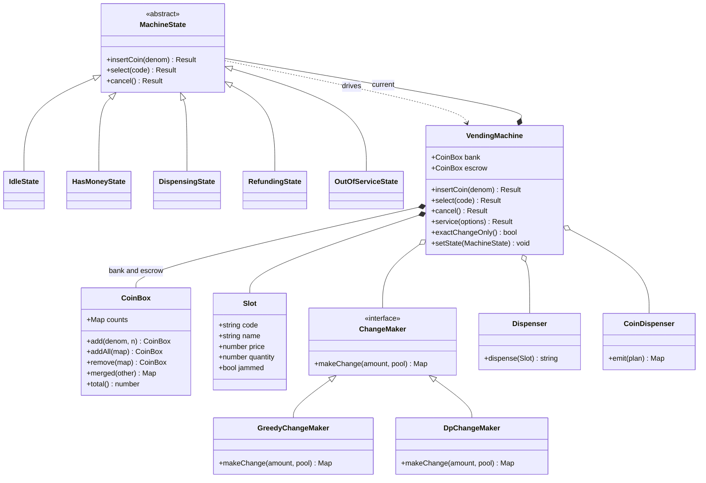
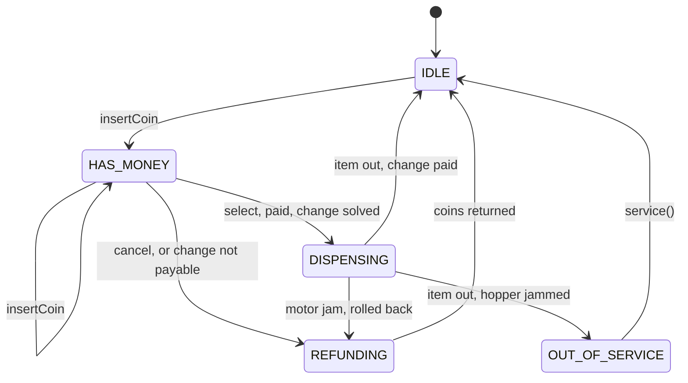

# Design a vending machine

*The compact State pattern problem. Small enough to finish in twenty minutes,
with one genuinely hard subproblem hiding inside it.*

A machine holds products in priced slots, takes coins, vends one item and gives
change. The state machine everyone expects you to draw — idle, holding money,
dispensing, refunding — is the easy half, and drawing it is table stakes. What is
actually being probed is what you do about change. A real coin till is finite,
and a finite till breaks greedy change-making even when the denominations are the
familiar ones, so you need the bounded DP and you need to notice that you need
it. Right behind that sits the ordering question: take the money, drop the item,
pay the change — in which order, and who absorbs the loss when the machine fails
between two of those steps. Get the ordering right and the state diagram writes
itself.

---

## Requirements

**Functional**
- Accept coins of known denominations, reject everything else, show running credit
- Select a slot; vend when credit covers the price *and* the change is payable
- Return change
- Cancel before the item drops, and get the money back
- An operator can restock products and refill the coin till

**Non-functional / constraints**
- Money is exact. No floats, no rounding in anybody's favour.
- A sale is atomic: the buyer ends with (item + correct change) or (every coin back). There is no third outcome.
- The machine must never dispense an item it cannot make change for.
- The hardware is slow and fallible. A dispense takes seconds and can jam.
- There is one physical actuator. Inputs arriving mid-vend are rejected, not queued.

**Out of scope** — say it out loud: card and cashless readers (a follow-up),
notes and note recyclers, multi-item carts, remote price management and
telemetry, and the coin validator itself. Assume the validator hands you either a
denomination or a reject.

## Clarifying questions to ask

**Coins only, or cashless too?** A cashless sale has no change, so the hard half
of this problem evaporates on that path — and it adds a second source of credit
that can race the coin path. If the answer is "cashless only", say that the
design just got much smaller and check that is really what they want.

**What denominations, and is the set canonical?** With 1/5/10/25, greedy happens
to be optimal on an infinite till. With 1/20/25 it is not: 40c greedily is
25 + 15x1c, sixteen coins, where 20 + 20 is two. Whether they hand you a
canonical set decides whether greedy is even arguable.

**Is the till finite, and are the coins just inserted usable as change?** This is
the question the problem is built around. A finite till breaks greedy even for
canonical denominations. And whether inserted coins are spendable decides whether
you need an escrow separate from the till, which in turn decides whether a cancel
can ever fail.

**When change cannot be made, does the machine refuse the sale or vend and owe?**
Refusing is the standard answer, and it is where the "exact change only" light
comes from. Worth establishing that the light is derived from the till, not a
switch an operator flips.

**Does a sensor confirm the item actually dropped?** With a sensor, a jam is
recoverable and the buyer gets refunded. Without one, you are choosing which
party absorbs the loss, and you should make the interviewer choose with you.

**One machine, or a fleet?** A fleet moves pricing, stock and audit off the board
and turns restocking into a routing problem. The state machine on the board does
not change, which is worth saying — it is the reason this design survives the
follow-up.

## Core entities

| Entity | Owns | Must never own |
|---|---|---|
| `CoinBox` | Counts per denomination; all-or-nothing add and remove | Deciding *which* coins to pay out |
| Escrow (a `CoinBox`) | The coins of the sale in progress, still the buyer's | Being spent before the sale commits |
| `Slot` | Code, product, price, quantity, jam flag | Money, change, or machine state |
| `ChangeMaker` | Turning an amount plus a till into a coin plan, or nothing | Moving coins; knowing that products exist |
| `MachineState` | Which inputs are legal right now, and what they do | Coin arithmetic; solving change |
| `Dispenser` / `CoinDispenser` | The two fallible actuators | Deciding whether a sale should happen |
| `VendingMachine` | Slots, till, escrow, current state, the event feed | Change arithmetic; the per-state input rules |

The row to defend is the escrow. Coins sit there, still belonging to the buyer,
until the item has dropped. That single separation is what makes a cancel
impossible to get wrong: it hands back the same physical coins, so it can never
fail for lack of change, no matter how empty the till is.

## Class diagram



And the transitions, which is the diagram they will actually ask for:



Note what has no arrow into it: there is no path from `DISPENSING` back to
`HAS_MONEY`. Once the money has moved, the only exits are a completed sale, a
rollback, or a machine that stops trading.

## Implementation

Four things in the code carry the grade.

**Greedy change-making is wrong, and not only for the textbook reason.** The
textbook reason is a non-canonical denomination set: with 1/20/25, greedy pays
40c as 25 + 15x1c and the optimum is 20 + 20. That is a fine story but it is
somebody else's currency. The reason that actually bites you is the till. Take
plain US coins and a till holding one 25c and three 10c. Change due is 30c.
Greedy takes the 25c, then needs 5c, has none, and declares the sale impossible —
while 10 + 10 + 10 was sitting right there. Greedy cannot back out of a coin it
has already taken, and a finite till is exactly the situation where backing out is
required.

**So change-making is bounded coin change, solved with DP.** `dp[a]` is the
fewest coins that make exactly `a`, one round per denomination, with a `used[]`
array capping how many copies of the current coin any chain may spend. That cap is
the only difference from the unbounded version everyone already knows, and it is
what makes the till's stock a constraint rather than a suggestion. Cost is
`O(amount x denominations)`, and `amount` here is change due — at most the largest
coin you accept, so a few hundred cells. Say that out loud, because "dynamic
programming" sounds expensive and this one is fifteen lines and microseconds.

**The ordering is the whole answer to "the item dropped and there is no change".**
Solve the change first, then move the money and set those coins aside, then drop
the item, then pay the change out. Each step only runs once the previous one is
guaranteed. That makes "item out, change impossible" unreachable by construction
rather than by a check someone might forget. Exactly one window is
irreversible — the item is out and the coin hopper jams — and there the machine
records the debt and stops trading instead of quietly keeping the difference.

**States reject by default.** `MachineState` refuses every input, and each
subclass names only the inputs it accepts. The alternative, a `switch (state)`
inside `select`, means every new state edits every method and a forgotten case
silently falls through to the happy path. Adding `OUT_OF_SERVICE` here was one
class and no edits to the others.

```js
// ---------- money ----------
// Every amount is an integer number of cents. 0.1 + 0.2 !== 0.3, and a machine
// that rounds is a machine that leaks money one sale at a time.
const DENOMS_DESC = [100, 25, 10, 5, 1];
const money = (c) => `$${(c / 100).toFixed(2)}`;
const planToString = (plan) =>
  [...plan].sort((a, b) => b[0] - a[0]).map(([d, n]) => `${n}x${d}c`).join(' + ') || 'none';

class CoinBox {
  constructor(counts = {}) {
    this.counts = new Map();
    for (const [d, n] of Object.entries(counts)) this.counts.set(Number(d), n);
  }
  add(denom, n = 1) {
    this.counts.set(denom, (this.counts.get(denom) ?? 0) + n);
    return this;
  }
  addAll(map) {
    for (const [d, n] of map) this.add(d, n);
    return this;
  }
  // Check every denomination before mutating any of them: a partial removal
  // that throws halfway would leave the box in a state nobody can reconcile.
  remove(map) {
    for (const [d, n] of map) {
      if ((this.counts.get(d) ?? 0) < n) throw new Error(`coin box underflow at ${d}c`);
    }
    for (const [d, n] of map) this.counts.set(d, this.counts.get(d) - n);
    return this;
  }
  snapshot() {
    return new Map([...this.counts].filter(([, n]) => n > 0));
  }
  merged(other) {
    const m = this.snapshot();
    for (const [d, n] of other.snapshot()) m.set(d, (m.get(d) ?? 0) + n);
    return m;
  }
  total() {
    let t = 0;
    for (const [d, n] of this.counts) t += d * n;
    return t;
  }
  clear() {
    this.counts.clear();
    return this;
  }
}

// ---------- change making ----------
class ChangeMaker {
  makeChange() {
    throw new Error('ChangeMaker.makeChange is abstract');
  }
}

// Take the largest coin that fits, repeat. Correct for an unlimited US till,
// wrong the moment the till is finite.
class GreedyChangeMaker extends ChangeMaker {
  makeChange(amount, pool) {
    const plan = new Map();
    let left = amount;
    for (const d of DENOMS_DESC) {
      const take = Math.min(pool.get(d) ?? 0, Math.floor(left / d));
      if (take > 0) {
        plan.set(d, take);
        left -= take * d;
      }
    }
    return left === 0 ? plan : null;
  }
}

// Bounded knapsack: dp[a] = fewest coins that make exactly a, using only what
// the till holds. used[] caps how many copies of the current coin any chain may
// spend, which is what turns unbounded coin change into the bounded version.
class DpChangeMaker extends ChangeMaker {
  makeChange(amount, pool) {
    if (amount === 0) return new Map();
    const coins = [...pool].filter(([, n]) => n > 0);
    const dp = new Array(amount + 1).fill(Infinity);
    dp[0] = 0;
    const usedPerCoin = [];

    for (const [denom, stock] of coins) {
      const used = new Array(amount + 1).fill(0);
      for (let a = denom; a <= amount; a++) {
        const prev = a - denom;
        if (dp[prev] === Infinity) continue;
        if (used[prev] >= stock) continue; // no copies of this coin left
        if (dp[prev] + 1 < dp[a]) {
          dp[a] = dp[prev] + 1;
          used[a] = used[prev] + 1;
        }
      }
      usedPerCoin.push(used);
    }
    if (dp[amount] === Infinity) return null;

    // Walk the rounds backwards: round i spent used[i][a] copies of coin i, so
    // the state before that round is a - used * denom.
    const plan = new Map();
    let a = amount;
    for (let i = coins.length - 1; i >= 0; i--) {
      const k = usedPerCoin[i][a];
      if (k > 0) {
        plan.set(coins[i][0], k);
        a -= k * coins[i][0];
      }
    }
    return plan;
  }
}

// ---------- inventory and hardware ----------
class Slot {
  constructor(code, name, price, quantity) {
    this.code = code;
    this.name = name;
    this.price = price;
    this.quantity = quantity;
    this.jammed = false;
  }
  get isEmpty() {
    return this.quantity === 0;
  }
}

// The two fallible actuators, injected so the failure paths are testable.
class Dispenser {
  constructor(jamCodes = []) {
    this.jamCodes = new Set(jamCodes);
  }
  dispense(slot) {
    if (this.jamCodes.has(slot.code)) throw new Error(`motor jam in slot ${slot.code}`);
    slot.quantity -= 1;
    return slot.name;
  }
}

class CoinDispenser {
  constructor(shouldJam = () => false) {
    this.shouldJam = shouldJam;
  }
  emit(plan) {
    if (this.shouldJam(plan)) throw new Error('coin hopper jam');
    return plan;
  }
}

// ---------- states ----------
const ok = (extra = {}) => ({ ok: true, ...extra });
const fail = (code, extra = {}) => ({ ok: false, code, ...extra });

// The base class rejects everything. A state only names the inputs it accepts,
// so an unhandled input is a rejection by default rather than by omission.
class MachineState {
  constructor(machine) {
    this.machine = machine;
  }
  get name() {
    return this.constructor.name.replace('State', '').toUpperCase();
  }
  insertCoin() {
    return fail('NOT_ACCEPTING_COINS');
  }
  select() {
    return fail('NOT_READY');
  }
  cancel() {
    return fail('NOTHING_TO_CANCEL');
  }
}

class IdleState extends MachineState {
  insertCoin(denom) {
    const m = this.machine;
    m.escrow.add(denom);
    m.setState(new HasMoneyState(m));
    return ok({ credit: m.escrow.total() });
  }
  select(code) {
    const slot = this.machine.inventory.get(code);
    if (!slot) return fail('NO_SUCH_SLOT', { slot: code });
    return fail('INSERT_MONEY', { price: slot.price });
  }
}

class HasMoneyState extends MachineState {
  insertCoin(denom) {
    const m = this.machine;
    m.escrow.add(denom);
    return ok({ credit: m.escrow.total() });
  }

  select(code) {
    const m = this.machine;
    const slot = m.inventory.get(code);
    if (!slot) return fail('NO_SUCH_SLOT', { slot: code });
    if (slot.jammed) return fail('SLOT_JAMMED', { slot: code });
    if (slot.isEmpty) return fail('SOLD_OUT', { slot: code });

    const credit = m.escrow.total();
    if (credit < slot.price) return fail('INSUFFICIENT_FUNDS', { due: slot.price - credit });

    const changeDue = credit - slot.price;
    // The escrowed coins count as change only because the sale is about to be
    // committed. If it aborts they go back to the buyer as the same coins.
    const plan = m.changeMaker.makeChange(changeDue, m.bank.merged(m.escrow));
    if (plan === null) {
      m.setState(new RefundingState(m));
      const refunded = m.drainEscrow();
      m.setState(new IdleState(m));
      return fail('EXACT_CHANGE_ONLY', { changeDue, refunded });
    }

    m.setState(new DispensingState(m));
    const escrowed = m.escrow.snapshot();

    // Money moves before the item does, so the change is set aside before the
    // product can drop. "Item out, no change" is unreachable by construction.
    m.bank.addAll(escrowed);
    m.escrow.clear();
    m.bank.remove(plan);

    let item;
    try {
      item = m.dispenser.dispense(slot);
    } catch (err) {
      // Compensating transaction: the exact inverse of the two lines above.
      m.bank.addAll(plan);
      m.bank.remove(escrowed);
      m.escrow.addAll(escrowed);
      slot.jammed = true;
      m.setState(new RefundingState(m));
      const refunded = m.drainEscrow();
      m.setState(new IdleState(m));
      return fail('DISPENSE_FAILED', { reason: err.message, refunded });
    }

    try {
      m.coinDispenser.emit(plan);
    } catch (err) {
      // The item is gone and cannot be un-sold. Record the debt and stop
      // trading rather than quietly keeping the difference.
      m.debts.push({ slot: code, owed: changeDue });
      m.setState(new OutOfServiceState(m));
      return ok({ item, change: new Map(), owed: changeDue, warning: err.message });
    }

    m.setState(new IdleState(m));
    return ok({ item, change: plan });
  }

  // A cancel hands back the physical coins sitting in escrow, so it can never
  // fail for lack of change. That is the entire reason escrow exists.
  cancel() {
    const m = this.machine;
    m.setState(new RefundingState(m));
    const refunded = m.drainEscrow();
    m.setState(new IdleState(m));
    return ok({ refunded });
  }
}

// Both transient states reject every input. On real hardware the actuator takes
// seconds, and this is what keeps a second button press out of the transaction.
class DispensingState extends MachineState {
  insertCoin() {
    return fail('BUSY');
  }
  select() {
    return fail('BUSY');
  }
  cancel() {
    return fail('TOO_LATE_TO_CANCEL');
  }
}

class RefundingState extends MachineState {
  insertCoin() {
    return fail('BUSY');
  }
  select() {
    return fail('BUSY');
  }
}

class OutOfServiceState extends MachineState {
  insertCoin() {
    return fail('OUT_OF_SERVICE');
  }
  select() {
    return fail('OUT_OF_SERVICE');
  }
  cancel() {
    return fail('OUT_OF_SERVICE');
  }
}

// ---------- the machine ----------
class VendingMachine {
  constructor({
    slots,
    bank,
    changeMaker = new DpChangeMaker(),
    dispenser = new Dispenser(),
    coinDispenser = new CoinDispenser(),
  }) {
    this.inventory = new Map(slots.map((s) => [s.code, s]));
    this.bank = bank;
    this.escrow = new CoinBox();
    this.changeMaker = changeMaker;
    this.dispenser = dispenser;
    this.coinDispenser = coinDispenser;
    this.debts = [];
    this.listeners = [];
    this.state = new IdleState(this);
  }

  subscribe(fn) {
    this.listeners.push(fn);
    return this;
  }
  emit(event) {
    for (const fn of this.listeners) fn(event);
  }
  setState(next) {
    this.state = next;
    this.emit({ type: 'STATE', name: next.name, credit: this.escrow.total() });
  }
  drainEscrow() {
    const coins = this.escrow.snapshot();
    this.escrow.clear();
    return coins;
  }

  // Rejecting a foreign coin is the validator's job, not a state's, so it is
  // handled once here instead of in every state that accepts money.
  insertCoin(denom) {
    if (!DENOMS_DESC.includes(denom)) return fail('COIN_REJECTED', { denom });
    return this.state.insertCoin(denom);
  }
  select(code) {
    return this.state.select(code);
  }
  cancel() {
    return this.state.cancel();
  }

  // Only the operator can leave OUT_OF_SERVICE.
  service({ refill = {}, restock = {} } = {}) {
    for (const [d, n] of Object.entries(refill)) this.bank.add(Number(d), n);
    for (const [code, n] of Object.entries(restock)) {
      const slot = this.inventory.get(code);
      slot.quantity += n;
      slot.jammed = false;
    }
    const settled = this.debts.splice(0);
    this.setState(new IdleState(this));
    return ok({ settled, bank: this.bank.total() });
  }

  // "Exact change only" is derived, never a flag someone forgets to clear.
  exactChangeOnly() {
    const pool = this.bank.snapshot();
    return [...this.inventory.values()].some((slot) =>
      DENOMS_DESC.some((d) => d > slot.price && this.changeMaker.makeChange(d - slot.price, pool) === null),
    );
  }
}

// ---------- usage ----------
const show = (label, r) =>
  console.log(label.padEnd(24), JSON.stringify(r, (k, v) => (v instanceof Map ? planToString(v) : v)));

// 1. Greedy against a finite till, which is the failure they are fishing for.
const till = new Map([[25, 1], [10, 3]]);
console.log('30c change from a till of 1x25c + 3x10c');
console.log('   greedy ->', new GreedyChangeMaker().makeChange(30, till) ?? 'FAILED');
console.log('   dp     ->', planToString(new DpChangeMaker().makeChange(30, till)));

// 2. Greedy is also wrong on a non-canonical denomination set, even unlimited.
const odd = new Map([[25, 9], [20, 9], [1, 40]]);
console.log('40c change from denominations 1 / 20 / 25');
console.log('   greedy ->', planToString(new GreedyChangeMaker().makeChange(40, odd)));
console.log('   dp     ->', planToString(new DpChangeMaker().makeChange(40, odd)));
console.log('');

// 3. The same machine, the same sale, two change makers.
const build = (changeMaker) =>
  new VendingMachine({
    slots: [new Slot('A1', 'Cola', 70, 3), new Slot('A2', 'Chips', 100, 1), new Slot('B1', 'Gum', 35, 5)],
    bank: new CoinBox({ 25: 1, 10: 3 }),
    changeMaker,
    dispenser: new Dispenser(['B1']), // B1's motor is dead
  });

const greedyMachine = build(new GreedyChangeMaker());
greedyMachine.insertCoin(100);
show('greedy, buy A1 (70c)', greedyMachine.select('A1'));

const machine = build(new DpChangeMaker());
machine.subscribe((e) => console.log(`   [display] ${e.name} credit=${money(e.credit)}`));
console.log('');
show('select before paying', machine.select('A1'));
show('foreign coin', machine.insertCoin(3));
show('insert 25c', machine.insertCoin(25));
show('buy A1 too early', machine.select('A1'));
show('cancel', machine.cancel());
console.log('');
show('insert 100c', machine.insertCoin(100));
show('dp, buy A1 (70c)', machine.select('A1'));

// The 10c coins are gone now, so 30c of change is no longer payable at all.
console.log('');
show('insert 100c', machine.insertCoin(100));
show('buy A1 (70c)', machine.select('A1'));
console.log('');
show('insert 100c', machine.insertCoin(100));
show('buy A2 (100c)', machine.select('A2'));
show('insert 100c', machine.insertCoin(100));
show('buy A2 again', machine.select('A2'));
show('cancel', machine.cancel());

// Motor jam: nothing dropped, so everything the buyer put in comes back.
console.log('');
show('insert 25c', machine.insertCoin(25));
show('insert 10c', machine.insertCoin(10));
show('buy B1 (jammed motor)', machine.select('B1'));
show('exact change only?', machine.exactChangeOnly());
show('service', machine.service({ refill: { 10: 20, 5: 20, 1: 20 }, restock: { A2: 4, B1: 0 } }));
show('exact change only?', machine.exactChangeOnly());

// 4. The one failure that cannot be rolled back: the item dropped, the coin
//    hopper did not. The machine owes money and says so.
console.log('');
const faulty = new VendingMachine({
  slots: [new Slot('A1', 'Cola', 70, 1)],
  bank: new CoinBox({ 10: 3 }),
  coinDispenser: new CoinDispenser(() => true),
});
faulty.insertCoin(100);
show('hopper jam mid-sale', faulty.select('A1'));
show('next buyer', faulty.insertCoin(25));
```

Running it prints the two greedy failures, the same sale succeeding under the DP
and refused under greedy, a motor jam that returns the exact coins inserted, and
a hopper jam that leaves the machine owing 30c and out of service.

## Design patterns used

| Pattern | Where | What it buys |
|---|---|---|
| State | `MachineState` and its five subclasses, held by `VendingMachine` | "Cancel after the item dropped" and "press the button twice mid-vend" become unreachable rather than guarded. A new state is one class, not a new branch in five methods. |
| Strategy | `ChangeMaker`, greedy or DP, injected | The change policy is swappable and unit-testable against a fixed till with no machine around it. It also makes the greedy-versus-DP argument demonstrable instead of theoretical. |
| Observer | `subscribe` and `emit`, consumed by the display | The display, the audit log and fleet telemetry attach without the sale learning what a screen is. |
| Dependency injection | `Dispenser` and `CoinDispenser` passed into the constructor | The jam paths are the interesting paths, and this is what makes them testable without hardware. |

`Singleton` for the machine is the reflex answer and is wrong for the usual
reason: it makes the machine un-constructible in a test, and the demo above
builds three of them in twenty lines — one greedy, one DP, one with a broken
hopper — precisely to compare their behaviour.

## Concurrency / edge cases

**Two money sources racing.** On one board the transaction above is synchronous
and nothing can interleave. The moment the dispense becomes `await
dispenser.dispense(slot)` — which it is on real hardware — a cashless
authorisation or a second coin can land in the middle. The invariant that saves
you is already in the code: the change coins are removed from the till *before*
the actuator is told to move. Reserve, then act. Solving change and then acting
across an `await` is the bug, and it shows up as two sales paying out the same
last 10c coin.

**Partial failure has three windows.** Before the money moves, there is nothing
to undo. Between the money moving and the item dropping, the rollback is the
exact inverse of the commit, written immediately below it, and the buyer gets the
same coins back. After the item drops, nothing can be undone — you cannot un-sell
a chocolate bar — so the machine books the debt and goes out of service. The rule
behind all three: when something must be lost, lose stock or lose trading time,
never the buyer's money.

**States that must not be reachable.** Credit sitting in escrow while the machine
shows `IDLE`. An item dispensed against change that was never solved. A slot
decremented twice because a select was retried during the vend — `DispensingState`
rejects it. And the till must never hold a negative count: `remove` checks every
denomination before mutating any of them, and throws rather than writing a
negative, because one negative count makes every later change solve succeed on
coins that do not exist.

**Sold out is not the same as jammed.** Sold out is `quantity === 0` and an
operator fixes it by restocking. Jammed is a slot whose motor did not turn, and it
must stay unsellable until someone clears it. Conflating them sells the same jam
to ten people in a row, refunding each of them, which is how a machine ends a day
with a full coin box and no sales.

**"Exact change only" is derived, never stored.** `exactChangeOnly()` asks
whether any legal overpayment on any slot has no solution against the current
till. A cached boolean drifts the moment a sale changes the coin mix, and it
drifts silently — the light stays off while the machine starts refusing people.

**Money is integer cents everywhere.** `0.1 + 0.2 !== 0.3`, and a machine that
holds prices as floats is a machine that is a penny out after a few thousand
sales, in a direction nobody can predict or reconcile.

**Power cut mid-vend.** In-memory state dies with the board. Real firmware writes
the escrow contents and the current state to NVRAM before the actuator moves, and
boots into `REFUNDING` if it wakes up inside a transaction. The design above is
shaped for that: the escrow is a small serialisable value and the state is a
single name, so persisting the two of them is the whole job.

## Follow-ups they will ask

**"Add a card reader."** The reader is a second credit source behind the same
interface: authorise on select, capture only after the item drops. Change is
always zero so the DP never runs, and the escrow becomes an authorisation hold
that you release instead of coins that you return.

**"Stop the till running out of 5c coins."** Change the DP's objective, not its
shape. Minimising coin count is exactly what drains the small tubes first. Give
each denomination a weight reflecting how badly you want to keep it and minimise
total weight; the recurrence is identical, the `+ 1` becomes `+ weight[coin]`.

**"Accept notes and give notes as change."** A note recycler is another `CoinBox`
with bigger denominations, and `makeChange` does not change at all. The only thing
to watch is the amount axis of the DP, and even a few thousand cents is still a
trivially small table.

**"A fleet of a thousand machines."** The board keeps this exact state machine and
gains an outbox: every sale, jam and debt is queued locally and shipped when the
network returns. The server owns pricing, the planogram and restock routing. The
non-negotiable is that a vend never waits on a network call — a machine with no
signal must still sell.

**"Two items in one purchase."** The price becomes a sum computed before the
change solve, and `DISPENSING` becomes a loop with per-item rollback. The
interesting case is a jam on item two of three: you can no longer refund
everything, so the machine owes a partial refund — and the debt record invented
for the hopper jam is already the right place to put it.
