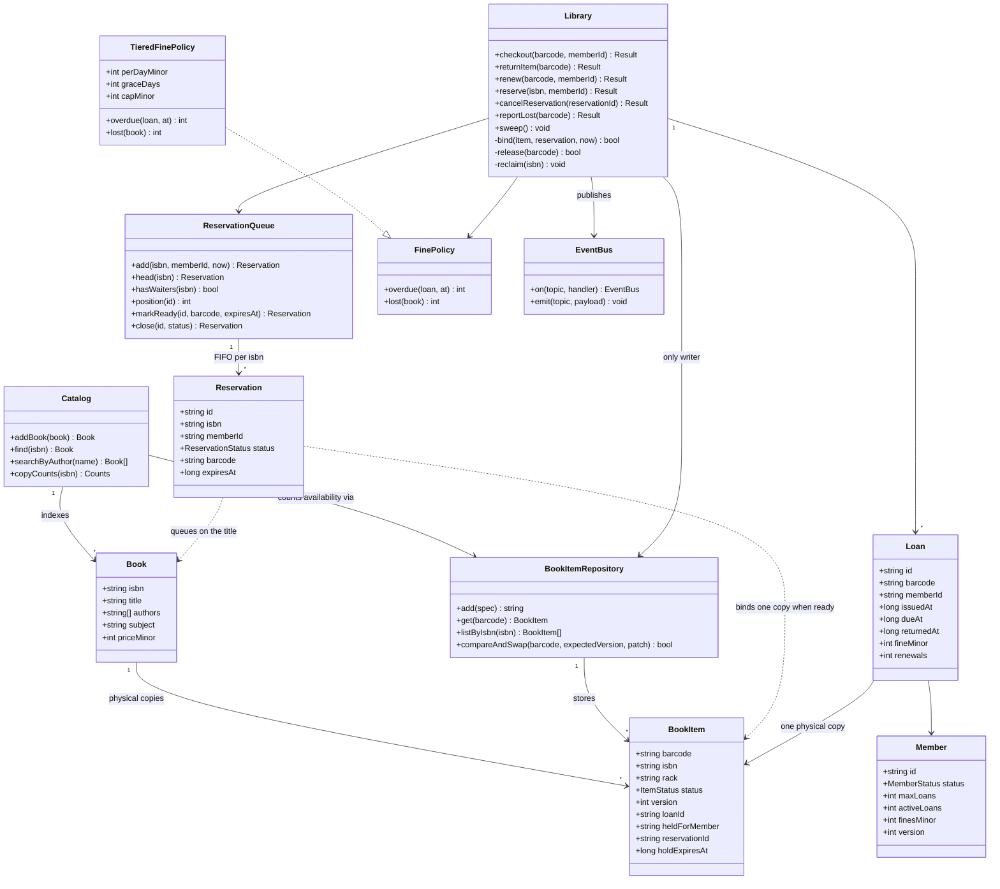

# Library management system

*Every library system looks like a CRUD exercise until the second person asks
for the same title. Then the whole design turns on one distinction: a book is
not a copy of a book.*

The interviewer is probing entity modelling, and they have one specific thing
in mind. `Book` is a bibliographic record — ISBN, title, author, subject. It is
a description, and a library with three hundred copies of it still has exactly
one. `BookItem` is a physical object with a barcode, a shelf, a due date and a
condition. Candidates who fold these into one class can express "the library
has *Clean Code*" but cannot express "Asha has copy 0001 and Bala has copy
0002", so they cannot lend the same title twice, cannot say how many are out,
and have nowhere to put a barcode. The two follow-on probes come from the same
place: a reservation queues on the **title** (any copy will do) but is
fulfilled by a **copy**, and a fine is computed from the **loan**, not from
either.

---

## Requirements

**Functional**
- Search the catalogue by title, author, subject or ISBN
- A member checks out a physical copy and gets a due date
- Return a copy; a late return is fined
- Renew a loan, if nobody is waiting for that title
- Reserve a title whose copies are all out, and be notified when one frees up
- A notified member has a limited window to collect before the copy moves on
- Report a copy lost; staff add and withdraw copies

**Non-functional**
- **A physical copy is on loan to at most one member at a time.** This is the
  only hard invariant; everything else may degrade.
- The reservation queue is FIFO and a member can see their position
- Fine rates, loan periods and limits are configuration, not code — a branch
  changing its daily rate must not touch the checkout path
- Catalogue reads vastly outnumber circulation writes
- Every circulation action is auditable: which barcode, which member, when

**Out of scope**: inter-library loans, e-books and DRM, acquisitions and
purchasing, membership billing, shelving and rack routing, the public
catalogue UI, and recommendations.

## Clarifying questions to ask

| Question | Why it changes the design |
|---|---|
| Does a reservation queue on the title or on a specific copy? | This decides whether `Reservation` points at `Book` or `BookItem`. Queue on a copy and the line stalls behind one slow borrower while an identical copy sits on the shelf. Queue on the title and the copy is chosen at the last possible moment. |
| Do copies of one title differ in ways a member cares about — large print, reference-only, a different edition? | If yes, "any copy will do" is false, and you need a third level between title and copy that the queue keys on. If no, the two-level model holds and the design stays small. |
| When a copy comes back and somebody is waiting, does it go to the shelf or to a hold shelf? | The single most consequential rule in the system. It decides whether `return` writes `AVAILABLE` or `HELD`, and whether a walk-in can take a copy out from under the queue. |
| How long does a ready hold last, and where does the copy go when it lapses? | If a lapsed hold simply frees the copy, the next person in the queue gets skipped. The copy has to be re-offered down the queue, which means expiry is a queue operation, not a cleanup. |
| Is a fine charged when the book comes back, or does it accrue daily regardless? | Charging on return is one computation at one known moment. Daily accrual is a scheduled job, a running balance on the member, and a reconciliation story for when the job misses a night. |
| Do unpaid fines block borrowing, and above what amount? | This puts a read of the member's balance on the checkout path, which turns `Member` from a lookup into a contended, mutable row with its own concurrency problem. |

## Core entities

| Entity | Owns | Must never own |
|---|---|---|
| **Book** | ISBN, title, authors, subject, publisher, list price | A barcode, a status or a due date. Those belong to an object you can hold, and there are many of those per title. |
| **BookItem** | Barcode, rack, format, its status and its version | Title metadata. Correct a misspelt author and you must not have to rewrite a million copy rows. |
| **Member** | Identity, loan limit, active loan count, fine balance | The loans themselves. It carries a *count* because the count is what the limit check needs; the list lives in the loan ledger. |
| **Loan** | One barcode, one member, issued, due, returned, the fine actually charged | The fine *rate*. Rates change; a loan that already closed must keep the amount it was charged. |
| **Reservation** | The ISBN it queues on, the member, its status, and once ready, the one copy bound to it | A copy at creation time. It has no copy until the moment one is free, which is the entire point of queueing on the title. |
| **FinePolicy** | Daily rate, grace days, cap, replacement cost, processing fee | Anything about members or loans beyond the arguments it is handed. It is arithmetic, not a service. |
| **Library** | Orchestration, and the only writes to copy state | Fine arithmetic and queue ordering. Both are delegated, so both can be swapped. |

The load-bearing split is **Book versus BookItem**. Everything downstream falls
out of it: a loan references a barcode because you borrow an object, a
reservation references an ISBN because you want a story, and the join between
them only happens when a copy is physically free. Conflate the two and there is
no row to lock, no place to put a status, and no way to answer "how many are
out".

## Class diagram



Two arrows are deliberately absent. `Book` has no arrow to `Loan` — you cannot
borrow a title. And nothing except `Library` writes to `BookItemRepository`, so
every state transition a copy can make is in one class, and the
compare-and-swap that protects it is in one method.

## Implementation

The store is a `Map`, and `compareAndSwap` stands in for one SQL statement:

```sql
UPDATE book_items
   SET status = ?, loan_id = ?, held_for_member = ?, hold_expires_at = ?, version = version + 1
 WHERE barcode = ? AND version = ?
```

Zero rows updated means somebody changed that copy between your read and your
write, and you lost. Every concurrency guarantee below is built from that and
nothing else.

```js
// ---------------------------------------------------------------- enums

const DAY = 24 * 60 * 60 * 1000;

const ItemStatus = Object.freeze({
  AVAILABLE: 'AVAILABLE',   // on the shelf, anybody may take it
  LOANED: 'LOANED',         // out with a member
  HELD: 'HELD',             // allocated to one reservation, waiting for pickup
  LOST: 'LOST',             // written off; never returns to the pool
});

const ReservationStatus = Object.freeze({
  WAITING: 'WAITING', READY: 'READY', FULFILLED: 'FULFILLED',
  CANCELLED: 'CANCELLED', EXPIRED: 'EXPIRED',
});

const MemberStatus = Object.freeze({ ACTIVE: 'ACTIVE', SUSPENDED: 'SUSPENDED' });

// ---------------------------------------------------------------- clock

class SystemClock { now() { return Date.now(); } }

class FakeClock {
  constructor(t = 1_700_000_000_000) { this.t = t; }
  now() { return this.t; }
  advanceDays(d) { this.t += d * DAY; }
}

// ---------------------------------------------------------------- events

class EventBus {
  constructor() { this.handlers = new Map(); }
  on(topic, fn) {
    if (!this.handlers.has(topic)) this.handlers.set(topic, []);
    this.handlers.get(topic).push(fn);
    return this;
  }
  emit(topic, payload) {
    for (const fn of this.handlers.get(topic) || []) fn(payload);
  }
}

// ---------------------------------------------------- bibliographic record
//
// A Book is a title. It has no barcode, no status and no due date, because
// none of those are properties of a title. Two hundred copies of it share
// exactly one of these rows.

class Book {
  constructor({ isbn, title, authors, subject, publisher, year, priceMinor }) {
    Object.assign(this, { isbn, title, authors, subject, publisher, year, priceMinor });
  }
}

class Catalog {
  constructor(items) {
    this.items = items;
    this.books = new Map();
    this.byAuthor = new Map();
    this.bySubject = new Map();
  }

  #index(map, key, isbn) {
    if (!map.has(key)) map.set(key, new Set());
    map.get(key).add(isbn);
  }

  addBook(book) {
    this.books.set(book.isbn, book);
    for (const a of book.authors) this.#index(this.byAuthor, a.toLowerCase(), book.isbn);
    this.#index(this.bySubject, book.subject.toLowerCase(), book.isbn);
    return book;
  }

  find(isbn) { return this.books.get(isbn) ?? null; }

  searchByAuthor(name) {
    return [...(this.byAuthor.get(name.toLowerCase()) ?? [])].map((i) => this.books.get(i));
  }

  // Availability is asked of the copies, never stored on the title.
  copyCounts(isbn) {
    const counts = { total: 0 };
    for (const row of this.items.listByIsbn(isbn)) {
      counts.total += 1;
      counts[row.status] = (counts[row.status] ?? 0) + 1;
    }
    return counts;
  }
}

// ------------------------------------------------------- physical copies
//
// One table, one atomic primitive:
//   UPDATE book_items SET <patch>, version = version + 1
//    WHERE barcode = ? AND version = ?

class BookItemRepository {
  constructor() { this.rows = new Map(); }

  add({ barcode, isbn, rack, format = 'HARDCOVER' }) {
    this.rows.set(barcode, {
      barcode, isbn, rack, format,
      status: ItemStatus.AVAILABLE,
      version: 0,
      loanId: null,
      heldForMember: null,
      reservationId: null,
      holdExpiresAt: 0,
    });
    return barcode;
  }

  get(barcode) {
    const row = this.rows.get(barcode);
    return row ? { ...row } : null;
  }

  listByIsbn(isbn) {
    return [...this.rows.values()].filter((r) => r.isbn === isbn).map((r) => ({ ...r }));
  }

  all() { return [...this.rows.values()].map((r) => ({ ...r })); }

  compareAndSwap(barcode, expectedVersion, patch) {
    const row = this.rows.get(barcode);
    if (!row || row.version !== expectedVersion) return false;
    Object.assign(row, patch, { version: row.version + 1 });
    return true;
  }
}

// ---------------------------------------------------------------- members

class MemberRepository {
  constructor() { this.rows = new Map(); }

  add({ id, name, maxLoans = 5 }) {
    this.rows.set(id, {
      id, name, maxLoans,
      status: MemberStatus.ACTIVE,
      activeLoans: 0,
      finesMinor: 0,
      version: 0,
    });
    return id;
  }

  get(id) {
    const row = this.rows.get(id);
    return row ? { ...row } : null;
  }

  compareAndSwap(id, expectedVersion, patch) {
    const row = this.rows.get(id);
    if (!row || row.version !== expectedVersion) return false;
    Object.assign(row, patch, { version: row.version + 1 });
    return true;
  }
}

// ---------------------------------------------------------- reservations
//
// The queue is per TITLE. A member waits for "any copy of this ISBN"; the
// copy is only chosen at the moment one becomes free.

class ReservationQueue {
  constructor() { this.records = new Map(); this.order = new Map(); this.seq = 0; }

  add(isbn, memberId, now) {
    const rec = {
      id: `rs_${++this.seq}`, isbn, memberId,
      status: ReservationStatus.WAITING,
      createdAt: now, barcode: null, expiresAt: 0,
    };
    this.records.set(rec.id, rec);
    if (!this.order.has(isbn)) this.order.set(isbn, []);
    this.order.get(isbn).push(rec.id);
    return rec;
  }

  get(id) { return this.records.get(id) ?? null; }

  #live(isbn) {
    return (this.order.get(isbn) ?? [])
      .map((id) => this.records.get(id))
      .filter((r) => r.status === ReservationStatus.WAITING || r.status === ReservationStatus.READY);
  }

  head(isbn) {
    return this.#live(isbn).find((r) => r.status === ReservationStatus.WAITING) ?? null;
  }

  hasWaiters(isbn) { return this.#live(isbn).length > 0; }

  activeFor(isbn, memberId) {
    return this.#live(isbn).find((r) => r.memberId === memberId) ?? null;
  }

  position(id) {
    const rec = this.records.get(id);
    if (!rec) return -1;
    return this.#live(rec.isbn).findIndex((r) => r.id === id) + 1;
  }

  markReady(id, barcode, expiresAt) {
    const rec = this.records.get(id);
    Object.assign(rec, { status: ReservationStatus.READY, barcode, expiresAt });
    return rec;
  }

  close(id, status) {
    const rec = this.records.get(id);
    if (!rec) return null;
    rec.status = status;
    return rec;
  }
}

// ------------------------------------------------------------ fine policy

class TieredFinePolicy {
  constructor({ perDayMinor = 500, graceDays = 1, capMinor = 20_000,
                replacementMultiplier = 1, processingFeeMinor = 10_000 } = {}) {
    Object.assign(this, { perDayMinor, graceDays, capMinor, replacementMultiplier, processingFeeMinor });
  }

  daysLate(loan, at) { return Math.max(0, Math.ceil((at - loan.dueAt) / DAY)); }

  overdue(loan, at) {
    const billable = Math.max(0, this.daysLate(loan, at) - this.graceDays);
    return Math.min(this.capMinor, billable * this.perDayMinor);
  }

  lost(book) {
    return Math.round(book.priceMinor * this.replacementMultiplier) + this.processingFeeMinor;
  }
}

// ---------------------------------------------------------------- loans

class Loan {
  constructor({ id, barcode, isbn, memberId, issuedAt, dueAt }) {
    Object.assign(this, { id, barcode, isbn, memberId, issuedAt, dueAt });
    this.returnedAt = null;
    this.fineMinor = 0;
    this.renewals = 0;
  }
}

// ---------------------------------------------------------------- library

class Library {
  constructor({ catalog, items, members, reservations, fines, clock, events,
                loanDays = 14, holdDays = 3, maxRenewals = 2, fineBlockMinor = 5_000 }) {
    Object.assign(this, { catalog, items, members, reservations, fines, clock, events });
    this.loanMs = loanDays * DAY;
    this.holdMs = holdDays * DAY;
    this.maxRenewals = maxRenewals;
    this.fineBlockMinor = fineBlockMinor;
    this.loans = new Map();
    this.seq = 0;
  }

  // Relative counter updates, so a blind retry on a lost CAS is safe.
  // A mutator returning null is a guard saying no, and must not be retried.
  #updateMember(id, mutate) {
    for (let attempt = 0; attempt < 5; attempt += 1) {
      const row = this.members.get(id);
      if (!row) return false;
      const patch = mutate(row);
      if (!patch) return false;
      if (this.members.compareAndSwap(id, row.version, patch)) return true;
    }
    return false;
  }

  // Bind one free copy to one waiting reservation, atomically.
  #bind(item, rec, now) {
    const ok = this.items.compareAndSwap(item.barcode, item.version, {
      status: ItemStatus.HELD,
      heldForMember: rec.memberId,
      reservationId: rec.id,
      holdExpiresAt: now + this.holdMs,
      loanId: null,
    });
    if (!ok) return false;
    this.reservations.markReady(rec.id, item.barcode, now + this.holdMs);
    this.events.emit('reservation.ready', {
      reservationId: rec.id, memberId: rec.memberId,
      isbn: item.isbn, barcode: item.barcode, expiresAt: now + this.holdMs,
    });
    return true;
  }

  // A freed copy asks the queue first. It only reaches the shelf if nobody
  // is waiting. There is no window in which it is AVAILABLE with waiters.
  #release(barcode) {
    const now = this.clock.now();
    const item = this.items.get(barcode);
    if (!item) return false;
    const next = this.reservations.head(item.isbn);
    if (next) return this.#bind(item, next, now);
    return this.items.compareAndSwap(barcode, item.version, {
      status: ItemStatus.AVAILABLE,
      heldForMember: null, reservationId: null, holdExpiresAt: 0, loanId: null,
    });
  }

  // Offer whatever is already on the shelf to whoever is waiting.
  #allocate(isbn) {
    const now = this.clock.now();
    for (const item of this.items.listByIsbn(isbn)) {
      if (item.status !== ItemStatus.AVAILABLE) continue;
      const next = this.reservations.head(isbn);
      if (!next) return;
      this.#bind(item, next, now);
    }
  }

  // Lazy expiry. A lapsed hold forfeits the copy, but the copy goes to the
  // NEXT waiter, not back to the shelf.
  #reclaim(isbn) {
    const now = this.clock.now();
    for (const item of this.items.listByIsbn(isbn)) {
      if (item.status !== ItemStatus.HELD || item.holdExpiresAt > now) continue;
      this.reservations.close(item.reservationId, ReservationStatus.EXPIRED);
      this.events.emit('reservation.expired', { reservationId: item.reservationId, isbn });
      this.#release(item.barcode);
    }
  }

  #activeLoanFor(memberId, isbn) {
    return [...this.loans.values()].find(
      (l) => l.memberId === memberId && l.isbn === isbn && l.returnedAt === null,
    ) ?? null;
  }

  // ---------------------------------------------------------- public API

  addCopy(isbn, barcode, rack) {
    if (!this.catalog.find(isbn)) throw new Error(`no catalogue record for ${isbn}`);
    this.items.add({ barcode, isbn, rack });
    this.#allocate(isbn);        // a new copy can settle an outstanding hold
    return barcode;
  }

  checkout(barcode, memberId) {
    const now = this.clock.now();
    const probe = this.items.get(barcode);
    if (!probe) return { ok: false, reason: 'unknown_barcode' };
    this.#reclaim(probe.isbn);

    const member = this.members.get(memberId);
    if (!member) return { ok: false, reason: 'unknown_member' };
    if (member.status !== MemberStatus.ACTIVE) return { ok: false, reason: 'member_suspended' };
    if (member.finesMinor >= this.fineBlockMinor) return { ok: false, reason: 'unpaid_fines' };
    if (member.activeLoans >= member.maxLoans) return { ok: false, reason: 'loan_limit' };

    const item = this.items.get(barcode);
    const mine = item.status === ItemStatus.HELD
      && item.heldForMember === memberId
      && item.holdExpiresAt > now;
    if (item.status !== ItemStatus.AVAILABLE && !mine) {
      return {
        ok: false,
        reason: item.status === ItemStatus.HELD ? 'held_for_another_member' : `item_${item.status.toLowerCase()}`,
      };
    }

    const loanId = `ln_${++this.seq}`;
    const took = this.items.compareAndSwap(item.barcode, item.version, {
      status: ItemStatus.LOANED, loanId,
      heldForMember: null, reservationId: null, holdExpiresAt: 0,
    });
    if (!took) return { ok: false, reason: 'raced_on_copy' };

    const counted = this.#updateMember(memberId, (row) => (
      row.activeLoans >= row.maxLoans ? null : { activeLoans: row.activeLoans + 1 }
    ));
    if (!counted) {
      // Put the copy back exactly where it came from, hold and all.
      const now2 = this.items.get(barcode);
      this.items.compareAndSwap(barcode, now2.version, mine
        ? { status: ItemStatus.HELD, heldForMember: memberId,
            reservationId: item.reservationId, holdExpiresAt: item.holdExpiresAt, loanId: null }
        : { status: ItemStatus.AVAILABLE, loanId: null });
      return { ok: false, reason: 'loan_limit' };
    }

    if (mine) this.reservations.close(item.reservationId, ReservationStatus.FULFILLED);

    const loan = new Loan({
      id: loanId, barcode, isbn: item.isbn, memberId,
      issuedAt: now, dueAt: now + this.loanMs,
    });
    this.loans.set(loanId, loan);
    this.events.emit('loan.issued', loan);
    return { ok: true, loan };
  }

  returnItem(barcode) {
    const now = this.clock.now();
    const item = this.items.get(barcode);
    if (!item || item.status !== ItemStatus.LOANED) return { ok: false, reason: 'not_on_loan' };

    const loan = this.loans.get(item.loanId);
    const fineMinor = this.fines.overdue(loan, now);
    loan.returnedAt = now;
    loan.fineMinor = fineMinor;

    this.#updateMember(loan.memberId, (row) => ({
      activeLoans: Math.max(0, row.activeLoans - 1),
      finesMinor: row.finesMinor + fineMinor,
    }));

    this.#release(barcode);

    if (fineMinor > 0) this.events.emit('fine.charged', { memberId: loan.memberId, loanId: loan.id, fineMinor });
    this.events.emit('loan.returned', loan);
    return { ok: true, loan, fineMinor, destination: this.items.get(barcode).status };
  }

  renew(barcode, memberId) {
    const now = this.clock.now();
    const item = this.items.get(barcode);
    if (!item || item.status !== ItemStatus.LOANED) return { ok: false, reason: 'not_on_loan' };
    const loan = this.loans.get(item.loanId);
    if (loan.memberId !== memberId) return { ok: false, reason: 'not_your_loan' };
    if (loan.renewals >= this.maxRenewals) return { ok: false, reason: 'renewal_limit' };
    if (now > loan.dueAt) return { ok: false, reason: 'already_overdue' };

    this.#reclaim(item.isbn);
    if (this.reservations.hasWaiters(item.isbn)) return { ok: false, reason: 'reserved_by_another' };

    loan.renewals += 1;
    loan.dueAt += this.loanMs;
    return { ok: true, loan };
  }

  reserve(isbn, memberId) {
    const now = this.clock.now();
    if (!this.catalog.find(isbn)) return { ok: false, reason: 'unknown_isbn' };
    const member = this.members.get(memberId);
    if (!member || member.status !== MemberStatus.ACTIVE) return { ok: false, reason: 'member_ineligible' };
    if (this.#activeLoanFor(memberId, isbn)) return { ok: false, reason: 'already_on_loan' };
    if (this.reservations.activeFor(isbn, memberId)) return { ok: false, reason: 'duplicate_reservation' };

    this.#reclaim(isbn);
    const rec = this.reservations.add(isbn, memberId, now);
    this.#allocate(isbn);
    return { ok: true, reservation: this.reservations.get(rec.id), position: this.reservations.position(rec.id) };
  }

  cancelReservation(reservationId) {
    const rec = this.reservations.get(reservationId);
    if (!rec) return { ok: false, reason: 'unknown_reservation' };
    if (rec.status === ReservationStatus.READY) {
      const { barcode } = rec;
      this.reservations.close(reservationId, ReservationStatus.CANCELLED);
      this.#release(barcode);            // re-offer, never shelve blindly
      return { ok: true, requeued: true };
    }
    if (rec.status !== ReservationStatus.WAITING) {
      return { ok: false, reason: `already_${rec.status.toLowerCase()}` };
    }
    this.reservations.close(reservationId, ReservationStatus.CANCELLED);
    return { ok: true, requeued: false };
  }

  reportLost(barcode) {
    const now = this.clock.now();
    const item = this.items.get(barcode);
    if (!item || item.status === ItemStatus.LOST) return { ok: false, reason: 'not_lostable' };
    const book = this.catalog.find(item.isbn);
    const loan = item.loanId ? this.loans.get(item.loanId) : null;
    const fineMinor = this.fines.lost(book) + (loan ? this.fines.overdue(loan, now) : 0);

    this.items.compareAndSwap(barcode, item.version, {
      status: ItemStatus.LOST, loanId: null,
      heldForMember: null, reservationId: null, holdExpiresAt: 0,
    });

    if (loan && loan.returnedAt === null) {
      loan.returnedAt = now;
      loan.fineMinor = fineMinor;
      this.#updateMember(loan.memberId, (row) => ({
        activeLoans: Math.max(0, row.activeLoans - 1),
        finesMinor: row.finesMinor + fineMinor,
      }));
    }
    if (item.reservationId) this.reservations.close(item.reservationId, ReservationStatus.WAITING);
    this.#allocate(item.isbn);
    return { ok: true, fineMinor };
  }

  payFine(memberId, amountMinor) {
    return this.#updateMember(memberId, (row) => ({
      finesMinor: Math.max(0, row.finesMinor - amountMinor),
    }));
  }

  // Housekeeping only. Correctness already comes from #reclaim on read paths.
  sweep() {
    const now = this.clock.now();
    for (const isbn of new Set(this.items.all().map((i) => i.isbn))) this.#reclaim(isbn);
    for (const loan of this.loans.values()) {
      if (loan.returnedAt === null && loan.dueAt < now) {
        this.events.emit('loan.overdue', { loanId: loan.id, memberId: loan.memberId, daysLate: this.fines.daysLate(loan, now) });
      }
    }
  }
}
```

### Usage

```js
const money = (m) => `${(m / 100).toFixed(2)}`;

const clock = new FakeClock();
const items = new BookItemRepository();
const members = new MemberRepository();
const catalog = new Catalog(items);
const reservations = new ReservationQueue();
const fines = new TieredFinePolicy({ perDayMinor: 500, graceDays: 1, capMinor: 20_000 });

const events = new EventBus()
  .on('reservation.ready', (e) => console.log(`  [notify] ${e.memberId}: ${e.barcode} is ready, pick up within 3 days`))
  .on('reservation.expired', (e) => console.log(`  [notify] reservation ${e.reservationId} expired`))
  .on('fine.charged', (e) => console.log(`  [notify] ${e.memberId} charged ${money(e.fineMinor)}`));

const lib = new Library({ catalog, items, members, reservations, fines, clock, events,
  loanDays: 14, holdDays: 3, maxRenewals: 2, fineBlockMinor: 5_000 });

catalog.addBook(new Book({
  isbn: '978-0132350884', title: 'Clean Code', authors: ['Robert C. Martin'],
  subject: 'Software', publisher: 'Prentice Hall', year: 2008, priceMinor: 45_000,
}));

// One title, two physical copies. This line is the whole problem.
lib.addCopy('978-0132350884', 'BC-0001', 'A3');
lib.addCopy('978-0132350884', 'BC-0002', 'A3');

members.add({ id: 'asha', name: 'Asha', maxLoans: 3 });
members.add({ id: 'bala', name: 'Bala', maxLoans: 3 });
members.add({ id: 'chen', name: 'Chen', maxLoans: 3 });
members.add({ id: 'dia', name: 'Dia', maxLoans: 3 });
members.add({ id: 'esi', name: 'Esi', maxLoans: 1 });

console.log('copies at open   :', JSON.stringify(catalog.copyCounts('978-0132350884')));

// 1. Two members take the two copies of the same title.
console.log('asha takes 0001  :', lib.checkout('BC-0001', 'asha').ok);
console.log('bala takes 0002  :', lib.checkout('BC-0002', 'bala').ok);
console.log('copies now       :', JSON.stringify(catalog.copyCounts('978-0132350884')));

// 2. Nothing on the shelf, so Chen and Dia queue on the TITLE.
const chen = lib.reserve('978-0132350884', 'chen');
const dia = lib.reserve('978-0132350884', 'dia');
console.log('chen reserves    :', chen.reservation.id, 'position', chen.position);
console.log('dia reserves     :', dia.reservation.id, 'position', dia.position);

// 3. Bala cannot renew, because Dia is waiting on the title.
console.log('bala renews      :', lib.renew('BC-0002', 'bala').reason);

// 4. Asha is six days late. Fine charged, and the copy goes to Chen, not the shelf.
clock.advanceDays(20);
const back = lib.returnItem('BC-0001');
console.log('asha returns     :', `fine ${money(back.fineMinor)} | copy went to ${back.destination}`);

// 5. A walk-in cannot take a copy that is holding for someone else.
console.log('esi tries 0001   :', lib.checkout('BC-0001', 'esi').reason);

// 6. Chen collects his hold.
console.log('chen collects    :', lib.checkout('BC-0001', 'chen').ok, '| reservation', reservations.get(chen.reservation.id).status);

// 7. Bala returns; the copy holds for Dia, who never turns up.
console.log('bala returns     :', lib.returnItem('BC-0002').destination);
clock.advanceDays(4);
lib.sweep();
console.log('copies after TTL :', JSON.stringify(catalog.copyCounts('978-0132350884')));

// 8. Now the shelf copy is genuinely free, and Esi can have it.
console.log('esi takes 0002   :', lib.checkout('BC-0002', 'esi').ok);
console.log('esi second loan  :', lib.checkout('BC-0001', 'esi').reason || 'ok');

// 9. Esi loses it. Replacement plus processing, and the copy never comes back.
clock.advanceDays(30);
const lost = lib.reportLost('BC-0002');
console.log('esi loses 0002   :', `fine ${money(lost.fineMinor)}`);
console.log('esi blocked      :', lib.checkout('BC-0001', 'esi').reason);
console.log('final copies     :', JSON.stringify(catalog.copyCounts('978-0132350884')));
console.log('search by author :', catalog.searchByAuthor('Robert C. Martin').map((b) => b.title).join());
```

Output:

```
copies at open   : {"total":2,"AVAILABLE":2}
asha takes 0001  : true
bala takes 0002  : true
copies now       : {"total":2,"LOANED":2}
chen reserves    : rs_1 position 1
dia reserves     : rs_2 position 2
bala renews      : reserved_by_another
  [notify] chen: BC-0001 is ready, pick up within 3 days
  [notify] asha charged 25.00
asha returns     : fine 25.00 | copy went to HELD
esi tries 0001   : held_for_another_member
chen collects    : true | reservation FULFILLED
  [notify] dia: BC-0002 is ready, pick up within 3 days
  [notify] bala charged 25.00
bala returns     : HELD
  [notify] reservation rs_2 expired
copies after TTL : {"total":2,"LOANED":1,"AVAILABLE":1}
esi takes 0002   : true
esi second loan  : loan_limit
esi loses 0002   : fine 625.00
esi blocked      : unpaid_fines
final copies     : {"total":2,"LOANED":1,"LOST":1}
search by author : Clean Code
```

Read the line `asha returns : fine 25.00 | copy went to HELD`. The copy did not
become available. Six days late at five rupees a day with one day of grace is
twenty-five rupees, and the copy went straight onto the hold shelf for Chen.
Esi, standing at the desk with the same barcode in her hand, is refused. That
one line is the difference between a design that has a reservation queue and a
design that has a reservation queue which actually works.

## Design patterns used

| Pattern | Where | What it buys |
|---|---|---|
| **Repository** | `BookItemRepository`, `MemberRepository` | Confines every mutation of a contended row to one `compareAndSwap` method. Swap the `Map` for Postgres and the concurrency argument does not move. |
| **Strategy** | `FinePolicy` / `TieredFinePolicy` | A branch that wants a two-day grace period, a different cap, or free returns for students changes one injected object. `Library` never learns what a day of lateness costs. |
| **Observer** | `EventBus`, `reservation.ready` | The notification hook the problem asks for. Email, SMS and push all subscribe; none of them sit on the return path, and none of them can fail a return. |
| **State machine** | `ItemStatus` and `ReservationStatus` transitions | Makes the illegal states nameable. A copy is `AVAILABLE`, `LOANED`, `HELD` or `LOST` and nothing else, and the only path into `LOANED` is a successful CAS from `AVAILABLE` or from a hold that belongs to the borrower. |
| **Facade** | `Library` | One entry point per real-world action. A caller says `checkout(barcode, memberId)` and does not orchestrate the item write, the member counter, the reservation close and the event. |
| **Dependency injection** | `clock`, policy, repositories, event bus | The hold-expiry case in the demo above is testable because time is an argument. With `Date.now()` hard-coded that test would take three days. |

## Concurrency and edge cases

**Two members, one copy.** The naive checkout reads the copy, sees
`AVAILABLE`, and writes `LOANED`. Two requests can both read `AVAILABLE`
before either writes. No single line is wrong; the bug is the gap between line
one and line two. Close it by making the check and the write one operation:
`UPDATE ... WHERE barcode = ? AND version = ?`. The loser updates zero rows and
gets `raced_on_copy`.

**The returned copy must never touch the shelf.** This is the trap specific to
this problem, and it is easy to write by accident. If `return` sets the copy to
`AVAILABLE` and *then* asks the queue who wants it, there is a window — however
short — in which a walk-in at the desk can check it out. The queue is skipped,
and nobody can reproduce it. So `#release` asks the queue **first** and writes
`HELD` directly if anyone is waiting. `AVAILABLE` is only ever written when the
queue is empty. There is no intermediate state.

**A hold that lapses must go to the next waiter, not to the shelf.** The same
mistake, one step later. Lazy expiry is the right mechanic — a hold whose
`hold_expires_at` has passed is not really holding anything — but "treat it as
free" is the wrong conclusion when four people are still queued. `#reclaim`
closes the expired reservation first, *then* calls `#release`, which re-runs
the same offer logic. Dia's expired hold in the demo only becomes an
`AVAILABLE` copy because she was the last one in the queue.

**Cancelling a hold that is already ready.** The member gets the notification
and cancels anyway. Cancel the reservation, then release the copy through the
same path, so it is offered to the next waiter rather than shelved. Doing it in
the other order re-offers the copy to the person who just cancelled.

**Partial failure in the middle of a checkout.** `checkout` writes two rows:
the copy and the member's loan counter. The copy goes first because it is the
scarce, contended row; the member counter can then be rejected by the limit
guard. When it is, the copy is rolled back to *exactly* where it came from — if
it was on hold for that member, the rollback restores the hold, the reservation
id and the original expiry, not a shelf slot. Rolling back to `AVAILABLE`
would silently hand the queue's copy to the next walk-in.

**The member row is contended too.** A member with three devices open can fire
three checkouts. `#updateMember` retries on a lost CAS, which is safe because
every update is relative (`activeLoans + 1`, `finesMinor + fine`) rather than
absolute. The limit check lives **inside** the retry: reading the count,
deciding, and then retrying the write with the stale decision is exactly how a
member ends up with six books and a limit of five.

**States that must be unreachable.** A `LOANED` copy with no open loan, and one
barcode with two open loans. Both are prevented by putting `loan_id` on the
copy row itself and setting it in the same CAS that sets `LOANED` — there is no
moment at which the status and the owner disagree. `returnItem` guards on
`status === LOANED`, so scanning a book twice at the desk returns
`not_on_loan` on the second scan rather than charging a second fine.

**Fines are charged on return, not accrued.** The fine is a pure function of
the loan's due date and the moment of return, so there is no daily job to miss
a night and no balance to reconcile. The cost is that an overdue book that
never comes back accrues nothing, which is why `reportLost` exists as an
explicit staff action that charges replacement plus the overdue amount at that
moment.

**Clock skew.** Due dates and hold expiry are compared against a wall clock. If
one branch's server runs fast, it will expire live holds and hand copies to the
wrong member. Do the comparison inside the same statement as the CAS
(`hold_expires_at > NOW()`) so the database is the only clock in the system.

**The sweeper is not the source of truth.** `#reclaim` runs on the read paths,
so a lapsed hold is handled the moment anyone looks. `sweep()` exists to send
overdue notices and keep the hold shelf tidy. If it is down for a day, nothing
is mis-lent; the reports are just stale.

**A copy lost while people are waiting.** The queue does not shrink when
inventory does. `reportLost` withdraws the copy and then re-runs allocation on
the title, so the remaining waiters are re-offered whatever is left. The people
behind that copy simply wait longer, which is correct and must be visible in
the position they are shown.

## Follow-ups they will ask

**Multiple branches.** A copy belongs to a branch, so `BookItem` gains a
`branchId` and the queue becomes per title *per branch*, or global with a
transfer step. The transfer is the interesting part: the copy needs an
`IN_TRANSIT` status, which is just another state in the same machine, and the
hold clock must not start until it arrives.

**How do you actually send the notification?** Not inline. Write the event to
an outbox table in the same transaction as the hold, and let a worker deliver
it. A return must not fail because the mail server is down, and a notification
must not be lost because the process died after committing the hold.

**A title with twenty copies and five hundred people waiting.** Show position
and an estimated wait derived from copies and the average loan length, cap the
queue so the number stays honest, and shorten the pickup window on
high-demand titles so a no-show costs the queue hours rather than days.

**Digital copies with concurrent-use licences.** A licence seat is a
`BookItem` whose checkout expires by itself. The status machine is unchanged —
`AVAILABLE`, `LOANED`, back to `AVAILABLE` — and the only new piece is that
expiry is automatic rather than a physical return. That the model absorbs this
without a new class is the evidence the Book/BookItem split was right.

**Audit and history.** The loan table is already an append-only ledger: a loan
is written once and closed once, never edited. Keep it that way and "who had
this barcode in March" is a query, not a forensic exercise. Fines belong on the
loan that caused them, never only as a balance on the member, or you can never
explain a charge.
