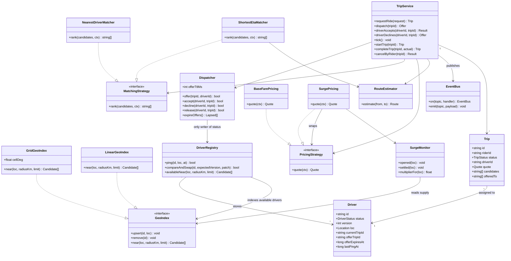

# Ride-sharing

*Uber, Lyft, Ola, Grab. Everyone arrives ready to talk about matching, because
matching is the interesting-sounding part. Matching is a sort. The problem is
what happens in the fifteen seconds after you have sorted.*

The interviewer is probing whether you notice that a driver is a contended
resource being handed between two long-running state machines, and that the
handoff is performed by a human who may be looking at their phone, or may not.
You have to hold a driver for a rider across a network call to an app in a
moving vehicle, take them back when nobody answers, and never end up with one
driver assigned to two trips. The second thing being probed is the geospatial
index: whether you put it behind an interface, and whether you notice it is a
write-heavy structure pretending to be a read-heavy one.

---

## Requirements

**Functional**
- A rider requests a ride from a pickup to a dropoff and gets a fare quote up front
- The system finds nearby available drivers and offers the trip to them in order
- A driver accepts or declines; an offer nobody answers expires and moves on
- Exactly one driver ends up on the trip, and the rider is told who
- The trip runs through pickup, ride and completion, and produces a final fare
- Either side can cancel before the ride starts
- Drivers stream their location continuously while online

**Non-functional**
- **A driver is on at most one trip.** That is the only hard invariant.
- The quoted fare is the charged fare, modulo actual distance and time
- Location writes vastly outnumber everything else: a driver pings every few
  seconds whether or not anybody is looking for them
- Matching must feel instant. A rider watching a spinner is a rider opening the
  other app.
- Requests are retried constantly, because phones are on mobile networks

**Out of scope**: routing and map data internals, payment capture, driver
onboarding, ratings, pooled rides, and the distributed fan-out of location
updates across regions — that last one is the [HLD half](../hld/) of this
problem, and scoping it out loud is worth marks.

## Clarifying questions to ask

| Question | Why it changes the design |
|---|---|
| Is the offer sequential, or broadcast to several drivers at once? | Sequential means one hold at a time and a clean ladder. Broadcast means N drivers hold offers for the same trip and the first accept has to void the rest — a different and harder race. |
| How long does a driver have to answer? | That number is the TTL on the hold. Too long and riders stare at a spinner while an idle driver is blocked; too short and you skip past drivers who were merely at a traffic light. |
| Is the quote binding, or an estimate? | Binding means the fare is computed once, written onto the trip, and never recomputed — which reduces surge to a single read at request time. An estimate lets you price on completion and removes a class of disputes about the number. |
| How often do drivers report location, and how many are online? | This is the actual load, and it is the number people forget to ask for. It decides whether the geo index can be a tree or has to be a flat bucket. |
| Can a rider cancel after a driver has accepted? | If yes, a driver can be halfway to a pickup that no longer exists, so `ASSIGNED` has to be reversible and there has to be a cancellation-fee path. If no, the state machine is close to a straight line. |
| Do we match one request at a time, or batch a window of them? | One at a time is greedy and only locally optimal. Batching a few seconds of requests lets you minimise total wait across all of them, and it changes the matcher's signature from one trip to many. |

## Core entities

| Entity | Owns | Must never own |
|---|---|---|
| **Rider** | Identity, saved payment method, trip history | Anything about a driver, or any part of the fare calculation |
| **Driver** | Identity, vehicle, and the one mutable row everything fights over: status, version, location, the trip it is on, the offer it is holding | The trip's lifecycle. A driver losing signal does not cancel a ride. |
| **Offer** | Which trip, and the instant it dies | A table of its own. It is three columns on the driver row, because "is this driver free" has to be answerable without a join. |
| **GeoIndex** | Where the bookable drivers are | Driver status, or any truth at all. It is a derived view of the driver table and must be rebuildable from it. |
| **Trip** | The state machine, the rider, the assigned driver, the locked quote, and the ladder of candidates already tried | Driver availability. It asks the dispatcher; it never writes a driver row. |
| **Quote** | The numbers agreed at request time, surge multiplier included | Any awareness of the live multiplier. Once written it is a historical fact. |
| **SurgeMonitor** | Open requests and available supply per cell | The fare formula. It produces one number and knows nothing about base fares. |

Two of those rows carry the design. The first is that the **offer lives on the
driver row** — not in a lock, not in an offers table. The second is that the
**geo index owns nothing**: it can be stale, it can be rebuilt, and no
correctness argument rests on it. That is what lets you swap a grid for a
QuadTree, or shard it across a hundred machines, without reopening the
concurrency question.

## Class diagram



Look at what does not point at `DriverRegistry`. `TripService` never writes a
driver row. Every status change goes through `Dispatcher`, which is the only
place the compare-and-swap lives, so there is exactly one file to read when a
driver ends up in a state nobody can explain.

## Implementation

The database is a `Map`, and `compareAndSwap` stands in for one statement:

```sql
UPDATE drivers SET status = ?, offer_trip_id = ?, offer_expires_at = ?, version = version + 1
 WHERE id = ? AND version = ?
```

Zero rows updated means somebody beat you. Everything below is built out of
that one primitive.

```js
// ---------------------------------------------------------------- enums

const TripStatus = Object.freeze({
  REQUESTED: 'REQUESTED',
  MATCHING: 'MATCHING',
  ASSIGNED: 'ASSIGNED',
  IN_PROGRESS: 'IN_PROGRESS',
  COMPLETED: 'COMPLETED',
  CANCELLED: 'CANCELLED',
  NO_DRIVERS: 'NO_DRIVERS',
});

const DriverStatus = Object.freeze({
  OFFLINE: 'OFFLINE',
  AVAILABLE: 'AVAILABLE',
  OFFERED: 'OFFERED',
  ON_TRIP: 'ON_TRIP',
});

// The whole state machine, in one place. Anything not listed is unreachable.
const TRIP_TRANSITIONS = Object.freeze({
  REQUESTED:   ['MATCHING', 'CANCELLED'],
  MATCHING:    ['ASSIGNED', 'NO_DRIVERS', 'CANCELLED'],
  ASSIGNED:    ['IN_PROGRESS', 'MATCHING', 'CANCELLED'],
  IN_PROGRESS: ['COMPLETED'],
  COMPLETED:   [],
  CANCELLED:   [],
  NO_DRIVERS:  [],
});

// ---------------------------------------------------------------- clock

class FakeClock {
  constructor(t = 1_700_000_000_000) { this.t = t; }
  now() { return this.t; }
  advance(ms) { this.t += ms; return this.t; }
}

// ---------------------------------------------------------------- events

class EventBus {
  constructor() { this.handlers = new Map(); }
  on(topic, fn) {
    if (!this.handlers.has(topic)) this.handlers.set(topic, []);
    this.handlers.get(topic).push(fn);
    return this;
  }
  emit(topic, payload) { for (const fn of this.handlers.get(topic) || []) fn(payload); }
}

// ---------------------------------------------------------------- geometry

const EARTH_KM = 6371;
const rad = (d) => (d * Math.PI) / 180;

function haversineKm(a, b) {
  const dLat = rad(b.lat - a.lat);
  const dLng = rad(b.lng - a.lng);
  const h = Math.sin(dLat / 2) ** 2
    + Math.cos(rad(a.lat)) * Math.cos(rad(b.lat)) * Math.sin(dLng / 2) ** 2;
  return 2 * EARTH_KM * Math.asin(Math.sqrt(h));
}

// ------------------------------------------------------------- geo index
//
// The interface every implementation honours:
//   upsert(id, loc)                 -> void
//   remove(id)                      -> void
//   near(loc, radiusKm, limit)      -> [{ id, distanceKm }] sorted, nearest first
//
// Uniform grid. A cell is a fixed box of degrees; a bucket is a Set of ids.
// An update is at most two Set operations, which is what a moving fleet needs.

class GridGeoIndex {
  constructor(cellDeg = 0.01) {
    this.cellDeg = cellDeg;
    this.cellKm = cellDeg * 111;
    this.cells = new Map();   // "i:j" -> Set(driverId)
    this.at = new Map();      // driverId -> loc
  }

  #cell(loc) {
    return [Math.floor(loc.lat / this.cellDeg), Math.floor(loc.lng / this.cellDeg)];
  }

  upsert(id, loc) {
    const prev = this.at.get(id);
    const [i, j] = this.#cell(loc);
    this.at.set(id, loc);
    if (prev) {
      const [pi, pj] = this.#cell(prev);
      if (pi === i && pj === j) return;             // stayed in cell: nothing to move
      this.cells.get(`${pi}:${pj}`)?.delete(id);
    }
    const key = `${i}:${j}`;
    if (!this.cells.has(key)) this.cells.set(key, new Set());
    this.cells.get(key).add(id);
  }

  remove(id) {
    const loc = this.at.get(id);
    if (!loc) return;
    const [i, j] = this.#cell(loc);
    this.cells.get(`${i}:${j}`)?.delete(id);
    this.at.delete(id);
  }

  // Expanding ring. Stop as soon as one full ring has produced enough
  // candidates, so a dense city never scans the whole radius.
  near(loc, radiusKm, limit) {
    const maxRing = Math.max(1, Math.ceil(radiusKm / this.cellKm));
    const [ci, cj] = this.#cell(loc);
    const found = [];
    for (let r = 0; r <= maxRing; r++) {
      for (let i = ci - r; i <= ci + r; i++) {
        for (let j = cj - r; j <= cj + r; j++) {
          if (r > 0 && Math.abs(i - ci) !== r && Math.abs(j - cj) !== r) continue;
          for (const id of this.cells.get(`${i}:${j}`) || []) {
            const distanceKm = haversineKm(loc, this.at.get(id));
            if (distanceKm <= radiusKm) found.push({ id, distanceKm });
          }
        }
      }
      if (found.length >= limit) break;
    }
    return found.sort((a, b) => a.distanceKm - b.distanceKm).slice(0, limit);
  }
}

// Same interface, no index at all. Correct for a hundred drivers, useful as
// the oracle a grid is tested against.
class LinearGeoIndex {
  constructor() { this.at = new Map(); }
  upsert(id, loc) { this.at.set(id, loc); }
  remove(id) { this.at.delete(id); }
  near(loc, radiusKm, limit) {
    return [...this.at.entries()]
      .map(([id, l]) => ({ id, distanceKm: haversineKm(loc, l) }))
      .filter((c) => c.distanceKm <= radiusKm)
      .sort((a, b) => a.distanceKm - b.distanceKm)
      .slice(0, limit);
  }
}

// ------------------------------------------------------------- routing

// Stands in for a routing engine. The detour factor turns straight-line
// distance into road distance; the barrier is a river with one bridge.
class RouteEstimator {
  constructor({ detourFactor = 1.35, speedKmph = 24, barrierLng = null, barrierCost = 2.4 } = {}) {
    Object.assign(this, { detourFactor, speedKmph, barrierLng, barrierCost });
  }

  #crossesBarrier(a, b) {
    if (this.barrierLng === null) return false;
    return (a.lng - this.barrierLng) * (b.lng - this.barrierLng) < 0;
  }

  estimate(from, to) {
    let distanceKm = haversineKm(from, to) * this.detourFactor;
    if (this.#crossesBarrier(from, to)) distanceKm *= this.barrierCost;
    return {
      distanceKm: Math.round(distanceKm * 100) / 100,
      durationMin: Math.max(1, Math.round((distanceKm / this.speedKmph) * 60)),
    };
  }
}

// ------------------------------------------------------------- matching

class NearestDriverMatcher {
  rank(candidates) {
    return [...candidates].sort((a, b) => a.distanceKm - b.distanceKm).map((c) => c.id);
  }
}

class ShortestEtaMatcher {
  constructor(routes) { this.routes = routes; }
  rank(candidates, { pickup, locationOf }) {
    return [...candidates]
      .map((c) => ({ id: c.id, eta: this.routes.estimate(locationOf(c.id), pickup).durationMin }))
      .sort((a, b) => a.eta - b.eta || a.id.localeCompare(b.id))
      .map((c) => c.id);
  }
}

// -------------------------------------------------------------- pricing

class BaseFarePricing {
  constructor({ base = 50, perKm = 12, perMin = 2, minimum = 80 } = {}) {
    Object.assign(this, { base, perKm, perMin, minimum });
  }
  quote({ distanceKm, durationMin }) {
    const fare = this.base + this.perKm * distanceKm + this.perMin * durationMin;
    return { surge: 1, total: Math.max(this.minimum, Math.round(fare)) };
  }
}

// Decorator. Base pricing does not know surge exists; surge does not know
// how a fare is computed.
class SurgePricing {
  constructor(inner, monitor) { this.inner = inner; this.monitor = monitor; }
  quote(ctx) {
    const q = this.inner.quote(ctx);
    const surge = this.monitor.multiplierFor(ctx.pickup);
    return { ...q, surge, total: Math.round(q.total * surge) };
  }
}

// Demand is open requests in a cell, supply is available drivers near it.
class SurgeMonitor {
  constructor(index, { cellDeg = 0.01, radiusKm = 2, cap = 3 } = {}) {
    Object.assign(this, { index, cellDeg, radiusKm, cap });
    this.openRequests = new Map();
  }
  #key(loc) {
    return `${Math.floor(loc.lat / this.cellDeg)}:${Math.floor(loc.lng / this.cellDeg)}`;
  }
  opened(loc) { const k = this.#key(loc); this.openRequests.set(k, (this.openRequests.get(k) || 0) + 1); }
  settled(loc) { const k = this.#key(loc); this.openRequests.set(k, Math.max(0, (this.openRequests.get(k) || 0) - 1)); }
  multiplierFor(loc) {
    const demand = this.openRequests.get(this.#key(loc)) || 0;
    const supply = this.index.near(loc, this.radiusKm, 50).length;
    if (supply === 0) return demand > 0 ? this.cap : 1;
    const raw = demand / supply;
    return Math.min(this.cap, Math.max(1, Math.round(raw * 2) / 2));
  }
}

// ------------------------------------------------------- driver registry
//
// One table, one atomic primitive. Every guarantee below is built out of
// compareAndSwap:
//   UPDATE drivers SET <patch>, version = version + 1
//    WHERE id = ? AND version = ?

class DriverRegistry {
  constructor(index) { this.index = index; this.rows = new Map(); }

  register({ id, name, loc }) {
    this.rows.set(id, {
      id, name, loc,
      status: DriverStatus.OFFLINE,
      version: 0,
      currentTripId: null,
      offerTripId: null,
      offerExpiresAt: 0,
      lastPingAt: 0,
    });
  }

  get(id) { const r = this.rows.get(id); return r ? { ...r } : null; }
  locationOf(id) { return this.rows.get(id).loc; }

  // Location is not contended state, so a ping does not bump the version and
  // cannot invalidate an offer that is mid-flight. Out-of-order GPS is dropped.
  ping(id, loc, at) {
    const row = this.rows.get(id);
    if (!row || at <= row.lastPingAt) return false;
    row.loc = loc;
    row.lastPingAt = at;
    if (row.status === DriverStatus.AVAILABLE) this.index.upsert(id, loc);
    return true;
  }

  compareAndSwap(id, expectedVersion, patch) {
    const row = this.rows.get(id);
    if (!row || row.version !== expectedVersion) return false;
    Object.assign(row, patch, { version: row.version + 1 });
    // The index holds only bookable drivers, so a candidate list is mostly
    // clean before the CAS ever runs.
    if (row.status === DriverStatus.AVAILABLE) this.index.upsert(id, row.loc);
    else this.index.remove(id);
    return true;
  }

  availableNear(loc, radiusKm, limit) { return this.index.near(loc, radiusKm, limit); }
}

// ------------------------------------------------------------ dispatcher
//
// The only writer of driver status. Every method is a guarded CAS.

class Dispatcher {
  constructor(registry, clock, offerTtlMs = 15_000) {
    Object.assign(this, { registry, clock, offerTtlMs });
  }

  offer(tripId, driverId) {
    const d = this.registry.get(driverId);
    if (!d || d.status !== DriverStatus.AVAILABLE) return false;
    return this.registry.compareAndSwap(d.id, d.version, {
      status: DriverStatus.OFFERED,
      offerTripId: tripId,
      offerExpiresAt: this.clock.now() + this.offerTtlMs,
    });
  }

  // Lazy expiry: a lapsed offer is dead on read, whatever the sweeper has
  // got round to.
  accept(driverId, tripId) {
    const d = this.registry.get(driverId);
    if (!d || d.status !== DriverStatus.OFFERED || d.offerTripId !== tripId) return false;
    if (d.offerExpiresAt <= this.clock.now()) return false;
    return this.registry.compareAndSwap(d.id, d.version, {
      status: DriverStatus.ON_TRIP,
      currentTripId: tripId,
      offerTripId: null,
      offerExpiresAt: 0,
    });
  }

  decline(driverId, tripId) {
    const d = this.registry.get(driverId);
    if (!d || d.status !== DriverStatus.OFFERED || d.offerTripId !== tripId) return false;
    return this.registry.compareAndSwap(d.id, d.version, {
      status: DriverStatus.AVAILABLE, offerTripId: null, offerExpiresAt: 0,
    });
  }

  // Guarded on currentTripId, so releasing a stale trip cannot free a driver
  // who has since started another one.
  release(driverId, tripId) {
    const d = this.registry.get(driverId);
    if (!d || d.status !== DriverStatus.ON_TRIP || d.currentTripId !== tripId) return false;
    return this.registry.compareAndSwap(d.id, d.version, {
      status: DriverStatus.AVAILABLE, currentTripId: null,
    });
  }

  expireOffers() {
    const now = this.clock.now();
    const lapsed = [];
    for (const row of this.registry.rows.values()) {
      if (row.status !== DriverStatus.OFFERED || row.offerExpiresAt > now) continue;
      const tripId = row.offerTripId;
      if (this.registry.compareAndSwap(row.id, row.version, {
        status: DriverStatus.AVAILABLE, offerTripId: null, offerExpiresAt: 0,
      })) lapsed.push({ driverId: row.id, tripId });
    }
    return lapsed;
  }
}

// ------------------------------------------------------------------ trip

class Trip {
  constructor({ id, riderId, pickup, dropoff, quote, estimate, requestedAt }) {
    Object.assign(this, { id, riderId, pickup, dropoff, quote, estimate, requestedAt });
    this.status = TripStatus.REQUESTED;
    this.driverId = null;
    this.candidates = [];   // ranked ids still to try
    this.offeredTo = [];    // ids already asked, so nobody is asked twice
    this.fare = null;
  }
}

class TripService {
  constructor({ registry, dispatcher, matcher, pricing, routes, surge, clock, events,
                searchRadiusKm = 5, candidateLimit = 5 }) {
    Object.assign(this, { registry, dispatcher, matcher, pricing, routes, surge, clock, events,
                          searchRadiusKm, candidateLimit });
    this.trips = new Map();
    this.byIdempotencyKey = new Map();
    this.seq = 0;
  }

  #transition(trip, next) {
    if (!TRIP_TRANSITIONS[trip.status].includes(next)) {
      throw new Error(`illegal transition ${trip.status} -> ${next} on ${trip.id}`);
    }
    trip.status = next;
    this.events.emit(`trip.${next.toLowerCase()}`, trip);
    return trip;
  }

  requestRide({ idempotencyKey, riderId, pickup, dropoff }) {
    const replay = this.byIdempotencyKey.get(idempotencyKey);
    if (replay) return { replay: true, trip: this.trips.get(replay) };

    const estimate = this.routes.estimate(pickup, dropoff);
    this.surge.opened(pickup);
    const quote = this.pricing.quote({ ...estimate, pickup });   // locked here, for good

    const trip = new Trip({
      id: `t_${++this.seq}`, riderId, pickup, dropoff, quote, estimate,
      requestedAt: this.clock.now(),
    });
    this.trips.set(trip.id, trip);
    this.byIdempotencyKey.set(idempotencyKey, trip.id);
    this.events.emit('trip.requested', trip);
    return { replay: false, trip };
  }

  dispatch(tripId) {
    const trip = this.trips.get(tripId);
    this.#transition(trip, TripStatus.MATCHING);
    const candidates = this.registry.availableNear(trip.pickup, this.searchRadiusKm, this.candidateLimit);
    trip.candidates = this.matcher
      .rank(candidates, { pickup: trip.pickup, locationOf: (id) => this.registry.locationOf(id) })
      .filter((id) => !trip.offeredTo.includes(id));
    return this.#offerNext(trip);
  }

  #offerNext(trip) {
    while (trip.candidates.length) {
      const driverId = trip.candidates.shift();
      if (this.dispatcher.offer(trip.id, driverId)) {
        trip.offeredTo.push(driverId);
        this.events.emit('offer.sent', { trip, driverId });
        return { offeredTo: driverId };
      }
      // Lost the CAS: somebody took this driver between the index read and
      // here. Fall through to the next candidate.
    }
    this.#transition(trip, TripStatus.NO_DRIVERS);
    this.surge.settled(trip.pickup);
    return { offeredTo: null };
  }

  driverAccepts(driverId, tripId) {
    const trip = this.trips.get(tripId);
    if (!this.dispatcher.accept(driverId, tripId)) return { ok: false, reason: 'offer_gone' };
    // The rider may have cancelled while the offer was in flight. Give the
    // driver straight back rather than assigning them to a dead trip.
    if (trip.status !== TripStatus.MATCHING) {
      this.dispatcher.release(driverId, tripId);
      return { ok: false, reason: `trip_${trip.status.toLowerCase()}` };
    }
    trip.driverId = driverId;
    this.#transition(trip, TripStatus.ASSIGNED);
    this.surge.settled(trip.pickup);
    return { ok: true, trip };
  }

  driverDeclines(driverId, tripId) {
    const trip = this.trips.get(tripId);
    this.dispatcher.decline(driverId, tripId);
    if (trip.status !== TripStatus.MATCHING) return { offeredTo: null };
    return this.#offerNext(trip);
  }

  // Housekeeping plus the re-offer ladder. Correctness does not depend on it
  // running; a lapsed offer is already dead to accept().
  tick() {
    for (const { driverId, tripId } of this.dispatcher.expireOffers()) {
      const trip = this.trips.get(tripId);
      this.events.emit('offer.lapsed', { trip, driverId });
      if (trip.status === TripStatus.MATCHING) this.#offerNext(trip);
    }
  }

  startTrip(tripId) {
    const trip = this.trips.get(tripId);
    return this.#transition(trip, TripStatus.IN_PROGRESS);
  }

  completeTrip(tripId, { distanceKm, durationMin }) {
    const trip = this.trips.get(tripId);
    const actual = this.pricing.quote({ distanceKm, durationMin, pickup: trip.pickup });
    // Charge on the actual ride, but at the multiplier quoted at request time.
    // Re-reading surge on completion would bill the rider for a jam they sat in.
    trip.fare = { ...actual, surge: trip.quote.surge, total: Math.round((actual.total / actual.surge) * trip.quote.surge) };
    this.dispatcher.release(trip.driverId, trip.id);
    return this.#transition(trip, TripStatus.COMPLETED);
  }

  cancelByRider(tripId) {
    const trip = this.trips.get(tripId);
    if (trip.status === TripStatus.IN_PROGRESS) return { ok: false, reason: 'already_riding' };
    if (trip.driverId) this.dispatcher.release(trip.driverId, trip.id);
    if (trip.status === TripStatus.MATCHING || trip.status === TripStatus.REQUESTED) this.surge.settled(trip.pickup);
    this.#transition(trip, TripStatus.CANCELLED);
    return { ok: true, trip };
  }
}
```

### Usage

```js
const clock = new FakeClock();
const index = new GridGeoIndex(0.01);
const registry = new DriverRegistry(index);
const routes = new RouteEstimator({ speedKmph: 24, barrierLng: 77.60 });   // a river at 77.60
const surge = new SurgeMonitor(index);
const pricing = new SurgePricing(new BaseFarePricing(), surge);
const dispatcher = new Dispatcher(registry, clock, 15_000);
const events = new EventBus()
  .on('offer.lapsed', ({ trip, driverId }) => console.log(`  [push] ${driverId} never answered ${trip.id}`))
  .on('trip.assigned', (t) => console.log(`  [push] rider ${t.riderId}: ${t.driverId} is on the way`));

const svc = new TripService({ registry, dispatcher, matcher: new ShortestEtaMatcher(routes),
  pricing, routes, surge, clock, events });

const pickup = { lat: 12.9716, lng: 77.5946 };        // west bank
const dropoff = { lat: 12.9950, lng: 77.5800 };

for (const d of [
  { id: 'd_ravi',  loc: { lat: 12.9760, lng: 77.5960 } },   // west,  0.51 km
  { id: 'd_sana',  loc: { lat: 12.9730, lng: 77.6010 } },   // east,  0.71 km, wrong side of the river
  { id: 'd_kiran', loc: { lat: 12.9650, lng: 77.5900 } },   // west,  0.89 km
  { id: 'd_meera', loc: { lat: 13.0400, lng: 77.6400 } },   // 9 km away
]) {
  registry.register(d);
  registry.compareAndSwap(d.id, 0, { status: DriverStatus.AVAILABLE });
  registry.ping(d.id, d.loc, clock.now());
}

const shortlist = () => registry.availableNear(pickup, 5, 5);
const ctx = { pickup, locationOf: (id) => registry.locationOf(id) };

console.log('nearby, by distance   :', shortlist().map((c) => `${c.id}@${c.distanceKm.toFixed(2)}km`).join(' '));

// The two indexes are interchangeable. The grid is an optimisation, not a
// different answer.
const oracle = new LinearGeoIndex();
for (const c of ['d_ravi', 'd_sana', 'd_kiran', 'd_meera']) oracle.upsert(c, registry.locationOf(c));
console.log('grid agrees with scan :',
  JSON.stringify(index.near(pickup, 5, 5)) === JSON.stringify(oracle.near(pickup, 5, 5)));

// A GPS packet that arrives late must not drag the driver backwards.
console.log('stale ping rejected   :', !registry.ping('d_ravi', { lat: 12.9, lng: 77.5 }, clock.now() - 1));

// 1. Ranking. Sana is nearest on the map and third once the river is priced in.
console.log('rank by distance      :', new NearestDriverMatcher().rank(shortlist()).join(' > '));
console.log('rank by ETA           :', new ShortestEtaMatcher(routes).rank(shortlist(), ctx).join(' > '));

// 2. Asha requests. The quote is locked here and never recomputed.
const { trip } = svc.requestRide({ idempotencyKey: 'k-asha', riderId: 'r_asha', pickup, dropoff });
console.log('asha quote            :', `${trip.estimate.distanceKm} km`,
  `surge x${trip.quote.surge}`, `total ${trip.quote.total}`);
console.log('duplicate tap         :', svc.requestRide({ idempotencyKey: 'k-asha', riderId: 'r_asha', pickup, dropoff }).replay);

// 3. Dispatch, then Ravi ignores the offer. The ladder walks on by itself.
console.log('offered to            :', svc.dispatch(trip.id).offeredTo);
clock.advance(16_000);
svc.tick();
console.log('now offered to        :', trip.offeredTo.at(-1));
console.log('ravi answers late     :', svc.driverAccepts('d_ravi', trip.id).reason);
console.log('kiran accepts         :', svc.driverAccepts('d_kiran', trip.id).ok, '| trip is', trip.status);

// 4. Four more riders queue in the same cell while supply is down to two.
//    Surge is computed from that, not configured.
const queue = ['r_bala', 'r_chen', 'r_dia', 'r_esha'].map((riderId) =>
  svc.requestRide({ idempotencyKey: `k-${riderId}`, riderId, pickup, dropoff }).trip);
console.log('surge as queue builds :', queue.map((t) => `${t.riderId} x${t.quote.surge}`).join(' '));

// 5. Bala is offered a driver, then cancels while the offer is still out.
//    The driver accepting afterwards must not land on a dead trip.
const bala = queue[0];
console.log('bala offered to       :', svc.dispatch(bala.id).offeredTo);
svc.cancelByRider(bala.id);
const stranded = bala.offeredTo.at(-1);
console.log('accept after cancel   :', svc.driverAccepts(stranded, bala.id).reason,
  `| ${stranded} is`, registry.get(stranded).status);

// 6. Asha's ride runs long. Distance is actual; the multiplier is the quoted one,
//    even though the live multiplier has since moved.
svc.startTrip(trip.id);
console.log('live surge now        :', `x${surge.multiplierFor(pickup)}`, '| asha locked at', `x${trip.quote.surge}`);
svc.completeTrip(trip.id, { distanceKm: 4.9, durationMin: 22 });
console.log('asha charged          :', `surge x${trip.fare.surge}`, `total ${trip.fare.total}`,
  '| kiran is', registry.get('d_kiran').status);

// 7. A state that does not exist.
try { svc.startTrip(trip.id); } catch (e) { console.log('illegal transition    :', e.message); }
```

Output:

```
nearby, by distance   : d_ravi@0.51km d_sana@0.71km d_kiran@0.89km
grid agrees with scan : true
stale ping rejected   : true
rank by distance      : d_ravi > d_sana > d_kiran
rank by ETA           : d_ravi > d_kiran > d_sana
asha quote            : 4.11 km surge x1 total 119
duplicate tap         : true
offered to            : d_ravi
  [push] d_ravi never answered t_1
now offered to        : d_kiran
ravi answers late     : offer_gone
  [push] rider r_asha: d_kiran is on the way
kiran accepts         : true | trip is ASSIGNED
surge as queue builds : r_bala x1 r_chen x1 r_dia x1.5 r_esha x2
bala offered to       : d_ravi
accept after cancel   : trip_cancelled | d_ravi is AVAILABLE
live surge now        : x1.5 | asha locked at x1
asha charged          : surge x1 total 153 | kiran is AVAILABLE
illegal transition    : illegal transition COMPLETED -> IN_PROGRESS on t_1
```

Two lines in that trace are the whole write-up. `rank by distance` and `rank by
ETA` disagree because Sana is 0.71 km away across a river with no bridge in
shot, and `asha charged : surge x1` while `live surge now : x1.5` because the
multiplier she agreed to was written down and never looked up again.

## Design patterns used

| Pattern | Where | What it buys |
|---|---|---|
| **Strategy** | `GeoIndex`, `MatchingStrategy`, `PricingStrategy` | Three axes that change for different reasons and on different schedules. The index changes when the fleet grows, the matcher when the business decides what "best driver" means, the pricing when finance does. None of those three edits touches `TripService`. |
| **Decorator** | `SurgePricing` wraps a `PricingStrategy` | Surge is a multiplier on a fare, not a kind of fare. `BaseFarePricing` does not know surge exists, and you can stack an airport levy the same way without either class learning about the other. |
| **Repository** | `DriverRegistry` | Confines every driver mutation to one `compareAndSwap`. Swapping the `Map` for Postgres or DynamoDB changes one class, and the concurrency argument does not move. |
| **State machine** | `TRIP_TRANSITIONS` plus `#transition` | The legal graph is a table you can read in six lines, and everything else throws. `IN_PROGRESS` has exactly one exit, which is how "cancel a ride that is already happening" stops being a bug you have to remember not to write. |
| **Observer** | `EventBus` | Push notifications, receipts and analytics subscribe to trip events. None of them sit on the dispatch path and none of them can fail a trip. |
| **Dependency injection** | Clock, index, routes, matcher, pricing, all constructor arguments | The offer-expiry case in the trace above runs in microseconds because time is an argument. With `Date.now()` hard-coded that test takes fifteen seconds, so nobody writes it. |
| **Idempotency key** | `requestRide` keyed by client key | A rider double-tapping on a flaky connection gets the same trip back, not a second one with a second driver walking towards them. |

## Concurrency and edge cases

**Two riders, one driver.** The naive dispatch reads the index, sees Ravi is
free, and writes `OFFERED`. Two requests can both read "free" before either
writes. The index read is stale by construction — it was stale the instant it
returned — so the fix is not a fresher read, it is to make the check and the
write one operation: `UPDATE ... WHERE id = ? AND version = ?`. The loser gets
zero rows and falls through to the next candidate in its own ranked list.
Notice there is no retry loop: the loser already has four more names, so a
contended pool degrades into more offers, not into a spin.

**Why an offer and not a lock.** The obvious implementation is `SELECT ... FOR
UPDATE` on the driver row. It is correct, and it is unusable, because the thing
you are waiting for is a human noticing a notification. You cannot hold a
transaction open for the fifteen seconds a driver takes to glance at their
phone, let alone the eight minutes of the pickup leg. The unlock is the same as
in any booking system: **put the hold in the data, not in the lock manager**.
`status = OFFERED, offer_expires_at = now + 15s` is a write that takes
microseconds and a hold that lasts fifteen seconds. They stop being the same
thing.

**Why a version column instead of `WHERE status = 'AVAILABLE'`.** Because of
ABA. Between your read and your write a driver can go `AVAILABLE → OFFERED →`
(offer lapses) `→ AVAILABLE`. A status-only predicate passes on a row that
changed twice underneath you, and you overwrite an `offerTripId` and expiry
belonging to a request you never saw. The version is a counter that any
intervening write bumps, so the CAS fails on a row that changed even when it
changed back.

**Location pings must not bump the version.** This is the trap in the previous
paragraph's solution. If every GPS ping were an ordinary versioned write, an
offer CAS would fail whenever the driver moved — which is always, because they
are driving. So `ping` writes location outside the version, on the grounds that
location is not contended state: nobody else is trying to set it and no decision
is made atomically on it. What location does need is a monotonic guard, because
a packet that spent eight seconds in a queue will otherwise teleport a driver
back to where they were, and hand them a trip they have already driven past.

**A driver who answers late.** Ravi's offer expires, the ladder moves to Kiran,
and then Ravi's phone finally posts an accept. Two guards catch it: `accept`
rejects an offer whose expiry has passed, and it rejects one whose
`offerTripId` is not the trip being accepted. The second guard is the one that
matters once he has been offered something else in the meantime — without it, a
stale accept for trip A would flip a driver who is currently holding an offer
for trip B.

**A rider who cancels while an offer is out.** The design does not revoke the
offer. It cannot rely on revoking it, because the driver can always accept in
the instant between the check and the revoke, so the accept path has to be
defensive anyway: after winning the CAS, `driverAccepts` re-reads the trip, sees
it is no longer `MATCHING`, and hands the driver straight back with `release`.
Revoking outstanding offers on cancel is a worthwhile optimisation — it frees
supply fifteen seconds sooner — but it is an optimisation, and writing it as if
it were the safety mechanism is how you end up with a driver assigned to a
cancelled trip.

**Releasing a driver you no longer own.** `release` is guarded on
`currentTripId`. A delayed cleanup for a trip that ended ten minutes ago must
not free a driver who has since started another one. Every write in this design
is conditional on something; none of them are blind.

**Crash between the accept and the trip write.** The driver flipped to `ON_TRIP`
and the process died before `trip.status` moved. The driver row carries
`currentTripId`, so the orphan is self-describing: a reconciler walks drivers in
`ON_TRIP` whose trip is not `ASSIGNED` or `IN_PROGRESS` and releases them. This
only works because the status and the trip id are set in the *same* CAS. Two
writes and there is a window where a driver is busy with nothing.

**States that must not be reachable.** One driver on two trips, blocked by the
CAS. A trip `IN_PROGRESS` with no driver, blocked because `IN_PROGRESS` is only
reachable from `ASSIGNED`, which is only reachable from a successful accept. A
completed trip with no fare, blocked because `completeTrip` writes the fare
before it transitions. And cancelling a ride that is already happening, blocked
because `IN_PROGRESS` has exactly one outgoing edge.

**The sweeper is not the source of truth.** `accept` treats a lapsed offer as
dead on read, so correctness never waits for `tick` to run. The sweeper exists
to return supply to the pool and to advance the ladder. If it stops for a
minute, nothing is double-assigned; riders just wait longer than they should,
which is a page but not a corruption.

**The hot cell.** An airport at 11pm, a stadium at full time. Thousands of
requests land in one grid cell, every one of them scans the same bucket and
ranks the same handful of drivers, and all but one of each batch loses its CAS.
Correct, and useless. The answer is not a different locking scheme, it is to
stop matching greedily one request at a time: collect a few seconds of requests
and assign the batch as an allocation problem, which also produces a better
answer than first-come-first-served did.

**Grid cells are not equal-area.** A fixed number of degrees of longitude is a
shorter distance the further you are from the equator, so the same `cellDeg`
gives you different-sized cells in Quito and in Oslo. It does not break the
radius filter — that is a real haversine on every candidate — but it does change
how many cells an expanding ring has to touch. This is why production systems
index on S2 cells or geohashes rather than raw degrees.

## Follow-ups they will ask

**Why a grid and not a QuadTree?** Because the workload is upside down from what
a QuadTree is good at. Every driver writes a position every few seconds and only
a rider request ever reads, so updates outnumber queries by orders of magnitude.
A QuadTree update is a remove plus an insert with splits and merges propagating
up the tree, and the nodes that split are exactly the dense downtown ones that
are hottest. A grid update is two hash-set operations, and zero when the driver
has not left the cell — which, at a four-second ping, is most pings. The
`GeoIndex` interface is there precisely so this is a benchmark and not an
argument.

**How does this become a real distributed index?** Shard by cell: each region
server holds its cells in memory, drivers publish location to a partitioned
stream keyed on cell, and a query fans out to the owning server plus its
neighbours when the radius crosses a boundary. Nothing above changes, because
`near` is already the whole contract. That fan-out, its replication and its
rebalancing are the HLD version of this problem.

**How do you match a batch instead of one at a time?** `rank` becomes
`assign(requests, candidates)` returning pairs, and the greedy sort becomes a
min-cost assignment over the ETA matrix. `TripService` still offers to one
driver at a time and still relies on the same CAS; only the objective changed.
Batching wins because a driver who is second-best for the rider in front can be
the only good option for the one behind.

**What if the driver cancels after accepting?** `ASSIGNED → MATCHING` and back
onto the ladder, with `offeredTo` preserved so the ladder does not offer the
same driver again. The mechanics are easy. The hard part is upstream: accepting
and then cancelling is how a driver cherry-picks fares, so it needs an
acceptance-rate metric behind it, not just a state transition.

**Why compute ETA with a routing engine only for the shortlist?** Because a real
route call costs milliseconds and money, and there may be two hundred drivers
inside the radius. The cheap geometric filter narrows to five candidates, and
only those five get priced properly. That two-phase shape — cheap filter, then
expensive scoring on a shortlist — is the same one search and recommendation use,
and it is worth naming as such.
