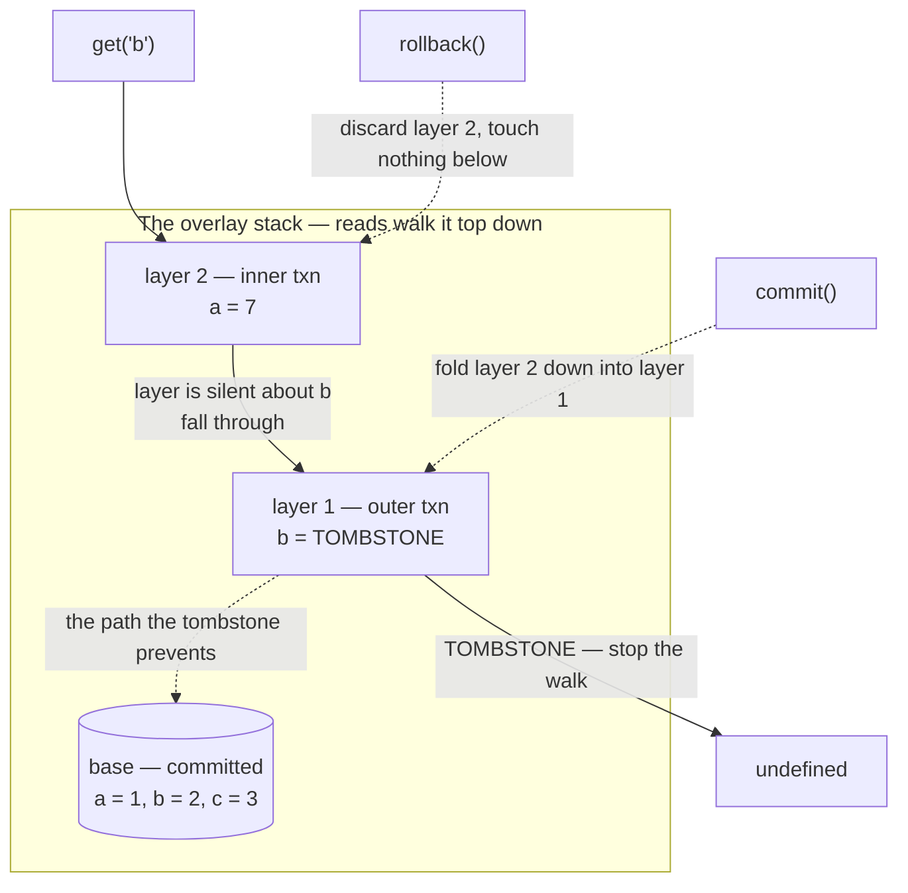

# In-memory key-value store (the progressive-spec round)

Build a key-value store. Then, every ten minutes or so, the interviewer adds a
requirement: prefix scan, then TTL, then transactions with nesting, then
compaction.

**The round is not testing whether you can write a hash map.** It is testing
whether the code you wrote in the first ten minutes survives the requirement you
had not heard yet, and whether you can restructure it calmly, out loud, with the
clock running. The final feature — transactions — is chosen because it breaks a
naive level-1 design completely. Every line that read or wrote `this.data`
directly has to change. If you wrote thirty of those lines, you spend the last
fifteen minutes on mechanical edits and never reach the interesting part.

Say that framing out loud in the first two minutes. It buys you permission to
structure level 1 more carefully than a whiteboard hash map.

| They say | They are watching for |
|---|---|
| "Now add prefix scan" | Whether you notice a `Map` has no order, and say so instead of quietly shipping an O(n) filter and pretending it is fine |
| "Now add TTL" | Whether you call `Date.now()` inside the store, which makes every test either slow or flaky |
| "Now add transactions" | Whether your read path is one function or twelve. This is the whole round. |
| "And nest them" | Whether your transaction state is a single object or a stack. A single object handles one level and silently corrupts at two. |
| "What about memory?" | Whether you know that lazy expiry never reclaims a key nobody reads |
| Throughout | Whether you keep talking. Silence during a refactor reads as being stuck. |

**The failure mode is not a wrong answer, it is a stall.** Most candidates who
lose this round lose it at level 4, when they realise every method touches the
map directly, go quiet for four minutes doing find-and-replace, and run out of
time before nesting. The recovery is verbal: name the refactor before you type
it, so the interviewer grades the idea while you do the typing.

## Requirements, and what to ask

Functional, as they arrive: L1 `set` / `get` / `delete`; L2 `scan(prefix)` and
`scan(prefix, filter)`; L3 `set(key, value, { ttlMs })` with expired keys
invisible; L4 `begin` / `commit` / `rollback`, nestable to any depth; L5 reclaim
memory from expired entries without waiting for a read. Single process, single
owner — a library, not a server. Point operations are O(1) with no transaction
open and O(depth) with `depth` open, where depth is a nesting level, not data.
Deterministic under test: no wall clock, no timers in the data path. Out of
scope, said out loud: persistence, replication, eviction by capacity (that is
[the LRU problem](03-lru-cache.md)), isolation between concurrent transactions.

Three clarifying questions, asked at level 1 — asking about transactions before
transactions are mentioned looks like you memorised the round. Does `get` have to
distinguish a missing key from a stored `undefined`, which decides the whole
return contract? Are keys strings, since prefix scan means nothing otherwise?
Does `delete` report whether anything was there — a boolean, and the only way
`delete` inside a transaction behaves sensibly later?

## Level 1 — SET, GET, DELETE

**The requirement.** Store a value under a key. Read it back. Remove it.

```js
class Store {
  constructor() { this.data = new Map(); }
  set(key, value) { this.data.set(key, value); }
  get(key) { return this.data.get(key); }
  has(key) { return this.data.has(key); }
  delete(key) { return this.data.delete(key); }
}

const s = new Store();
s.set('user:1:name', 'ada');
console.log(s.get('user:1:name'));     // ada
console.log(s.delete('user:1:name'));  // true
console.log(s.delete('user:1:name'));  // false
```

**What it does to the data structures.** One `Map`, and do not gold-plate it.
`Map` over a plain object because object keys stringify and the prototype chain
leaks keys you never set — `store.get('toString')` returns a function.

> "`has` is separate from `get` because `get` returning `undefined` is ambiguous
> the moment someone stores `undefined`. And every method goes through
> `this.data` — one read path, one write path. If the requirements grow, that is
> the seam I'll widen."

That last sentence costs thirty seconds and saves ten minutes at level 4. Level 1
should take three.

## Level 2 — Prefix scan, and filtered scan

**The requirement.** `scan('user:')` returns every entry whose key starts with
that prefix. `scan('user:', fn)` keeps only those where `fn(key, value)` is true.

```js
class Store {
  constructor() { this.data = new Map(); }
  set(key, value) { this.data.set(key, value); }
  delete(key) { return this.data.delete(key); }
  // Snapshot the keys before yielding anything. The caller is allowed to
  // delete while iterating, and a live Map iterator would then skip entries.
  *scan(prefix = '', filter = null) {
    for (const key of [...this.data.keys()].sort()) {
      if (!key.startsWith(prefix)) continue;
      if (!this.data.has(key)) continue;          // deleted since the snapshot
      const value = this.data.get(key);
      if (filter && !filter(key, value)) continue;
      yield [key, value];
    }
  }
}

const s = new Store();
s.set('user:1:name', 'ada');
s.set('user:1:role', 'admin');
s.set('session:x', 'tok');
console.log([...s.scan('user:')].map(([k]) => k));  // [ 'user:1:name', 'user:1:role' ]
console.log([...s.scan('user:', (k, v) => v === 'admin')]);  // [ [ 'user:1:role', 'admin' ] ]
```

**What it does to the data structures.** Nothing, and say that explicitly. A hash
map has no order, so prefix scan is a full scan — O(n) in the number of keys, not
O(matches). You shipped the honest version and named its cost.

| Structure | Scan | Point | Buy it when |
|---|---|---|---|
| Hash map (here) | O(n) over all keys | O(1) | Scan is rare, or n is small |
| Sorted array / skip list / B-tree | O(log n + matches) | O(log n) | Scan is hot and range queries appear |
| Trie on key segments | O(prefix + matches) | O(key length) | Keys are hierarchical and prefixes are the access pattern |
| Hash map + index per prefix | O(matches) | O(1) plus upkeep per write | Prefixes are a small fixed set known up front |

The `has` re-check inside the loop is what makes the snapshot correct rather than
merely non-crashing — the key was alive when you snapshotted and may be dead by
the time you reach it.

> "Scan on a hash map is a full scan, O(n), and I want to say that rather than
> hide it. I'm returning a generator, so: what if the caller deletes while
> iterating? I snapshot the keys and re-check each one before yielding, so a
> concurrent delete is visible but never corrupts the walk."

Writing the O(n) scan is fine. Writing it while claiming it is efficient is not.

## Level 3 — TTL and expiry

**The requirement.** `set(key, value, { ttlMs: 500 })`. After 500 milliseconds
the key behaves as if it were never there.

```js
class SystemClock { now() { return Date.now(); } }

class FakeClock {
  constructor(start = 0) { this.t = start; }
  now() { return this.t; }
  advance(ms) { this.t += ms; return this.t; }
}

class Store {
  constructor({ clock = new SystemClock() } = {}) {
    this.clock = clock;
    this.data = new Map();   // key -> { value, expiresAt }
  }

  set(key, value, { ttlMs = null } = {}) {
    const expiresAt = ttlMs === null ? null : this.clock.now() + ttlMs;
    this.data.set(key, { value, expiresAt });
  }
  // The one place expiry is decided. get, has, delete and scan all route
  // through this, so there is no second copy of the comparison to get wrong.
  _resolve(key) {
    const record = this.data.get(key);
    if (record === undefined) return null;
    if (record.expiresAt !== null && record.expiresAt <= this.clock.now()) {
      this.data.delete(key);            // lazy expiry: reap on the read
      return null;
    }
    return record;
  }
  get(key) {
    const record = this._resolve(key);
    return record === null ? undefined : record.value;
  }
  has(key) { return this._resolve(key) !== null; }
}

const clock = new FakeClock(1000);
const s = new Store({ clock });
s.set('session:x', 'tok', { ttlMs: 500 });
clock.advance(499);
console.log(s.get('session:x'));       // tok
clock.advance(1);
console.log(s.get('session:x'));       // undefined
console.log(s.data.has('session:x'));  // false  <- reaped by the read
```

**What it does to the data structures.** The map's value stops being the value
and becomes a record, `{ value, expiresAt }` — the first time the stored shape
and the user-visible shape diverge. The load-bearing change is `_resolve`:
expiry is a *view* concern, the same bytes visible or not depending on the time,
so the check sits on the read path and there must be exactly one read path.

**Inject the clock, do not call the real one.** A store that calls `Date.now()`
internally can only be tested by sleeping for real, which makes the suite slow
and flaky, or by monkey-patching a global, which is worse. With an injected
clock, expiry is arithmetic on two numbers you control. That is not a testing
trick: the clock is an input to the store's behaviour, exactly like the key, and
inputs go in the constructor.

| | Lazy (reap on read) | Active (background sweep) |
|---|---|---|
| Cost | Zero until someone reads the key | A recurring scan, whether or not anything expired |
| Correctness | Perfect. A key is never visible past its expiry. | Also perfect — the sweep is an optimisation, not the mechanism |
| Memory | **Never reclaims a key nobody reads.** | Bounded, if the sweep keeps up |
| Failure mode | Silent memory growth | Sweep falls behind under write pressure and you get both costs |

Do lazy first. **The sweep can be late or absent and nothing is ever wrong, only
larger.** The reverse is not true. A `setInterval` inside a library also keeps
the process alive and mutates the store between two lines the caller thinks are
adjacent, so level 5 makes it a method the owner calls.

> "I'm injecting a clock rather than calling `Date.now()` — the only change that
> makes TTL testable without sleeping. Expiry is lazy: correct on its own, but it
> never reclaims memory for keys nobody reads, so I'd add a bounded sweep on top.
> Deliberately in that order: the sweep is an optimisation, the read check is the
> mechanism."

## Level 4 — Transactions, including nesting

**The requirement.** `begin()` starts a transaction. Writes after it are visible
to `get` but not yet permanent. `commit()` makes them permanent, `rollback()`
discards them. `begin()` inside a transaction nests: the inner `commit()` folds
into the enclosing transaction, not into the store.

**This is the level that collapses a naive level-1 design.** A transaction means
a write must be visible to reads but not yet committed, so there are now *two*
places a value can live and reads must consult both. Any method that touched the
map directly is now wrong.

### The refactor that saves it

**A stack of overlay layers, read through in order.**

- The committed state is one map, `base`.
- Each open transaction pushes an empty map onto a stack of `layers`.
- A **write** goes to the topmost layer only — `base` if the stack is empty.
- A **read** walks the stack newest to oldest and stops at the first layer that
  mentions the key, falling through to `base` if none does.
- **Commit** pops the top layer and folds each entry one level down.
- **Rollback** pops the top layer and throws it away. That is the entire
  implementation — nothing below was written, so nothing below is touched.

And the piece that makes deletes work: **a tombstone.** If a transaction deletes
a key you cannot represent that by removing it from the layer — the layer never
had it, and removing nothing from nothing leaves `base` visible. You cannot store
`undefined` either, because someone may have stored `undefined`. So you store a
unique marker. A `Symbol` is exactly right: it is not equal to any value a caller
could pass in, so `record === TOMBSTONE` is unambiguous.

**A tombstone is a delete that is loud enough to be seen through.** It says "this
key is gone as of this layer" and it stops the read walk, which is precisely what
`base.delete()` cannot do from inside a transaction you might roll back.



The dotted edge to `base` is the path the read would have taken if layer 1 were
silent about `b`. Without the tombstone the read reaches `base`, finds `b = 2`,
and the delete is invisible to the transaction that performed it.

```js
const TOMBSTONE = Symbol('tombstone');

class Store {
  constructor({ clock = new SystemClock() } = {}) {
    this.clock = clock;
    this.base = new Map();   // committed state: key -> { value, expiresAt }
    this.layers = [];        // open transactions, innermost last
  }

  get depth() { return this.layers.length; }
  _writeTarget() {
    return this.layers.length ? this.layers[this.layers.length - 1] : this.base;
  }
  begin() { this.layers.push(new Map()); return this.layers.length; }
  commit() {
    if (this.layers.length === 0) throw new Error('COMMIT without BEGIN');
    const top = this.layers.pop();
    const target = this._writeTarget();       // the next layer down, or base
    for (const [key, record] of top) {
      if (record === TOMBSTONE && target === this.base) {
        target.delete(key);                   // at the bottom a tombstone IS a delete
      } else {
        target.set(key, record);              // higher up it must keep shadowing
      }
    }
    return this.layers.length;
  }
  rollback() {
    if (this.layers.length === 0) throw new Error('ROLLBACK without BEGIN');
    this.layers.pop();
    return this.layers.length;
  }
  // Walk the layers newest-first, then base. Returns the first record found,
  // which may be TOMBSTONE — that is the whole point of having one.
  _lookup(key) {
    for (let i = this.layers.length - 1; i >= 0; i--) {
      if (this.layers[i].has(key)) return this.layers[i].get(key);
    }
    return this.base.get(key);
  }
  _resolve(key) {
    const record = this._lookup(key);
    if (record === undefined || record === TOMBSTONE) return null;
    if (record.expiresAt !== null && record.expiresAt <= this.clock.now()) {
      // Reap only the committed record. An expired record inside an open layer
      // belongs to that transaction; deleting it would survive a rollback.
      if (this.base.get(key) === record) this.base.delete(key);
      return null;
    }
    return record;
  }
  set(key, value, { ttlMs = null } = {}) {
    const expiresAt = ttlMs === null ? null : this.clock.now() + ttlMs;
    this._writeTarget().set(key, { value, expiresAt });
  }
  get(key) {
    const record = this._resolve(key);
    return record === null ? undefined : record.value;
  }
  delete(key) {
    const existed = this._resolve(key) !== null;
    if (this.layers.length === 0) this.base.delete(key);
    else this._writeTarget().set(key, TOMBSTONE);
    return existed;
  }
}
```

`scan` changes too, and not interestingly: it can no longer iterate one map.
Union every key mentioned in `base` and in every layer, sort, then resolve each.

```js
const s = new Store({ clock: new FakeClock(1000) });
s.set('a', 1);
s.set('b', 2);
s.begin();
s.set('a', 99);
s.delete('b');
console.log(s.get('a'), s.get('b'));        // 99 undefined
s.rollback();
console.log(s.get('a'), s.get('b'));        // 1 2
s.begin();
s.delete('b');
s.begin();
s.set('b', 42);
console.log(s.get('b'));                    // 42
s.rollback();                               // inner gone, tombstone still stands
console.log(s.get('b'));                    // undefined
s.commit();
console.log(s.get('b'), s.depth);           // undefined 0
```

**What it does to the data structures.** The map became a stack of maps and the
lookup became a walk. A point read is now O(depth) instead of O(1), where depth
is the nesting level — a small integer, not a function of the data. Say that out
loud; it is the price of the design and it is cheap. Three details, because they
are the three places this goes wrong:

| Detail | Why it is there |
|---|---|
| `layer.has(key)` before `layer.get(key)` in `_lookup` | A layer can hold a record whose value is falsy, and it can hold `TOMBSTONE`. Only `has` distinguishes "this layer mentions the key" from "this layer is silent about it", and the read walk turns entirely on that distinction. |
| `record === TOMBSTONE && target === this.base` in `commit` | A tombstone folded into `base` becomes a real delete. Folded into another layer it must stay a tombstone, because it still has to shadow whatever `base` holds. Collapsing the two cases is the classic nesting bug. |
| `this.base.get(key) === record` in `_resolve` | Lazy expiry must only reap the committed record. Identity gets that for free: if the record came from a layer, it is not the base record. |

**What you say out loud — before you type.** This is the part that decides the
round.

> "There are now two places a value can live and every read has to consult both.
> `base` is the committed map; each `begin` pushes an empty map; writes go to the
> top; reads walk newest-first and stop at the first layer that mentions the key.
> Commit folds a layer one level down, rollback drops it — nothing to undo,
> because nothing below was ever written.
>
> The piece that is easy to miss is delete. I cannot delete from `base`, because
> a rollback has to bring it back, and I cannot leave the layer empty, because
> then the read falls through to the committed value. So a delete writes a
> tombstone. It has to be *loud*, not absent. Nesting then falls out for free,
> which is the sign the structure is right."

Then write it; the design is already graded. They are listening for the overlay
stack rather than a diff-and-undo log, the tombstone named as distinct from
absence, and whether nesting required a rewrite or fell out.

**The design you should not pick** is an undo log — writing straight into the map
and recording the previous value of every key you touch. It buys O(1) reads and
pays with O(writes) rollback, a log per nesting level, its own sentinel for "was
absent" anyway, and one fatal property: uncommitted state lives *in the base
map*, where any scan or sweep sees the half-done transaction. **The overlay keeps
uncommitted state out of the committed map,** which is why a bug in rollback
cannot corrupt committed data.

## Level 5 — Compaction, and what to do about memory

**The requirement.** Expired keys that nobody reads are still holding memory.

```js
class CompactingStore extends Store {
  // Bounded incremental sweep, the shape Redis is reported to use: sample a
  // fixed number of keys with a TTL, drop the dead ones, and repeat only while
  // the hit rate stays high. Cost per call is capped, so it never stalls.
  // Refuses mid-transaction: a layer above may hold a live record for a key
  // whose base record looks dead.
  sweep({ sample = 20, repeatIfDeadRatioAbove = 0.25, maxRounds = 5 } = {}) {
    if (this.layers.length > 0) return 0;
    const now = this.clock.now();
    let removed = 0;
    for (let round = 0; round < maxRounds; round++) {
      let looked = 0, dead = 0;
      for (const [key, record] of this.base) {
        if (record.expiresAt === null) continue;
        looked += 1;
        if (record.expiresAt <= now) { this.base.delete(key); dead += 1; }
        if (looked >= sample) break;
      }
      removed += dead;
      if (looked === 0 || dead / looked <= repeatIfDeadRatioAbove) break;
    }
    return removed;
  }
}

const clock = new FakeClock(1000);
const s = new CompactingStore({ clock });
for (let i = 0; i < 200; i++) s.set(`s:${i}`, i, { ttlMs: 500 });
s.set('permanent', 'x');
clock.advance(600);
console.log(s.base.size);          // 201  <- nothing read them, nothing reaped them
console.log(s.sweep());            // 100  <- bounded: 5 rounds x 20 samples
console.log(s.sweep());            // 100  <- the rest, on the next call
console.log(s.base.size);          // 1
```

An unbounded `compact()` is the same loop over `[...this.base]` with no sample
cap, and it should throw mid-transaction rather than return 0.

**What it does to the data structures.** Nothing, deliberately. Compaction reads
the same records `_resolve` reads and deletes the same entries a read would have
deleted. No index, no second copy, no new invariant. **A compaction that can be
skipped entirely without changing any answer is a compaction that cannot corrupt
anything.** The adaptive repeat is the trick worth naming: when nothing has
expired you pay for twenty lookups and stop; when a million keys just expired you
keep going. The upgrade, if TTLs are sparse enough that sampling wastes most of
its lookups, is an expiry-ordered index — a min-heap of `(expiresAt, key)`, or
time buckets — costing a second structure to keep in sync, plus stale entries
when a TTL is extended, so validate against the record on pop.

> "Lazy expiry alone leaks, so I want a sweep — an explicit method the owner
> calls, not a timer the store starts. Bounded and adaptive: sample twenty keys
> with TTLs, repeat only while most of the sample is dead. That caps the pause
> and still drains fast after a mass expiry."

They are listening for whether you connect this back to level 3. Compaction
exists *because* lazy expiry was chosen.

## The refactor — what level 1 should have been

**Answer first: two seams, and nothing else.** `_resolve(key)` is the only
function that decides whether a key is visible; `_writeTarget()` is the only
function that decides where a write lands.

If those exist at level 1 — even when `_resolve` is one line and `_writeTarget`
returns `this.data` unconditionally — then every later level is an edit to one of
them plus new code that never touches the map.

| Level | Touched | Would have touched without the seams |
|---|---|---|
| 2 scan | New method only | New method only |
| 3 TTL | `_resolve` (3 lines), `set` | `get`, `has`, `delete`, `scan` — four copies of the expiry check |
| 4 transactions | `_resolve`, `_writeTarget`, three new methods, scan's key union | Every method. All of them. |
| 5 compaction | New method only | New method only |

**Level 4 is the whole argument.** With the seams it is a rewrite of two small
private functions. Without them it is a rewrite of the class, under time
pressure, while talking. One other thing is nearly free at level 1: the clock in
the constructor even if nothing uses it, because adding a constructor parameter
later means updating every call site in your own test code.

### The honest counterpoint

**Designing for level 4 at level 1 is over-engineering if level 4 never arrives.**
This is the real tension, and the interviewer is often probing for whether you
can hold both sides.

| What you build at level 1 | Verdict |
|---|---|
| Two one-line private methods, `_resolve` and `_writeTarget` | **Do it.** Two lines. Pays for itself the first time any read-path rule appears — expiry, permissions, soft delete, anything. |
| A record wrapper `{ value }` with nothing in it yet | Borderline. An allocation per entry and a `.value` at every read, for a change you may not need. Say which way you are going. |
| A layer stack with exactly one layer, "ready" for transactions | **Do not.** Speculative generality. You paid O(depth) reads, a harder mental model and a key-union scan for a feature nobody asked for. |
| A transaction API that throws `NotImplemented` | **Do not.** Dead API surface is worse than no API surface. Someone will call it. |

The principle underneath: **structure is cheap, mechanism is expensive.** A
function boundary that funnels every read through one place costs two lines and
no runtime behaviour. A layer stack is mechanism — a cost, a failure mode, and a
concept the next reader has to learn.

> "I would keep `_resolve` and `_writeTarget` from the start, and I would still
> not build the layer stack. So the honest version is: I would not design for
> transactions. I would design so that *adding* transactions is a small diff.
> Those are different things, and only the second one is free."

Candidates who say "I should have built it all upfront" and candidates who say
"you can't predict requirements, so don't try" are each giving half the answer.

## Concurrency and edge cases

**Node is single-threaded, which is not the same as having no interleaving.**
Nothing preempts you mid-method, but an `await` between two store calls is a
yield point, so a transaction spanning an `await` is exposed.

```js
const s = new Store({ clock: new FakeClock(1000) });
s.set('m', 'committed');
s.begin();
s.set('m', 'inflight', { ttlMs: 10 });
s.clock.advance(50);
console.log(s.get('m'));            // undefined  <- the layer record is dead
console.log(s.base.get('m').value); // committed  <- base is untouched
s.rollback();
console.log(s.get('m'));            // committed  <- rollback restores the view
try { s.commit(); } catch (e) { console.log(e.message); }   // COMMIT without BEGIN
```

- **TTL expiring mid-transaction.** Two identical `get` calls inside one
  transaction can differ. Not a bug: this store gives atomicity and no isolation
  from time. Snapshot isolation means resolving against `txStartTime` rather than
  `clock.now()` — two lines — and costs you the ability to see your own TTL
  expire. Offer the tradeoff, do not pick silently.
- **Reaping inside a transaction.** Getting the identity check wrong means a
  rollback that loses committed data, the worst failure this store can have.
- **Nested rollback with an outer tombstone standing.** Popping a layer cannot
  get this wrong; "restore the previous value of everything this transaction
  touched" would restore the key and silently undo the outer delete.
- **A live `Map` iterator.** Entries deleted before the cursor are skipped — not
  a crash, so it passes the happy-path test and is wrong in production. State the
  semantic you chose: **scan sees a snapshot of the key set and live values.**
  And throw on `commit()` with no open transaction: returning `false` lets a
  caller with a mismatched `try/finally` silently commit to base.
- **A transaction abandoned by an exception.** The layer stays on the stack
  forever and every later write lands in a transaction nobody will commit — a
  worse leak than expired keys. Ship a `transaction(fn)` that wraps `begin`,
  `fn()`, `commit` in a `try`, with `rollback` and a rethrow in the `catch`, and
  keep the three verbs underneath it.
- **Two concurrent transactions.** The layer stack is global, so the second one's
  writes land on top of the first one's. Real concurrency needs a layer *per
  transaction* plus a conflict rule at commit: lock the keys you touch, or record
  a read set and abort if anything in it changed.

## Sibling framings

The same round is reported under other names. The late requirement invalidates a
level-1 shortcut, and the recovery is a named structural change.

**A bank account that gains layered transaction types.** Balance-as-a-number dies
at reversals, because a reversal needs to know what it is reversing and a number
has no history. Make the ledger the source of truth and the balance a fold over
it, then add periodic snapshots — this document's level 5. **A tombstone and a
reversal entry are the same idea**: a removal represented as a thing that exists
rather than as an absence, which is what makes it undoable and auditable.

**A rate limiter that gains per-tenant limits, then burst, then a sliding
window.** A counter plus a reset time has no memory of *when* within the window
requests arrived, so it cannot express a sliding window. Replace the scalar with
a token bucket, which absorbs burst too — the same move as the overlay stack:
**replace the scalar with a structure that carries time.** The per-tenant step
hides a leak: a tenant map that only grows needs eviction.

## Follow-ups they will ask

**"Persist it."** Append every mutation to a log before applying it and replay on
startup. Only committed transactions go in the log, which is easy here because
commit is already the single point where data reaches `base`. Add snapshots so
replay does not grow unbounded.

**"Watch a key."** The question underneath is *when*: firing inside a transaction
leaks uncommitted state to an observer who cannot roll back. Queue notifications
in the layer and flush them on the commit that reaches `base`, so a rollback
discards them for free.

**"Make scan efficient."** Replace the base `Map` with a skip list or B-tree, so
a prefix becomes a range from `prefix` to the next string above it. Layers stay
maps, since they are tiny. Point lookups go from O(1) to O(log n).
**"What would you monitor?"** Entry count and heap size, which diverge when the
record wrapper is the cost. Sweep reclaim rate — near zero while memory grows
means TTLs are sparse and you need the expiry index. Maximum transaction depth
and lifetime, because a depth that never returns to zero is the abandoned-
transaction leak, and it is invisible in every other metric.
